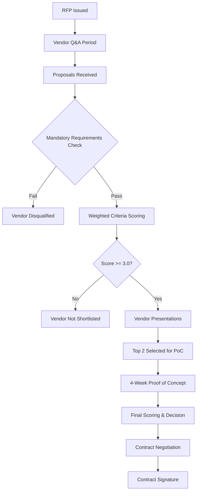

# RFP: Core Insurance Platform Replacement

**Document ID:** RFP-CORE-001

**Version:** 1.0

**Date:** 2026-02-10

**Prepared by:** TryggFörsäkring AB — IT & Business Transformation

**Classification:** Confidential

---

## 1. Introduction

### 1.1 Purpose

This Request for Proposal (RFP) invites responses from shortlisted vendors
for the replacement of TryggFörsäkring AB's legacy policy administration
system. The selected platform will serve as the core insurance system
supporting all personal and commercial lines of business.

### 1.2 Company Overview

TryggFörsäkring AB is a mid-size Swedish non-life insurer offering Motor,
Home & Property, and Commercial insurance products. The company operates
under the regulatory supervision of Finansinspektionen (FSA) and must comply
with GDPR and the Insurance Distribution Directive (IDD).

### 1.3 Background

The current policy administration system has been in production for over
15 years. Business rules exist primarily as tribal knowledge held by senior
staff. The system lacks modern APIs, has limited configurability, and cannot
support TryggFörsäkring's digital transformation ambitions. A structured
replacement programme has been initiated with phased delivery:

| Phase   | Scope            | Target                   |
| ------- | ---------------- | ------------------------ |
| Phase 1 | Motor Insurance  | First production go-live |
| Phase 2 | Home & Property  | Second release           |
| Phase 3 | Commercial Lines | Full portfolio migration |

### 1.4 Shortlisted Vendors

Based on market analysis, the following three vendors have been shortlisted:

| Vendor                | Platform              |
| --------------------- | --------------------- |
| Sapiens International | Sapiens/TIA           |
| Keylane               | Keylane Axon          |
| Socotra               | Socotra Core Platform |

---

## 2. Mandatory Requirements (Pass/Fail)

Vendors **must** demonstrate compliance with all mandatory requirements
below. Failure on any item results in disqualification.

| #   | Requirement                   | Description                                                                                                                                                                                    | Evidence Required                                    |
| --- | ----------------------------- | ---------------------------------------------------------------------------------------------------------------------------------------------------------------------------------------------- | ---------------------------------------------------- |
| M1  | Swedish regulatory compliance | FSA reporting (quarterly/annual), GDPR data handling (right to erasure, data portability, consent management), IDD compliance (demands-and-needs assessment, product oversight and governance) | Compliance statement, reference customer attestation |
| M2  | Multi-line P&C support        | Platform must support Motor, Home & Property, and Commercial lines within a single installation — covering all three delivery phases                                                           | Product documentation, live demo                     |
| M3  | Cloud deployment              | SaaS or managed cloud deployment; no on-premise-only offerings accepted                                                                                                                        | Architecture documentation, SLA commitments          |
| M4  | API-first architecture        | Open, documented REST or GraphQL APIs for integration with Swedish external systems (BankID, Transportstyrelsen, TFF, Lantmäteriet)                                                            | API documentation, sandbox access                    |
| M5  | Policy lifecycle              | Full policy lifecycle support: quote, bind, endorse, renew, cancel, and claims management within a single platform                                                                             | Functional specification, demo walkthrough           |

---

## 3. Weighted Evaluation Criteria

### 3.1 Criteria Overview

| #   | Criterion                               | Weight | Description                                                                                                                                                                        |
| --- | --------------------------------------- | ------ | ---------------------------------------------------------------------------------------------------------------------------------------------------------------------------------- |
| E1  | Nordic track record                     | 20%    | Swedish/Nordic reference customers, Nordic implementation team, demonstrated experience with Scandinavian insurance markets                                                        |
| E2  | Swedish integration capability          | 15%    | BankID (digital signing and authentication), Transportstyrelsen (vehicle registry lookups), TFF membership verification, Lantmäteriet (property registry), personnummer validation |
| E3  | Total Cost of Ownership (5 years)       | 15%    | License/subscription fees + implementation costs + ongoing integration and maintenance + internal team requirements                                                                |
| E4  | Implementation timeline (Phase 1 Motor) | 10%    | Time from contract signature to first production go-live for motor insurance, including data migration                                                                             |
| E5  | Underwriting rules engine               | 10%    | Configurability of underwriting rules, low-code/no-code rule management, rating factor support, Swedish bonus–malus system (bonusgrundande skadehistorik)                          |
| E6  | Claims management depth                 | 10%    | FNOL intake, partner coordination (workshops, restoration companies, glass repair), settlement workflows, subrogation and recovery                                                 |
| E7  | Digital self-service                    | 5%     | Customer-facing portal, mobile support, BankID login, real-time policy and claims status                                                                                           |
| E8  | Configurability / low-code              | 5%     | Business user product configuration, time-to-market for new insurance products without developer involvement                                                                       |
| E9  | Data migration support                  | 5%     | Tooling, methodology, and experience migrating from legacy policy admin systems; support for parallel-run validation                                                               |
| E10 | Vendor viability and roadmap            | 5%     | Financial stability, R&D investment levels, AI/GenAI roadmap, long-term strategic direction                                                                                        |

### 3.2 Scoring Model

Each criterion is scored on a 1–5 scale:

| Score | Definition                                                                       |
| ----- | -------------------------------------------------------------------------------- |
| 5     | **Exceeds requirements** — Proven Nordic capability with referenceable customers |
| 4     | **Fully meets requirements** — Demonstrated capability in production             |
| 3     | **Partially meets** — Requires moderate customization or configuration           |
| 2     | **Significant gaps** — Requires substantial development or workarounds           |
| 1     | **Does not meet requirement** — No current capability                            |

### 3.3 Final Score Calculation

```text
Final Score = Σ (Criterion Score × Criterion Weight)

Example:
  E1: 4 × 0.20 = 0.80
  E2: 3 × 0.15 = 0.45
  ...
  Total = sum of all weighted scores (maximum possible: 5.00)
```

A minimum score of **3.0** is required to proceed to the Proof of Concept
(PoC) stage.

---

## 4. Vendor-Specific Questions

Vendors must provide written responses to each question below. Responses
should be specific, evidence-based, and reference actual implementations
where possible.

### Q1 — Nordic Implementation Experience

Describe your largest Swedish or Nordic P&C insurance implementation.
Include (where permissible): customer name, scope of lines of business,
project timeline, team composition, and outcome.

### Q2 — BankID Integration

How does your platform handle BankID integration for:

- Digital signing of policy documents
- Customer authentication (login)
- Agent/broker authentication

Provide details on whether BankID support is native, partner-provided,
or requires custom integration.

### Q3 — Swedish Regulatory Reporting

Describe your approach to Swedish regulatory reporting:

- FSA quarterly and annual reporting (Finansinspektionen)
- GDPR data subject requests (access, erasure, portability)
- IDD demands-and-needs documentation and product oversight

### Q4 — Phased Rollout Support

How would you support TryggFörsäkring's phased rollout strategy?

- **Phase 1:** Motor insurance (quote, bind, endorse, renew, cancel, claims)
- **Phase 2:** Home & Property (homeowner, tenant, property damage)
- **Phase 3:** Commercial lines (business, liability, fleet, commercial property)

Describe how the platform supports incremental line-of-business activation
and parallel running with legacy systems during transition.

### Q5 — Data Migration

Describe your data migration methodology and tooling:

- What tools do you provide for data extraction, transformation, and loading?
- How do you handle data quality validation during migration?
- What is your approach to parallel-run testing?
- Provide an example timeline for a migration of comparable scope.

### Q6 — Reference Customer

Provide contact details for at least one reference customer willing to share
their implementation experience. Preference for:

- Swedish or Nordic P&C insurer
- Similar company size to TryggFörsäkring
- Implementation completed within the last 3 years

### Q7 — Pricing Model

Provide a detailed pricing breakdown including:

- Licensing/subscription model (per-policy, per-user, flat fee, or hybrid)
- Implementation fees (phases 1–3)
- Ongoing support and maintenance costs
- Integration development costs for Swedish systems
- Any volume discounts or multi-year commitment pricing

### Q8 — Swedish Language Support

Describe your approach to:

- Swedish-language user interface for internal users
- Swedish-language customer-facing portal
- Swedish-language communication templates (policy documents, letters, emails)
- Support for Swedish date, currency, and number formats

---

## 5. Submission Requirements

### 5.1 Response Format

| Section                                | Max Pages |
| -------------------------------------- | --------- |
| Executive summary                      | 3         |
| Mandatory requirements (M1–M5)         | 10        |
| Evaluation criteria responses (E1–E10) | 30        |
| Vendor-specific questions (Q1–Q8)      | 20        |
| Pricing proposal                       | 10        |
| Reference customer details             | 2         |
| Implementation plan (high-level)       | 10        |
| **Total**                              | **85**    |

### 5.2 Submission Details

- **Format:** PDF and editable Word document
- **Language:** English (Swedish supplement accepted for regulatory sections)
- **Delivery:** Secure file transfer (link provided upon confirmation)
- **Questions deadline:** Vendor questions must be submitted in writing

---

## 6. Evaluation Process and Timeline

### 6.1 Timeline

| Milestone                         | Target Date |
| --------------------------------- | ----------- |
| RFP issued to shortlisted vendors | Week 1      |
| Vendor Q&A period                 | Weeks 2–3   |
| Q&A responses published           | Week 3      |
| Proposal submission deadline      | Week 5      |
| Evaluation and scoring            | Weeks 6–7   |
| Vendor presentations / demos      | Week 8      |
| Shortlist for PoC (top 2 vendors) | Week 9      |
| Proof of Concept (4-week sprint)  | Weeks 10–13 |
| PoC evaluation and final scoring  | Week 14     |
| Vendor selection decision         | Week 15     |
| Contract negotiation              | Weeks 16–18 |
| Contract signature                | Week 19     |

### 6.2 Evaluation Process



### 6.3 Evaluation Committee

| Role                   | Responsibility                        |
| ---------------------- | ------------------------------------- |
| Project Sponsor        | Final decision authority              |
| IT Architecture Lead   | Technical evaluation (M3, M4, E5, E8) |
| Business Lead — Motor  | Domain evaluation (M5, E5, E6)        |
| Business Lead — Claims | Claims workflows (E6)                 |
| Compliance Officer     | Regulatory compliance (M1, Q3)        |
| Procurement            | Commercial evaluation (E3, Q7)        |
| External Advisor       | Independent assessment                |

### 6.4 Proof of Concept Scope

The PoC will focus on Phase 1 (Motor Insurance) and must demonstrate:

1. **Motor quote-to-bind** — End-to-end motor policy creation including
   risk assessment, pricing, and policy issuance
2. **BankID integration** — Customer authentication and document signing
3. **Transportstyrelsen lookup** — Vehicle registry integration for
   automatic vehicle data population
4. **Claims FNOL** — First Notice of Loss intake for a motor damage claim
5. **Regulatory reporting** — Sample FSA report generation
6. **Swedish bonus–malus** — Bonus class calculation based on claims history

---

## 7. Terms and Conditions

### 7.1 Confidentiality

All information provided in this RFP and vendor responses is confidential.
Vendors must not disclose participation in this procurement process without
prior written consent from TryggFörsäkring AB.

### 7.2 Cost of Proposal

TryggFörsäkring AB will not reimburse vendors for any costs incurred in
preparing and submitting proposals.

### 7.3 Right to Cancel

TryggFörsäkring AB reserves the right to cancel this RFP process at any
stage without obligation to any vendor.

### 7.4 Regulatory Obligations

The selected vendor must support TryggFörsäkring AB's ongoing compliance
obligations under:

- **FSA (Finansinspektionen)** — Solvency, consumer protection, reporting
  (FSA-001 through FSA-014)
- **GDPR** — Personal data handling, right to erasure, data portability,
  consent (GDPR-001 through GDPR-006)
- **IDD (Insurance Distribution Directive)** — Product oversight,
  demands-and-needs assessment, disclosure (IDD-001 through IDD-010)

---

## 8. Contact Information

| Role                 | Contact                            |
| -------------------- | ---------------------------------- |
| RFP Coordinator      | TryggFörsäkring Procurement Office |
| Technical Questions  | IT Architecture Lead               |
| Commercial Questions | Procurement Lead                   |

All communication must go through the RFP Coordinator. Direct contact
with evaluation committee members is not permitted during the evaluation
period.
