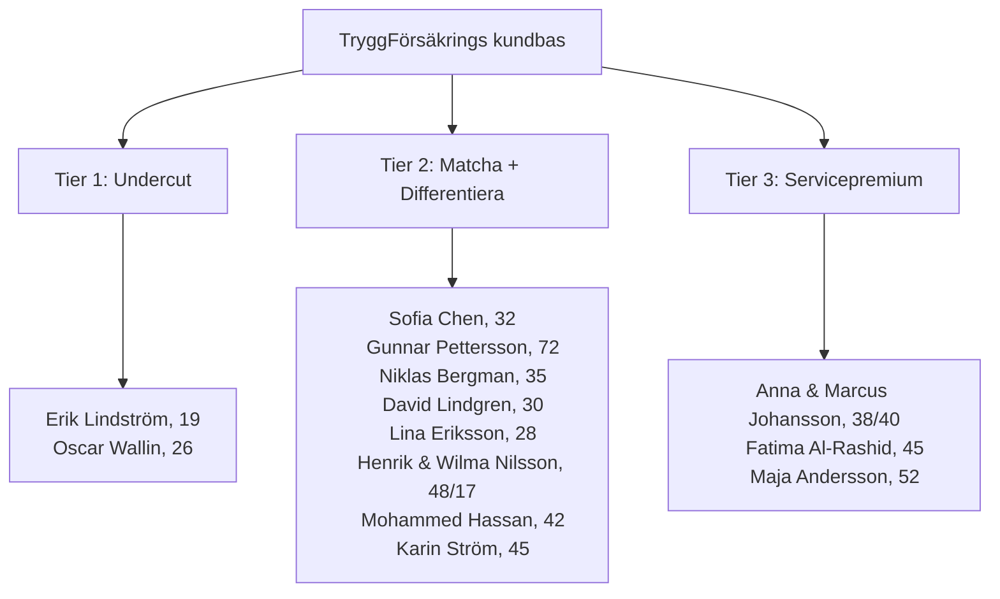
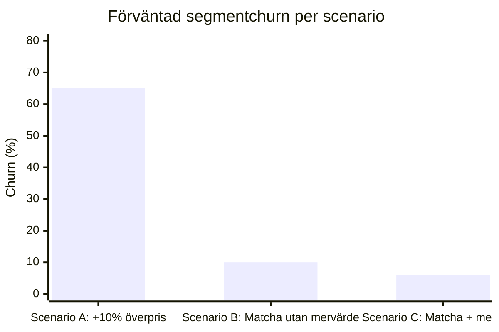

# Strategiska prisrekommendationer

Strategiska prisrekommendationer för TryggFörsäkring AB baserade på
priskänslighetsanalys av samtliga 13 kundpersonas i Fas 1 (motorförsäkring). Detta
dokument fungerar som beslutsunderlag för prissättningsteamet och produktägare.

## 1. Sammanfattning för ledningen

Analysen av TryggFörsäkrings 13 kundpersonas i motorförsäkringssegmentet visar att
**premiumpris inte är hållbart för 10 av 13 kundsegment**. Majoriteten av kunderna är
aktivt prismedvetna, jämför erbjudanden regelbundet och har låga byteskostnader.

**Centrala slutsatser:**

- Enbart 3 av 13 personas tolererar premiehöjningar — och bara i kombination med
  tydliga mervärden
- 6 personas har hög eller mycket hög bytesrisk vid felaktig prissättning
- Den enda hållbara vägen till premiumprissättning är **servicedifferentiering med
  riktade mervärden** per segment
- Rekommenderad strategi: **"Matcha marknaden, vinn på värde"**

:::info Konsekvens vid felprissättning

En generell överprissättning på 10 % beräknas leda till 60–70 % segmentchurn och
förlust av tiotals miljoner SEK i kundlivstidsvärde (LTV). Se
[Riskscenarier](#5-riskscenarier) för detaljerad modellering.

:::

## 2. Segmenterad prisstrategi — trestegsmodell

### Tier 1 — Undercut (2 personas: Erik, Oscar)

**Varför:** Noll lojalitet, noll byteskostnad, rent prisjämförelsebeteende. Erik är
förstagångsköpare med studentbudget. Oscar har variabel inkomst i gig-ekonomin och
döljer aktivt sin kommersiella användning av rädsla för premiehöjningar.

**Strategi:**

| Parameter             | År 1               | År 2+               |
| --------------------- | ------------------ | ------------------- |
| Premiepositionering   | −3–5 % vs marknad  | Marknadsmatchning   |
| Mål                   | Volymförvärv       | Bonusklasslojalitet |
| Konverteringsstrategi | Låg ingångskostnad | Lönsam långtidskund |

**Intäktsmodell:** Förvärva volym genom aggressiv prissättning, bygg
bonusklasslojalitet under de första åren, konvertera till lönsamma långtidskunder
allt eftersom bonusklassen stiger och byteskostnaden ökar.

### Tier 2 — Matcha + Differentiera (8 personas)

**Varför:** Dessa kunder är priskänsliga men kan behållas med rätt mervärden. De
jämför priser aktivt men värderar bekvämlighet, transparens och specifika
funktioner tillräckligt för att stanna — förutsatt att grundpremien är
konkurrenskraftig.

**Maximal premietolerans:** +3–5 % **med** levererade mervärden.

| Persona                  | Priskänslighet | Mervärde som behåller kunden                    | Uppskattad kostnad | Retentions-ROI |
| ------------------------ | -------------- | ----------------------------------------------- | ------------------ | -------------- |
| Sofia Chen, 32           | Medel-hög      | Automatisk bonusklassöverföring från utlandet   | Låg                | Hög            |
| Gunnar Pettersson, 72    | Medel          | Lojalitetsrabatt + veteranbilanpassad premie    | Låg                | Medel          |
| Niklas Bergman, 35       | Medel          | Snabb skadereglering + bonusskydd vid felfri    | Medel              | Hög            |
| David Lindgren, 30       | Medel          | Friktionsfri digital upplevelse (UX)            | Medel              | Hög            |
| Lina Eriksson, 28        | Hög            | EV-specifik premieförklaring + batteritäckning  | Medel              | Hög            |
| Henrik & Wilma N., 48/17 | Hög            | Ung-förare-tillägg med graderad premie          | Låg                | Medel          |
| Mohammed Hassan, 42      | Mycket hög     | Konkurrenskraftig förnyelsepremie + flottrabatt | Låg                | Mycket hög     |
| Karin Ström, 45          | Hög            | Bonusklasserkännande för namngivna förare       | Låg                | Hög            |

### Tier 3 — Servicepremium (3 personas: Anna & Marcus, Fatima, Maja)

**Varför:** Dessa kunder har högre byteskostnader och värderar bekvämlighet,
relationer och operationell effektivitet. De söker inte aktivt lägsta pris.

**Strategi:**

| Parameter           | År 1–3                    | År 3+                               |
| ------------------- | ------------------------- | ----------------------------------- |
| Premiepositionering | Marknadsmatchning         | +3–5 % med hushålls-/flotfunktioner |
| Fokus               | Etablera förtroende       | Introducera premiumtjänster         |
| Tillväxtmotor       | Konsolidering av policyer | Korsförsäljning (hem Fas 2)         |

**Intäktsmodell:** Matcha marknaden under de första 2–3 åren för att bygga
förtroende, introducera sedan +3–5 % premiehöjning i takt med att
hushålls-/flottfunktioner levereras. Primär intäktstillväxt via korsförsäljning
(hemförsäkring i Fas 2, flotexpansion).

## 3. Produktinnovationer som möjliggör premium

| Produktnamn                   | Målpersona(s)              | Uppskattad kostnad | Premietolerans | Förväntad retentionsförbättring |
| ----------------------------- | -------------------------- | ------------------ | -------------- | ------------------------------- |
| Gig-förare-försäkring         | Oscar Wallin               | Medel              | +5–8 %         | +15–20 % (eliminerar bedrägeri) |
| EV Coverage Clarity           | Lina Eriksson              | Låg                | +3–5 %         | +10–15 %                        |
| Spillover Bonus               | Sofia Chen, Karin Ström    | Låg                | +3–5 %         | +20–25 %                        |
| Hushållsportal                | Anna & Marcus, Henrik & W. | Hög                | +5–8 %         | +15–20 %                        |
| Ung-förare-graderad premie    | Erik, Henrik & Wilma       | Medel              | +3–5 %         | +10–15 %                        |
| Flotthanteringsplattform      | Fatima, Mohammed           | Hög                | +5–10 %        | +20–25 %                        |
| Lojalitetsprogram Veteran     | Gunnar Pettersson          | Låg                | +2–3 %         | +10–15 %                        |
| Digital Skaderegleringsportal | Niklas, David              | Medel              | +3–5 %         | +15–20 %                        |

## 4. Konkurrensanalys — prissättning

| Konkurrent       | Positionering                         | Prisstrategi                                | TryggFörsäkrings differentieringsmöjlighet             |
| ---------------- | ------------------------------------- | ------------------------------------------- | ------------------------------------------------------ |
| If P&C           | Marknadsledare, bred portfölj         | Premiumpris med stark varumärkesigenkänning | Nischprodukter (gig-ekonomi, EV) som If inte erbjuder  |
| Länsförsäkringar | Regional, kooperativ, stark lokal bas | Konkurrenskraftig regional prissättning     | Nationell digital upplevelse vs regional fragmentering |
| Folksam          | Kooperativ, fackföreningsanknuten     | Medlemsprissättning, grupprabatter          | Individuell anpassning vs kollektiva paket             |
| Trygg-Hansa      | Mellanmarknad, generalist             | Marknadsmatchning med standardtjänster      | Svenskspecifika tjänster och nischprodukter            |

**Strategisk slutsats:** TryggFörsäkring kan inte tävla på volym eller
varumärkeskännedom mot If eller Länsförsäkringar. Differentiering bör ske genom:

- **Nischprodukter** som saknas i marknaden (gig-förare-försäkring,
  EV-batteritäckning, bonusklassöverföring)
- **Digital upplevelse** som överträffar Länsförsäkringars regionala fragmentering
- **Svenskspecifika tjänster** som internationella konkurrenter inte prioriterar

## 5. Riskscenarier

### Scenario A: 10 % generell överprissättning

- **Churn:** 60–70 % segmentchurn
- **LTV-förlust:** Tiotals miljoner SEK
- **Drabbade segment:** Erik och Oscar lämnar omedelbart (100 % churn). Mohammed,
  Karin, Lina och Henrik/Wilma följer inom 1–2 förnyelsecykler. Även lojala kunder
  som Gunnar ifrågasätter efter upprepade höjningar utan förklaring.
- **Slutsats:** Ohållbart. Förstör kundbasen inom 2–3 år.

### Scenario B: Marknadsmatchning utan differentiering

- **Churn:** 8–12 % naturlig churn
- **Tillväxt:** Stabil men ingen nettotillväxt
- **Konsekvens:** Behåller befintliga kunder men attraherar inga nya. Ingen
  premiumintäkt. Konkurrenter med bättre digitala tjänster tar gradvis
  marknadsandelar.
- **Slutsats:** Överlevnadsstrategi, inte tillväxtstrategi.

### Scenario C: Matcha + riktade mervärden (rekommenderat)

- **Churn:** 5–8 % (under branschgenomsnittet)
- **LTV-tillväxt:** Positiv via korsförsäljning och premiumtjänster
- **Konsekvens:** Behåller priskänsliga segment genom konkurrenskraftig
  grundprissättning. Bygger premium via produktinnovationer. Skapar
  korsförsäljningsmöjligheter inför Fas 2 (hemförsäkring).
- **Slutsats:** Balanserad strategi som möjliggör tillväxt utan att riskera
  kundbasen.

## 6. Regulatorisk koppling

Prissättningsstrategin måste följa gällande regulatoriska krav:

| Regelkrav                                                                                | Tillämpning på prissättningsstrategi                                                                                                                                                          |
| ---------------------------------------------------------------------------------------- | --------------------------------------------------------------------------------------------------------------------------------------------------------------------------------------------- |
| [FSA-004](../regulatory/fsa-requirements.md#fsa-004-consumer-protection--fair-treatment) | Premietransparens och rättvis behandling. Alla premieskillnader mellan segment måste baseras på objektiva riskfaktorer, inte diskriminerande kategorisering.                                  |
| [IDD-001](../regulatory/idd-compliance.md#idd-001-demands-and-needs-assessment)          | Krav- och behovsanalys måste ligga till grund för prisrekommendationer. Tiered pricing-strategin måste kopplas till dokumenterade kundbehov.                                                  |
| [IDD-003](../regulatory/idd-compliance.md#idd-003-pre-contractual-information)           | Förhandsinformation om prissättning måste vara tydlig och inte vilseledande. Kampanjpriser (Tier 1 undercut) måste kommuniceras transparent med villkor för år 2+.                            |
| GDPR — telematik och beteendebaserad prissättning                                        | Eventuell användning av telematikdata (t.ex. gig-förare-försäkring, körbeteendebaserad premie) kräver uttryckligt samtycke enligt GDPR Art. 6(1)(a) och dataskyddskonsekvensbedömning (DPIA). |

:::warning Regulatoriskt krav

Segmenterad prissättning baserad på personaanalys är tillåten om den grundas på
objektiva riskfaktorer (ålder, körsträcka, fordonstyp, skadehistorik). Prissättning
får **aldrig** baseras på etnisk bakgrund, nationalitet eller andra skyddade
kategorier — även om personaanalysen innehåller demografisk information för
kontextuell förståelse. Se [FSA-004](../regulatory/fsa-requirements.md#fsa-004-consumer-protection--fair-treatment)
för detaljerade krav.

:::

## 7. Rekommenderade KPI:er

| KPI                             | Mål                            | Mätfrekvens | Ansvarig          |
| ------------------------------- | ------------------------------ | ----------- | ----------------- |
| Churn rate per segment          | < 8 % för Tier 2–3             | Kvartalsvis | Prissättningsteam |
| NPS per segment                 | > 60                           | Halvårsvis  | Kundupplevelse    |
| Prisindex vs konkurrenter       | 98–102 för Tier 2              | Månadsvis   | Marknadsanalys    |
| Korsförsäljningskvot            | > 25 % inom 3 år               | Kvartalsvis | Produktägare      |
| Mervärdestjänstadoption         | > 40 % per innovation          | Kvartalsvis | Produktutveckling |
| Bonusklasskonvertering (Tier 1) | > 60 % till klass 3+ inom 3 år | Årsvis      | Prissättningsteam |

## Relaterade dokument

- [Personaprofiler](../personas/index.md) — detaljerade kundprofiler med
  priskänslighet och beteendemönster
- [FSA-krav](../regulatory/fsa-requirements.md) — regulatoriskt ramverk för
  konsumentskydd
- [IDD-efterlevnad](../regulatory/idd-compliance.md) — krav på kravanalys och
  förhandsinformation
- [GDPR-kartläggning](../regulatory/gdpr-mapping.md) — dataskyddskrav för
  kunddata och telematik
