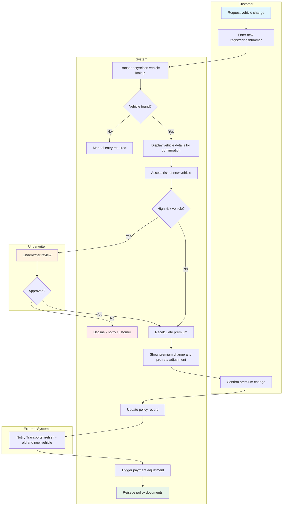
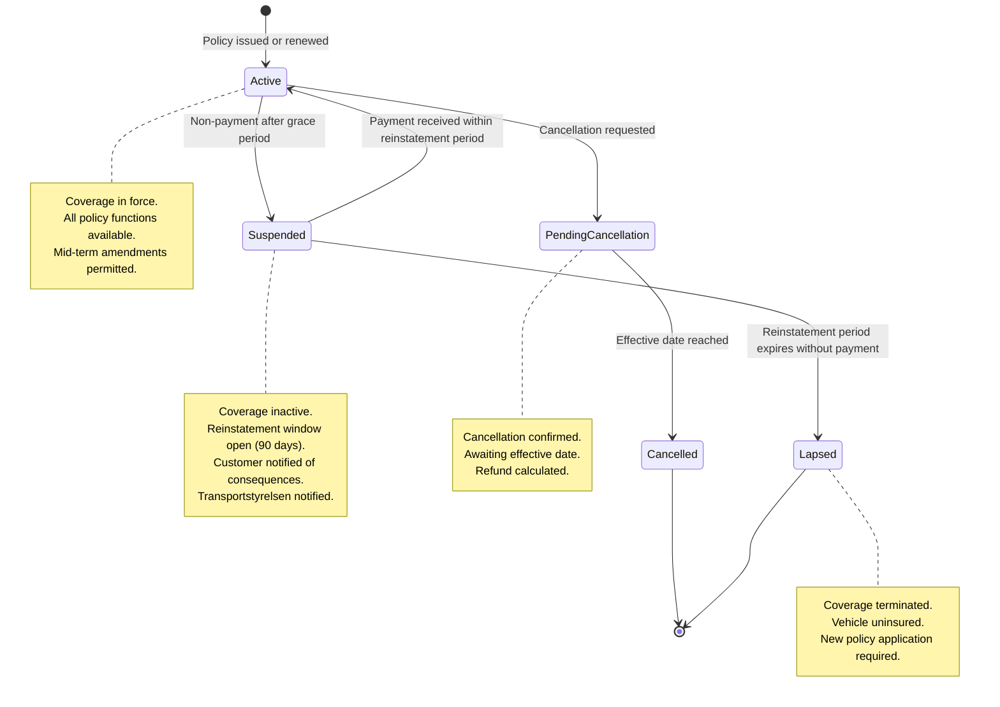
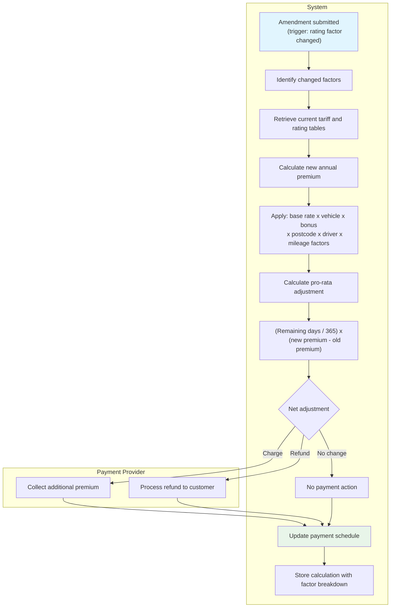

# Policy Administration Use Cases

Detailed interaction flows for motor policy mid-term adjustments (MTAs) and
policy lifecycle management. Each use case describes the step-by-step process,
preconditions, postconditions, validation rules, data model, and exception flows.

## Shared Data Model: Amendment Record

All policy administration use cases create an amendment record. The amendment
record entity provides a complete audit trail of every policy change.

| Attribute               | Type      | Description                                                                                                                 |
| ----------------------- | --------- | --------------------------------------------------------------------------------------------------------------------------- |
| `amendment_id`          | UUID      | Unique identifier for the amendment                                                                                         |
| `policy_id`             | UUID      | Reference to the parent policy                                                                                              |
| `amendment_type`        | Enum      | `VEHICLE_CHANGE`, `COVERAGE_CHANGE`, `DRIVER_ADD`, `DRIVER_REMOVE`, `STATUS_CHANGE`, `PREMIUM_RECALC`, `UNDERWRITER_REVIEW` |
| `status`                | Enum      | `PENDING`, `AWAITING_REVIEW`, `APPROVED`, `DECLINED`, `COMPLETED`, `CANCELLED`                                              |
| `old_value`             | JSON      | Snapshot of the affected attribute(s) before the change                                                                     |
| `new_value`             | JSON      | Snapshot of the affected attribute(s) after the change                                                                      |
| `effective_date`        | Date      | Date the amendment takes effect                                                                                             |
| `premium_old`           | Decimal   | Annual premium before the amendment                                                                                         |
| `premium_new`           | Decimal   | Annual premium after the amendment                                                                                          |
| `prorate_adjustment`    | Decimal   | Pro-rata premium adjustment amount (positive = charge, negative = refund)                                                   |
| `initiated_by`          | Enum      | `CUSTOMER`, `AGENT`, `UNDERWRITER`, `SYSTEM`                                                                                |
| `channel`               | Enum      | `WEB`, `APP`, `PHONE`, `INTERNAL`                                                                                           |
| `bankid_reference`      | String    | BankID transaction reference (if customer-initiated)                                                                        |
| `underwriter_decision`  | Enum      | `N/A`, `APPROVED`, `APPROVED_WITH_CONDITIONS`, `DECLINED`                                                                   |
| `underwriter_rationale` | Text      | Written rationale (required when underwriter is involved)                                                                   |
| `created_at`            | Timestamp | When the amendment was created                                                                                              |
| `completed_at`          | Timestamp | When the amendment was finalized                                                                                            |

---

## UC-PA-001: Process Mid-Term Vehicle Change

### Use Case Summary

| Field                | Value                                                                          |
| -------------------- | ------------------------------------------------------------------------------ |
| **Use Case ID**      | UC-PA-001                                                                      |
| **Name**             | Process Mid-Term Vehicle Change                                                |
| **Primary Actor**    | Customer (Privatkund)                                                          |
| **Secondary Actors** | Transportstyrelsen, Payment Provider, Underwriter (for high-risk vehicles)     |
| **Goal**             | Replace the insured vehicle on an active policy without a coverage gap         |
| **Preconditions**    | Active policy, customer authenticated via BankID, new registreringsnummer      |
| **Postconditions**   | Policy updated with new vehicle, Transportstyrelsen notified, premium adjusted |
| **Trigger**          | Customer initiates a vehicle change from the policy management page            |

### Stakeholders and Interests

| Stakeholder        | Interest                                                            |
| ------------------ | ------------------------------------------------------------------- |
| Customer           | Seamless vehicle swap with no coverage gap; fair premium adjustment |
| Underwriter        | High-risk vehicles reviewed before acceptance                       |
| Transportstyrelsen | Registry updated with correct insurance status for both vehicles    |
| Payment Provider   | Premium adjustment collected or refunded correctly                  |
| TryggFörsäkring    | Accurate risk data; regulatory compliance; retained customer        |

### Preconditions

1. The customer has an active motor insurance policy
1. The customer has the registreringsnummer of the new vehicle
1. The customer is authenticated via BankID

### Vehicle Change Process Flow

### Main Success Scenario

1. **Initiate** — Customer selects "Change vehicle" from their policy
   management page
1. Customer enters the new vehicle's registreringsnummer
1. **Vehicle lookup** — System looks up the vehicle in Transportstyrelsen's
   vehicle registry and retrieves: make, model, year, engine power, weight,
   vehicle type, VIN
1. System displays the vehicle details and asks the customer to confirm the
   vehicle is correct
1. Customer confirms the vehicle
1. **Risk assessment** — System evaluates the new vehicle against underwriting
   rules. If the vehicle is within standard risk parameters, continue to step 7. If the vehicle triggers a high-risk flag, see **Alternative Flow A**.
1. **Premium recalculation** — System recalculates the premium using the new
   vehicle's risk factors (vehicle type, value, engine power) while retaining
   the customer's existing bonus class, address, and coverage tier
1. System displays: current premium, new premium, pro-rata adjustment amount,
   and effective date
1. **Confirmation** — Customer reviews and accepts the premium adjustment
1. **Amendment processing** — System processes the amendment: updates the
   policy record with the new vehicle; sends a de-registration notification
   to Transportstyrelsen for the old vehicle; sends a registration
   notification to Transportstyrelsen for the new vehicle; creates an
   amendment record in the policy history; triggers premium adjustment via the
   payment provider (collection or refund)
1. **Document reissue** — System generates an updated policy document and
   insurance certificate
1. Customer receives confirmation with a link to the updated policy document

### Alternative Flows

#### A. High-Risk Vehicle Requires Underwriter Review

1. System notifies the customer that the vehicle change requires manual review
   (expected turnaround: 2 business days)
1. System routes the amendment request to the underwriter queue with the
   vehicle data and risk assessment
1. Underwriter reviews the request (see UC-PA-006)
1. If approved: resume main flow at step 7 with any adjusted terms
1. If declined: notify the customer with the reason; the original policy
   remains unchanged

#### B. Vehicle Not Found in Transportstyrelsen Registry

1. System displays an error: "Vehicle not found in the vehicle registry"
1. Customer is advised to verify the registreringsnummer
1. If the vehicle is newly registered, the customer is advised to wait 24 hours
   for registry propagation and retry

#### C. Transportstyrelsen Service Unavailable

1. System detects that Transportstyrelsen is unavailable
1. System displays: "Vehicle registry is temporarily unavailable. Please try
   again later."
1. The amendment cannot proceed without vehicle data — no partial processing

#### D. Transportstyrelsen Notification Fails (Post-Amendment)

1. System queues the notification for retry (exponential backoff: 1 min, 5 min,
   15 min, 1 hour, 4 hours)
1. The amendment proceeds — the policy is updated regardless of notification
   delivery status
1. Operations staff are alerted after retry exhaustion
1. Manual intervention sends the notification when the integration is restored

#### E. Customer Declines Premium Adjustment

1. Customer cancels the vehicle change
1. The original policy remains unchanged
1. No amendment record is created
1. No notifications are sent to Transportstyrelsen

#### F. Payment Processing Fails

1. System detects payment failure from the payment provider
1. The policy amendment is rolled back — the old vehicle remains on the policy
1. Customer is notified that the vehicle change could not be completed due to a
   payment issue
1. Customer is advised to verify their payment method and retry

### Validation Rules

| Rule ID  | Rule                                                         | Error Message                                              |
| -------- | ------------------------------------------------------------ | ---------------------------------------------------------- |
| VR-PA1-1 | New vehicle must exist in Transportstyrelsen registry        | "Vehicle not found in the vehicle registry"                |
| VR-PA1-2 | New vehicle must be registered in Sweden                     | "Only vehicles registered in Sweden can be insured"        |
| VR-PA1-3 | New vehicle type must be insurable (passenger car, MC, etc.) | "This vehicle type cannot be insured under a motor policy" |
| VR-PA1-4 | Policy must be in Active status                              | "Vehicle changes can only be made on active policies"      |
| VR-PA1-5 | Trafikförsäkring must transfer without coverage gap          | N/A — enforced automatically by the system                 |
| VR-PA1-6 | Bonus class remains with the policyholder, not the vehicle   | N/A — system rule                                          |
| VR-PA1-7 | Old vehicle trafikförsäkring status must be updated          | N/A — system rule                                          |

### Postconditions

**Success:**

- The policy record reflects the new vehicle
- Transportstyrelsen has been notified (or notification is queued)
- The amendment is recorded in the policy history with full audit trail
- An updated policy document and insurance certificate are available
- The premium adjustment has been initiated

**Failure:**

- The original policy remains unchanged
- No notifications are sent to Transportstyrelsen
- Customer is informed of the reason for failure

### Non-Functional Requirements

| Requirement                       | Target                                                |
| --------------------------------- | ----------------------------------------------------- |
| Transportstyrelsen vehicle lookup | Response within 3 seconds                             |
| Premium recalculation             | Complete within 2 seconds                             |
| Amendment processing              | Complete within 5 seconds after customer confirmation |
| Transportstyrelsen notification   | Sent within 1 hour of amendment completion            |
| Insurance certificate reissue     | Generated within 30 seconds of amendment completion   |
| Audit trail                       | All steps logged with timestamps and actor identity   |

### Regulatory Compliance

| Regulation   | Requirement                                                             |
| ------------ | ----------------------------------------------------------------------- |
| **FSA-007**  | Continuous trafikförsäkring coverage — no gap between vehicles          |
| **FSA-009**  | Transportstyrelsen notified of insurance status for both vehicles       |
| **GDPR-002** | Policy data update follows data minimization principles                 |
| **GDPR-004** | Transportstyrelsen data exchange limited to mandated fields             |
| **IDD-001**  | If vehicle change significantly alters risk, reassess demands and needs |

### Related User Stories

- [US-PA-001: Change Vehicle on Policy](../user-stories/policy-administration.md#us-pa-001-change-vehicle-on-policy)
- [US-PA-010: Recalculate Premium After Amendment](../user-stories/policy-administration.md#us-pa-010-recalculate-premium-after-amendment)
- [US-PA-011: Notify Transportstyrelsen of Policy Changes](../user-stories/policy-administration.md#us-pa-011-notify-transportstyrelsen-of-policy-changes)
- [US-PA-012: Reissue Policy Document](../user-stories/policy-administration.md#us-pa-012-reissue-policy-document)

---

## UC-PA-002: Process Coverage Tier Change

### Use Case Summary

| Field                | Value                                                                 |
| -------------------- | --------------------------------------------------------------------- |
| **Use Case ID**      | UC-PA-002                                                             |
| **Name**             | Process Coverage Tier Change                                          |
| **Primary Actor**    | Customer (Privatkund)                                                 |
| **Secondary Actors** | Payment Provider                                                      |
| **Goal**             | Upgrade or downgrade the coverage tier on an active motor policy      |
| **Preconditions**    | Active policy, customer authenticated via BankID, target tier differs |
| **Postconditions**   | Coverage tier updated, IPID provided, premium adjusted                |
| **Trigger**          | Customer initiates a coverage change from the policy management page  |

### Stakeholders and Interests

| Stakeholder        | Interest                                                        |
| ------------------ | --------------------------------------------------------------- |
| Customer           | Adjust coverage to match current needs; understand what changes |
| Compliance Officer | IPID provided before confirmation; demands-and-needs reassessed |
| Payment Provider   | Premium adjustment collected or refunded correctly              |
| Finance Company    | Vehicle with finance agreement maintains required coverage      |
| TryggFörsäkring    | Correct coverage; regulatory compliance; customer retention     |

### Preconditions

1. The customer has an active motor insurance policy
1. The customer is authenticated via BankID
1. The target coverage tier is different from the current tier

### Main Success Scenario

1. **Initiate** — Customer selects "Change coverage" from their policy
   management page
1. **Coverage comparison** — System displays the available coverage tiers with
   a comparison:

   | Feature                      | Trafikförsäkring | Halvförsäkring | Helförsäkring |
   | ---------------------------- | ---------------- | -------------- | ------------- |
   | Third-party liability        | Included         | Included       | Included      |
   | Fire and theft               | —                | Included       | Included      |
   | Glass damage                 | —                | Included       | Included      |
   | Roadside assistance          | —                | Included       | Included      |
   | Legal expenses               | —                | Included       | Included      |
   | Collision damage (vagnskada) | —                | —              | Included      |

1. Customer selects the desired coverage tier
1. **Eligibility check** — System checks eligibility: downgrade to
   trafikförsäkring is always permitted; upgrade to helförsäkring checks
   vehicle age and value thresholds. If ineligible, see **Alternative Flow A**.
1. **IPID delivery** — System provides the updated IPID for the new tier
   (IDD-002)
1. **Premium recalculation** — System recalculates the premium and displays:
   current tier and premium, new tier and premium, pro-rata adjustment,
   effective date
1. Customer acknowledges the IPID and coverage changes
1. **Confirmation** — Customer confirms the tier change
1. **Amendment processing** — System processes the amendment: updates the
   coverage tier on the policy record; creates an amendment record in the
   policy history; triggers premium adjustment via the payment provider. For
   upgrades, new coverage is effective immediately. For downgrades, new
   coverage is effective from start of next day.
1. **Document reissue** — System generates an updated policy document
1. Customer receives confirmation

### Alternative Flows

#### A. Helförsäkring Not Available for Vehicle

1. System informs the customer that helförsäkring is not available for their
   vehicle (e.g., vehicle too old or value below threshold)
1. System displays the reason: "Vehicles older than 15 years or with a market
   value below 50 000 SEK are not eligible for helförsäkring"
1. Customer is shown alternative options (halvförsäkring if currently on
   trafikförsäkring only)

#### B. Customer Has Financed Vehicle Requiring Helförsäkring

1. System detects that the vehicle is subject to a finance agreement requiring
   comprehensive coverage
1. System warns the customer: "Your finance agreement may require
   helförsäkring. Downgrading could breach your finance terms."
1. Customer may proceed at their own risk or cancel the downgrade

#### C. Downgrade Would Remove Trafikförsäkring

1. System detects an attempt to remove trafikförsäkring coverage (impossible by
   law)
1. System blocks the change: "Trafikförsäkring is mandatory for all vehicles
   registered in Sweden and cannot be removed"

#### D. Payment Processing Fails

1. System detects payment failure from the payment provider
1. For upgrades: the amendment is rolled back; the old coverage remains
1. For downgrades: the amendment proceeds (refund is retried)
1. Customer is notified of the payment status

#### E. Customer Cancels Mid-Amendment

1. Customer cancels before confirmation
1. The original policy remains unchanged
1. No amendment record is created

### Validation Rules

| Rule ID  | Rule                                                     | Error Message                                                         |
| -------- | -------------------------------------------------------- | --------------------------------------------------------------------- |
| VR-PA2-1 | Cannot downgrade below trafikförsäkring                  | "Trafikförsäkring is mandatory and cannot be removed"                 |
| VR-PA2-2 | Helförsäkring requires vehicle age ≤ 15 years            | "Helförsäkring is not available for vehicles older than 15 years"     |
| VR-PA2-3 | Helförsäkring requires vehicle market value ≥ 50 000 SEK | "Helförsäkring is not available for vehicles valued below 50 000 SEK" |
| VR-PA2-4 | Policy must be in Active status                          | "Coverage changes can only be made on active policies"                |
| VR-PA2-5 | Target tier must differ from current tier                | "You already have this coverage tier"                                 |
| VR-PA2-6 | IPID must be acknowledged before confirmation            | N/A — UI enforced                                                     |
| VR-PA2-7 | Upgrades take effect immediately; downgrades at next day | N/A — system rule                                                     |

### Effective Date Rules

| Direction | Effective Date    | Rationale                                            |
| --------- | ----------------- | ---------------------------------------------------- |
| Upgrade   | Immediately       | Customer benefits from increased coverage right away |
| Downgrade | Start of next day | Prevents same-day claim-then-downgrade abuse         |

### Postconditions

**Success:**

- The policy record reflects the new coverage tier
- An updated IPID was provided and acknowledged
- The amendment is recorded in the policy history
- An updated policy document is available
- Premium adjustment has been initiated

**Failure:**

- The original policy remains unchanged
- Customer is informed of the reason for failure

### Non-Functional Requirements

| Requirement              | Target                                                |
| ------------------------ | ----------------------------------------------------- |
| Coverage comparison load | Display within 2 seconds                              |
| Premium recalculation    | Complete within 2 seconds                             |
| IPID delivery            | Immediate (pre-generated per tier)                    |
| Amendment processing     | Complete within 5 seconds after customer confirmation |
| Audit trail              | All steps logged with timestamps and actor identity   |

### Regulatory Compliance

| Regulation  | Requirement                                                |
| ----------- | ---------------------------------------------------------- |
| **FSA-007** | Trafikförsäkring must remain as minimum coverage           |
| **FSA-004** | Clear comparison of coverage tiers and transparent pricing |
| **FSA-012** | Pre-contractual disclosure for new coverage tier           |
| **IDD-001** | Demands-and-needs reassessment for significant changes     |
| **IDD-002** | Updated IPID provided and acknowledged before confirmation |

### Related User Stories

- [US-PA-003: Upgrade Coverage Tier](../user-stories/policy-administration.md#us-pa-003-upgrade-coverage-tier)
- [US-PA-004: Downgrade Coverage Tier](../user-stories/policy-administration.md#us-pa-004-downgrade-coverage-tier)
- [US-PA-010: Recalculate Premium After Amendment](../user-stories/policy-administration.md#us-pa-010-recalculate-premium-after-amendment)

---

## UC-PA-003: Process Named Driver Change

### Use Case Summary

| Field                | Value                                                              |
| -------------------- | ------------------------------------------------------------------ |
| **Use Case ID**      | UC-PA-003                                                          |
| **Name**             | Process Named Driver Change                                        |
| **Primary Actor**    | Customer (Privatkund)                                              |
| **Secondary Actors** | Underwriter (for high-risk drivers)                                |
| **Goal**             | Add or remove named drivers on an active motor insurance policy    |
| **Preconditions**    | Active policy, customer authenticated via BankID                   |
| **Postconditions**   | Driver list updated, premium adjusted, policy document reissued    |
| **Trigger**          | Customer initiates a driver change from the policy management page |

### Stakeholders and Interests

| Stakeholder        | Interest                                                           |
| ------------------ | ------------------------------------------------------------------ |
| Customer           | Add/remove drivers easily; understand premium impact of surcharges |
| Underwriter        | High-risk drivers reviewed before acceptance                       |
| Compliance Officer | Lawful basis for named driver data collection verified             |
| TryggFörsäkring    | Accurate risk data; correct premium for insured driver pool        |

### Preconditions

1. The customer has an active motor insurance policy
1. The customer is authenticated via BankID
1. For adding a driver: the customer has the new driver's personnummer

### Main Success Scenario — Add Named Driver

1. **Initiate** — Customer selects "Add driver" from their policy management
   page
1. Customer enters the new driver's personnummer
1. **Validation** — System validates the personnummer format (Luhn check)
1. System retrieves the driver's age from the personnummer
1. System verifies the driver holds a valid Swedish driving license (or EU
   equivalent)
1. **Risk assessment** — System assesses the risk impact. Driver age ≥ 25 and
   no risk flags: continue to step 7. Driver age < 25: apply young driver
   surcharge, continue to step 7. Driver age < 20 or other high-risk flags:
   see **Alternative Flow A**.
1. **Premium recalculation** — System recalculates the premium with the
   additional driver's risk factors
1. System displays: current premium, new premium, adjustment amount, and a
   description of any surcharges applied (see young driver surcharge tiers
   below)
1. **Confirmation** — Customer confirms the addition
1. **Amendment processing** — System processes the amendment: adds the named
   driver to the policy record; creates an amendment record in the policy
   history; triggers premium adjustment
1. **Document reissue** — System generates an updated policy document
1. Customer receives confirmation

**Young driver surcharge tiers:**

| Driver Age | Surcharge    |
| ---------- | ------------ |
| 18–19      | +75%         |
| 20–22      | +40%         |
| 23–24      | +15%         |
| 25+        | No surcharge |

### Main Success Scenario — Remove Named Driver

1. **Initiate** — Customer selects "Remove driver" from their policy management
   page
1. System displays the list of named drivers on the policy (excluding the
   policyholder)
1. **Selection** — Customer selects the driver to remove
1. **Premium recalculation** — System recalculates the premium without the
   removed driver
1. System displays the premium adjustment
1. **Confirmation** — Customer confirms the removal
1. **Amendment processing** — System processes the amendment: removes the named
   driver from the active policy record; creates an amendment record in the
   policy history; triggers premium adjustment (refund if applicable)
1. **Document reissue** — System generates an updated policy document
1. Customer receives confirmation

### Alternative Flows

#### A. High-Risk Driver Requires Underwriter Review

1. System notifies the customer that the driver addition requires review
   (expected turnaround: 2 business days)
1. System routes the request to the underwriter queue with the driver's risk
   profile
1. Underwriter reviews (see UC-PA-006): approve with standard terms (resume
   main flow at step 7), approve with adjusted terms (customer must accept),
   or decline (customer notified, policy unchanged)

**High-risk driver triggers:**

| Trigger                   | Threshold             |
| ------------------------- | --------------------- |
| Very young driver         | Age < 20              |
| Recently licensed         | License held < 1 year |
| Claims history (if known) | 3+ claims in 3 years  |

#### B. Invalid Personnummer

1. System displays: "Invalid personnummer format"
1. Customer is asked to re-enter

#### C. Attempting to Remove the Only Driver (Policyholder)

1. System prevents removal: "The policyholder cannot be removed as a named
   driver"
1. The removal form does not list the policyholder as a removable option

#### D. Driver Already on Policy

1. System detects the personnummer matches an existing named driver
1. System displays: "This driver is already listed on your policy"

#### E. Customer Cancels Mid-Amendment

1. Customer cancels before confirmation
1. The original policy remains unchanged
1. No amendment record is created

#### F. Payment Processing Fails (Add Driver)

1. System detects payment failure for the premium increase
1. The driver addition is rolled back
1. Customer is notified of the payment issue and advised to retry

### Validation Rules

| Rule ID  | Rule                                           | Error Message                                              |
| -------- | ---------------------------------------------- | ---------------------------------------------------------- |
| VR-PA3-1 | Personnummer must pass Luhn validation         | "Invalid personnummer format"                              |
| VR-PA3-2 | Driver must hold a valid driving license       | "A valid driving license is required to be a named driver" |
| VR-PA3-3 | At least one driver (policyholder) must remain | "The policyholder cannot be removed"                       |
| VR-PA3-4 | Driver must not already be on the policy       | "This driver is already listed on your policy"             |
| VR-PA3-5 | Policy must be in Active status                | "Driver changes can only be made on active policies"       |
| VR-PA3-6 | Minimum driver age is 18 (legal driving age)   | "Named drivers must be at least 18 years old"              |
| VR-PA3-7 | Young driver surcharge applied for age < 25    | N/A — informational, shown in premium breakdown            |

### Postconditions

**Success:**

- The policy record reflects the updated driver list
- The amendment is recorded in the policy history
- An updated policy document is available
- Premium adjustment has been initiated

**Failure:**

- The original driver list remains unchanged
- Customer is informed of the reason for failure

### Non-Functional Requirements

| Requirement             | Target                                                |
| ----------------------- | ----------------------------------------------------- |
| Personnummer validation | Immediate (client-side + server-side)                 |
| License verification    | Response within 3 seconds                             |
| Premium recalculation   | Complete within 2 seconds                             |
| Amendment processing    | Complete within 5 seconds after customer confirmation |
| Audit trail             | All steps logged with timestamps and actor identity   |

### Regulatory Compliance

| Regulation   | Requirement                                                      |
| ------------ | ---------------------------------------------------------------- |
| **GDPR-001** | Named driver personnummer collection requires lawful basis       |
| **GDPR-002** | Driver data stored under policy administration retention rules   |
| **FSA-004**  | Young driver surcharges communicated transparently               |
| **IDD-001**  | Reassess demands and needs if risk profile changes significantly |

### Related User Stories

- [US-PA-006: Add Named Driver](../user-stories/policy-administration.md#us-pa-006-add-named-driver)
- [US-PA-007: Remove Named Driver](../user-stories/policy-administration.md#us-pa-007-remove-named-driver)
- [US-PA-010: Recalculate Premium After Amendment](../user-stories/policy-administration.md#us-pa-010-recalculate-premium-after-amendment)

---

## UC-PA-004: Manage Policy Status Transitions

### Use Case Summary

| Field                | Value                                                                      |
| -------------------- | -------------------------------------------------------------------------- |
| **Use Case ID**      | UC-PA-004                                                                  |
| **Name**             | Manage Policy Status Transitions                                           |
| **Primary Actor**    | System (automated)                                                         |
| **Secondary Actors** | Underwriter, Customer, Transportstyrelsen, Payment Provider                |
| **Goal**             | Manage the full lifecycle of policy status changes based on payment events |
| **Preconditions**    | Policy exists in the system with a known current status                    |
| **Postconditions**   | Policy status reflects the current state; all stakeholders notified        |
| **Trigger**          | Payment due date passes, payment received, or reinstatement period expires |

### Stakeholders and Interests

| Stakeholder        | Interest                                                    |
| ------------------ | ----------------------------------------------------------- |
| Customer           | Clear communication about status; opportunity to reinstate  |
| Underwriter        | Review extended suspensions before reinstatement            |
| Transportstyrelsen | Accurate insurance status in the vehicle registry           |
| Payment Provider   | Outstanding amounts collected; refunds processed            |
| TFF                | Aware of uninsured vehicles for default coverage assignment |
| TryggFörsäkring    | Minimize lapsed policies; regulatory compliance             |

### Preconditions

1. The policy exists in the system with a known current status

### State Machine

### State Transition Rules

| From      | To        | Trigger                              | Guard                                                | Action                                                  |
| --------- | --------- | ------------------------------------ | ---------------------------------------------------- | ------------------------------------------------------- |
| Active    | Suspended | Grace period expires without payment | Payment reminder sent; grace period elapsed          | Notify customer; notify Transportstyrelsen; log status  |
| Suspended | Active    | Outstanding payment received         | Suspension ≤ threshold → automatic                   | Notify customer; notify Transportstyrelsen; log status  |
| Suspended | Active    | Outstanding payment received         | Suspension > threshold → underwriter review required | Route to underwriter; await decision                    |
| Suspended | Lapsed    | Reinstatement period expires         | No payment received within reinstatement period      | Notify customer; confirm Transportstyrelsen; log status |

### Configurable Thresholds

| Parameter                    | Default Value | Description                                                 |
| ---------------------------- | ------------- | ----------------------------------------------------------- |
| Payment grace period         | 30 days       | Days after due date before suspension                       |
| Reinstatement period         | 90 days       | Days after suspension before lapse                          |
| Auto-reinstatement threshold | 30 days       | Max suspension days for automatic reinstatement             |
| Underwriter review threshold | 30 days       | Suspension days beyond which underwriter review is required |

### Main Success Scenario — Suspension Due to Non-Payment

1. **Payment overdue** — The premium payment due date passes without payment
1. System sends a payment reminder to the customer with the outstanding amount
   and a grace period deadline (default: 30 days from due date)
1. **Grace period expiry** — The grace period expires without payment
1. System changes the policy status from "Active" to "Suspended"
1. **Customer notification** — System sends a suspension notification to the
   customer explaining: coverage is no longer active; the reinstatement period
   and deadline (default: 90 days); consequences for trafikförsäkring (vehicle
   may incur trafikförsäkringsavgift from TFF); how to reinstate by paying the
   outstanding amount
1. **Registry notification** — System notifies Transportstyrelsen that the
   vehicle's insurance coverage is suspended
1. **Audit** — System records the status change in the amendment history

### Main Success Scenario — Reinstatement

1. **Payment received** — The customer pays the outstanding premium within the
   reinstatement period
1. The payment provider confirms receipt
1. **Eligibility check** — System evaluates reinstatement eligibility. If
   suspension ≤ auto-reinstatement threshold: automatic reinstatement (step 4).
   If suspension > threshold: see **Alternative Flow A**.
1. System changes the policy status from "Suspended" to "Active"
1. System notifies Transportstyrelsen that coverage is reinstated
1. System sends a reinstatement confirmation to the customer
1. System records the reinstatement in the amendment history

### Main Success Scenario — Lapse

1. **Expiry** — The reinstatement period expires without payment
1. System changes the policy status from "Suspended" to "Lapsed"
1. **Customer notification** — System sends a lapse notification to the
   customer explaining: the policy is terminated; the vehicle is now uninsured;
   TFF may assign default trafikförsäkring with a penalty fee
   (trafikförsäkringsavgift); how to obtain new coverage
1. **Registry notification** — System confirms Transportstyrelsen notification
   of coverage termination
1. **Audit** — System records the lapse in the amendment history

### Alternative Flows

#### A. Extended Suspension Requires Underwriter Review

1. System routes the reinstatement request to the underwriter queue
1. Underwriter reviews the policy's claims history during the suspension period
   and any changes in risk factors
1. If approved: resume reinstatement flow at step 4
1. If declined: customer is notified that they must apply for a new policy; the
   policy remains in Suspended status until it lapses

#### B. Transportstyrelsen Notification Failure

1. System queues the notification for retry (exponential backoff: 1 min, 5 min,
   15 min, 1 hour, 4 hours)
1. Operations staff are alerted after retry exhaustion
1. The status change proceeds on the policy record regardless

#### C. Partial Payment Received

1. System detects that the payment amount is less than the outstanding balance
1. System credits the partial payment but does not reinstate the policy
1. Customer is notified of the remaining balance required for reinstatement

### Validation Rules

| Rule ID  | Rule                                                       | Error Message / Action                                    |
| -------- | ---------------------------------------------------------- | --------------------------------------------------------- |
| VR-PA4-1 | Suspension requires grace period to have elapsed           | N/A — system-enforced timing                              |
| VR-PA4-2 | Reinstatement requires full outstanding premium paid       | "Full outstanding balance must be paid for reinstatement" |
| VR-PA4-3 | Lapse is irreversible — customer must apply for new policy | "This policy has lapsed. Please apply for a new policy."  |
| VR-PA4-4 | Status transitions must follow the state machine           | N/A — system-enforced                                     |
| VR-PA4-5 | Transportstyrelsen must be notified of all status changes  | N/A — system-enforced with retry                          |
| VR-PA4-6 | Customer must be notified before any adverse status change | N/A — system-enforced                                     |

### Postconditions

**Suspension:**

- Policy status is "Suspended"
- Transportstyrelsen has been notified of coverage suspension
- Customer has been notified of consequences and reinstatement options
- Status change is recorded in amendment history

**Reinstatement:**

- Policy status is "Active"
- Transportstyrelsen has been notified of coverage reinstatement
- Customer has received reinstatement confirmation
- Status change is recorded in amendment history

**Lapse:**

- Policy status is "Lapsed"
- Transportstyrelsen has been notified of coverage termination
- Customer has been notified of termination and next steps
- Status change is recorded in amendment history

### Non-Functional Requirements

| Requirement                      | Target                                         |
| -------------------------------- | ---------------------------------------------- |
| Payment detection                | Within 1 hour of payment provider confirmation |
| Status change processing         | Complete within 1 minute of trigger            |
| Customer notification            | Sent within 15 minutes of status change        |
| Transportstyrelsen notification  | Sent within 1 hour of status change            |
| Grace period/reinstatement timer | Accurate to the calendar day                   |
| Audit trail                      | All transitions logged with timestamps         |

### Regulatory Compliance

| Regulation   | Requirement                                                        |
| ------------ | ------------------------------------------------------------------ |
| **FSA-007**  | Lapsed trafikförsäkring means the vehicle is uninsured             |
| **FSA-009**  | Transportstyrelsen notified of all coverage status changes         |
| **FSA-004**  | Customer clearly informed of consequences at each transition       |
| **FSA-013**  | Suspension and lapse procedures comply with Försäkringsavtalslagen |
| **GDPR-002** | Status changes recorded in policy administration                   |

### Related User Stories

- [US-PA-013: Manage Policy Status](../user-stories/policy-administration.md#us-pa-013-manage-policy-status)
- [US-PA-011: Notify Transportstyrelsen of Policy Changes](../user-stories/policy-administration.md#us-pa-011-notify-transportstyrelsen-of-policy-changes)

---

## UC-PA-005: Recalculate Premium After Amendment

### Use Case Summary

| Field                | Value                                                             |
| -------------------- | ----------------------------------------------------------------- |
| **Use Case ID**      | UC-PA-005                                                         |
| **Name**             | Recalculate Premium After Amendment                               |
| **Primary Actor**    | System (automated)                                                |
| **Secondary Actors** | Payment Provider                                                  |
| **Goal**             | Calculate the correct premium after any mid-term policy amendment |
| **Preconditions**    | Amendment submitted that changes one or more rating factors       |
| **Postconditions**   | New premium calculated, pro-rata adjustment initiated             |
| **Trigger**          | A policy amendment is submitted that changes rating factors       |

### Stakeholders and Interests

| Stakeholder        | Interest                                                      |
| ------------------ | ------------------------------------------------------------- |
| Customer           | Fair, transparent premium; understands why the amount changed |
| Payment Provider   | Correct adjustment amount; timely collection or refund        |
| Compliance Officer | Calculation is auditable; rating factors documented           |
| TryggFörsäkring    | Accurate pricing; regulatory compliance; no revenue leakage   |

### Preconditions

1. A policy amendment has been submitted that changes one or more rating factors
1. The current premium and rating factors are known

### Premium Recalculation Process Flow

### Main Success Scenario

1. **Identify changed factors** — System identifies which rating factors have
   changed: vehicle (type, age, value, engine power), address (postcode risk
   zone), coverage tier, deductible level, named drivers (count, ages,
   experience), mileage band
1. **Retrieve tariff** — System retrieves the current tariff and rating tables
   effective at the amendment date
1. **Calculate new premium** — System calculates the new annual premium using:
   base rate for the vehicle type and coverage tier; bonus class discount
   (unchanged by mid-term amendments); postcode risk zone factor; driver
   surcharges (age, experience); mileage factor; deductible adjustment factor
1. **Pro-rata adjustment** — System calculates the pro-rata adjustment using
   the formula: `remaining_days = policy_end_date - amendment_effective_date`,
   `old_daily = old_annual / 365`, `new_daily = new_annual / 365`,
   `adjustment = (new_daily - old_daily) × remaining_days`
1. **Minimum threshold** — If the absolute adjustment is below the minimum
   threshold (configurable, default: 50 SEK), the adjustment is waived and the
   system skips to step 8
1. **Return result** — System returns the calculation result: new annual
   premium, pro-rata adjustment, effective date, rating factor breakdown
1. **Payment processing** — After customer confirmation: if adjustment > 0
   (additional premium), initiate collection via payment provider; if
   adjustment < 0 (refund), initiate refund or credit to next installment
1. **Audit** — System records the premium calculation details in the amendment
   record, including full rating factor breakdown

### Alternative Flows

#### A. Tariff Data Unavailable

1. System logs the error and alerts operations
1. The amendment is paused; the customer is informed of a temporary delay
1. When tariff data is available, the system resumes calculation automatically

#### B. Payment Collection Fails

1. System detects payment failure for additional premium
1. System retries collection according to payment provider retry policy
1. If retries exhausted: amendment is rolled back; customer is notified
1. Operations staff are alerted

#### C. Refund Processing Fails

1. System detects refund failure
1. System queues the refund for retry
1. If retries exhausted: credit is applied to the next premium installment
1. Customer is notified of the alternative refund method

### Rating Factor Breakdown

| Factor             | Source                 | Impact                                    |
| ------------------ | ---------------------- | ----------------------------------------- |
| Vehicle type       | Transportstyrelsen     | Base rate varies by segment               |
| Vehicle age        | Transportstyrelsen     | Older vehicles = lower comprehensive rate |
| Vehicle value      | Market data / declared | Higher value = higher comprehensive rate  |
| Engine power (kW)  | Transportstyrelsen     | Higher power = higher rate                |
| Coverage tier      | Customer selection     | Trafik < Halv < Hel                       |
| Bonus class        | Claims history         | 0–75% discount (unchanged mid-term)       |
| Postcode risk zone | Customer address       | Urban/high-crime areas = higher rate      |
| Named driver ages  | Personnummer           | Young driver surcharge applied            |
| Mileage band       | Customer declaration   | Higher mileage = higher rate              |
| Deductible level   | Customer selection     | Higher deductible = lower premium         |

### Validation Rules

| Rule ID  | Rule                                                          | Error Message / Action                  |
| -------- | ------------------------------------------------------------- | --------------------------------------- |
| VR-PA5-1 | Bonus class does not change mid-term                          | N/A — system rule                       |
| VR-PA5-2 | Tariff version must match the amendment effective date        | N/A — system rule                       |
| VR-PA5-3 | Minimum adjustment threshold (default 50 SEK) applies         | N/A — adjustment waived below threshold |
| VR-PA5-4 | All premium calculations must store the full factor breakdown | N/A — audit requirement                 |
| VR-PA5-5 | Pro-rata calculation uses 365-day year                        | N/A — system rule                       |

### Postconditions

**Success:**

- The new premium is calculated and recorded
- The pro-rata adjustment has been initiated with the payment provider
- The premium calculation breakdown is stored for audit

**Failure:**

- The amendment is paused or rolled back
- Customer and operations staff are notified

### Non-Functional Requirements

| Requirement              | Target                                             |
| ------------------------ | -------------------------------------------------- |
| Premium calculation      | Complete within 2 seconds                          |
| Pro-rata calculation     | Complete within 1 second                           |
| Payment initiation       | Within 5 minutes of customer confirmation          |
| Tariff data availability | 99.9% uptime                                       |
| Audit trail              | Full factor breakdown stored for every calculation |

### Regulatory Compliance

| Regulation   | Requirement                                             |
| ------------ | ------------------------------------------------------- |
| **FSA-004**  | Premium calculation must be transparent and explainable |
| **FSA-006**  | Premium data available for regulatory reporting         |
| **GDPR-002** | Calculation data retained as part of policy record      |

### Related User Stories

- [US-PA-010: Recalculate Premium After Amendment](../user-stories/policy-administration.md#us-pa-010-recalculate-premium-after-amendment)
- [US-PA-005: Adjust Deductible Level](../user-stories/policy-administration.md#us-pa-005-adjust-deductible-level)
- [US-PA-008: Update Annual Mileage Estimate](../user-stories/policy-administration.md#us-pa-008-update-annual-mileage-estimate)

---

## UC-PA-006: Underwriter Review of High-Risk Amendment

### Use Case Summary

| Field                | Value                                                                   |
| -------------------- | ----------------------------------------------------------------------- |
| **Use Case ID**      | UC-PA-006                                                               |
| **Name**             | Underwriter Review of High-Risk Amendment                               |
| **Primary Actor**    | Underwriter (Riskbedömare)                                              |
| **Secondary Actors** | Customer, System                                                        |
| **Goal**             | Evaluate and decide on amendments that exceed automated risk thresholds |
| **Preconditions**    | Amendment flagged as high-risk; request in underwriter queue            |
| **Postconditions**   | Decision recorded; amendment processed, adjusted, or declined           |
| **Trigger**          | Automated risk assessment flags an amendment as requiring manual review |

### Stakeholders and Interests

| Stakeholder        | Interest                                                              |
| ------------------ | --------------------------------------------------------------------- |
| Customer           | Timely decision; fair outcome; clear communication                    |
| Underwriter        | Complete risk information; ability to set appropriate terms           |
| Senior Underwriter | Escalated cases handled within SLA                                    |
| Compliance Officer | All decisions documented with rationale; fair treatment               |
| TryggFörsäkring    | Balanced risk acceptance; profitable portfolio; regulatory compliance |

### Preconditions

1. A policy amendment has been flagged as high-risk by the automated risk
   assessment
1. The amendment is in the underwriter queue

### Referral Triggers

| Trigger Category      | Threshold                                      | Example                              |
| --------------------- | ---------------------------------------------- | ------------------------------------ |
| Very young driver     | Driver age < 20                                | 18-year-old named driver             |
| High-value vehicle    | Vehicle market value > 800 000 SEK             | Luxury or performance vehicle        |
| High-performance      | Engine power > 200 kW                          | Sports car                           |
| Claims history        | 3+ at-fault claims in the past 3 years         | Frequent claimant                    |
| Vehicle age anomaly   | Helförsäkring requested for vehicle > 12 years | Old vehicle with comprehensive cover |
| Combined risk factors | 2+ moderate risk flags on the same amendment   | Young driver + high-value vehicle    |

### Main Success Scenario

1. **Queue assignment** — Underwriter opens the amendment request from the
   queue
1. **Risk review** — System displays: current policy details (coverage,
   vehicle, drivers, premium); proposed amendment details; risk assessment
   (flagged triggers, risk score change, historical data); customer's claims
   history (past 5 years); similar policy portfolio performance data
   (anonymized)
1. **Decision** — Underwriter evaluates the risk and decides: **Approve** (the
   amendment proceeds with standard terms), **Approve with adjusted terms**
   (the underwriter specifies adjustments such as higher deductible, additional
   exclusion, or premium loading), or **Decline** (the amendment is rejected)
1. **Document decision** — Underwriter records the decision with a written
   rationale (mandatory)
1. **Process decision** — System processes the decision. Approved: triggers the
   standard amendment flow (premium recalculation, policy update). Approved
   with adjustments: the customer is presented with the adjusted terms and must
   accept before the amendment proceeds. Declined: the customer is notified
   with the reason; the original policy remains unchanged.
1. **Audit** — System records the underwriting decision in the amendment history

### Alternative Flows

#### A. Customer Rejects Adjusted Terms

1. Customer declines the underwriter's adjusted terms
1. The amendment is cancelled; the original policy remains unchanged
1. System records the customer's rejection in the amendment history

#### B. SLA Breach — Review Not Completed Within 2 Business Days

1. System detects the review has exceeded the 2-business-day SLA
1. System escalates the amendment to a senior underwriter
1. Customer is notified of the delay with a revised expected timeline
1. System logs the SLA breach for operational reporting

#### C. Underwriter Requests Additional Information

1. Underwriter determines that additional information is needed before a
   decision can be made
1. System sends an information request to the customer (e.g., recent vehicle
   inspection report, proof of driving experience)
1. The SLA clock pauses while awaiting customer response
1. Customer submits the requested information
1. Resume main flow at step 2 with the additional data

#### D. Customer Does Not Respond to Adjusted Terms

1. Customer does not accept or reject adjusted terms within 14 days
1. System automatically cancels the amendment
1. Customer is notified that the amendment has expired
1. The original policy remains unchanged

### Underwriter Decision Options

| Decision                       | Customer Impact                                     | Premium Impact                  |
| ------------------------------ | --------------------------------------------------- | ------------------------------- |
| Approve                        | Amendment proceeds with standard terms              | Standard recalculation          |
| Approve with higher deductible | Amendment proceeds; deductible increased            | May reduce premium increase     |
| Approve with exclusion         | Amendment proceeds; specific exclusion added        | May reduce premium increase     |
| Approve with premium loading   | Amendment proceeds; additional risk premium applied | Premium increase above standard |
| Decline                        | Amendment rejected; policy unchanged                | No change                       |

### Validation Rules

| Rule ID  | Rule                                                | Error Message / Action                                     |
| -------- | --------------------------------------------------- | ---------------------------------------------------------- |
| VR-PA6-1 | Underwriter decision must include written rationale | "A written rationale is required for all decisions"        |
| VR-PA6-2 | SLA: decision within 2 business days                | Auto-escalation to senior underwriter on breach            |
| VR-PA6-3 | Customer must explicitly accept adjusted terms      | "Please review and accept the adjusted terms to proceed"   |
| VR-PA6-4 | Adjusted terms offer expires after 14 days          | Auto-cancellation of amendment                             |
| VR-PA6-5 | Decline reason must be communicable to the customer | N/A — underwriter must provide customer-facing explanation |

### Postconditions

**Approved:**

- The underwriter decision is recorded with rationale
- The amendment is processed with standard or adjusted terms
- The customer has been notified of the approval

**Declined:**

- The underwriter decision is recorded with rationale
- The original policy remains unchanged
- The customer has been notified with the reason for decline

### Non-Functional Requirements

| Requirement           | Target                                  |
| --------------------- | --------------------------------------- |
| Queue assignment      | Within 1 minute of referral             |
| Risk data display     | Load within 3 seconds                   |
| Decision SLA          | 2 business days from queue entry        |
| Customer notification | Within 15 minutes of decision           |
| Escalation            | Automatic at SLA breach                 |
| Audit trail           | Complete decision record with rationale |

### Regulatory Compliance

| Regulation  | Requirement                                                      |
| ----------- | ---------------------------------------------------------------- |
| **FSA-004** | Fair treatment; decisions justified and communicated to customer |
| **FSA-005** | Product governance; high-risk amendments monitored               |
| **FSA-014** | Underwriting decisions retained for record-keeping period        |
| **IDD-001** | Demands-and-needs reassessment if significant risk change        |

### Related User Stories

- [US-PA-014: Review High-Risk Amendments](../user-stories/policy-administration.md#us-pa-014-review-high-risk-amendments)
- [US-PA-006: Add Named Driver](../user-stories/policy-administration.md#us-pa-006-add-named-driver)
- [US-PA-001: Change Vehicle on Policy](../user-stories/policy-administration.md#us-pa-001-change-vehicle-on-policy)
