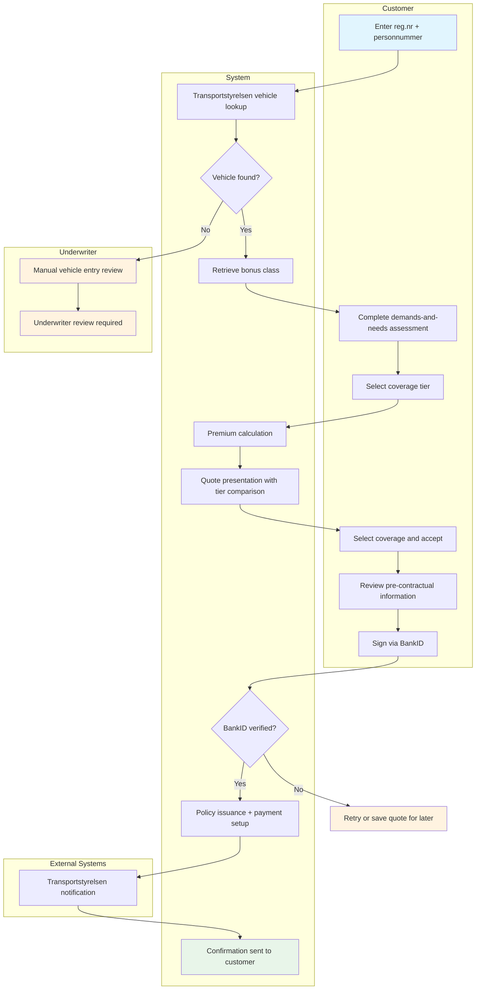
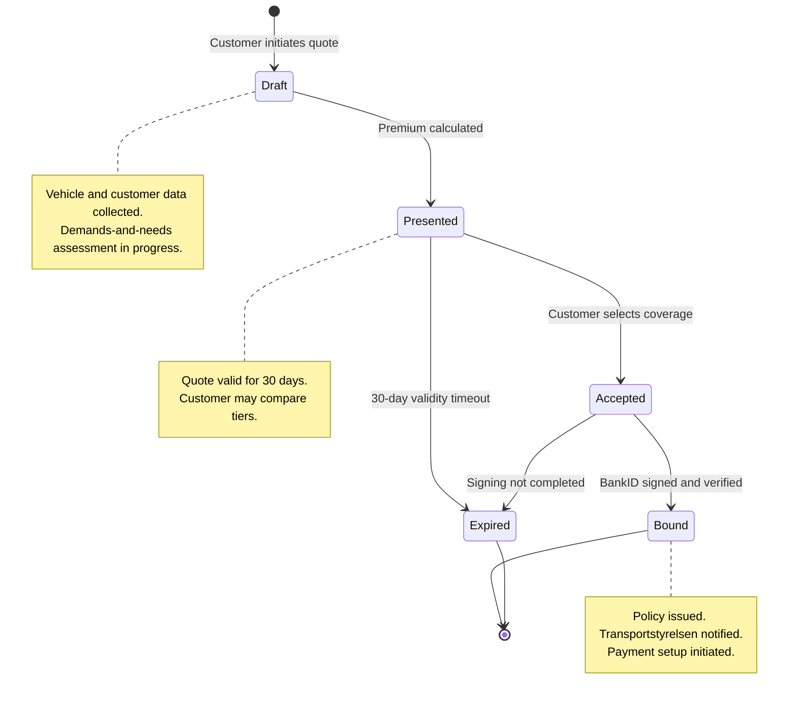

# Use Case: Quote and Bind Motor Insurance

End-to-end use case for quoting and binding a motor insurance policy at
TryggFörsäkring. Covers the complete flow from customer identification through
policy issuance and Transportstyrelsen notification.

## Use Case Summary

| Field                | Value                                                            |
| -------------------- | ---------------------------------------------------------------- |
| **Use Case ID**      | UC-QNB-001                                                       |
| **Name**             | Quote and Bind Motor Insurance                                   |
| **Primary Actor**    | Private Customer (Privatkund)                                    |
| **Secondary Actors** | Insurance Agent, Insurance Broker, Underwriter                   |
| **Goal**             | Obtain a motor insurance quote and bind a policy                 |
| **Preconditions**    | Customer has a Swedish personnummer and a registered vehicle     |
| **Postconditions**   | Policy is bound, certificate issued, Transportstyrelsen notified |
| **Trigger**          | Customer initiates a motor insurance quote request               |

## Stakeholders and Interests

| Stakeholder            | Interest                                                             |
| ---------------------- | -------------------------------------------------------------------- |
| Private Customer       | Quick, transparent quote; fair pricing; immediate proof of insurance |
| Insurance Agent/Broker | Efficient tool for customer advisory; compliant workflow             |
| Underwriter            | Correct risk assessment and bonus class application                  |
| Compliance Officer     | IDD assessment completed; all records retained                       |
| TryggFörsäkring        | New policy sale; regulatory compliance; accurate data                |
| Transportstyrelsen     | Timely notification of insurance status changes                      |

## Process Flow

## State Lifecycle

## Main Success Scenario

### 1. Customer Identification

1. Customer enters registreringsnummer (vehicle registration number)
2. Customer enters personnummer (personal identity number)
3. System verifies customer identity
4. System retrieves vehicle data from Transportstyrelsen:
   - Make, model, year, VIN
   - Registered owner
   - Current insurance status

### 2. Customer Data Retrieval

1. System retrieves the customer's current bonus class (bonusklass) from the
   internal claims database
2. If the customer is new, system assigns the default starting bonus class
3. System retrieves any existing policies for the same vehicle

### 3. Demands-and-Needs Assessment

1. System presents the structured demands-and-needs assessment form
   (krav- och behovsanalys)
2. Customer completes the assessment:
   - Vehicle usage pattern (commuting, business, leisure)
   - Annual mileage estimate
   - Parking situation (garage, carport, street)
   - Deductible tolerance (low, medium, high)
   - Need for add-on coverages
3. System generates a coverage recommendation with rationale:
   - Recommended coverage tier (trafik/halv/hel)
   - Recommended deductible level
   - Relevant add-ons

### 4. Premium Calculation and Coverage Comparison

1. System calculates premiums for all three coverage tiers using:
   - Vehicle risk factors (make, model, year, value)
   - Customer risk factors (age, driving history, bonus class)
   - Geographic risk factors (postal code)
   - Deductible levels
2. System presents a side-by-side tier comparison showing:
   - Coverage details per tier
   - Premium per tier
   - Deductible per tier
   - IPID access link per tier
3. System highlights the recommended tier from the assessment
4. System presents available add-ons with individual pricing

### 5. Coverage Selection

1. Customer selects a coverage tier
2. Customer selects a deductible level
3. Customer selects or declines optional add-ons
4. If the customer deviates from the recommendation, system records the
   deviation
5. System calculates the final premium (base + add-ons)

### 6. Pre-contractual Review and Signing

1. System presents the binding summary:
   - Selected coverage tier and details
   - Premium amount and payment frequency
   - Deductible amount
   - Policy effective date and huvudförfallodag (anniversary)
   - Pre-contractual information (IDD-003):
     - Insurer identity (TryggFörsäkring AB)
     - FSA registration status
     - Complaints handling procedures
     - Dispute resolution options (ARN)
   - IPID delivery confirmation (IDD-002)
   - Demands-and-needs assessment reference (IDD-001)
   - 14-day cooling-off right (ångerrätt) information (FSA-013)
2. Customer initiates BankID signing
3. System sends the policy document hash to BankID
4. Customer completes BankID authentication and signing
5. System records the BankID transaction reference and timestamp

### 7. Policy Issuance

1. System generates a unique policy number
2. System creates the policy record with all binding details
3. System generates the insurance certificate (försäkringsbevis)
4. System initiates payment setup with the payment provider:
   - Monthly autogiro setup, or
   - Annual invoice generation
5. System calculates the ångerrätt (cooling-off) expiry date (14 days)

### 8. Transportstyrelsen Notification

1. System sends insurance notification to Transportstyrelsen:
   - Registreringsnummer
   - Policy number
   - Insurance company identifier
   - Coverage start date
   - Coverage type
2. System records the Transportstyrelsen acknowledgement reference

### 9. Confirmation

1. System sends confirmation to the customer:
   - Insurance certificate (PDF)
   - Full policy document
   - IPID for the selected tier
   - Payment instructions
   - Cooling-off information
2. Policy documents are available in the self-service portal

## Extensions (Alternative Flows)

### 1a. Vehicle Not Found in Transportstyrelsen

1. System displays a message that the vehicle was not found
2. Customer is offered manual vehicle entry (make, model, year)
3. Manual entry requires underwriter review before binding
4. Flow continues from step 5

### 2a. Customer Transferring Bonus from Another Insurer

1. Customer indicates they have a bonus class from another insurer
2. System allows manual entry of the transferred bonus class
3. Customer provides supporting documentation (e.g., insurance certificate
   from previous insurer)
4. Transferred bonus is applied provisionally, subject to verification via
   TFF
5. Flow continues from step 8

### 3a. Agent-Assisted Quote

1. Agent authenticates via BankID
2. System verifies the agent's competence certification (IDD-009)
3. Agent enters the customer's registreringsnummer and personnummer
4. Agent completes the demands-and-needs assessment on behalf of the
   customer
5. System records the agent's identity and distribution channel
6. Agent provides a personal recommendation with documented rationale
   (IDD-006)
7. System records the distribution status disclosure (IDD-005)
8. Flow continues from step 11 (Premium Calculation)
9. At signing, the customer (not the agent) signs via BankID

### 3b. Broker-Assisted Quote

1. Broker authenticates via BankID
2. Broker discloses independence, fee structure, and duty to act in the
   customer's interest (IDD-005)
3. Broker enters the customer's registreringsnummer and personnummer
4. Broker conducts an independent demands-and-needs assessment
5. Broker provides a personalized recommendation with documented rationale
   (IDD-006)
6. System records the broker's identity, distribution channel, and
   disclosures
7. Flow continues from step 11 (Premium Calculation)
8. At signing, the customer signs via BankID

### 6a. BankID Signing Fails

1. System displays an error message indicating the signing failed
2. The quote remains valid for the configured validity period
3. Customer can retry signing without re-entering data
4. If the failure persists, customer is offered to save the quote and
   complete later

### 8a. Transportstyrelsen Notification Fails

1. System logs the failure and queues the notification for retry
2. Automatic retry with exponential backoff
3. After a configured number of failures, an alert is raised for
   operations staff
4. The policy remains valid regardless of notification status; the
   notification is a post-binding obligation

### 5a. Customer Selects Trafikförsäkring Only

1. If the customer selects only trafikförsäkring (mandatory minimum)
2. System presents a confirmation that this provides third-party liability
   only and no own-damage coverage
3. System records the customer's informed decision
4. Flow continues from step 19

## Business Rules

| Rule ID | Rule                                                                                                    |
| ------- | ------------------------------------------------------------------------------------------------------- |
| BR-01   | The demands-and-needs assessment must be completed before any quote is finalized                        |
| BR-02   | The IPID for the selected tier must be provided before binding                                          |
| BR-03   | The customer must be informed of the 14-day cooling-off right (ångerrätt) before signing                |
| BR-04   | Bonus class must be verified or defaulted before premium calculation                                    |
| BR-05   | Transportstyrelsen must be notified within the same business day of policy binding                      |
| BR-06   | Quotes have a configurable validity period (default: 30 days)                                           |
| BR-07   | Minimum age for policyholder is 18 years (verified via personnummer)                                    |
| BR-08   | All vehicles on Swedish roads must have at least trafikförsäkring                                       |
| BR-09   | Add-on pricing must be itemized separately from the base premium                                        |
| BR-10   | Agent/broker-assisted sales must record the distribution channel, advisor identity, and all disclosures |

## Non-functional Requirements

| Requirement                     | Target                                                      |
| ------------------------------- | ----------------------------------------------------------- |
| Vehicle data lookup             | Response within 3 seconds (Transportstyrelsen SLA)          |
| Quote calculation               | Complete within 5 seconds                                   |
| BankID signing                  | Timeout after 2 minutes; allow retry                        |
| Transportstyrelsen notification | Sent within 1 hour of policy binding                        |
| Quote validity                  | Configurable; default 30 days                               |
| Audit trail                     | All steps logged with timestamps and actor identity         |
| Availability                    | Quote-and-bind flow available 24/7 for digital self-service |

## Regulatory Compliance Summary

| Regulation   | Requirements Addressed                                                      |
| ------------ | --------------------------------------------------------------------------- |
| **FSA-004**  | Fair treatment through demands-and-needs assessment and transparent pricing |
| **FSA-007**  | Mandatory trafikförsäkring verified and offered                             |
| **FSA-009**  | Transportstyrelsen notification within regulated timeframes                 |
| **FSA-012**  | Pre-contractual disclosure before binding                                   |
| **FSA-013**  | Cooling-off right (ångerrätt) communicated at binding                       |
| **GDPR-001** | Personal data collected under Article 6(1)(b) for quote generation          |
| **GDPR-002** | Policy data processed under Article 6(1)(b) for contract performance        |
| **GDPR-004** | Transportstyrelsen data sharing under legal obligation                      |
| **IDD-001**  | Demands-and-needs assessment completed before quote finalization            |
| **IDD-002**  | IPID provided for each tier before binding                                  |
| **IDD-003**  | Pre-contractual information presented before signing                        |
| **IDD-005**  | Distribution status disclosed for agent/broker channels                     |
| **IDD-006**  | Advice documented with rationale for agent/broker channels                  |
| **IDD-007**  | Add-on pricing itemized separately                                          |
| **IDD-008**  | All distribution records retained per retention requirements                |
| **IDD-009**  | Agent/broker competence verified before quote initiation                    |

## Related User Stories

- [QNB-01: Get a Quick Quote](../user-stories/quote-and-bind.md#qnb-01-get-a-quick-quote)
- [QNB-02: Agent-Assisted Quote](../user-stories/quote-and-bind.md#qnb-02-agent-assisted-quote)
- [QNB-03: Demands-and-Needs Assessment](../user-stories/quote-and-bind.md#qnb-03-demands-and-needs-assessment)
- [QNB-04: Compare Coverage Tiers](../user-stories/quote-and-bind.md#qnb-04-compare-coverage-tiers)
- [QNB-05: Sign Policy with BankID](../user-stories/quote-and-bind.md#qnb-05-sign-policy-with-bankid)
- [QNB-06: Receive Insurance Certificate Immediately](../user-stories/quote-and-bind.md#qnb-06-receive-insurance-certificate-immediately)
- [QNB-07: Automatic Bonus Class Calculation](../user-stories/quote-and-bind.md#qnb-07-automatic-bonus-class-calculation)
- [QNB-08: Notify Transportstyrelsen of New Policy](../user-stories/quote-and-bind.md#qnb-08-notify-transportstyrelsen-of-new-policy)
