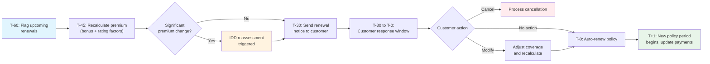

# Motor Policy Renewal Use Cases

Detailed interaction flows for the motor insurance renewal lifecycle. Each use case describes the step-by-step process for pre-renewal processing, automatic renewal, customer-initiated cancellation at huvudförfallodag, and insurer switching via flyttanmälan.

## Renewal Timeline

## UC-RN-001: Process Annual Policy Renewal

Handles the end-to-end renewal flow from pre-renewal premium recalculation through automatic renewal or customer cancellation.

### Actors

- **Primary:** System (automated batch process)
- **Supporting:** Underwriter (for flagged renewals), Customer, Payment Provider, Transportstyrelsen

### Preconditions

- The policy is active with a known huvudförfallodag
- The policy has not already been cancelled
- The pre-renewal processing window has been reached (configurable, e.g., 60 days before huvudförfallodag)

### Main Flow

1. The daily renewal batch process identifies policies with a huvudförfallodag within the processing window
2. For each identified policy, the system retrieves the current policy state: coverage tier, vehicle, named drivers, address, mileage, deductible, and bonus class
3. The system evaluates the claims history for the expiring policy period:
   - Zero claims → bonus class increases by one step (up to maximum)
   - One claim (paid) → bonus class decreases by the configured step-down amount
   - Two or more claims (paid) → bonus class drops to the lowest class
   - Glass-only claims → no bonus class impact
4. The system retrieves the tariff version effective on the huvudförfallodag
5. The system recalculates the annual premium using: updated bonus class, current risk factors, and the new tariff
6. The system creates a renewal record with: old premium, new premium, bonus class change, factor breakdown, and tariff version
7. The system evaluates the renewal against flagging rules:
   - Premium increase above threshold → **Exception Flow A**
   - Retention eligibility criteria met → **Exception Flow B**
   - Demands-and-needs reassessment trigger → **Exception Flow C**
8. The system generates a renewal notice containing: current premium, new premium, premium change breakdown, bonus class change, coverage summary, hauptförfallodag, and cancellation instructions
9. The system dispatches the renewal notice at least 30 days before the huvudförfallodag via the customer's preferred channel (post and/or digital)
10. The system logs the notice dispatch: sent date, channel, content version, delivery status
11. The customer response window opens (30 days before huvudförfallodag):
    - Customer takes no action → continue to step 12
    - Customer cancels → **Exception Flow D**
    - Customer requests coverage changes → **Exception Flow E**
12. On the huvudförfallodag, the system processes the automatic renewal:
    a. Creates a new policy period (365 days from huvudförfallodag)
    b. Applies the recalculated premium and updated bonus class
    c. Retains coverage tier, vehicle, named drivers, deductible, and address from the expiring period
    d. Generates an updated policy document for the new period
    e. Updates the payment schedule with the new premium and installment amounts
    f. Records the renewal in the policy amendment history
13. The system sends a renewal confirmation to the customer with a link to the updated policy document
14. The system initiates the first payment collection for the new period

### Exception Flows

#### A. Premium increase requires underwriter review

1. The system routes the renewal to the underwriter queue with the premium calculation details, factor breakdown, and customer history
2. The underwriter reviews the renewal and decides:
   - Approve standard renewal → resume main flow at step 8
   - Adjust premium (e.g., apply a capping rule to limit increase) → update the renewal record, then resume at step 8
   - Flag for retention offer → proceed to Exception Flow B
3. If the underwriter does not review within 2 business days, the system escalates to a senior underwriter

#### B. Retention offer applied

1. The system evaluates the customer against retention eligibility criteria: tenure, bonus class, claims history, premium increase percentage
2. If eligible, the system calculates a retention discount (capped at a configurable maximum)
3. The underwriter reviews and approves/adjusts the retention offer
4. The renewal notice (step 8) includes both the standard premium and the retention-adjusted premium
5. If the customer does not cancel, the retention-adjusted premium is applied at renewal (step 12)

#### C. Demands-and-needs reassessment triggered

1. The system contacts the customer (digitally or via agent) to reassess their coverage needs
2. The reassessment covers: current coverage tier appropriateness, deductible level, add-on relevance
3. If the customer requests changes based on the reassessment, the renewal terms are adjusted before the notice is sent
4. If the customer does not respond within 14 days, the renewal proceeds with existing terms
5. The reassessment record is stored and linked to the renewal record

#### D. Customer cancels before huvudförfallodag

1. The customer submits a cancellation request (via self-service, phone, or post)
2. The system validates that the cancellation is received before the huvudförfallodag
3. The system records the cancellation with the effective date set to the huvudförfallodag
4. The system suppresses the automatic renewal for this policy
5. The system notifies Transportstyrelsen that coverage will end on the huvudförfallodag
6. The system sends the customer a cancellation confirmation including:
   - Cancellation effective date
   - Reminder that trafikförsäkring must be obtained from another insurer
   - The customer's current bonus class (for transfer to the new insurer)
   - Warning about TFF default coverage and trafikförsäkringsavgift if no replacement coverage is obtained

#### E. Customer requests coverage changes at renewal

1. The customer contacts TryggFörsäkring to request changes effective at the huvudförfallodag (e.g., coverage tier change, deductible adjustment, add/remove named driver)
2. The system recalculates the renewal premium with the requested changes
3. The customer confirms the updated renewal terms
4. The renewal proceeds at step 12 with the modified terms
5. If the changes trigger a high-risk flag, the standard underwriter review applies (see UC-PA-006)

### Postconditions

- The policy has been renewed for a new 365-day period (or cancelled if the customer opted out)
- The renewal record is stored with full audit trail: premium calculation, bonus class change, notice dispatch, and renewal/cancellation outcome
- Transportstyrelsen has been notified if coverage status changed
- The customer has received either a renewal confirmation or cancellation confirmation
- The payment schedule has been updated for the new period

### Business Rules

- Automatic renewal is the default — the customer must actively cancel to prevent it
- Renewal notice must be sent at least 30 days before huvudförfallodag (Försäkringsavtalslagen)
- Bonus class changes only at renewal, never mid-term
- Trafikförsäkring coverage must be continuous — no gap at renewal (FSA-007)
- Retention discounts must comply with fair treatment (FSA-004)

### Regulatory

- **FSA-004** — Renewal notices must be clear and transparent
- **FSA-007** — Continuous trafikförsäkring coverage at renewal
- **FSA-012** — Pre-contractual disclosure for renewed terms
- **FSA-013** — Customer's right to cancel at huvudförfallodag; renewal rules per Försäkringsavtalslagen
- **FSA-014** — Renewal records retained for the record-keeping period
- **GDPR-002** — Renewal data stored as part of policy administration
- **GDPR-005** — Renewal notice communications comply with marketing and renewal data processing rules
- **IDD-001** — Demands-and-needs reassessment when significant changes occur at renewal

---

## UC-RN-002: Process Flyttanmälan (Insurer Switch Request)

Handles the processing of an inbound cancellation request from a competitor insurer when a customer switches their motor insurance at huvudförfallodag.

### Actors

- **Primary:** System (automated)
- **Supporting:** Competitor Insurer, Customer, Transportstyrelsen

### Preconditions

- The policy is active with a known huvudförfallodag
- A flyttanmälan has been received from another insurer
- The flyttanmälan contains the policyholder's personnummer and vehicle registreringsnummer

### Main Flow

1. The system receives a flyttanmälan from a competitor insurer (via industry API or manual channel)
2. The system validates the request:
   a. Matches the personnummer and registreringsnummer to an active policy
   b. Verifies the requested effective date aligns with the policy's huvudförfallodag
   c. Checks that the request is received before the huvudförfallodag
3. The system processes the cancellation:
   a. Records the cancellation effective on the huvudförfallodag
   b. Suppresses automatic renewal for this policy
   c. Updates the renewal record status to "cancelled — insurer switch"
4. The system generates a försäkringsbesked (insurance certificate) containing:
   - Policyholder details
   - Current bonus class
   - Claims history summary for the current period
   - Coverage end date
5. The system responds to the competitor insurer with:
   - Confirmation of cancellation
   - Försäkringsbesked data
   - Huvudförfallodag date
6. The system notifies Transportstyrelsen that coverage will end on the huvudförfallodag
7. The system sends the customer:
   - Cancellation confirmation
   - Bonus class certificate (for their records)
   - Reminder of the coverage end date

### Exception Flows

#### A. Policy not found or personnummer mismatch

1. The system cannot match the flyttanmälan to an active policy
2. The system responds to the competitor insurer with a rejection: "Policy not found"
3. No changes are made to any policy

#### B. Effective date does not match huvudförfallodag

1. The requested effective date does not align with the policy's huvudförfallodag
2. The system responds with a rejection including the correct huvudförfallodag date
3. The competitor insurer may resubmit with the correct date

#### C. Flyttanmälan received after huvudförfallodag

1. The policy has already been renewed
2. The system responds with a rejection: "Policy already renewed; mid-term cancellation process applies"
3. The customer must contact TryggFörsäkring directly for mid-term cancellation

#### D. Duplicate flyttanmälan

1. The system detects that a cancellation has already been recorded for this policy at this huvudförfallodag
2. The system responds with confirmation of the existing cancellation
3. No duplicate processing occurs

### Postconditions

- The policy is marked for cancellation on the huvudförfallodag
- Automatic renewal has been suppressed
- The competitor insurer has received confirmation and the försäkringsbesked
- Transportstyrelsen has been notified (or notification is queued)
- The customer has been informed

### Business Rules

- Flyttanmälan is the standard Swedish industry mechanism for insurer switching
- The effective date must match the huvudförfallodag — mid-term switching follows different rules
- The försäkringsbesked must include an accurate bonus class so the new insurer can apply it correctly
- Processing should be automated for electronic requests; manual requests may require operator handling
- Response time SLA: electronic requests processed within 1 business day

### Regulatory

- **FSA-013** — Insurer switching at huvudförfallodag is governed by Försäkringsavtalslagen
- **FSA-009** — Transportstyrelsen must be notified of the coverage change
- **FSA-007** — The customer must maintain trafikförsäkring — the system warns about gaps
- **GDPR-002** — Switching records stored as part of policy administration
- **GDPR-004** — Data shared with the competitor insurer is limited to mandated fields

---

## UC-RN-003: Manage Bonus Class Progression

Handles the annual bonus class update at renewal based on the policyholder's claims history.

### Actors

- **Primary:** System (automated)
- **Supporting:** Underwriter (for dispute resolution)

### Preconditions

- The policy is approaching renewal (within the pre-renewal processing window)
- Claims data for the expiring policy period is finalized

### Main Flow

1. The system retrieves the policyholder's current bonus class and the bonus class scale configuration
2. The system queries the claims history for the expiring policy period:
   - Number of claims where the insurer made a payment
   - Claim types (standard, glass-only)
   - Claim amounts paid
3. The system applies the bonus progression rules:
   a. **Zero paid claims (excluding glass-only):** Bonus class increases by one step (e.g., class 4 → class 5)
   b. **One paid claim:** Bonus class decreases by the configured step-down amount (e.g., class 5 → class 2)
   c. **Two or more paid claims:** Bonus class drops to the lowest class (e.g., class 1)
   d. **At maximum class with zero claims:** Bonus class remains at the maximum
   e. **At minimum class with claims:** Bonus class remains at the minimum (cannot go below class 1)
4. The system records the bonus class change: old class, new class, claims count, rule applied, effective date (huvudförfallodag)
5. The new bonus class is used in the renewal premium calculation (UC-RN-001, step 5)
6. The bonus class change is included in the renewal notice sent to the customer

### Exception Flows

#### A. Customer disputes bonus class

1. The customer contacts TryggFörsäkring to dispute the bonus class change (e.g., claim was declined but incorrectly counted, or claim was made by a third party)
2. The system routes the dispute to an underwriter
3. The underwriter reviews the claims data and the bonus class calculation
4. If the dispute is valid: the bonus class is corrected and the renewal premium is recalculated
5. If the dispute is invalid: the customer is informed with the rationale
6. The dispute and resolution are recorded in the policy history

#### B. Bonus class transfer from previous insurer

1. A new customer provides a försäkringsbesked from their previous insurer
2. The system validates the document (insurer, policyholder personnummer, stated bonus class, coverage end date)
3. The system applies the transferred bonus class to the customer's first renewal
4. If the document is older than a configurable period (e.g., 12 months), the transfer may be subject to underwriter review

### Postconditions

- The policyholder's bonus class has been updated for the new policy period
- The bonus class change is recorded with full audit trail
- The updated bonus class has been applied to the renewal premium calculation

### Business Rules

- Bonus class changes are applied only at renewal, never mid-term
- Glass-only claims (glasskada) do not affect bonus class — this is a Swedish motor insurance industry standard
- Declined claims and claims below the deductible do not affect bonus class
- The bonus class belongs to the policyholder, not the vehicle
- Bonus transfers from another insurer require documented proof (försäkringsbesked)
- The bonus class scale (number of classes, discount percentages, step-up/step-down rules) is configurable per product

### Regulatory

- **FSA-004** — Bonus class rules and their impact on premium must be communicated clearly
- **FSA-005** — The bonus system must be monitored as part of product governance
- **GDPR-001** — Bonus data from previous insurers requires lawful basis for collection
- **GDPR-002** — Bonus class history is part of the policy administration record

---

## Related User Stories

- [US-RN-001: Receive Renewal Notice](../user-stories/renewals.md#us-rn-001-receive-renewal-notice)
- [US-RN-002: View Premium Change Explanation](../user-stories/renewals.md#us-rn-002-view-premium-change-explanation)
- [US-RN-003: Recalculate Renewal Premium](../user-stories/renewals.md#us-rn-003-recalculate-renewal-premium)
- [US-RN-004: Update Bonus Class at Renewal](../user-stories/renewals.md#us-rn-004-update-bonus-class-at-renewal)
- [US-RN-005: Automatically Renew Policy](../user-stories/renewals.md#us-rn-005-automatically-renew-policy)
- [US-RN-006: Cancel Policy Before Renewal](../user-stories/renewals.md#us-rn-006-cancel-policy-before-renewal)
- [US-RN-007: Update Payment Schedule for Renewed Policy](../user-stories/renewals.md#us-rn-007-update-payment-schedule-for-renewed-policy)
- [US-RN-008: Handle Inbound Insurer Switch](../user-stories/renewals.md#us-rn-008-handle-inbound-insurer-switch-flyttanmälan)
- [US-RN-009: Offer Retention Pricing](../user-stories/renewals.md#us-rn-009-offer-retention-pricing)
- [US-RN-010: Reassess Demands and Needs at Renewal](../user-stories/renewals.md#us-rn-010-reassess-demands-and-needs-at-renewal)
