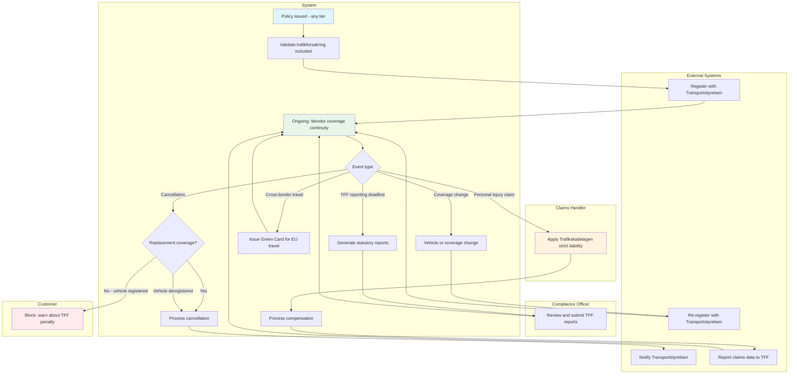
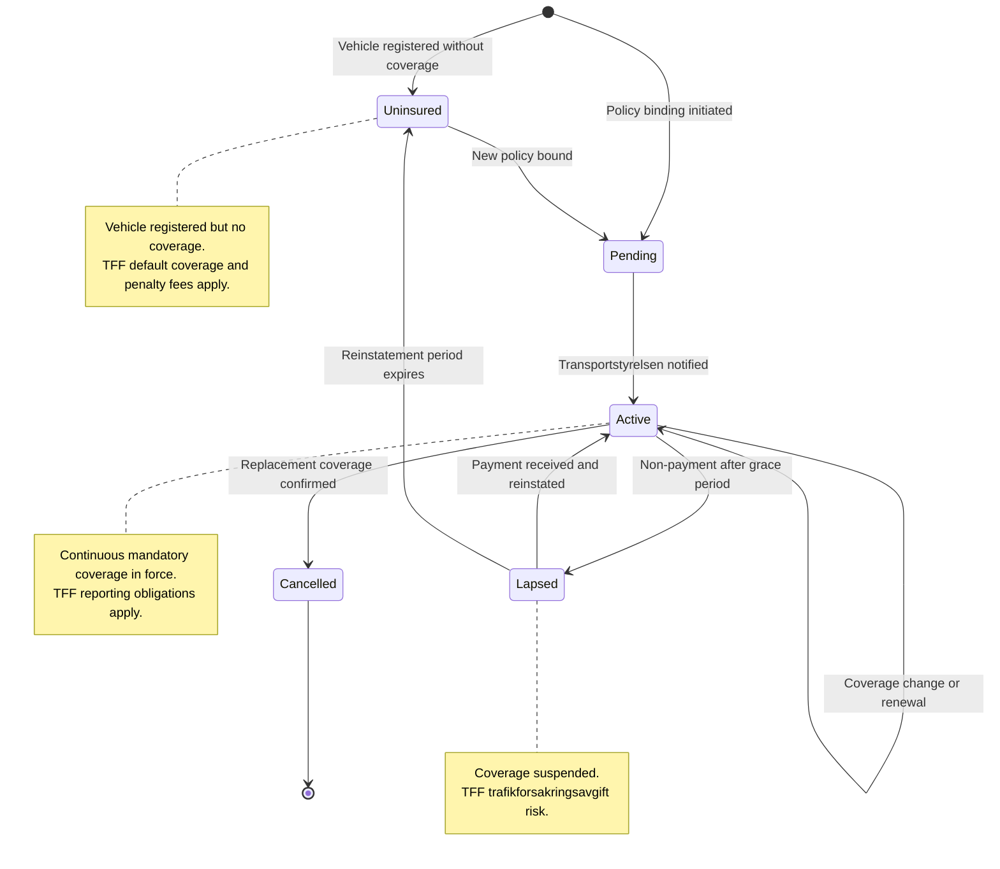
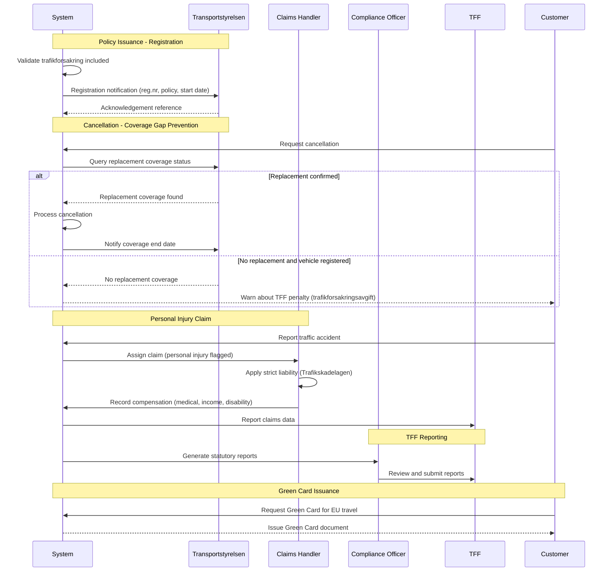

# Use Case: Trafikforsakring Compliance Lifecycle

End-to-end use case for managing mandatory third-party liability insurance
(trafikforsakring) at TryggForsakring. Covers Transportstyrelsen registration,
coverage gap prevention, personal injury claims under Trafikskadelagen, TFF
reporting obligations, uninsured vehicle handling, and cross-border coverage
via the Green Card system.

## Use Case Summary

| Field                | Value                                                                                 |
| -------------------- | ------------------------------------------------------------------------------------- |
| **Use Case ID**      | UC-TRF-001                                                                            |
| **Name**             | Trafikforsakring Compliance Lifecycle                                                 |
| **Primary Actor**    | System (automated processes)                                                          |
| **Secondary Actors** | Claims Handler, Compliance Officer, Private Customer                                  |
| **Goal**             | Ensure continuous mandatory coverage, compliant reporting, and proper claims handling |
| **Preconditions**    | TryggForsakring is an authorized trafikforsakring seller and TFF member               |
| **Postconditions**   | Vehicle registry is updated, coverage gaps are prevented, claims are processed        |
| **Trigger**          | Policy binding, cancellation, claim registration, or reporting deadline               |

## Stakeholders and Interests

| Stakeholder                                                                | Interest                                                                 |
| -------------------------------------------------------------------------- | ------------------------------------------------------------------------ |
| [Customer (Privatkund)](../../actors/internal/customer.md)                 | Continuous legal coverage; clear information about mandatory obligations |
| [Claims Handler (Skadereglerare)](../../actors/internal/claims-handler.md) | Correct claim classification; clear personal injury process              |
| [Compliance Officer](../../actors/internal/compliance-officer.md)          | Timely TFF reporting; regulatory compliance evidence                     |
| Underwriter                                                                | Accurate trafikforsakring pricing within product tiers                   |
| [Transportstyrelsen](../../actors/external/transportstyrelsen.md)          | Timely and accurate insurance status notifications                       |
| [TFF](../../actors/external/tff.md)                                        | Membership reporting compliance; uninsured vehicle claims cooperation    |
| FSA                                                                        | Regulatory oversight of mandatory insurance obligations                  |

## Compliance Lifecycle Flow

## State Lifecycle

## Interaction Sequence

## Main Success Scenario

### 1. Policy Issuance — Mandatory Coverage Check and Registration

1. A motor insurance policy is bound (any tier: trafik, halv, or hel)
2. System validates that trafikforsakring is included as mandatory base
   coverage
3. System sends a registration notification to Transportstyrelsen
   containing:
   - Registreringsnummer
   - Policy number
   - Insurance company identifier
   - Coverage start date and time
   - Coverage type
4. Transportstyrelsen acknowledges the registration
5. System records the acknowledgement reference and timestamp
6. Vehicle registry now reflects valid trafikforsakring with
   TryggForsakring

### 2. Ongoing Monitoring — Coverage Gap Detection and TFF Reporting

1. System continuously monitors for vehicles where trafikforsakring
   coverage is about to end without confirmed replacement
2. When a cancellation request is received, system queries
   Transportstyrelsen for replacement coverage status
3. If replacement coverage is confirmed, system processes the cancellation
   with aligned coverage dates
4. System notifies Transportstyrelsen of the coverage end date
5. System records the cancellation details and replacement policy reference
6. At each reporting period, system generates TFF statutory reports
7. Compliance officer reviews and submits reports to TFF

### 3. Claims — Personal Injury Processing Under Strict Liability

1. A traffic accident is reported and a claim is registered
2. Claims handler classifies the claim type (personal injury, property
   damage, or combined)
3. For personal injury claims, the system applies strict liability rules
   under Trafikskadelagen
4. Claims handler obtains medical documentation from healthcare providers
5. System calculates compensation based on:
   - Medical costs incurred
   - Lost income during recovery
   - Pain and suffering
   - Permanent disability (if applicable)
6. Claims handler reviews and approves the compensation
7. System processes the payment to the injured person
8. Claim data is included in TFF reporting

### 4. Claims — TFF Claims Coordination

1. Claims handler identifies a claim involving an uninsured, unidentified,
   or foreign vehicle
2. System verifies the vehicle's insurance status via Transportstyrelsen
3. System generates a TFF referral with all required claim documentation
4. TFF processes the claim and provides settlement decision
5. System records the TFF settlement and closes the claim

### 5. Cross-Border — Green Card Issuance and EU Compliance

1. Customer requests a Green Card for international travel
2. System generates a Green Card document with policy details and
   coverage countries
3. If the customer is involved in an accident abroad, they report
   the claim through the normal channel
4. System supports cross-border claim processing via the Green Card
   bureau network

## Extensions (Alternative Flows)

### 1a. Transportstyrelsen Notification Fails

1. System logs the failure with error details
2. System queues the notification for automatic retry with exponential
   backoff
3. After 3 consecutive failures, system raises an alert for operations
   staff
4. The policy remains valid regardless of notification delivery status
5. Operations staff investigates and resolves the integration issue
6. System resends the notification when connectivity is restored

### 2a. No Replacement Coverage at Cancellation

1. System queries Transportstyrelsen and finds no replacement coverage
2. System displays a warning to the policyholder explaining:
   - The vehicle will be uninsured
   - TFF will charge a trafikforsakringsavgift (penalty fee) for the
     uninsured period
   - The vehicle owner remains liable for any damages caused
3. Policyholder must explicitly acknowledge the consequences
4. System records the acknowledgement with timestamp
5. System processes the cancellation and notifies Transportstyrelsen
6. System logs the uninsured vehicle event for audit purposes

### 2b. Vehicle Deregistered

1. Policyholder provides proof that the vehicle has been deregistered
   from Transportstyrelsen (scrapped, exported, or permanently off road)
2. System verifies the deregistration status with Transportstyrelsen
3. System processes the cancellation without requiring replacement coverage
4. System notifies Transportstyrelsen of the coverage end date

### 2c. Insurer-Initiated Cancellation (Non-Payment)

1. Policyholder fails to pay premium within the grace period
2. System sends payment reminders per the payment schedule
3. After the final reminder period expires, system initiates cancellation
4. System notifies the policyholder that coverage will end on a specified
   date, with minimum notice period per Forsakringsavtalslagen
5. System notifies Transportstyrelsen of the coverage end date
6. System logs the insurer-initiated cancellation reason

### 3a. Claim Involves Uninsured Vehicle

1. Claims handler looks up the responsible vehicle's insurance status
   via Transportstyrelsen
2. System confirms the vehicle has no valid trafikforsakring
3. System flags the claim as an uninsured vehicle claim
4. System generates a TFF referral with all required claim documentation
5. Claims handler notifies the victim that TFF will handle the claim
   against the uninsured vehicle
6. System tracks the TFF referral status

### 3b. Claim Involves Foreign-Registered Vehicle

1. Claims handler identifies the responsible vehicle as foreign-registered
2. System checks for valid Green Card or equivalent EU motor insurance
3. If no valid coverage is found, system generates a TFF referral for
   handling via the Green Card bureau system
4. If valid coverage is found, system routes the claim to the foreign
   insurer's representative via the bureau network
5. System records the foreign vehicle's country of origin and available
   insurance details

### 3c. Hit-and-Run Incident

1. The responsible vehicle has fled the scene and cannot be identified
2. Claims handler registers the claim with police report reference
3. System generates a TFF referral for unidentified vehicle claims
4. TFF handles compensation for the victim under Trafikskadelagen
5. System tracks the TFF claim progress

### 5a. Foreign Claim Against TryggForsakring Policyholder

1. A foreign insurer or Green Card bureau submits a claim against
   TryggForsakring's policyholder for an incident abroad
2. System routes the incoming claim to the appropriate claims handler
3. Claims handler reviews the foreign documentation
4. System processes the claim according to the law of the country where
   the accident occurred (per EU Motor Insurance Directive)
5. System records the cross-border claim details and settlement

## Business Rules

| Rule ID  | Rule                                                                                                             |
| -------- | ---------------------------------------------------------------------------------------------------------------- |
| BR-TF-01 | Trafikforsakring is mandatory for all registered vehicles; no motor policy may exist without it as base coverage |
| BR-TF-02 | Transportstyrelsen must be notified within 1 hour of policy binding                                              |
| BR-TF-03 | Personal injury claims under Trafikskadelagen follow strict liability (no fault required)                        |
| BR-TF-04 | All persons injured in or by the vehicle are covered, including the driver                                       |
| BR-TF-05 | Coverage gap prevention: system must check for replacement insurance before processing cancellations             |
| BR-TF-06 | TFF reporting is mandatory and must follow TFF's data exchange specifications                                    |
| BR-TF-07 | Uninsured vehicle claims must be referred to TFF                                                                 |
| BR-TF-08 | Green Card coverage extends trafikforsakring to all EU/EEA and Green Card system countries                       |
| BR-TF-09 | Medical data for personal injury claims requires legal obligation basis under Trafikskadelagen                   |
| BR-TF-10 | Insurer-initiated cancellation requires minimum notice period per Forsakringsavtalslagen                         |

## Non-functional Requirements

| Requirement                        | Target                                                           |
| ---------------------------------- | ---------------------------------------------------------------- |
| Transportstyrelsen notification    | Sent within 1 hour of policy binding                             |
| Notification retry                 | Exponential backoff; alert after 3 failures                      |
| Coverage verification              | Response within 3 seconds (Transportstyrelsen SLA)               |
| Personal injury claim registration | System classification available immediately at FNOL              |
| TFF report generation              | Complete within 30 minutes for quarterly data                    |
| Green Card generation              | Available immediately upon request                               |
| Audit trail                        | All trafikforsakring events logged with timestamps and actor IDs |
| Data retention                     | Trafikforsakring records retained for policy duration + 10 years |

## Regulatory Compliance Summary

| Regulation                       | Requirements Addressed                                              |
| -------------------------------- | ------------------------------------------------------------------- |
| **FSA-007**                      | Mandatory trafikforsakring enforced for all registered vehicles     |
| **FSA-008**                      | TFF membership obligations met through reporting and cooperation    |
| **FSA-009**                      | Transportstyrelsen notified within regulated timeframes             |
| **FSA-010**                      | Personal injury claims handled fairly under strict liability rules  |
| **FSA-013**                      | Cooling-off cancellations follow coverage gap prevention rules      |
| **FSA-014**                      | All trafikforsakring records retained per regulatory requirements   |
| **GDPR-003**                     | Claims data (including medical) processed under legal obligation    |
| **GDPR-004**                     | Transportstyrelsen and TFF data sharing under legal obligation      |
| **IDD-002**                      | IPID describes trafikforsakring coverage including geographic scope |
| **EU Motor Insurance Directive** | Cross-border coverage via Green Card; mutual recognition across EU  |

## Related User Stories

- [US-TRF-001: Ensure Continuous Mandatory Coverage](../user-stories/trafikforsakring.md#us-trf-001-ensure-continuous-mandatory-coverage)
- [US-TRF-002: Report to TFF](../user-stories/trafikforsakring.md#us-trf-002-report-to-tff)
- [US-TRF-003: Handle TFF Data Exchange](../user-stories/trafikforsakring.md#us-trf-003-handle-tff-data-exchange)
- [US-TRF-004: Process Personal Injury Under Trafikskadelagen](../user-stories/trafikforsakring.md#us-trf-004-process-personal-injury-under-trafikskadelagen)
- [US-TRF-005: Issue Green Card for EU Travel](../user-stories/trafikforsakring.md#us-trf-005-issue-green-card-for-eu-travel)
- [US-TRF-006: Handle Trafikforsakringsavgift Notification](../user-stories/trafikforsakring.md#us-trf-006-handle-trafikforsakringsavgift-notification)
- [US-TRF-007: Verify TFF Membership Compliance](../user-stories/trafikforsakring.md#us-trf-007-verify-tff-membership-compliance)
