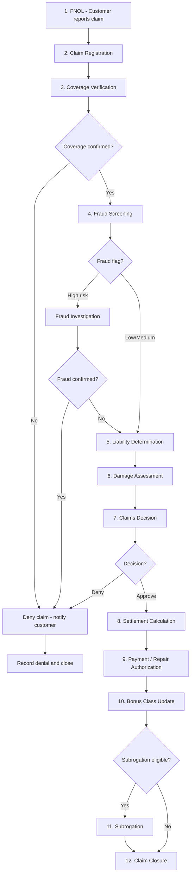

# UC-CLM-001: Claims Lifecycle

## Overview

This use case describes the end-to-end lifecycle of a motor insurance claim, from first notification of loss (FNOL) through investigation, decision, settlement, and closure. It serves as the orchestrating use case that ties together the individual claims processing steps.

## Actors

- **Primary:** [Customer (Privatkund)](../../actors/internal-actors.md#customer-privatkund), [Claims Handler (Skadereglerare)](../../actors/internal-actors.md#claims-handler-skadereglerare)
- **Supporting:** [Claims Adjuster (Värderare)](../../actors/internal-actors.md#claims-adjuster-värderare), [Repair Shop (Verkstad)](../../actors/external-actors.md#repair-shop-verkstad), [Police (Polis)](../../actors/external-actors.md#police-polis), [Medical Provider (Vårdgivare)](../../actors/external-actors.md#medical-provider-vårdgivare), [TFF](../../actors/external-actors.md#trafikförsäkringsföreningen-tff), [Payment Provider (Betalningsleverantör)](../../actors/external-actors.md#payment-provider)

## Preconditions

1. The customer holds an active motor insurance policy with TryggFörsäkring
2. An insured event has occurred (accident, theft, damage, etc.)

## Postconditions

**Success:**

- Claim is settled and closed with full documentation
- Customer has received the settlement amount (or repair has been completed)
- Bonus class has been updated (if applicable)
- Subrogation has been initiated (if applicable)
- All records are retained per regulatory requirements

**Failure:**

- Claim is denied with documented reason and customer notification
- Customer has been informed of complaints procedure and dispute resolution options

## Main Flow

### Step-by-Step

| Step | Action                                                        | Actor           | System Response                                             | Reference                                                                                                        |
| ---- | ------------------------------------------------------------- | --------------- | ----------------------------------------------------------- | ---------------------------------------------------------------------------------------------------------------- |
| 1    | Customer reports the incident via web, app, or phone          | Customer        | Creates FNOL record, assigns claim number                   | [US-CLM-001](../user-stories/claims-fnol.md)                                                                     |
| 2    | Claims handler reviews and registers the claim                | Claims Handler  | Links claim to policy, sets status to "Registered"          | [US-CLM-002](../user-stories/claims-registration.md)                                                             |
| 3    | System verifies coverage was active and claim type is covered | Claims Handler  | Displays coverage confirmation or flags issues              | [US-CLM-003](../user-stories/claims-coverage-verification.md)                                                    |
| 4    | System runs automated fraud screening                         | System          | Assigns fraud risk score; flags suspicious claims           | [US-CLM-006](../user-stories/claims-fraud-screening.md)                                                          |
| 5    | Claims handler determines liability based on evidence         | Claims Handler  | Records liability split and supporting evidence             | [US-CLM-004](../user-stories/claims-liability.md)                                                                |
| 6    | Claims adjuster assesses vehicle damage                       | Claims Adjuster | Records repair estimate or total loss valuation             | [US-CLM-005](../user-stories/claims-damage-assessment.md)                                                        |
| 7    | Claims handler makes approve/deny decision                    | Claims Handler  | Records decision and rationale                              | [US-CLM-007](../user-stories/claims-decision.md)                                                                 |
| 8    | System calculates settlement amount                           | Claims Handler  | Calculates repair cost or total loss value minus deductible | [US-CLM-008](../user-stories/claims-settlement.md)                                                               |
| 9    | Payment is issued or repair is authorized                     | Claims Handler  | Processes payment or sends repair authorization             | [US-CLM-008](../user-stories/claims-settlement.md), [US-CLM-014](../user-stories/claims-repair-authorization.md) |
| 10   | System updates bonus class                                    | System          | Recalculates bonus class based on claim type                | [US-CLM-010](../user-stories/claims-bonus-impact.md)                                                             |
| 11   | Subrogation initiated if third party at fault                 | Claims Handler  | Records recovery target and tracks recovery                 | [US-CLM-009](../user-stories/claims-subrogation.md)                                                              |
| 12   | Claims handler performs final review and closes claim         | Claims Handler  | Sets status to "Closed", updates statistics                 | [US-CLM-015](../user-stories/claims-closure.md)                                                                  |

## Alternative Flows

### A1: Phone-Reported Claim

At step 1, if the customer reports the claim by phone:

1. The claims handler captures incident details during the call
2. The handler creates the claim record on behalf of the customer
3. The process continues from step 2

### A2: Third-Party Claimant

At step 1, if the claimant is a third party (not the policyholder):

1. The third party reports damage or injury caused by a TryggFörsäkring policyholder
2. The system creates a third-party claim linked to the policyholder's trafikförsäkring
3. Coverage verification confirms the policy was active (trafikförsäkring covers third parties)
4. The process continues from step 5 (liability determination)

### A3: TFF Claim

At step 3, if coverage verification reveals the at-fault vehicle is uninsured:

1. The claim is flagged as a TFF claim
2. The process follows the TFF claims handling flow (see [US-CLM-011](../user-stories/claims-tff.md))

### A4: Personal Injury Claim

At step 1, if the claim involves personal injury:

1. An additional personal injury sub-claim is created
2. Medical documentation is requested from healthcare providers
3. Injury compensation is calculated per Trafikskadelagen schedules
4. The claim may remain open for an extended period (see [US-CLM-012](../user-stories/claims-personal-injury.md))

### A5: Glass-Only Claim (Fast Track)

At step 1, if the claim is for glass damage only:

1. The customer is directed to an authorized glass repair shop
2. Coverage verification is performed (halvförsäkring or helförsäkring required)
3. The repair shop performs the replacement and bills TryggFörsäkring directly
4. The customer pays only the glass deductible
5. No bonus class impact — claim is closed after payment

## Exception Flows

### E1: Coverage Denied

At step 3, if coverage verification fails:

1. The claims handler records the denial reason
2. The system generates a denial notification to the customer
3. The notification includes the complaints procedure and external dispute resolution (ARN)
4. The claim is closed with status "Denied"

### E2: Claim Disputed by Customer

After step 7, if the customer disputes the decision:

1. The customer files a complaint through the complaints procedure (FSA-011)
2. The complaint is registered and linked to the claim
3. The complaint is investigated per the complaints handling process
4. If the complaint is upheld, the claim decision may be revised

## Business Rules

| Rule       | Description                                                              |
| ---------- | ------------------------------------------------------------------------ |
| BR-CLM-001 | A claim must be linked to exactly one active policy                      |
| BR-CLM-002 | Coverage verification must be completed before any settlement decision   |
| BR-CLM-003 | Claims exceeding the handler's authority limit must be escalated         |
| BR-CLM-004 | Denial notifications must include complaints procedure information       |
| BR-CLM-005 | Bonus class changes take effect at the next renewal date                 |
| BR-CLM-006 | Trafikförsäkring personal injury claims have a 10-year limitation period |
| BR-CLM-007 | The customer must be made whole before subrogation is pursued            |
| BR-CLM-008 | Fraud investigation must not unreasonably delay legitimate claims        |

## Key Performance Indicators

| KPI                      | Description                                   | Target                               |
| ------------------------ | --------------------------------------------- | ------------------------------------ |
| FNOL to registration     | Time from customer report to claim registered | < 1 business day                     |
| Registration to decision | Time from registration to approve/deny        | < 10 business days (standard claims) |
| Decision to payment      | Time from approval to payment issued          | < 5 business days                    |
| Total cycle time         | FNOL to claim closure                         | < 30 business days (standard claims) |
| Customer satisfaction    | Post-claim survey score                       | ≥ 4.0 / 5.0                          |
| Fraud detection rate     | Percentage of fraudulent claims detected      | Monitored (no fixed target)          |

## Regulatory

- **FSA-010** — Fair and timely claims settlement: the entire lifecycle must be efficient and transparent
- **FSA-011** — Complaints handling: denial and dispute paths must be available
- **FSA-014** — Record keeping: complete claim lifecycle records must be retained for 10 years
- **GDPR-003** — Claims processing: personal data must be handled according to GDPR throughout the lifecycle
- **IDD-005** — Claims handling disclosure: claim reporting procedures must be communicated to customers at policy purchase (via IPID)

## Related User Stories

- [US-CLM-001](../user-stories/claims-fnol.md) — Report a Claim Online (FNOL)
- [US-CLM-002](../user-stories/claims-registration.md) — Register and Manage Claims
- [US-CLM-003](../user-stories/claims-coverage-verification.md) — Verify Coverage and Check Exclusions
- [US-CLM-004](../user-stories/claims-liability.md) — Determine Liability
- [US-CLM-005](../user-stories/claims-damage-assessment.md) — Assess Vehicle Damage
- [US-CLM-006](../user-stories/claims-fraud-screening.md) — Screen Claims for Fraud
- [US-CLM-007](../user-stories/claims-decision.md) — Approve or Deny a Claim
- [US-CLM-008](../user-stories/claims-settlement.md) — Calculate and Process Settlement
- [US-CLM-009](../user-stories/claims-subrogation.md) — Recover Costs Through Subrogation
- [US-CLM-010](../user-stories/claims-bonus-impact.md) — Update Bonus Class After Claim
- [US-CLM-011](../user-stories/claims-tff.md) — Process TFF Claims
- [US-CLM-012](../user-stories/claims-personal-injury.md) — Handle Personal Injury Claims
- [US-CLM-013](../user-stories/claims-tracking.md) — Track Claim Status
- [US-CLM-014](../user-stories/claims-repair-authorization.md) — Authorize Repairs at Network Shops
- [US-CLM-015](../user-stories/claims-closure.md) — Close and Review Claims
