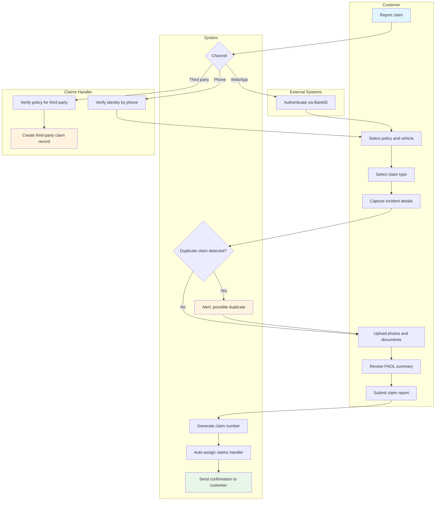
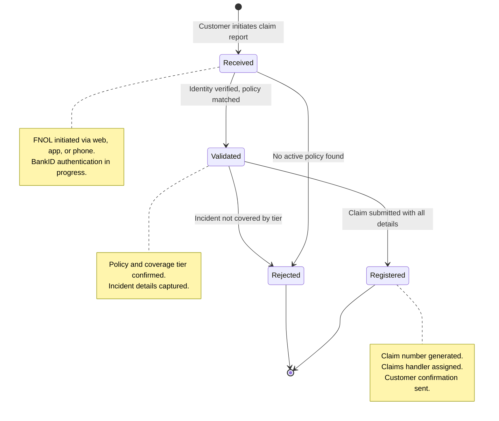

# UC-CLM-002: FNOL Processing

## Overview

This use case details the First Notification of Loss (FNOL) process — from the customer initiating a claim report through to the claim being registered and assigned to a claims handler. FNOL is the entry point for all claims and must be fast, intuitive, and capture sufficient information for the claims team to begin investigation.

## Actors

- **Primary:** [Customer (Privatkund)](../../actors/internal/customer.md)
- **Supporting:** [Claims Handler (Skadereglerare)](../../actors/internal/claims-handler.md), [BankID](../../actors/external/bankid.md)

## Preconditions

1. The customer is registered and has at least one active motor insurance policy
2. An insured event has occurred
3. The customer has access to the web portal or mobile app (or calls the claims phone line)

## Postconditions

**Success:**

- A claim record exists with a unique claim number (skadenummer)
- The claim is linked to the correct policy
- Incident details, photos, and supporting documents are stored
- A claims handler has been assigned
- The customer has received confirmation with the claim number

**Failure:**

- The customer is unable to complete the FNOL (e.g., no active policy found, system error)
- The customer is informed of the issue and directed to contact customer service

## Process Flow

## State Lifecycle

## Main Flow (Online Self-Service)

| Step | Actor    | Action                                                          | System Response                                                                                   |
| ---- | -------- | --------------------------------------------------------------- | ------------------------------------------------------------------------------------------------- |
| 1    | Customer | Opens the claims reporting page and authenticates via BankID    | System verifies identity and retrieves active policies                                            |
| 2    | Customer | Selects the policy and vehicle for the claim                    | System displays policy details and eligible claim types based on coverage tier                    |
| 3    | Customer | Selects the claim type (e.g., collision, theft, glass)          | System adapts the FNOL form to the selected claim type                                            |
| 4    | Customer | Enters incident details: date, time, location, description      | System validates the incident date against the policy's coverage period                           |
| 5    | Customer | Enters information about other parties involved (if applicable) | System records other party details: name, vehicle registration, insurer                           |
| 6    | Customer | Uploads photos of the damage and any supporting documents       | System stores photos linked to the claim record                                                   |
| 7    | Customer | Reviews the complete FNOL summary                               | System displays a summary for the customer to confirm                                             |
| 8    | Customer | Submits the claim report                                        | System creates the claim record, generates a claim number, and sends confirmation to the customer |
| 9    | System   | Assigns the claim to a claims handler based on rules            | Claims handler is notified of the new claim assignment                                            |

## Alternative Flow: Phone-Reported FNOL

| Step | Actor          | Action                                                                 | System Response                                              |
| ---- | -------------- | ---------------------------------------------------------------------- | ------------------------------------------------------------ |
| 1    | Customer       | Calls the claims phone line                                            | Claims handler answers and verifies identity                 |
| 2    | Claims Handler | Searches for the customer's policy using personnummer or policy number | System displays matching policies                            |
| 3    | Claims Handler | Selects the correct policy and creates a new claim                     | System opens the FNOL registration form                      |
| 4    | Claims Handler | Enters incident details as reported by the customer                    | System validates and records the information                 |
| 5    | Claims Handler | Records any additional details (police report number, witnesses)       | System stores all details in the claim record                |
| 6    | Claims Handler | Submits the claim registration                                         | System creates the claim record and generates a claim number |
| 7    | Claims Handler | Provides the claim number to the customer                              | Customer can use the number for online tracking              |

## Alternative Flow: Third-Party FNOL

| Step | Actor          | Action                                                                  | System Response                                                    |
| ---- | -------------- | ----------------------------------------------------------------------- | ------------------------------------------------------------------ |
| 1    | Third Party    | Contacts TryggFörsäkring to report damage caused by an insured vehicle  | Claims handler verifies the policy exists for the reported vehicle |
| 2    | Claims Handler | Creates a third-party claim against the policyholder's trafikförsäkring | System creates a third-party claim record                          |
| 3    | Claims Handler | Records the third party's details and the incident information          | System stores the claim with the third party as claimant           |
| 4    | Claims Handler | Notifies the policyholder of the third-party claim                      | System sends notification to the policyholder                      |

## Validation Rules

| Rule        | Description                                                        |
| ----------- | ------------------------------------------------------------------ |
| VR-FNOL-001 | Incident date must not be in the future                            |
| VR-FNOL-002 | Incident date must fall within the policy's active coverage period |
| VR-FNOL-003 | Claim type must be covered by the policy's coverage tier           |
| VR-FNOL-004 | At least one photo is recommended but not required at FNOL stage   |
| VR-FNOL-005 | Police report number is required for theft and hit-and-run claims  |
| VR-FNOL-006 | Other party information is required for multi-vehicle collisions   |

## Data Model

### Claim Record (Created at FNOL)

| Field                      | Type      | Required       | Description                            |
| -------------------------- | --------- | -------------- | -------------------------------------- |
| Claim number (skadenummer) | String    | Auto-generated | Unique identifier for the claim        |
| Policy number              | String    | Yes            | Link to the insured policy             |
| Claim type                 | Enum      | Yes            | Type of claim (collision, theft, etc.) |
| Status                     | Enum      | Auto-set       | Initial status: "Registered"           |
| Incident date              | Date      | Yes            | When the event occurred                |
| Incident time              | Time      | No             | Time of the event (if known)           |
| Incident location          | String    | Yes            | Where the event occurred               |
| Incident description       | Text      | Yes            | Free-text description                  |
| Police report number       | String    | Conditional    | Required for theft, hit-and-run        |
| Reporter                   | Reference | Yes            | Customer or third party who reported   |
| Photos                     | File[]    | No             | Uploaded damage photos                 |
| Other parties              | Object[]  | Conditional    | Other vehicles/persons involved        |
| Created date               | Timestamp | Auto-set       | When the FNOL was submitted            |
| Assigned handler           | Reference | Auto-set       | Claims handler assigned to the claim   |

## Regulatory

- **FSA-010** — Fair and timely claims settlement: FNOL must be processed promptly; the customer must receive acknowledgement without undue delay
- **FSA-014** — Record keeping: the complete FNOL record must be retained for 10 years
- **GDPR-003** — Claims processing: personal data collected at FNOL must follow data minimization; collect only what is necessary
- **GDPR-001** — Identity verification via BankID for online FNOL
- **IDD-005** — The IPID must have informed the customer about the claims reporting process before policy purchase

## Related User Stories

- [US-CLM-001](../user-stories/claims-fnol.md) — Report a Claim Online (FNOL)
- [US-CLM-002](../user-stories/claims-registration.md) — Register and Manage Claims
- [US-CLM-013](../user-stories/claims-tracking.md) — Track Claim Status
