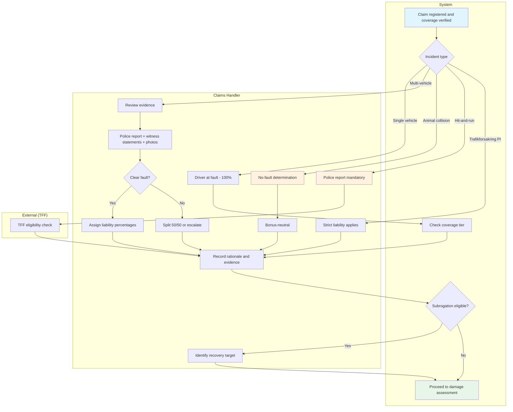
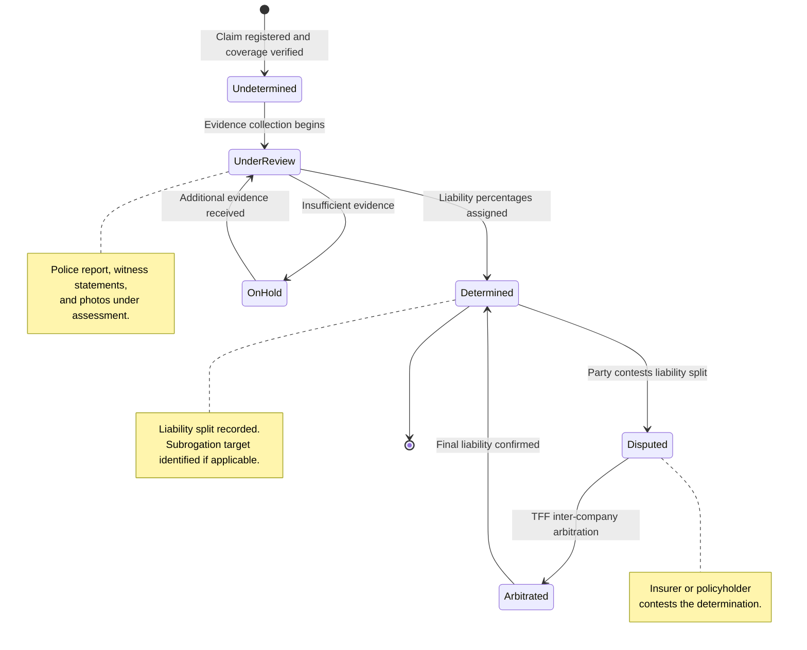
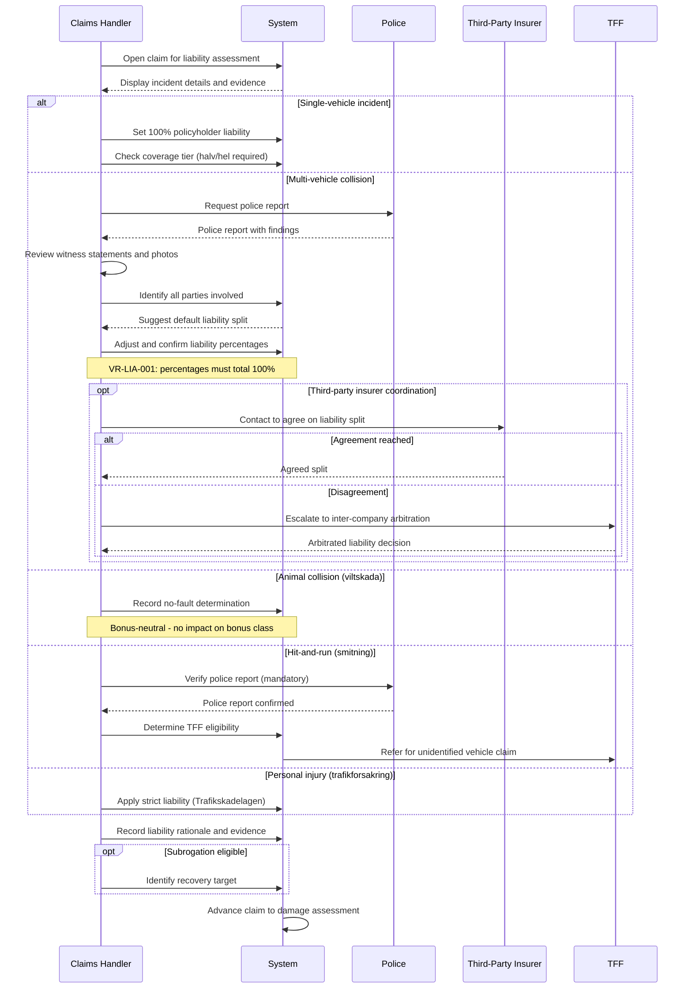

# UC-CLM-005: Liability Determination

## Overview

This use case describes the liability determination process for motor insurance claims. It covers the decision-making flow for single-vehicle, multi-party, and partial liability scenarios, including evidence requirements, police report handling, witness statements, and third-party insurer coordination.

## Use Case Summary

| Field                | Value                                                                   |
| -------------------- | ----------------------------------------------------------------------- |
| **Use Case ID**      | UC-CLM-005                                                              |
| **Name**             | Liability Determination                                                 |
| **Primary Actor**    | Claims Handler (Skadereglerare)                                         |
| **Secondary Actors** | Police, Third-party insurer, TFF                                        |
| **Goal**             | Determine liability split for a motor insurance claim based on evidence |
| **Preconditions**    | Claim is registered and coverage is verified                            |
| **Postconditions**   | Liability decision is recorded with rationale and evidence              |
| **Trigger**          | Coverage verification is complete and claim proceeds to investigation   |

## Actors

- **Primary:** [Claims Handler (Skadereglerare)](../../actors/internal/claims-handler.md)
- **Supporting:** [Police (Polis)](../../actors/external/police.md), [TFF](../../actors/external/tff.md)

## Preconditions

1. The claim has been registered and linked to a valid policy
2. Coverage verification confirms the claim type is covered
3. Fraud screening has been completed (or the claim is low-risk)

## Postconditions

**Success:**

- Liability has been determined and recorded with percentage split
- Supporting evidence is attached to the claim record
- The claim is ready to proceed to damage assessment and settlement
- If subrogation is applicable, the recovery target has been identified

**Failure:**

- Liability cannot be determined due to insufficient evidence
- The claim is placed on hold pending additional evidence (police report, witness statements)

## Process Flow

## State Lifecycle

## Interaction Sequence

## Main Success Scenario: Multi-Party Collision

| Step | Actor          | Action                                          | System Response                                                                 |
| ---- | -------------- | ----------------------------------------------- | ------------------------------------------------------------------------------- |
| 1    | Claims Handler | Opens the claim for liability assessment        | System displays incident details, FNOL data, and available evidence             |
| 2    | Claims Handler | Reviews the police report (if available)        | System displays the police report linked to the claim                           |
| 3    | Claims Handler | Reviews witness statements and photos           | System displays all evidence documents attached to the claim                    |
| 4    | Claims Handler | Identifies all parties involved                 | System records each party: name, vehicle registration, insurer                  |
| 5    | Claims Handler | Applies liability rules based on incident type  | System suggests a default liability split based on the scenario type            |
| 6    | Claims Handler | Adjusts liability percentages based on evidence | System validates that percentages total 100% across all parties                 |
| 7    | Claims Handler | Records the liability rationale                 | System stores the decision with references to supporting evidence               |
| 8    | Claims Handler | Confirms the liability determination            | System advances the claim to damage assessment; flags subrogation if applicable |

## Alternative Flow: Single-Vehicle Incident

| Step | Actor          | Action                                            | System Response                                                                                 |
| ---- | -------------- | ------------------------------------------------- | ----------------------------------------------------------------------------------------------- |
| 1    | Claims Handler | Identifies the claim as a single-vehicle incident | System sets the policyholder as 100% liable by default                                          |
| 2    | Claims Handler | Verifies no other party was involved              | System confirms single-vehicle classification                                                   |
| 3    | Claims Handler | Records the determination                         | System stores 100% policyholder liability and advances the claim                                |
| 4    | Claims Handler | Checks coverage tier                              | System confirms helförsäkring covers own damage; halvförsäkring does not cover collision damage |

## Alternative Flow: Animal Collision (Viltskada)

| Step | Actor          | Action                                                    | System Response                                                |
| ---- | -------------- | --------------------------------------------------------- | -------------------------------------------------------------- |
| 1    | Claims Handler | Identifies the claim as an animal collision               | System classifies as no-fault incident                         |
| 2    | Claims Handler | Verifies the viltolycksrapport (wildlife accident report) | System records the police report reference                     |
| 3    | Claims Handler | Records the no-fault determination                        | System stores no-fault liability; marks claim as bonus-neutral |
| 4    | System         | Advances to damage assessment                             | Coverage under halvförsäkring or helförsäkring applies         |

## Alternative Flow: Hit-and-Run (Smitning)

| Step | Actor          | Action                                                   | System Response                                                                  |
| ---- | -------------- | -------------------------------------------------------- | -------------------------------------------------------------------------------- |
| 1    | Claims Handler | Identifies the at-fault vehicle as unidentified          | System flags the claim for special handling                                      |
| 2    | Claims Handler | Verifies the police report exists (mandatory)            | System validates police report reference                                         |
| 3    | Claims Handler | Determines TFF eligibility                               | System flags for TFF processing (personal injury only for unidentified vehicles) |
| 4    | Claims Handler | Records own-damage liability under policyholder's policy | Vehicle damage covered under helförsäkring if applicable                         |

## Alternative Flow: Third-Party Insurer Coordination

| Step | Actor          | Action                                                       | System Response                                     |
| ---- | -------------- | ------------------------------------------------------------ | --------------------------------------------------- |
| 1    | Claims Handler | Identifies the at-fault party's insurer                      | System records the third-party insurer details      |
| 2    | Claims Handler | Contacts the third-party insurer to agree on liability split | System records communication log                    |
| 3a   | Claims Handler | Both insurers agree on the split                             | System records the agreed liability and proceeds    |
| 3b   | Claims Handler | Insurers disagree on the split                               | System escalates to TFF inter-company arbitration   |
| 4    | Claims Handler | Records the final agreed or arbitrated liability             | System updates the claim and proceeds to settlement |

## Exception Flow: Insufficient Evidence

| Step | Actor          | Action                                                   | System Response                                    |
| ---- | -------------- | -------------------------------------------------------- | -------------------------------------------------- |
| 1    | Claims Handler | Cannot determine liability due to insufficient evidence  | System records the hold reason                     |
| 2    | Claims Handler | Requests additional evidence from the customer or police | System sends a request and tracks response         |
| 3    | Claims Handler | Sets a follow-up date                                    | System schedules a reminder for the claims handler |
| 4    | Claims Handler | Resumes liability determination when evidence arrives    | System updates the claim and continues the flow    |

## Liability Decision Matrix

| Scenario                     | Default Split         | Evidence Required                 | Subrogation          | Bonus Impact           |
| ---------------------------- | --------------------- | --------------------------------- | -------------------- | ---------------------- |
| Rear-end collision           | 100% rear driver      | Police report, photos             | Yes                  | Yes (at-fault party)   |
| Intersection (right-of-way)  | Assessed per evidence | Police report, witness statements | Yes (partial)        | Yes (at-fault party)   |
| Single-vehicle accident      | 100% policyholder     | Photos, police report (optional)  | No                   | Yes                    |
| Parked vehicle hit           | 100% striking vehicle | Police report, photos             | Yes                  | No (not-at-fault)      |
| Animal collision (viltskada) | No fault              | Viltolycksrapport                 | No                   | No                     |
| Hit-and-run (smitning)       | Unknown / TFF         | Police report (mandatory)         | TFF pursues          | No (not-at-fault)      |
| Multi-party (3+ vehicles)    | Assessed per party    | Police report, all statements     | Yes (cross-recovery) | Yes (at-fault parties) |
| Parking lot (no witnesses)   | 50/50 if unclear      | Photos, CCTV (if available)       | Depends              | Yes (if at-fault)      |

## Validation Rules

| Rule       | Description                                                                                                   |
| ---------- | ------------------------------------------------------------------------------------------------------------- |
| VR-LIA-001 | Liability percentages across all parties must total exactly 100%                                              |
| VR-LIA-002 | Liability determination requires at least one piece of evidence (police report, photos, or witness statement) |
| VR-LIA-003 | Hit-and-run claims require a police report before liability can be determined                                 |
| VR-LIA-004 | Animal collision claims require a viltolycksrapport reference                                                 |
| VR-LIA-005 | Third-party insurer details are required when liability is shared with another insured party                  |
| VR-LIA-006 | Liability rationale text is mandatory and must reference the evidence used                                    |

## Data Model

### Liability Determination Record

| Field                    | Type        | Required       | Description                                                                       |
| ------------------------ | ----------- | -------------- | --------------------------------------------------------------------------------- |
| Determination ID         | String      | Auto-generated | Unique identifier                                                                 |
| Claim number             | String      | Yes            | Link to the parent claim                                                          |
| Incident type            | Enum        | Yes            | Rear-end, intersection, single-vehicle, animal, hit-and-run, multi-party, parking |
| Number of parties        | Integer     | Yes            | Total parties involved (including policyholder)                                   |
| Parties                  | Object[]    | Yes            | Each party: name, vehicle reg, insurer, liability %                               |
| Policyholder liability % | Integer     | Yes            | 0--100 in 10% increments                                                          |
| Police report reference  | String      | Conditional    | Police report number (mandatory for some types)                                   |
| Evidence documents       | Reference[] | Yes            | Links to photos, statements, reports                                              |
| Rationale                | Text        | Yes            | Handler's written explanation of the determination                                |
| Subrogation eligible     | Boolean     | Auto-set       | True if policyholder liability < 100%                                             |
| Recovery target          | Object      | Conditional    | At-fault party and insurer details for subrogation                                |
| Determined by            | Reference   | Yes            | Claims handler who made the determination                                         |
| Determination date       | Timestamp   | Auto-set       | When the determination was recorded                                               |
| Status                   | Enum        | Auto-set       | Pending, Determined, Disputed, Arbitrated                                         |

## Business Rules

| Rule       | Description                                                                                       |
| ---------- | ------------------------------------------------------------------------------------------------- |
| BR-LIA-001 | Liability determination must be completed before settlement calculation                           |
| BR-LIA-002 | For single-vehicle incidents, the system defaults to 100% policyholder liability                  |
| BR-LIA-003 | Animal collisions are always classified as no-fault                                               |
| BR-LIA-004 | Disputed liability between insurers is escalated to TFF arbitration                               |
| BR-LIA-005 | Personal injury under trafikförsäkring has strict liability regardless of fault                   |
| BR-LIA-006 | Liability percentage minimum granularity is 10%                                                   |
| BR-LIA-007 | The claims handler must document the rationale for any deviation from the default liability split |

## Non-functional Requirements

| Requirement                 | Target                                                       |
| --------------------------- | ------------------------------------------------------------ |
| Liability determination     | Complete within 5 business days of evidence availability     |
| Third-party insurer contact | Initial contact within 3 business days of claim registration |
| TFF arbitration response    | Within 30 business days of referral                          |

## Regulatory Compliance Summary

| Regulation   | Requirements Addressed                                                                                                      |
| ------------ | --------------------------------------------------------------------------------------------------------------------------- |
| **FSA-010**  | Fair and timely claims settlement: liability decisions must be evidence-based, documented, and communicated to the claimant |
| **FSA-014**  | Record keeping: liability determinations, evidence, and rationale must be retained for 10 years                             |
| **GDPR-003** | Claims processing: third-party personal data (names, registration numbers) must follow data minimization                    |
| **GDPR-001** | Third-party personal data collected during liability assessment must have a lawful basis                                    |

## Related User Stories

- [US-CLM-004](../user-stories/claims-liability.md) -- Determine Liability
- [US-CLM-009](../user-stories/claims-subrogation.md) -- Recover Costs Through Subrogation
- [US-CLM-011](../user-stories/claims-tff.md) -- Process TFF Claims
