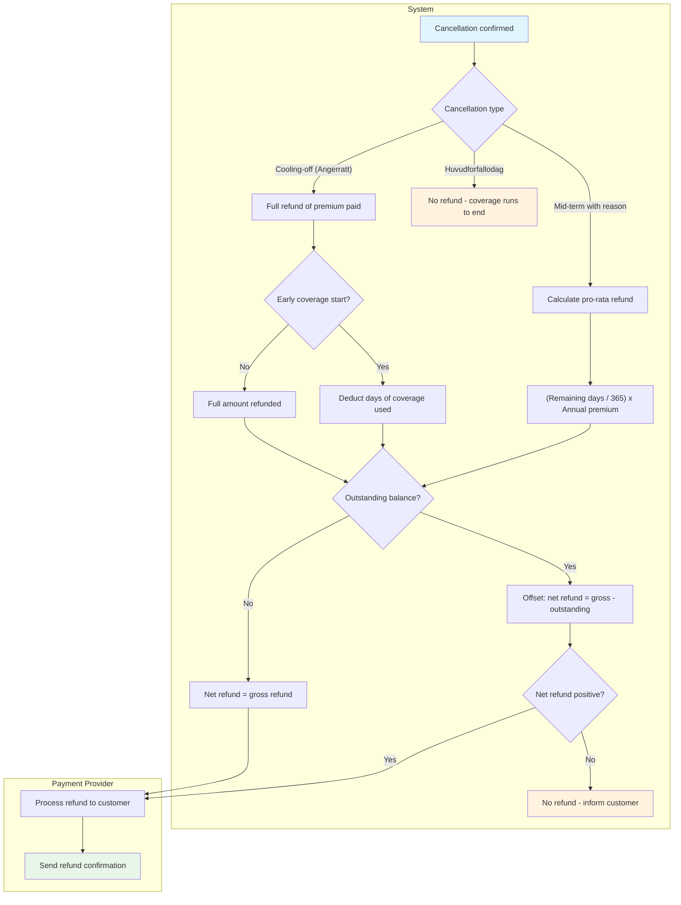
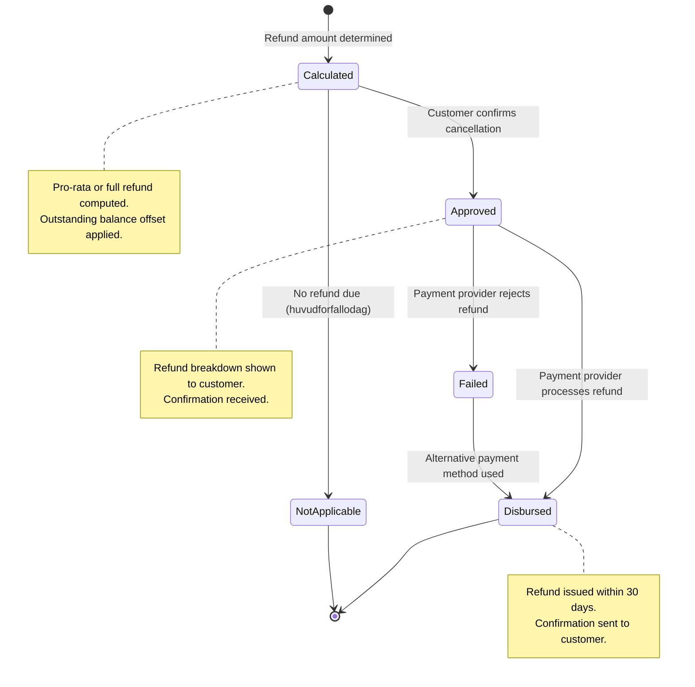

# UC-CAN-002: Premium Refund Calculation

## Overview

This use case details the premium refund calculation and payment process following a policy cancellation. The refund amount varies by cancellation type — from full refund (ångerrätt) to pro-rata refund (vehicle sold/scrapped) to no refund (huvudförfallodag). The customer must see the refund amount before confirming the cancellation.

## Actors

- **Primary:** System
- **Supporting:** [Customer (Privatkund)](../../actors/internal/customer.md), [System Administrator](../../actors/internal/system-administrator.md), [Payment Provider](../../actors/external/payment-provider.md)

## Preconditions

1. A cancellation request has been submitted and the cancellation type has been determined
2. The policy's premium payment history is available
3. The cancellation effective date has been calculated

## Postconditions

**Success:**

- The refund amount has been calculated and displayed to the customer
- Upon cancellation confirmation, the refund has been issued to the original payment method
- A refund record exists with full calculation details and audit trail
- The customer has received a refund confirmation

**Failure:**

- The refund calculation cannot be completed (e.g., missing premium data)
- The Payment Provider rejects the refund (operations staff alerted for manual processing)

## Process Flow

## State Lifecycle

## Main Flow (Pro-Rata Refund Calculation)

| Step | Actor    | Action                                                                                                | System Response                                                   |
| ---- | -------- | ----------------------------------------------------------------------------------------------------- | ----------------------------------------------------------------- |
| 1    | System   | Retrieves the policy's annual premium and payment history                                             | System loads premium amount, payment dates, and amounts paid      |
| 2    | System   | Determines the cancellation effective date and the policy period end date                             | System calculates the number of remaining days in the paid period |
| 3    | System   | Calculates the pro-rata refund: (remaining days / total days in period) × premium paid for the period | System generates the refund amount                                |
| 4    | System   | Checks for any outstanding balance or deductions                                                      | System subtracts unpaid premiums or applicable fees               |
| 5    | System   | Displays the refund breakdown to the customer: premium paid, days used, days remaining, refund amount | Customer reviews the calculation                                  |
| 6    | Customer | Confirms the cancellation and refund                                                                  | System records the refund details                                 |
| 7    | System   | Sends refund instruction to the Payment Provider for the original payment method                      | Payment Provider processes the refund                             |
| 8    | System   | Updates the refund status to "Processed" and sends confirmation to the customer                       | Customer receives refund confirmation with expected payment date  |

## Alternative Flow A: Ångerrätt Full Refund

| Step | Actor  | Action                                                          | System Response                                                   |
| ---- | ------ | --------------------------------------------------------------- | ----------------------------------------------------------------- |
| A1   | System | Detects cancellation type is ångerrätt                          | System applies full refund rules                                  |
| A2   | System | Checks whether the customer requested early coverage start      | If yes, deducts proportional amount for days of coverage provided |
| A3   | System | Calculates refund: full premium minus any early-start deduction | System displays the refund amount                                 |
| A4   | System | Proceeds with refund processing (main flow Steps 6–8)           | Refund issued within 30 days                                      |

## Alternative Flow B: No Refund (Huvudförfallodag)

| Step | Actor  | Action                                                                       | System Response                           |
| ---- | ------ | ---------------------------------------------------------------------------- | ----------------------------------------- |
| B1   | System | Detects cancellation type is huvudförfallodag                                | System identifies no refund is applicable |
| B2   | System | Displays confirmation that no refund is due (coverage runs to end of period) | Customer acknowledges                     |
| B3   | System | Skips refund processing; proceeds to cancellation confirmation               | Cancellation confirmed without refund     |

## Alternative Flow C: Refund With Outstanding Balance Offset

| Step | Actor  | Action                                                                                             | System Response                                          |
| ---- | ------ | -------------------------------------------------------------------------------------------------- | -------------------------------------------------------- |
| C1   | System | Detects outstanding premium balance on the policy                                                  | System calculates net refund                             |
| C2   | System | Offsets the refund against the outstanding amount: net refund = gross refund − outstanding balance | System displays the net amount                           |
| C3a  | System | Net refund is positive                                                                             | Refund issued for the net amount                         |
| C3b  | System | Net refund is zero or negative                                                                     | No refund; customer is informed of the remaining balance |

## Alternative Flow D: Payment Provider Rejection

| Step | Actor            | Action                                                     | System Response                                      |
| ---- | ---------------- | ---------------------------------------------------------- | ---------------------------------------------------- |
| D1   | System           | Sends refund instruction to Payment Provider               | Payment Provider rejects (e.g., closed bank account) |
| D2   | System           | Marks refund as "Failed" and alerts operations staff       | Operations staff investigates                        |
| D3   | Operations Staff | Contacts the customer to arrange alternative refund method | System updates the refund record                     |
| D4   | System           | Reprocesses the refund with the new payment method         | Refund completed                                     |

## Refund Calculation Formula

| Parameter             | Description                             |
| --------------------- | --------------------------------------- |
| Annual premium (P)    | The total annual premium for the policy |
| Period start date (S) | Start of the current policy period      |
| Cancellation date (C) | Effective cancellation date             |
| Period end date (E)   | End of the current policy period        |
| Days used             | C − S                                   |
| Days remaining        | E − C                                   |
| Total days            | E − S                                   |
| Gross refund          | (Days remaining / Total days) × P       |
| Net refund            | Gross refund − outstanding balance      |

## Validation Rules

| Rule       | Description                                                                                           |
| ---------- | ----------------------------------------------------------------------------------------------------- |
| VR-REF-001 | Refund amount must not exceed the total premium paid for the current period                           |
| VR-REF-002 | Refund calculation must use calendar days (not business days)                                         |
| VR-REF-003 | No administrative fees may be deducted from the refund amount                                         |
| VR-REF-004 | Refund must be issued within 30 calendar days of cancellation confirmation                            |
| VR-REF-005 | The refund breakdown must be displayed to the customer before confirmation                            |
| VR-REF-006 | Monthly-payment customers: refund is calculated only for prepaid amounts beyond the cancellation date |

## Regulatory

- **FSA-013** — Cancellation and cooling-off rights: refund calculations must follow statutory rules for each cancellation type
- **FSA-004** — Consumer protection and fair treatment: transparent calculations, no hidden deductions, refund displayed before confirmation
- **GDPR-002** — Policy administration: refund and payment records are retained per data retention policy
- **IDD-003** — Pre-contractual information: refund rules must have been disclosed to the customer before policy purchase

## Related User Stories

- [US-CAN-007](../user-stories/cancellation-refund.md) — Calculate and Process Premium Refund
- [US-CAN-001](../user-stories/cancellation-cooling-off.md) — Cancel Policy Within Cooling-Off Period (Ångerrätt)
- [US-CAN-003](../user-stories/cancellation-vehicle-sold.md) — Cancel Due to Vehicle Sold
- [US-CAN-004](../user-stories/cancellation-vehicle-deregistered.md) — Cancel Due to Vehicle Scrapped or Deregistered
- [US-CAN-012](../user-stories/cancellation-preview-refund.md) — View Refund Amount Before Confirming Cancellation
