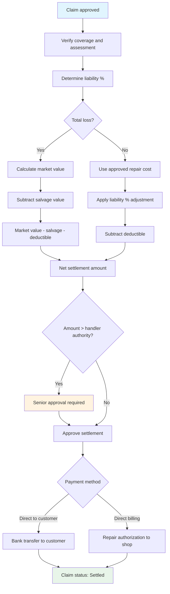

# UC-CLM-003: Settlement Calculation and Payment

## Overview

This use case describes the settlement calculation and payment process for approved motor insurance claims. It covers the rules for calculating settlement amounts across different claim types (repair, total loss, glass, theft, personal injury) and the payment execution flow.

## Actors

- **Primary:** [Claims Handler (Skadereglerare)](../../actors/internal/claims-handler.md)
- **Supporting:** [Claims Adjuster (Värderare)](../../actors/internal/claims-adjuster.md), [Payment Provider (Betalningsleverantör)](../../actors/external/payment-provider.md), [Repair Shop (Verkstad)](../../actors/external/repair-shop.md)

## Preconditions

1. The claim has been approved (status: "Approved" / Godkänd)
2. Damage assessment is complete (for vehicle damage claims)
3. Liability determination is complete (for multi-party claims)

## Postconditions

**Success:**

- Settlement amount has been calculated and documented
- Payment has been issued and confirmed
- Claim status is updated to "Settled" (Reglerad)
- Payment records are stored for audit and regulatory compliance

**Failure:**

- Payment fails (e.g., invalid bank details, payment provider error)
- Claims handler is notified and payment is retried or alternative payment method is used

## Process Flow



## Main Flow: Vehicle Repair Settlement

| Step | Actor          | Action                                              | System Response                                                                      |
| ---- | -------------- | --------------------------------------------------- | ------------------------------------------------------------------------------------ |
| 1    | Claims Handler | Opens the approved claim for settlement             | System displays the damage assessment with approved repair estimate                  |
| 2    | System         | Calculates settlement: repair cost minus deductible | System displays the calculated settlement amount with breakdown                      |
| 3    | Claims Handler | Verifies the calculation and selects payment method | System presents options: direct payment to customer or direct billing to repair shop |
| 4a   | Claims Handler | Selects direct billing to repair shop               | System sends repair authorization to the shop; customer pays deductible to shop      |
| 4b   | Claims Handler | Selects payment to customer                         | System initiates bank transfer to customer's registered account                      |
| 5    | System         | Processes the payment via payment provider          | System records payment status and updates claim status                               |
| 6    | System         | Confirms payment completion                         | Claim status changes to "Settled" (Reglerad)                                         |

## Alternative Flow: Total Loss Settlement

| Step | Actor           | Action                                                                        | System Response                                                       |
| ---- | --------------- | ----------------------------------------------------------------------------- | --------------------------------------------------------------------- |
| 1    | Claims Adjuster | Declares the vehicle a total loss (repair cost > threshold % of market value) | System flags the claim for total loss processing                      |
| 2    | System          | Calculates vehicle market value using industry valuation data                 | System displays the market value with valuation methodology           |
| 3    | Claims Handler  | Reviews the total loss valuation                                              | Handler may adjust within guidelines or request independent valuation |
| 4    | System          | Calculates settlement: market value − deductible − salvage value              | System displays the total loss settlement breakdown                   |
| 5    | Claims Handler  | Confirms the settlement and initiates payment                                 | System processes payment to the customer                              |
| 6    | System          | Records the settlement and updates claim status                               | Claim status changes to "Settled"                                     |

## Alternative Flow: Liability-Split Settlement

| Step | Actor          | Action                                                  | System Response                                                                               |
| ---- | -------------- | ------------------------------------------------------- | --------------------------------------------------------------------------------------------- |
| 1    | Claims Handler | Opens a claim with shared liability (e.g., 70/30 split) | System displays the liability determination and damage assessment                             |
| 2    | System         | Calculates the policyholder's share of the damage       | Settlement = (total damage × policyholder's non-fault percentage) − deductible                |
| 3    | Claims Handler | Reviews and confirms the adjusted settlement            | System processes payment for the adjusted amount                                              |
| 4    | Claims Handler | Initiates subrogation for the at-fault party's share    | System creates a subrogation record (see [US-CLM-009](../user-stories/claims-subrogation.md)) |

## Alternative Flow: Trafikförsäkring Personal Injury Settlement

| Step | Actor          | Action                                                   | System Response                                                                        |
| ---- | -------------- | -------------------------------------------------------- | -------------------------------------------------------------------------------------- |
| 1    | Claims Handler | Opens a personal injury claim with medical documentation | System displays injury details and compensation components                             |
| 2    | Claims Handler | Enters compensation amounts per component                | System calculates total: medical costs + income loss + pain and suffering + disability |
| 3    | Claims Handler | Reviews the total compensation                           | No deductible applies to trafikförsäkring personal injury claims                       |
| 4    | System         | Processes interim or final payment to the injured party  | System records the payment and tracks remaining compensation if applicable             |

## Settlement Calculation Rules

### Repair Settlement

```text
Settlement = Approved Repair Cost − Applicable Deductible (självrisk)
```

- Repair cost is based on the approved damage assessment estimate
- Deductible is determined by the policy terms and claim type
- If the policyholder is partially at fault in a multi-party incident, the settlement is adjusted by the non-fault percentage

### Total Loss Settlement

```text
Settlement = Vehicle Market Value − Deductible − Salvage Value
```

- Market value is the vehicle's fair market value at the time of loss
- Salvage value is deducted if the customer retains the damaged vehicle
- Total loss threshold: repair cost exceeds a configurable percentage (typically 75%) of market value

### Glass Settlement

```text
Settlement = Glass Repair/Replacement Cost − Glass Deductible
```

- Glass claims typically have a lower deductible than other claim types
- Repair (if possible) is preferred over full replacement

### Theft Settlement

```text
If vehicle not recovered:
  Settlement = Vehicle Market Value at Time of Theft − Deductible

If vehicle recovered with damage:
  Settlement = Repair Cost − Deductible
```

- A waiting period may apply before settling a theft claim (to allow for recovery)

## Payment Methods

| Method                        | Use Case                               | Details                                       |
| ----------------------------- | -------------------------------------- | --------------------------------------------- |
| Bank transfer to customer     | Standard settlement payment            | Uses customer's registered bank account       |
| Direct billing to repair shop | Network shop repair                    | Shop invoices TryggFörsäkring directly        |
| Bank transfer to third party  | Third-party liability settlement       | Payment to the injured party or their insurer |
| Interim payment               | Personal injury with ongoing treatment | Partial payments while claim remains open     |

## Validation Rules

| Rule       | Description                                                                       |
| ---------- | --------------------------------------------------------------------------------- |
| VR-SET-001 | Claim must have status "Approved" before settlement calculation begins            |
| VR-SET-002 | Damage assessment must be complete and accepted for vehicle damage claims         |
| VR-SET-003 | Liability determination must be recorded for multi-party claims                   |
| VR-SET-004 | Deductible amount must match the policy terms for the claim type                  |
| VR-SET-005 | Settlement amount cannot be negative                                              |
| VR-SET-006 | Total loss settlement requires both market value and salvage value to be recorded |
| VR-SET-007 | Payment recipient bank account must be verified before initiating transfer        |
| VR-SET-008 | Repair authorization amount must match the approved repair estimate               |
| VR-SET-009 | Personal injury compensation components must each have supporting documentation   |
| VR-SET-010 | Settlement amounts above the handler's authority limit require senior approval    |

## Data Model

### Settlement Record

| Field                 | Type      | Required       | Description                                                    |
| --------------------- | --------- | -------------- | -------------------------------------------------------------- |
| Settlement ID         | String    | Auto-generated | Unique identifier for the settlement                           |
| Claim number          | String    | Yes            | Link to the parent claim                                       |
| Settlement type       | Enum      | Yes            | Repair, Total loss, Glass, Theft, Personal injury, Third-party |
| Gross damage amount   | Decimal   | Yes            | Total damage or compensation before adjustments                |
| Liability adjustment  | Decimal   | Conditional    | Reduction based on policyholder's fault percentage             |
| Deductible amount     | Decimal   | Yes            | Deductible subtracted (SEK 0 for personal injury)              |
| Salvage value         | Decimal   | Conditional    | Deducted if customer retains total-loss vehicle                |
| Net settlement amount | Decimal   | Calculated     | Final amount payable                                           |
| Payment method        | Enum      | Yes            | Bank transfer, Direct billing, Interim payment                 |
| Payee                 | Reference | Yes            | Customer, Repair shop, or Third party                          |
| Payee bank account    | String    | Conditional    | Required for bank transfers                                    |
| Payment status        | Enum      | Auto-set       | Pending, Initiated, Confirmed, Failed                          |
| Payment reference     | String    | Conditional    | Transaction reference from payment provider                    |
| Payment date          | Timestamp | Conditional    | When payment was confirmed                                     |
| Approved by           | Reference | Yes            | Claims handler who approved the settlement                     |
| Created date          | Timestamp | Auto-set       | When the settlement was calculated                             |

## Business Rules

| Rule       | Description                                                                                                        |
| ---------- | ------------------------------------------------------------------------------------------------------------------ |
| BR-SET-001 | Payment must be initiated within 5 business days of settlement approval                                            |
| BR-SET-002 | If payment fails, the claims handler must arrange alternative payment within 2 business days                       |
| BR-SET-003 | Settlement amounts above SEK 100,000 require senior claims handler approval                                        |
| BR-SET-004 | VAT on repair costs must be handled according to applicable Swedish tax rules                                      |
| BR-SET-005 | Theft claims may have a waiting period (configurable, default 30 days) before settlement to allow vehicle recovery |
| BR-SET-006 | All payment amounts are rounded to the nearest whole SEK                                                           |
| BR-SET-007 | The customer must receive a written settlement breakdown before payment is initiated                               |

## Regulatory

- **FSA-010** — Fair and timely claims settlement: settlement must be calculated fairly and paid promptly; the customer must receive a clear explanation of the calculation
- **FSA-004** — Consumer protection: settlement breakdowns must be transparent and in plain language
- **FSA-014** — Record keeping: all settlement calculations, payment records, and supporting documentation must be retained for 10 years
- **GDPR-003** — Claims processing: payment data (bank accounts) must be handled securely with purpose limitation
- **GDPR-001** — Customer bank details must be collected and stored securely; used only for claim payments

## Related User Stories

- [US-CLM-005](../user-stories/claims-damage-assessment.md) — Assess Vehicle Damage
- [US-CLM-007](../user-stories/claims-decision.md) — Approve or Deny a Claim
- [US-CLM-008](../user-stories/claims-settlement.md) — Calculate and Process Settlement
- [US-CLM-014](../user-stories/claims-repair-authorization.md) — Authorize Repairs at Network Shops
