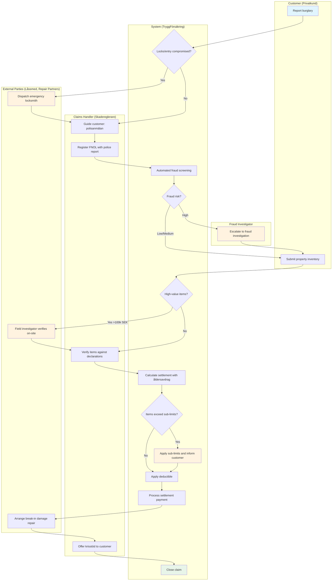
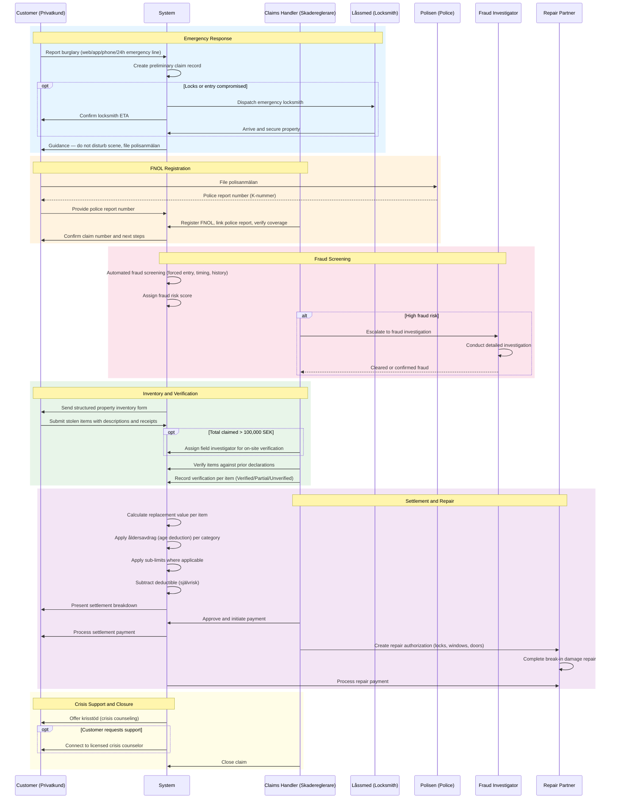
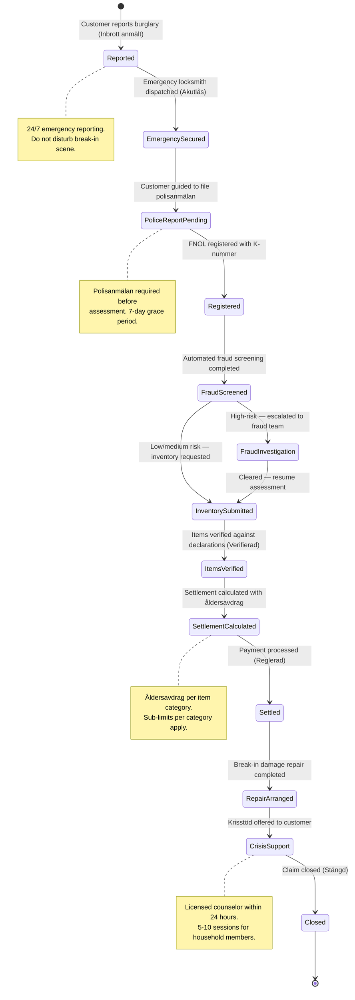

# Use Case: Burglary Claim Processing

End-to-end use case for processing burglary and theft (inbrott/stöld) claims
under home insurance at TryggFörsäkring. Covers emergency response, FNOL
registration, stolen property assessment, fraud screening, settlement
calculation with åldersavdrag and sub-limits, break-in damage repair, and
post-burglary crisis support. Includes the allrisk/drulle claims process for
accidental damage and loss outside the home.

## Use Case Summary

| Field                | Value                                                                |
| -------------------- | -------------------------------------------------------------------- |
| **Use Case ID**      | UC-HCB-001                                                           |
| **Name**             | Burglary Claim Processing                                            |
| **Primary Actor**    | Customer (Privatkund)                                                |
| **Secondary Actors** | Claims Handler (Skadereglerare), Fraud Investigator, Repair Partners |
| **Goal**             | Process a burglary claim from emergency response through settlement  |
| **Preconditions**    | Customer has an active home insurance policy covering inbrott/stöld  |
| **Postconditions**   | Claim settled, repairs completed, crisis support offered             |
| **Trigger**          | Customer reports a burglary or theft                                 |

## Stakeholders and Interests

| Stakeholder         | Interest                                                       |
| ------------------- | -------------------------------------------------------------- |
| Customer            | Immediate security, fair compensation, emotional support       |
| Claims Handler      | Complete documentation, accurate settlement, fraud prevention  |
| Fraud Investigator  | Suspicious claims identified early and investigated thoroughly |
| Repair Partners     | Clear repair scope, timely payment                             |
| Crisis Support Team | Timely access to counseling for affected customers             |
| TryggFörsäkring     | Fair claims handling, fraud prevention, customer satisfaction  |
| Polisen             | Police report filed for all burglary claims                    |

## Process Flow

## Interaction Sequence

## State Lifecycle

## Main Success Scenario

### 1. Burglary Report and Emergency Response

1. Customer reports a burglary via web, mobile app, phone, or 24/7 emergency
   line
2. System creates a preliminary claim record with claim type "Inbrott/stöld"
3. If locks or entry points are compromised, system dispatches an emergency
   locksmith (låssmed) from the partner network
4. Customer receives confirmation with the locksmith's estimated arrival time
5. System provides immediate guidance: do not disturb the break-in scene,
   file a polisanmälan, document damage with photos

### 2. Police Report and FNOL Registration

1. Customer files a polisanmälan with Polisen (online or at station)
2. Customer provides the police report number (K-nummer) to TryggFörsäkring
3. Claims handler registers the FNOL:
   - Links the police report to the claim
   - Verifies policy is active and covers inbrott/stöld
   - Records incident details (date, time, location, break-in method)
   - Transitions claim to "Under Assessment" status
4. System sends confirmation to the customer with the claim number and next
   steps

### 3. Fraud Screening

1. System runs automated fraud screening on the claim
2. Screening evaluates burglary-specific indicators:
   - Signs of forced entry (or absence thereof)
   - Timing relative to policy inception or coverage upgrade
   - Prior claims history
   - Consistency of break-in method and reported damage
   - Claimed value relative to property type
3. System assigns a fraud risk score (low / medium / high)
4. If medium or high risk: claims handler reviews indicators and decides
   whether to escalate to the fraud investigation team

### 4. Property Inventory Submission

1. System sends the customer a structured inventory form
2. Customer lists each stolen item with:
   - Description and category (electronics, jewelry, clothing, etc.)
   - Purchase date and original price (if available)
   - Estimated replacement value
   - Supporting documentation (receipts, photos, warranty cards)
3. System calculates total claimed value
4. System flags items exceeding category sub-limits
5. If total exceeds 100,000 SEK, system recommends field investigator

### 5. Item Verification

1. Claims handler reviews the property inventory
2. For high-value items (>10,000 SEK per item):
   - System displays any prior declarations or valuations on file
   - Claims handler cross-references claimed items against declarations
   - Claims handler may request additional proof (receipts, independent
     valuation, sworn statement)
3. For claims exceeding 100,000 SEK:
   - Field investigator conducts on-site verification
4. Claims handler records verification outcome per item: Verified, Partially
   Verified, or Unverified

### 6. Settlement Calculation

1. System calculates replacement value for each verified item using current
   market prices
2. System applies åldersavdrag (age deduction) based on item category and age:
   - Electronics: 0% year 1, 20% year 2, 30% year 3, 40% year 4, 50% year 5+
   - Clothing: 0% year 1, 25% year 2, 40% year 3, 50% year 4, 60% year 5+
   - Furniture: 0% year 1, 10% year 2, 15% year 3, 20% year 4, 25% year 5+
   - Jewelry: 0% (no åldersavdrag)
   - Sports/Hobby: 0% year 1, 15% year 2, 25% year 3, 35% year 4, 50% year 5+
3. System applies category sub-limits where applicable
4. System subtracts the deductible (självrisk)
5. System presents the settlement summary to the claims handler:
   - Per-item breakdown with åldersavdrag applied
   - Category totals with sub-limit caps
   - Total settlement after deductible
6. Claims handler approves and initiates payment

### 7. Break-in Damage Repair

1. Claims handler reviews break-in damage (locks, windows, doors)
2. System presents approved repair partners in the customer's area
3. Claims handler selects a partner and creates a repair authorization
4. Repair partner completes the work
5. System processes payment directly to the partner
6. Emergency locksmith costs (from step 1) are deducted to avoid double
   payment
7. If customer requests security upgrades beyond like-for-like replacement,
   partner discounts are offered for the upgrade portion

### 8. Crisis Support and Claim Closure

1. System informs the customer that krisstöd (crisis support) is available
2. If requested, system connects the customer to a licensed crisis counselor
   (within 24 hours by phone, within 3 business days for appointment)
3. Policy covers the defined number of counseling sessions (typically 5–10)
   for the customer and household members
4. After all payments, repairs, and support services are complete, claims
   handler closes the claim

## Extensions (Alternative Flows)

### 1a. After-Hours Burglary Report

1. Customer contacts the 24/7 emergency service
2. Emergency service dispatches a locksmith from the emergency partner roster
3. A preliminary claim record is created
4. Full FNOL registration follows during the next business day

### 2a. Police Report Delayed

1. Customer has not yet filed a polisanmälan
2. System allows a configurable grace period (default: 7 days)
3. Claims handler notes the pending police report
4. If the grace period expires without a police report, the claim is paused
   and the customer is notified

### 3a. Fraud Escalation

1. Fraud screening identifies high-risk indicators
2. Claims handler escalates to the fraud investigation team
3. Settlement processing is paused
4. Fraud investigator conducts a detailed investigation
5. Outcome recorded: confirmed fraud (referred to Polisen) or cleared
6. If cleared, flow resumes from step 4 (Property Inventory Submission)

### 4a. High-Value Claim (>100,000 SEK)

1. System detects total claimed value exceeds 100,000 SEK
2. System recommends assigning a field investigator
3. Field investigator conducts on-site verification of the break-in scene
   and claimed items
4. Flow continues from step 5 (Item Verification)

### 5a. Coverage Verification Fails

1. Claims handler discovers the policy does not cover the reported peril
   (e.g., hemförsäkring without inbrott/stöld coverage)
2. Claims handler notifies the customer with a clear explanation
3. Claim is closed as "Not Covered"

### 6a. Items Exceed Sub-Limits

1. System detects items in a category exceed the sub-limit
2. Settlement for that category is capped at the sub-limit
3. Customer is informed of the cap and options to increase coverage for
   future policies

### 6b. Customer Has Åldersavdrag Waiver

1. System detects the customer has a nollavdrag (åldersavdrag waiver) add-on
2. Åldersavdrag is not applied
3. Customer receives full replacement value (subject to sub-limits and
   deductible)

## Allrisk/Drulle Claims Process

The allrisk/drulle claims process is a simplified variant for accidental
damage or loss of personal property outside the home.

### Simplified Flow

1. Customer reports an accidental damage or loss via a simplified FNOL form
2. System verifies allrisk/drulle coverage is active
3. System verifies the incident is a covered peril (sudden and unforeseen,
   not wear and tear)
4. For items below the simplified threshold (under 5,000 SEK):
   - Streamlined assessment: verify coverage, confirm incident type,
     calculate settlement
   - No police report required
   - Settlement calculated: replacement value minus åldersavdrag minus
     allrisk deductible (självrisk)
5. For items above the simplified threshold (5,000+ SEK):
   - Standard assessment process applies (inventory, verification)
   - Police report may be required for theft or loss
6. Payment processed to the customer

### Fraud Prevention for Drulle Claims

- If more than 2 drulle claims are filed within 12 months, fraud screening
  is triggered
- Claims handler reviews the pattern before processing further claims

## Business Rules

| Rule ID   | Rule                                                                                                 |
| --------- | ---------------------------------------------------------------------------------------------------- |
| BR-HCB-01 | A polisanmälan is required for all burglary claims before assessment can proceed                     |
| BR-HCB-02 | Emergency locksmith dispatch must be available 24/7                                                  |
| BR-HCB-03 | High-value claims (>100,000 SEK) must be assigned to a field investigator                            |
| BR-HCB-04 | Åldersavdrag is applied per item category and age according to the published schedule                |
| BR-HCB-05 | Sub-limits apply per claim per category (e.g., jewelry max 50,000 SEK)                               |
| BR-HCB-06 | Fraud screening is mandatory for all burglary claims at FNOL registration                            |
| BR-HCB-07 | Drulle claims below 5,000 SEK follow simplified assessment (no police report required)               |
| BR-HCB-08 | More than 2 drulle claims in 12 months triggers fraud screening                                      |
| BR-HCB-09 | Crisis support (krisstöd) must be offered to all burglary victims and their household members        |
| BR-HCB-10 | Break-in damage repair costs are covered fully (subject to deductible) and paid directly to partners |
| BR-HCB-11 | Emergency locksmith costs are deducted from total repair settlement to prevent double payment        |
| BR-HCB-12 | Police report grace period is configurable (default: 7 days)                                         |

## Non-functional Requirements

| Requirement               | Target                                                       |
| ------------------------- | ------------------------------------------------------------ |
| Emergency locksmith ETA   | Dispatch initiated within 15 minutes of report               |
| FNOL registration         | Complete within 1 business day of police report receipt      |
| Fraud screening           | Automated screening within 30 seconds of FNOL registration   |
| Property inventory form   | Sent to customer within 2 hours of FNOL registration         |
| Settlement calculation    | Complete within 5 seconds after handler approval             |
| Repair partner assignment | Partner contacted within 1 business day of damage assessment |
| Crisis support response   | Phone counselor within 24 hours; appointment within 3 days   |
| Audit trail               | All steps logged with timestamps and actor identity          |
| Availability              | Emergency reporting and locksmith dispatch available 24/7    |

## Regulatory Compliance Summary

| Regulation   | Requirements Addressed                                                          |
| ------------ | ------------------------------------------------------------------------------- |
| **FSA-003**  | Timely claims handling; emergency response, FNOL, and settlement deadlines      |
| **FSA-004**  | Fair treatment; transparent sub-limits, crisis support availability             |
| **FSA-005**  | Fair settlement; åldersavdrag per schedule, sub-limits per policy terms         |
| **FSA-007**  | Fraud screening obligation; automated screening at FNOL, pattern monitoring     |
| **FSA-012**  | Coverage terms disclosed; sub-limits, åldersavdrag, and exclusions communicated |
| **FSA-014**  | Record keeping; FNOL, police reports, and claim data retained for 10 years      |
| **GDPR-007** | Personal data in claims processed under Article 6(1)(b); fraud screening under  |
|              | Article 6(1)(f); crisis support data under Article 9(2)(f)                      |
| **IDD-002**  | Settlement terms including åldersavdrag disclosed in IPID                       |

## Related User Stories

- [HCB-01: Report Burglary and Emergency Locksmith Dispatch](../user-stories/burglary-and-theft.md#hcb-01-report-burglary-and-emergency-locksmith-dispatch)
- [HCB-02: Guidance on Filing a Polisanmälan](../user-stories/burglary-and-theft.md#hcb-02-guidance-on-filing-a-polisanmälan)
- [HCB-03: Register Burglary FNOL with Police Report](../user-stories/burglary-and-theft.md#hcb-03-register-burglary-fnol-with-police-report)
- [HCB-04: Submit Stolen Property Inventory](../user-stories/burglary-and-theft.md#hcb-04-submit-stolen-property-inventory)
- [HCB-05: Verify High-Value Items](../user-stories/burglary-and-theft.md#hcb-05-verify-high-value-items)
- [HCB-06: Screen Burglary Claim for Fraud](../user-stories/burglary-and-theft.md#hcb-06-screen-burglary-claim-for-fraud)
- [HCB-07: Calculate Replacement Cost with Åldersavdrag](../user-stories/burglary-and-theft.md#hcb-07-calculate-replacement-cost-with-åldersavdrag)
- [HCB-08: Understand Sub-Limits for Property Categories](../user-stories/burglary-and-theft.md#hcb-08-understand-sub-limits-for-property-categories)
- [HCB-09: Arrange Lock Replacement and Window Repair](../user-stories/burglary-and-theft.md#hcb-09-arrange-lock-replacement-and-window-repair)
- [HCB-10: Claim for Accidentally Damaged or Lost Property](../user-stories/burglary-and-theft.md#hcb-10-claim-for-accidentally-damaged-or-lost-property-allriskdrulle)
- [HCB-11: Process Drulle Claims with Simplified Assessment](../user-stories/burglary-and-theft.md#hcb-11-process-drulle-claims-with-simplified-assessment)
- [HCB-12: Access Krisstöd After Burglary](../user-stories/burglary-and-theft.md#hcb-12-access-krisstöd-crisis-support-after-burglary)
