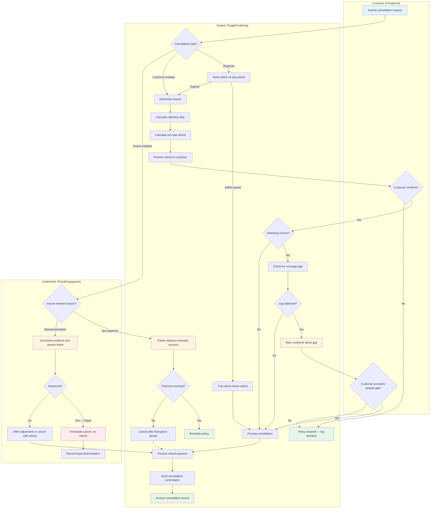
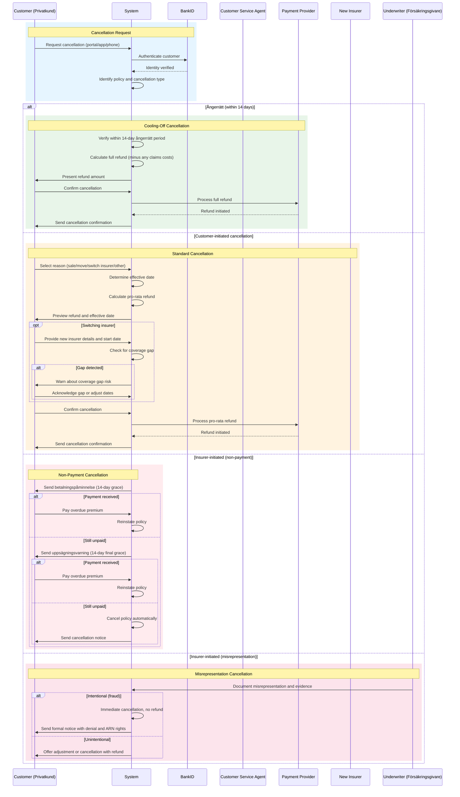

# Use Case: Home Insurance Cancellation Processing

End-to-end use case for processing cancellations (uppsägning) of home insurance
policies at TryggFörsäkring. Covers customer-initiated cancellations (ångerrätt,
property sale, moving, insurer switch, EU online cancellation button),
insurer-initiated cancellations (non-payment, material misrepresentation),
pro-rata refund calculation, and coverage gap prevention when switching insurers.

## Use Case Summary

| Field                | Value                                                                                    |
| -------------------- | ---------------------------------------------------------------------------------------- |
| **Use Case ID**      | UC-HCA-001                                                                               |
| **Name**             | Home Insurance Cancellation Processing                                                   |
| **Primary Actor**    | Customer (Privatkund)                                                                    |
| **Secondary Actors** | Customer Service Agent, Underwriter, System                                              |
| **Goal**             | Process a home insurance cancellation with correct refund and no unintended coverage gap |
| **Preconditions**    | Customer has an active home insurance policy with TryggFörsäkring                        |
| **Postconditions**   | Policy cancelled, refund processed (if applicable), confirmation sent                    |
| **Trigger**          | Customer requests cancellation, or insurer initiates cancellation                        |

## Stakeholders and Interests

| Stakeholder            | Interest                                                            |
| ---------------------- | ------------------------------------------------------------------- |
| Customer               | Fair refund, seamless process, no unintended coverage gap           |
| Customer Service Agent | Clear process, accurate refund preview, customer retention          |
| Underwriter            | Proper handling of non-payment and misrepresentation cancellations  |
| Finance Team           | Accurate refund calculations, timely payment processing             |
| TryggFörsäkring        | Customer satisfaction, regulatory compliance, retention opportunity |
| New Insurer            | Coordinated start date to avoid coverage gap                        |

## Process Flow

## Interaction Sequence

## Main Success Scenario

### 1. Cancellation Request

1. Customer requests cancellation via self-service portal (EU cancellation
   button), mobile app, phone, or written communication
2. System identifies the policy and the customer (BankID for digital channels)
3. System determines the cancellation type based on timing and reason

### 2. Ångerrätt Check

1. System checks if the policy was purchased via a distance channel (web,
   phone, app)
2. System calculates whether the request is within 14 calendar days of the
   contract conclusion date
3. If within ångerrätt: process as cooling-off cancellation with full refund
   (minus any claims costs)
4. If expired: continue to ordinary cancellation flow

### 3. Cancellation Reason and Effective Date

1. Customer or agent selects the cancellation reason:
   - Property sold (försäljning)
   - Moving to new address (flytt)
   - Switching insurer (byte av bolag)
   - Other personal reasons
2. System determines the cancellation effective date:
   - Property sold: property transfer date (tillträdesdag)
   - Moving: move date
   - Switching insurer: requested date or renewal date
   - Other: next possible date per policy terms
3. If property sold: customer provides proof of sale (överlåtelsehandling)

### 4. Refund Calculation and Preview

1. System calculates the pro-rata refund:
   - Remaining days / total policy days x annual premium
   - Adjusted for payment method (annual vs monthly instalments)
   - Deductions for outstanding payments or claims costs
2. Customer service agent presents the cancellation preview to the customer:
   - Cancellation effective date
   - Remaining coverage period
   - Refund amount with breakdown
   - Impact on active claims (if any)
3. Customer reviews the preview and may adjust the effective date

### 5. Coverage Gap Check (Switching Insurer)

1. If the customer is switching insurer, system prompts for the new insurer
   name and new policy start date
2. System compares the new policy start date with the cancellation effective
   date
3. If a gap is detected: system displays a prominent warning about the risk of
   being uninsured
4. Customer acknowledges the gap warning or adjusts dates to eliminate the gap

### 6. Cancellation Confirmation

1. Customer confirms the cancellation
2. For digital channels: BankID authentication verifies the customer's identity
3. System processes the cancellation effective on the agreed date
4. System initiates the refund payment to the customer's original payment
   method

### 7. Post-Cancellation Communication

1. System sends a cancellation confirmation to the customer including:
   - Cancellation effective date
   - Refund amount and expected payment date (within 14 business days)
   - Information about active claims (will continue processing)
   - Reminder to arrange replacement coverage if not already done
2. System archives the cancellation record for regulatory retention

## Extensions (Alternative Flows)

### 1a. EU Online Cancellation Button

1. Customer clicks the cancellation button in the self-service portal
2. System presents the cancellation flow inline with terms and refund preview
3. Customer completes the flow with BankID authentication
4. System sends immediate email confirmation
5. Flow continues from step 6 (Cancellation Confirmation)

### 2a. Ångerrätt with Claims

1. Customer has filed a claim during the ångerrätt period
2. System calculates the full premium refund minus the cost of claims paid
3. System presents the adjusted refund amount to the customer
4. Flow continues from step 6 (Cancellation Confirmation)

### 3a. Property Sold — Active Claim

1. Customer has an active claim on the policy being cancelled
2. System warns that the active claim will continue processing but no new
   claims can be filed after the cancellation effective date
3. Customer acknowledges and proceeds
4. Flow continues from step 4 (Refund Calculation)

### 3b. Moving — Policy Transfer Offered

1. Customer is moving within TryggFörsäkring's coverage area
2. System offers to transfer the policy to the new address with premium
   recalculation
3. If customer accepts: system recalculates premium for the new address and
   presents updated terms
4. If the housing type changes (villa to BRF or vice versa): system initiates
   a new quote for the appropriate product type
5. If customer declines transfer: flow continues as ordinary cancellation

### 4a. Insurer-Initiated — Non-Payment

1. System detects overdue premium payment
2. System sends first payment reminder (betalningspåminnelse) with 14-day
   grace period
3. If unpaid: system sends formal cancellation warning (uppsägningsvarning)
   with 14-day final grace period
4. If unpaid after final grace: system cancels the policy automatically
5. If customer pays at any point before cancellation: system reinstates the
   policy with no gap
6. System calculates any refund (if pre-paid) or outstanding balance (sent to
   collections)

### 4b. Insurer-Initiated — Material Misrepresentation

1. Underwriter discovers materially incorrect information provided at policy
   inception
2. Underwriter documents: the specific misrepresentation, evidence, risk
   impact, and intent assessment
3. If intentional (fraud): policy cancelled immediately with no refund;
   customer flagged for future underwriting review
4. If unintentional: customer offered adjustment (new terms/premium) or
   cancellation with pro-rata refund
5. System sends formal notice with reason, effective date, refund details,
   and right to dispute via Allmänna reklamationsnämnden (ARN)

### 5a. Customer Changes Mind

1. Customer reviews the cancellation preview
2. Customer decides not to cancel
3. Agent or system cancels the cancellation request
4. Policy remains active with no changes
5. System logs the retention event for analytics

## Business Rules

| Rule ID   | Rule                                                                                                    |
| --------- | ------------------------------------------------------------------------------------------------------- |
| BR-HCA-01 | Ångerrätt applies only to policies sold via distance or off-premises channels (web, phone, app)         |
| BR-HCA-02 | Ångerrätt period is 14 calendar days from the contract conclusion date                                  |
| BR-HCA-03 | Pro-rata refund is calculated as remaining days / total policy days x annual premium                    |
| BR-HCA-04 | Ångerrätt refund is full premium minus claims costs incurred during the coverage period                 |
| BR-HCA-05 | Insurer-initiated cancellation for non-payment requires two written notices with 14-day grace periods   |
| BR-HCA-06 | Fraud-based cancellation results in immediate termination with no refund                                |
| BR-HCA-07 | Unintentional misrepresentation must offer the customer the choice of policy adjustment or cancellation |
| BR-HCA-08 | Coverage gap warnings are mandatory when the customer is switching insurer                              |
| BR-HCA-09 | Refunds are paid within 14 business days to the customer's original payment method                      |
| BR-HCA-10 | Cancellation via the EU online button must be available 24/7 in the self-service portal                 |
| BR-HCA-11 | BankID authentication is required for all digital cancellations                                         |
| BR-HCA-12 | Home insurance policies are not automatically transferable to a new property owner upon sale            |

## Non-functional Requirements

| Requirement                   | Target                                                |
| ----------------------------- | ----------------------------------------------------- |
| Refund calculation            | Complete within 2 seconds of effective date selection |
| Cancellation confirmation     | Sent within 5 minutes of confirmation                 |
| Refund payment processing     | Initiated within 14 business days of cancellation     |
| EU cancellation button        | Available 24/7 with 99.9% uptime                      |
| BankID authentication         | Response within 10 seconds                            |
| Non-payment reminder delivery | Sent within 24 hours of trigger                       |
| Cancellation record archival  | Retained for policy duration + 10 years               |
| Audit trail                   | All steps logged with timestamps and actor identity   |

## Regulatory Compliance Summary

| Regulation                       | Requirements Addressed                                                         |
| -------------------------------- | ------------------------------------------------------------------------------ |
| **FSA-004**                      | Fair treatment; clear communication at each step, refund preview, gap warnings |
| **FSA-005**                      | Product governance; refund calculation follows published policy terms          |
| **FSA-013**                      | Cancellation rights; ångerrätt, ordinary cancellation, insurer-initiated rules |
| **FSA-014**                      | Record keeping; cancellation records and notices retained for 10 years         |
| **FSA-015**                      | Product suitability; correct product type offered when transferring policy     |
| **GDPR-007**                     | Personal data in cancellation records processed under Article 6(1)(b)          |
| **IDD-002**                      | IPID describes cancellation procedure and cooling-off rights                   |
| **EU Consumer Rights Directive** | Online cancellation button accessible and functional for digital customers     |

## Related User Stories

- [HCA-01: Cancel Within 14-Day Ångerrätt Period](../user-stories/cancellations.md#hca-01-cancel-within-14-day-ångerrätt-period)
- [HCA-02: Cancel When Property Is Sold](../user-stories/cancellations.md#hca-02-cancel-when-property-is-sold)
- [HCA-03: Cancel When Moving to a New Address](../user-stories/cancellations.md#hca-03-cancel-when-moving-to-a-new-address)
- [HCA-04: Switch to a Competitor Insurer at Renewal](../user-stories/cancellations.md#hca-04-switch-to-a-competitor-insurer-at-renewal)
- [HCA-05: Cancel Using the EU Online Cancellation Button](../user-stories/cancellations.md#hca-05-cancel-using-the-eu-online-cancellation-button)
- [HCA-06: Cancel Policy Due to Non-Payment](../user-stories/cancellations.md#hca-06-cancel-policy-due-to-non-payment)
- [HCA-07: Cancel Policy Due to Material Misrepresentation](../user-stories/cancellations.md#hca-07-cancel-policy-due-to-material-misrepresentation)
- [HCA-08: Calculate Pro-Rata Refund for Remaining Period](../user-stories/cancellations.md#hca-08-calculate-pro-rata-refund-for-remaining-period)
- [HCA-09: Ensure No Coverage Gap When Switching Insurer](../user-stories/cancellations.md#hca-09-ensure-no-coverage-gap-when-switching-insurer)
- [HCA-10: Preview Refund Amount Before Confirming Cancellation](../user-stories/cancellations.md#hca-10-preview-refund-amount-before-confirming-cancellation)
