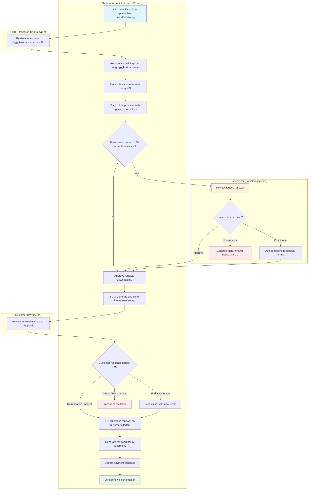

# Use Case: Annual Home Insurance Renewal

End-to-end use case for annual renewal (förnyelse) of home and property
insurance policies at TryggFörsäkring. Covers the complete renewal lifecycle
from policy identification through index adjustment of sums insured, premium
recalculation, renewal notice dispatch, customer response handling, automatic
renewal processing, and coverage modification at renewal. Includes
byggkostnadsindex and konsumentprisindex methodology, underwriter review of
flagged renewals, and IDD demands-and-needs reassessment.

## Use Case Summary

| Field                | Value                                                                                                |
| -------------------- | ---------------------------------------------------------------------------------------------------- |
| **Use Case ID**      | UC-HRN-001                                                                                           |
| **Name**             | Annual Home Insurance Renewal                                                                        |
| **Primary Actor**    | System (automated batch process)                                                                     |
| **Secondary Actors** | Customer (Privatkund), Customer Service Agent, Underwriter (Försäkringsgivare)                       |
| **Goal**             | Renew home insurance policies with updated sums insured, accurate premium, and customer notification |
| **Preconditions**    | Customer has an active home insurance policy approaching its huvudförfallodag                        |
| **Postconditions**   | Policy renewed with updated terms, or cancelled per customer request                                 |
| **Trigger**          | Policy reaches T-60 days before huvudförfallodag                                                     |

## Stakeholders and Interests

| Stakeholder            | Interest                                                            |
| ---------------------- | ------------------------------------------------------------------- |
| Customer               | Fair premium, adequate coverage, clear notice, freedom to cancel    |
| Customer Service Agent | Process phone modifications accurately, meet disclosure obligations |
| Underwriter            | Accurate risk pricing, appropriate continued coverage decisions     |
| Compliance Officer     | Regulatory notice timing met, IDD obligations fulfilled             |
| TryggFörsäkring        | Customer retention, accurate pricing, regulatory compliance         |
| SCB                    | Provides official index data (byggkostnadsindex, KPI)               |

## Process Flow

## Main Success Scenario

### 1. Policy Identification (T-60 Days)

1. The renewal batch process identifies all home insurance policies with a
   huvudförfallodag within the next 60 days
2. System retrieves each policy's current terms: coverage tier, sums insured,
   add-ons, deductible, and premium
3. System flags policies by type (hemförsäkring, villahemförsäkring,
   bostadsrättsförsäkring, fritidshusförsäkring) for appropriate index
   treatment

### 2. Index Adjustment of Sums Insured (T-60 Days)

1. System retrieves the current byggkostnadsindex from SCB
2. For policies with a building component (villa, fritidshus):
   - New Building Sum = Previous Building Sum x (Current Index / Previous Index)
   - System stores both index values and the adjustment percentage
3. System retrieves the current konsumentprisindex (KPI) from SCB
4. For all policies with contents coverage:
   - New Contents Sum = Previous Contents Sum x (Current KPI / Previous KPI)
   - Floor rule: contents sum is never reduced below the previous level
   - System stores both KPI values and the adjustment percentage
5. If the building sum index adjustment exceeds 10%, the renewal is flagged for
   underwriter review

### 3. Premium Recalculation (T-60 Days)

1. System recalculates the annual premium using:
   - Updated sums insured (after index adjustment)
   - Current claims history (claims count, types, total paid)
   - Current area risk zone for the property
   - Coverage tier and active add-ons
   - Current deductible level
   - Applicable tariff version
2. System records a factor breakdown showing each component's contribution to
   the premium change
3. If the premium increase exceeds 15% or the customer has 2+ claims in the
   expiring period, the renewal is flagged for underwriter review

### 4. Underwriter Review (T-45 Days, If Flagged)

1. Flagged renewals appear in the underwriter's review queue with the trigger
   reason
2. Underwriter reviews: claims history, premium factor breakdown, property risk
   data, and index adjustments
3. Underwriter makes a decision:
   - **Approve** — renewal proceeds with calculated terms
   - **Conditional** — renewal proceeds with added conditions (increased
     deductible, coverage exclusion, required improvements)
   - **Non-renewal** — policy will not be renewed; non-renewal notice must be
     sent at T-30

### 5. Renewal Notice Dispatch (T-30 Days)

1. System generates the förnyelseavisering containing:
   - New premium and premium change explanation (factor breakdown)
   - Updated building and contents sums with index adjustment details
   - Coverage tier and add-on summary
   - Year-over-year comparison table
   - Customer's right to cancel before huvudförfallodag
   - Instructions for modifying coverage
   - Any underwriter-imposed conditions
2. Notice is dispatched via the customer's preferred channel (postal letter,
   digital mailbox, Mina Sidor)
3. System records the dispatch date, channel, and delivery status

### 6. Customer Response Window (T-30 to T-0)

1. Customer reviews the renewal notice
2. Customer may:
   - **Accept** (explicitly or by inaction) — no action needed
   - **Modify coverage** — change tier, add/remove add-ons, adjust deductible
     (via Mina Sidor or phone)
   - **Cancel** — submit cancellation before the huvudförfallodag
3. If the customer requests modifications:
   - System recalculates the premium with the new terms
   - Customer confirms the updated terms
   - Modification is recorded in the renewal record
4. If the customer cancels:
   - Cancellation is effective on the huvudförfallodag
   - Automatic renewal is suppressed
   - Cancellation confirmation is sent

### 7. Automatic Renewal (T-0, Huvudförfallodag)

1. For all policies not cancelled:
   - System creates a new policy period with updated terms (premium, sums
     insured, coverage, any underwriter conditions)
   - New policy period starts at 00:00 on the huvudförfallodag
   - Expiring policy period ends at 00:00 on the huvudförfallodag (no gap)
2. System generates an updated policy document
3. System updates the payment schedule with the new premium amount
4. System sends a renewal confirmation to the customer within 1 business day

## Extensions (Alternative Flows)

### 3a. Significant Premium Increase (>15%)

1. System detects that the recalculated premium exceeds 15% over the previous
   year
2. Renewal is flagged for underwriter review (step 4) and for agent outreach
3. Customer service is notified to proactively contact the customer after the
   notice is sent to explain the increase and discuss options
4. Flow continues from step 4

### 3b. Multiple Claims in Past Year

1. System detects 2 or more claims during the expiring policy period
2. Renewal is flagged for underwriter review of continued coverage
3. Underwriter may impose conditions or decide on non-renewal
4. Flow continues from step 4

### 4a. Customer Has Requested Changes Before Renewal Processing

1. Customer previously requested modifications via Mina Sidor or phone
2. System incorporates the requested changes into the renewal calculation
3. Modified terms are reflected in the renewal notice
4. Flow continues from step 5

### 6a. Customer Requests Modifications via Phone

1. Customer calls to modify their renewal terms
2. Customer service agent opens the renewal record (HRN-08)
3. Agent modifies coverage, recalculates premium, and obtains verbal
   confirmation
4. Agent records the modification with verification details
5. Flow continues from step 7

### 6b. Customer Cancels Before Renewal

1. Customer submits a cancellation request before the huvudförfallodag (HRN-04)
2. System records the cancellation effective on the huvudförfallodag
3. Automatic renewal is suppressed
4. Customer receives cancellation confirmation with a reminder to arrange
   replacement coverage

### 6c. Competitor Insurer Sends Flyttanmälan

1. System receives a flyttanmälan from a competitor insurer
2. System validates the request against the policy's huvudförfallodag
3. If valid, the policy is cancelled effective on the huvudförfallodag
4. System responds with confirmation and the customer's policy history summary

### 7a. Non-Renewal by Insurer

1. Underwriter has decided not to renew the policy (step 4)
2. System generates a non-renewal notice sent to the customer at T-30
3. Non-renewal notice includes: reason for non-renewal, effective date, and the
   customer's right to seek coverage elsewhere
4. Policy ends on the huvudförfallodag with no new period created

### 7b. Payment Method Invalid

1. System detects the customer's payment method is invalid or expired
2. Renewal proceeds but the payment is flagged
3. System sends the customer a request to update their payment details
4. If not resolved within the grace period, the standard non-payment process
   applies

## Business Rules

| Rule ID   | Rule                                                                                              |
| --------- | ------------------------------------------------------------------------------------------------- |
| BR-HRN-01 | Renewal notice must be sent at least 30 days before huvudförfallodag per Försäkringsavtalslagen   |
| BR-HRN-02 | Building sum insured is adjusted annually using byggkostnadsindex from SCB                        |
| BR-HRN-03 | Contents sum insured is adjusted annually using konsumentprisindex (KPI) from SCB                 |
| BR-HRN-04 | Contents sum floor rule: KPI adjustment must not reduce the contents sum below the previous level |
| BR-HRN-05 | Premium recalculation uses the tariff version effective on the huvudförfallodag                   |
| BR-HRN-06 | Premium increases above 15% require underwriter review before notice dispatch                     |
| BR-HRN-07 | Two or more claims in the expiring period trigger underwriter review                              |
| BR-HRN-08 | Building sum index adjustment above 10% triggers underwriter review                               |
| BR-HRN-09 | Automatic renewal is the default; customer must explicitly cancel to prevent renewal              |
| BR-HRN-10 | Non-renewal notices must be sent at least 30 days before huvudförfallodag                         |
| BR-HRN-11 | Coverage modifications requested before huvudförfallodag take effect at renewal                   |
| BR-HRN-12 | Coverage modifications requested after huvudförfallodag are processed as mid-term endorsements    |
| BR-HRN-13 | The new policy period starts at 00:00 on the huvudförfallodag with no coverage gap                |
| BR-HRN-14 | Hemförsäkring (contents-only) policies do not receive building sum index adjustment               |

## Non-functional Requirements

| Requirement               | Target                                                               |
| ------------------------- | -------------------------------------------------------------------- |
| Renewal batch processing  | Complete for all eligible policies within 24 hours at T-60           |
| Index data retrieval      | SCB data refreshed monthly; fallback to cached values if unavailable |
| Premium recalculation     | Complete within 2 seconds per policy                                 |
| Renewal notice generation | All notices dispatched within 24 hours at T-30                       |
| Notice delivery tracking  | Delivery confirmation within 48 hours for digital channels           |
| Customer modification     | Premium recalculation in real time (under 3 seconds)                 |
| Audit trail               | All steps logged with timestamps, actor identity, and data versions  |
| Availability              | Renewal self-service on Mina Sidor available 24/7                    |
| Data retention            | Renewal records retained for 10 years per FSA-014                    |

## Regulatory Compliance Summary

| Regulation   | Requirements Addressed                                                          |
| ------------ | ------------------------------------------------------------------------------- |
| **FSA-003**  | Renewal notice timing (30 days); non-renewal notice timing; cancellation rights |
| **FSA-004**  | Clear, transparent communication of all changes; plain Swedish language         |
| **FSA-005**  | Fair treatment; index adjustments protect against underinsurance                |
| **FSA-006**  | Premium data available for supervisory reporting                                |
| **FSA-012**  | Modified coverage terms disclosed via updated policy documentation              |
| **FSA-016**  | Index adjustment methodology and amounts transparently disclosed                |
| **GDPR-007** | Customer data processed under Article 6(1)(b) contract performance; renewal     |
|              | records retained per data retention policy                                      |
| **IDD-006**  | Agent recommendations at renewal constitute advice requiring documentation      |
| **IDD-011**  | Demands-and-needs review at renewal; significant changes trigger reassessment   |

## Related User Stories

- [HRN-01: Receive Renewal Notice](../user-stories/home-renewals.md#hrn-01-receive-renewal-notice)
- [HRN-02: View Year-over-Year Comparison](../user-stories/home-renewals.md#hrn-02-view-year-over-year-comparison)
- [HRN-03: Modify Coverage at Renewal](../user-stories/home-renewals.md#hrn-03-modify-coverage-at-renewal)
- [HRN-04: Opt Out of Automatic Renewal](../user-stories/home-renewals.md#hrn-04-opt-out-of-automatic-renewal)
- [HRN-05: Recalculate Building Sum Insured Using Byggkostnadsindex](../user-stories/home-renewals.md#hrn-05-recalculate-building-sum-insured-using-byggkostnadsindex)
- [HRN-06: Recalculate Contents Sum Insured Using Konsumentprisindex](../user-stories/home-renewals.md#hrn-06-recalculate-contents-sum-insured-using-konsumentprisindex)
- [HRN-07: Apply Premium Adjustments at Renewal](../user-stories/home-renewals.md#hrn-07-apply-premium-adjustments-at-renewal)
- [HRN-08: Process Renewal Modifications for Phone Customers](../user-stories/home-renewals.md#hrn-08-process-renewal-modifications-for-phone-customers)
- [HRN-09: Review Flagged Renewals](../user-stories/home-renewals.md#hrn-09-review-flagged-renewals)
- [HRN-10: Generate and Send Renewal Notice](../user-stories/home-renewals.md#hrn-10-generate-and-send-renewal-notice)
