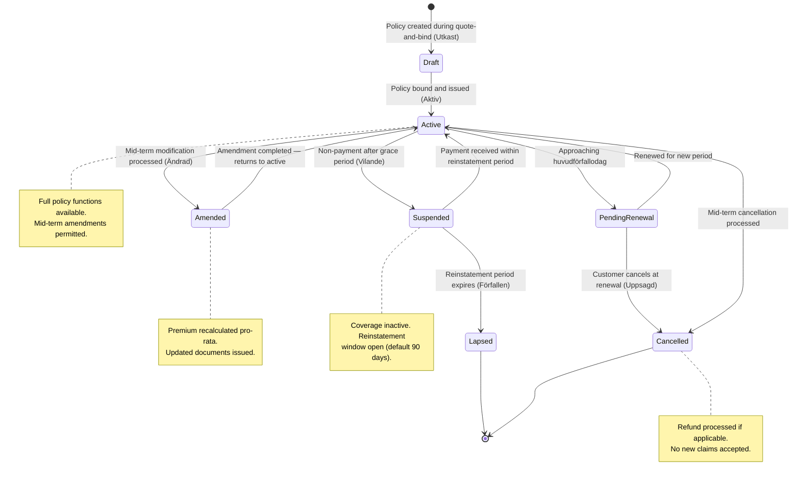
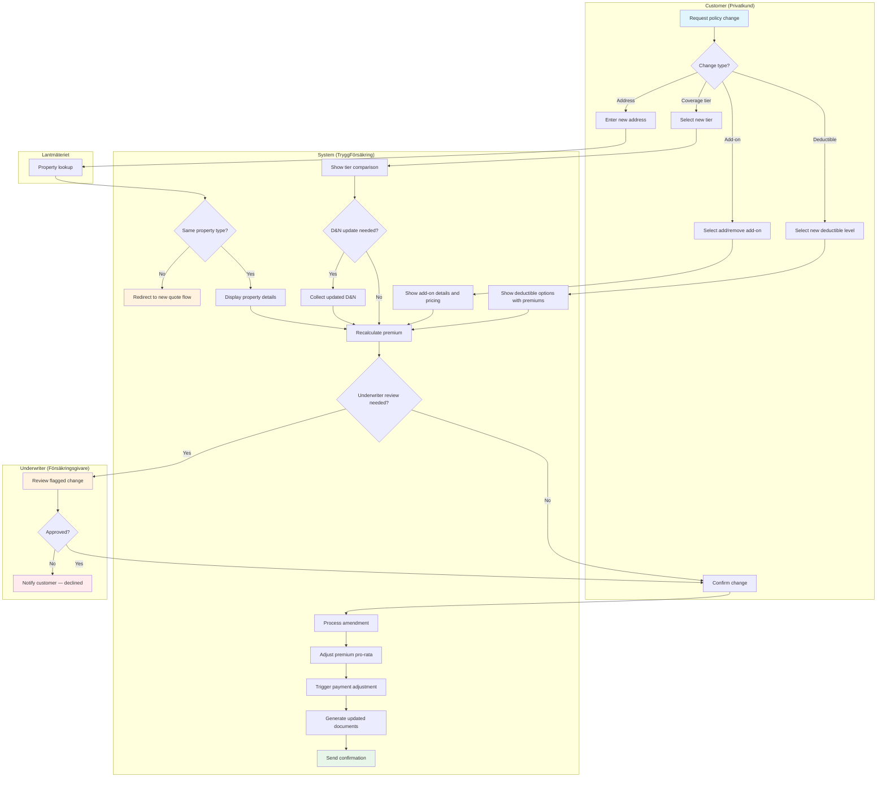
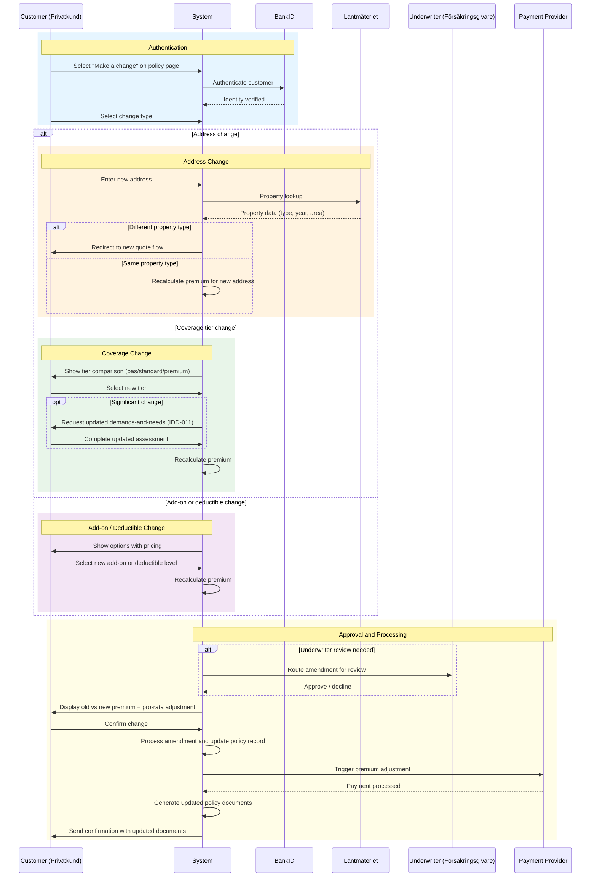
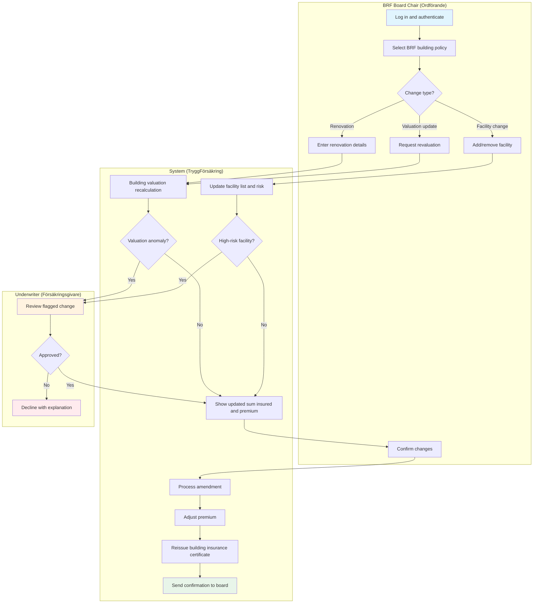
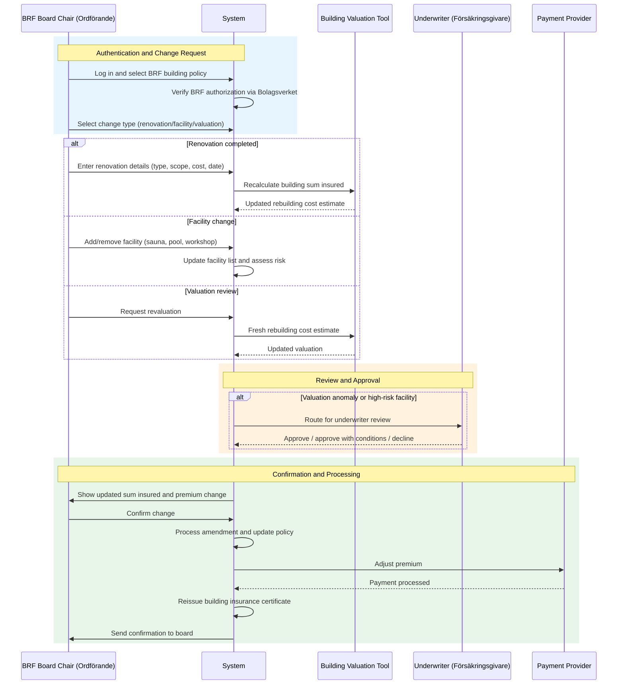
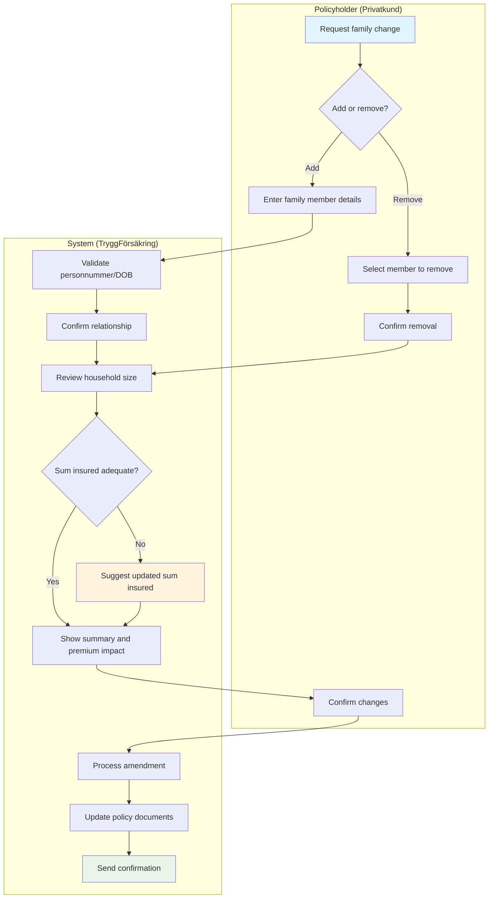
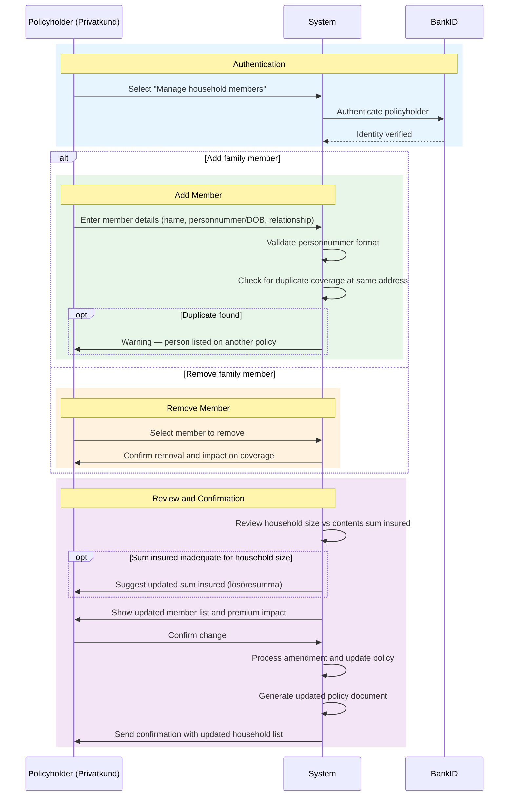

# Policy Administration Use Cases

Detailed interaction flows for home and property insurance mid-term
adjustments (MTAs) and policy lifecycle management. Each use case describes
the step-by-step process, preconditions, postconditions, validation rules,
data model, and exception flows.

## Shared Data Model: Home Policy Amendment Record

All policy administration use cases create an amendment record. The amendment
record entity provides a complete audit trail of every policy change.

| Attribute               | Type      | Description                                                                                                                               |
| ----------------------- | --------- | ----------------------------------------------------------------------------------------------------------------------------------------- |
| `amendment_id`          | UUID      | Unique identifier for the amendment                                                                                                       |
| `policy_id`             | UUID      | Reference to the parent policy                                                                                                            |
| `amendment_type`        | Enum      | `ADDRESS_CHANGE`, `RENOVATION`, `COVERAGE_CHANGE`, `ALLRISK_CHANGE`, `DEDUCTIBLE_CHANGE`, `FAMILY_MEMBER`, `BRF_BUILDING`, `BRF_FACILITY` |
| `status`                | Enum      | `PENDING`, `AWAITING_REVIEW`, `APPROVED`, `DECLINED`, `COMPLETED`, `CANCELLED`                                                            |
| `old_value`             | JSON      | Snapshot of the affected attribute(s) before the change                                                                                   |
| `new_value`             | JSON      | Snapshot of the affected attribute(s) after the change                                                                                    |
| `effective_date`        | Date      | Date the amendment takes effect                                                                                                           |
| `premium_old`           | Decimal   | Annual premium before the amendment                                                                                                       |
| `premium_new`           | Decimal   | Annual premium after the amendment                                                                                                        |
| `prorate_adjustment`    | Decimal   | Pro-rata premium adjustment amount (positive = charge, negative = refund)                                                                 |
| `initiated_by`          | Enum      | `CUSTOMER`, `AGENT`, `BRF_BOARD`, `UNDERWRITER`, `SYSTEM`                                                                                 |
| `channel`               | Enum      | `WEB`, `APP`, `PHONE`, `IN_PERSON`, `INTERNAL`                                                                                            |
| `bankid_reference`      | String    | BankID transaction reference (if customer-initiated)                                                                                      |
| `underwriter_decision`  | Enum      | `N/A`, `APPROVED`, `APPROVED_WITH_CONDITIONS`, `DECLINED`                                                                                 |
| `underwriter_rationale` | Text      | Written rationale (required when underwriter is involved)                                                                                 |
| `product_type`          | Enum      | `HEMFORSAKRING`, `VILLAHEMFORSAKRING`, `BOSTADSRATTSFORSAKRING`, `FRITIDSHUSFORSAKRING`, `BRF_FASTIGHETSFORSAKRING`                       |
| `created_at`            | Timestamp | When the amendment was created                                                                                                            |
| `completed_at`          | Timestamp | When the amendment was finalized                                                                                                          |

## State Lifecycle

---

## UC-HPA-001: Mid-Term Policy Modification

### Use Case Summary

| Field                | Value                                                                                            |
| -------------------- | ------------------------------------------------------------------------------------------------ |
| **Use Case ID**      | UC-HPA-001                                                                                       |
| **Name**             | Mid-Term Policy Modification                                                                     |
| **Primary Actor**    | Customer (Privatkund)                                                                            |
| **Secondary Actors** | Lantmäteriet, Payment Provider, Underwriter (for flagged changes), BankID                        |
| **Goal**             | Process an address change, coverage change, or add-on change on an active home policy            |
| **Preconditions**    | Active policy, customer authenticated via BankID                                                 |
| **Postconditions**   | Policy updated, premium adjusted pro-rata, amendment record created, updated documents available |
| **Trigger**          | Customer initiates a change from the policy management page or contacts customer service         |

### Stakeholders and Interests

| Stakeholder      | Interest                                                                |
| ---------------- | ----------------------------------------------------------------------- |
| Customer         | Seamless policy update; fair premium adjustment; immediate confirmation |
| Underwriter      | Flagged changes reviewed before acceptance; risk accurately priced      |
| Lantmäteriet     | Property data provided for address changes                              |
| Payment Provider | Premium adjustment collected or refunded correctly                      |
| TryggFörsäkring  | Accurate risk data; regulatory compliance; retained customer            |

### Preconditions

1. The customer has an active home or property insurance policy
1. The customer is authenticated via BankID
1. The policy is not in a pending cancellation or claims-hold state

### Mid-Term Modification Process Flow

### Interaction Sequence

### Main Success Scenario

1. **Initiate** — Customer selects "Make a change" from their policy
   management page
1. Customer selects the type of change: address, coverage tier, add-on
   (allrisk/drulle), or deductible
1. **Collect details** — System collects the change-specific information:
   - Address change: new address, validated via Lantmäteriet
   - Coverage tier: new tier selection with side-by-side comparison
   - Add-on: add or remove allrisk/drulle with pricing
   - Deductible: new level with premium comparison
1. **Validate** — System validates the change against business rules:
   - Address must be same property type; otherwise redirect to new quote
   - Coverage tier changes may require updated demands-and-needs (IDD-011)
   - Deductible must be within allowed range for the product type
1. **Risk assessment** — System evaluates whether the change requires
   underwriter review. Standard changes proceed automatically. Flagged
   changes (e.g., address in high-risk flood zone, major property type
   concern) route to underwriter review (see Alternative Flow A)
1. **Premium recalculation** — System recalculates the annual premium and
   the pro-rata adjustment for the remainder of the policy period
1. **Presentation** — System displays: current coverage, proposed changes,
   old premium, new premium, pro-rata adjustment amount, and effective date
1. **Confirmation** — Customer reviews and accepts the change
1. **Amendment processing** — System processes the amendment:
   - Updates the policy record with the new values
   - Creates an amendment record in the policy history
   - Triggers premium adjustment via the payment provider
   - Generates an updated policy document and insurance certificate
1. **Notification** — Customer receives confirmation via email or in-app
   notification with a link to the updated policy documents

### Alternative Flows

#### A. Change Requires Underwriter Review

1. System notifies the customer that the change requires manual review
   (expected turnaround: 2-5 business days depending on complexity)
1. System routes the amendment request to the underwriter queue with the
   change details and risk assessment
1. Underwriter reviews the request
1. If approved: resume main flow at step 6 with any adjusted terms
1. If declined: notify the customer with the reason; the original policy
   remains unchanged

#### B. Address Change to Different Property Type

1. System detects the new address is a different property type (e.g.,
   villa to BRF apartment)
1. System informs the customer that an address change cannot switch
   property types; a new policy is required
1. System offers to start a new quote flow with the new address
   pre-populated, linking it to the existing policy for seamless transition
1. The existing policy remains active until the new policy is bound

#### C. Agent-Assisted Change

1. Customer contacts customer service by phone
1. Agent authenticates the customer by requesting BankID verification
   (remote authentication sent to customer's mobile)
1. Agent performs the same steps as the customer self-service flow
1. Amendment record notes channel as PHONE and initiated_by as AGENT
1. Customer receives confirmation via email or SMS

#### D. Payment Processing Failure

1. Amendment is accepted but the payment provider returns an error
1. System creates the amendment with a PENDING payment status
1. System retries payment after 24 hours
1. If payment fails after 3 retries, the amendment is flagged for
   manual resolution by the finance team
1. The coverage change remains active — TryggFörsäkring carries the
   premium risk until payment is resolved

### Exception Flows

#### E1. Lantmäteriet Service Unavailable (Address Change)

1. System detects Lantmäteriet is unavailable
1. System displays: "Property registry is temporarily unavailable. Please
   try again later."
1. Customer can save the change request as a draft to resume later

#### E2. BankID Authentication Failure

1. BankID authentication times out or is rejected
1. System prompts the customer to retry or contact customer service
1. No policy change is processed without successful authentication

### Business Rules

| Rule                     | Description                                                                                    |
| ------------------------ | ---------------------------------------------------------------------------------------------- |
| Same-type address change | Address changes must be within the same property type (villa-to-villa, BRF-to-BRF)             |
| Immediate effect         | All amendments take effect on the date confirmed by the customer (or next business day)        |
| Pro-rata calculation     | Premium adjustments are calculated pro-rata from the effective date to the next renewal date   |
| Underwriter referral     | Changes flagged for review: flood-zone address, coverage upgrade > 2 tiers, structural changes |
| BankID required          | All customer-initiated changes require BankID authentication                                   |
| Audit trail              | Every amendment creates a full amendment record with before/after snapshots                    |

### Non-Functional Requirements

| Requirement     | Target                                           |
| --------------- | ------------------------------------------------ |
| Response time   | Premium recalculation < 3 seconds                |
| Availability    | Policy management available 99.5% of the time    |
| Document gen    | Updated policy document generated within 1 hour  |
| Audit retention | Amendment records retained for policy + 10 years |

### Regulatory Compliance

| Regulation | Requirement                                                             |
| ---------- | ----------------------------------------------------------------------- |
| FSA-004    | Premium changes must be transparent and clearly communicated            |
| FSA-015    | Product suitability must be verified after changes                      |
| FSA-016    | Building valuation must be updated after renovations                    |
| IDD-011    | Demands-and-needs reassessment on significant coverage changes          |
| IDD-012    | Coverage gap disclosure when changing coverage tier or removing add-ons |
| GDPR-007   | Property data processing follows data minimization principles           |

---

## UC-HPA-002: BRF Building Insurance Administration

### Use Case Summary

| Field                | Value                                                                                                 |
| -------------------- | ----------------------------------------------------------------------------------------------------- |
| **Use Case ID**      | UC-HPA-002                                                                                            |
| **Name**             | BRF Building Insurance Administration                                                                 |
| **Primary Actor**    | BRF Board Chair (Ordförande)                                                                          |
| **Secondary Actors** | Building Valuation Tool, Underwriter, Payment Provider                                                |
| **Goal**             | Update BRF building insurance after renovations, facility changes, or building valuation adjustments  |
| **Preconditions**    | Active BRF fastighetsförsäkring, board chair authenticated and authorized to act on behalf of the BRF |
| **Postconditions**   | Building insurance updated, sum insured adjusted, premium recalculated, certificate reissued          |
| **Trigger**          | BRF board chair reports a building change or the annual valuation review                              |

### Stakeholders and Interests

| Stakeholder      | Interest                                                                  |
| ---------------- | ------------------------------------------------------------------------- |
| BRF Board Chair  | Accurate building coverage; competitive premium; clear documentation      |
| BRF Members      | Adequate building insurance protecting their investments                  |
| Underwriter      | Building risk accurately assessed; major renovations reviewed             |
| Payment Provider | Premium adjustment processed correctly                                    |
| TryggFörsäkring  | Accurate building valuation; regulatory compliance; retained BRF customer |

### Preconditions

1. The BRF has an active fastighetsförsäkring (building insurance) policy
1. The board chair is authenticated and verified as an authorized
   representative of the BRF (verified via Bolagsverket organization
   register)
1. The BRF's organization number is registered in the system

### BRF Building Administration Process Flow

### Interaction Sequence

### Main Success Scenario

1. **Authenticate** — BRF board chair logs in and selects the BRF building
   insurance policy
1. Board chair selects the type of change: renovation completed, shared
   facility change, or valuation review
1. **Collect details** — System collects change-specific information:
   - Renovation: type, scope, completion date, cost, affected building areas
   - Facility: add/remove, type, location, equipment value, risk factors
   - Valuation: request a fresh rebuilding cost estimate
1. **Building valuation** — System recalculates the building sum insured
   using the building valuation tool, incorporating the reported changes
1. **Risk assessment** — System evaluates whether the change requires
   underwriter review:
   - Standard renovations (cosmetic, maintenance) proceed automatically
   - Major renovations (stambyte, structural changes) trigger review
   - High-risk facilities (sauna, pool) trigger review
1. **Presentation** — System displays: current sum insured, proposed sum
   insured, premium change, and the effective date
1. **Confirmation** — Board chair reviews and accepts the change
1. **Amendment processing** — System processes the amendment:
   - Updates the policy record with the new building data
   - Adjusts the premium and processes payment
   - Reissues the building insurance certificate
   - Creates an amendment record
1. **Notification** — Board chair receives confirmation; relevant
   documentation is available for download and for sharing with the BRF
   board and members

### Alternative Flows

#### A. Underwriter Review Required

1. System notifies the board chair that the change requires manual review
   (expected turnaround: 5 business days)
1. Underwriter reviews the building data and renovation details
1. Underwriter may request additional documentation (e.g., building
   inspection report, construction permits)
1. If approved: resume main flow at step 6 with any adjusted conditions
1. If approved with conditions: conditions are documented and communicated
   to the board chair
1. If declined: the board chair is notified with the reason; existing
   coverage remains unchanged

#### B. Underinsurance Detection

1. During valuation, the system detects the current sum insured is below
   the estimated rebuilding cost
1. System warns the board chair about underinsurance risk and explains
   proportional settlement consequences per FSA-016
1. System proposes an updated sum insured to eliminate underinsurance
1. Board chair decides whether to accept the updated sum or maintain the
   current level (with underinsurance acknowledgement)

#### C. Board Chair Authorization Expired

1. System detects the board chair's BRF authorization has expired (mandate
   period ended per Bolagsverket records)
1. System blocks the change and requests updated authorization
1. Board chair must provide updated BRF board resolution or Bolagsverket
   extract confirming current authorization

### Business Rules

| Rule                           | Description                                                                          |
| ------------------------------ | ------------------------------------------------------------------------------------ |
| Authorized representative only | Only verified BRF board representatives can modify building insurance                |
| Fullvärdesförsäkring default   | BRF building insurance defaults to fullvärdesförsäkring (no underinsurance)          |
| Annual valuation review        | System prompts for valuation review at each renewal, adjusting for byggkostnadsindex |
| Renovation threshold           | Renovations > 500 000 SEK trigger automatic underwriter review                       |
| Facility risk assessment       | Saunas, pools, and workshop facilities require underwriter approval                  |

### Non-Functional Requirements

| Requirement     | Target                                                    |
| --------------- | --------------------------------------------------------- |
| Response time   | Building valuation recalculation < 5 seconds              |
| Availability    | BRF administration portal available 99.5% of the time     |
| Document gen    | Updated certificate generated within 1 hour               |
| Audit retention | Amendment records retained for policy duration + 10 years |

### Regulatory Compliance

| Regulation | Requirement                                                    |
| ---------- | -------------------------------------------------------------- |
| FSA-016    | Building sum insured must reflect actual rebuilding cost       |
| FSA-015    | Product suitability for the BRF's building coverage needs      |
| GDPR-009   | Board member data processing follows BRF data processing rules |
| GDPR-007   | Property data processing follows data minimization principles  |

---

## UC-HPA-003: Family Member Management

### Use Case Summary

| Field                | Value                                                                                        |
| -------------------- | -------------------------------------------------------------------------------------------- |
| **Use Case ID**      | UC-HPA-003                                                                                   |
| **Name**             | Family Member Management                                                                     |
| **Primary Actor**    | Customer (Privatkund — Policyholder)                                                         |
| **Secondary Actors** | BankID, Payment Provider                                                                     |
| **Goal**             | Add or remove family members on a home insurance policy to ensure correct household coverage |
| **Preconditions**    | Active home policy, policyholder authenticated via BankID                                    |
| **Postconditions**   | Policy updated with new household composition, sum insured reviewed, documents updated       |
| **Trigger**          | Policyholder needs to add or remove a household member                                       |

### Stakeholders and Interests

| Stakeholder     | Interest                                                           |
| --------------- | ------------------------------------------------------------------ |
| Policyholder    | All household members covered; sum insured reflects household size |
| Family Member   | Personal belongings covered under the policy                       |
| TryggFörsäkring | Accurate household data for risk assessment; regulatory compliance |

### Preconditions

1. The policyholder has an active home insurance policy (any product type)
1. The policyholder is authenticated via BankID
1. The policyholder is the named policyholder on the policy

### Family Member Management Process Flow

### Interaction Sequence

### Main Success Scenario

1. **Initiate** — Policyholder selects "Manage household members" from
   their policy management page
1. Policyholder selects whether to add or remove a family member
1. **Add member** — Policyholder enters the new member's details:
   - Full name
   - Personnummer or date of birth (for children under 18)
   - Relationship to policyholder (partner, child, other household member)
1. **Validation** — System validates the provided details:
   - Personnummer format check (where provided)
   - The person is not already listed on another active policy at the
     same address (warning only — not a blocker)
1. **Household review** — System reviews the updated household
   composition and evaluates whether the current contents sum insured
   (lösöresumma) is adequate for the household size:
   - 1-2 persons: standard sum insured
   - 3-4 persons: suggest increased sum insured
   - 5+ persons: recommend contents review
1. **Presentation** — System displays: the updated household member list,
   the current sum insured, any recommended sum insured increase, and the
   premium impact (if any)
1. **Confirmation** — Policyholder reviews and confirms the change
1. **Amendment processing** — System processes the amendment:
   - Updates the policy record with the new household composition
   - Adjusts the sum insured if the policyholder accepted the
     recommendation
   - Recalculates the premium if the sum insured changed
   - Creates an amendment record
   - Generates an updated policy document
1. **Notification** — Policyholder receives confirmation with the updated
   household member list

### Alternative Flows

#### A. Remove Family Member

1. Policyholder selects "Remove" and chooses the member to remove from
   the household list
1. System confirms the removal and explains the impact: the member's
   belongings are no longer covered under this policy
1. System evaluates whether the sum insured should be reduced (optional —
   policyholder may keep the current level)
1. Resume main flow at step 6

#### B. Remove Last Remaining Family Member (Single Household)

1. If the removal leaves only the policyholder on the policy
1. System proceeds normally — single-person policies are valid
1. System suggests reviewing the sum insured downward to match a single
   household

#### C. Minor Child Turns 18

1. At renewal, the system detects that a listed child has turned 18
1. System notifies the policyholder that the now-adult child may want
   their own hemförsäkring (especially if they move out)
1. If the child remains in the household, no action is required
1. If the child has moved out, the policyholder should remove them

### Business Rules

| Rule                     | Description                                                                      |
| ------------------------ | -------------------------------------------------------------------------------- |
| Policyholder only        | Only the policyholder can add or remove family members                           |
| No personnummer required | Children under 18 can be added with date of birth only                           |
| Sum insured review       | System suggests sum insured review when household size changes significantly     |
| Premium impact           | Adding/removing members typically does not change the premium unless sum changes |
| Duplicate warning        | System warns if a person appears on another policy at the same address           |

### Non-Functional Requirements

| Requirement     | Target                                                    |
| --------------- | --------------------------------------------------------- |
| Response time   | Household update < 2 seconds                              |
| Availability    | Policy management available 99.5% of the time             |
| Document gen    | Updated policy document generated within 1 hour           |
| Audit retention | Amendment records retained for policy duration + 10 years |

### Regulatory Compliance

| Regulation | Requirement                                                                      |
| ---------- | -------------------------------------------------------------------------------- |
| GDPR-007   | Family member personal data requires legal basis; contract performance applies   |
| FSA-015    | Household composition affects product suitability; coverage must match household |
| FSA-004    | Any coverage or premium changes must be transparent and communicated             |
| FSA-012    | Updated policy documents must be accessible to the policyholder                  |
