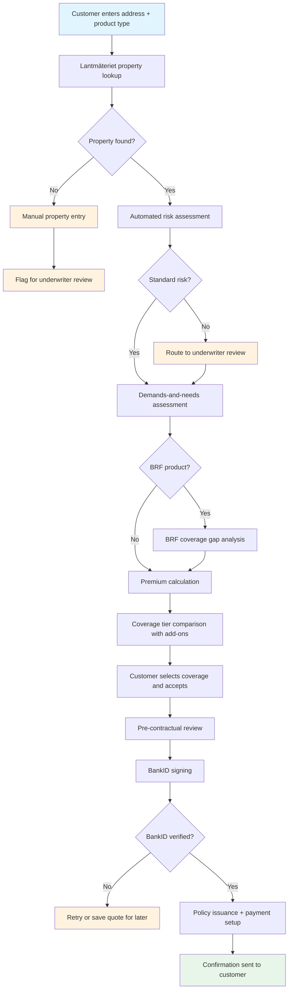
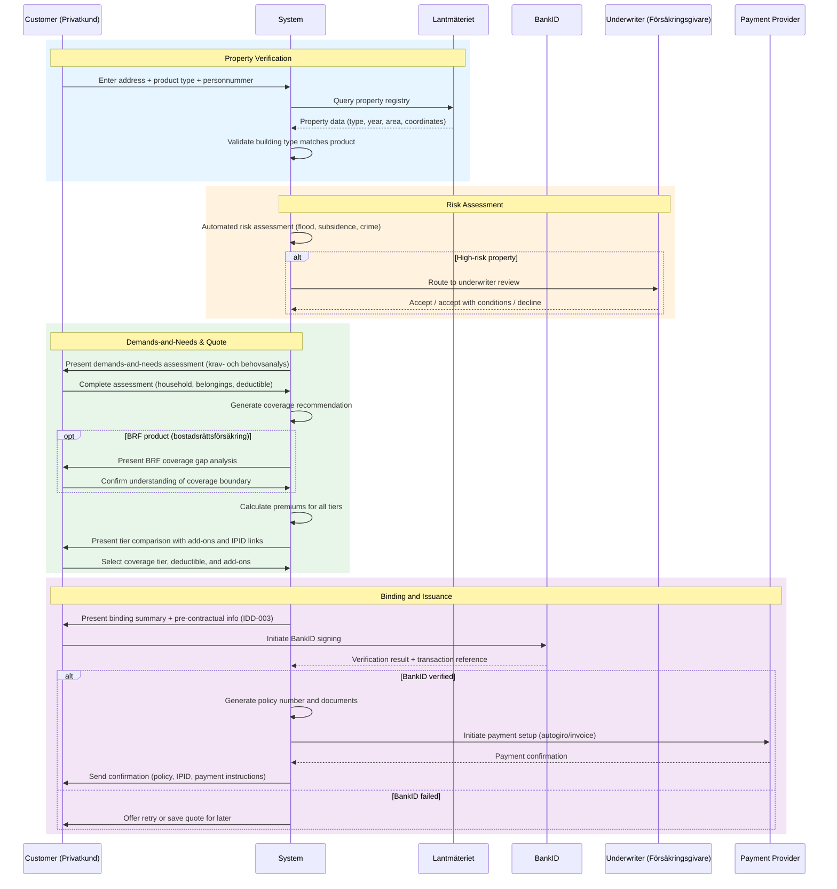
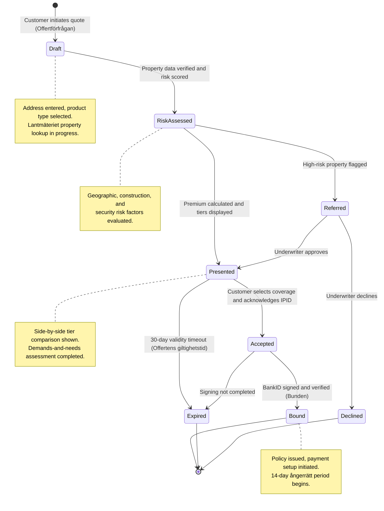

# Use Case: Quote and Bind Home Insurance

End-to-end use case for quoting and binding a home and property insurance policy
at TryggFörsäkring. Covers the complete flow from address entry and property
verification through premium calculation, coverage selection, and policy
issuance. Supports all four product types: hemförsäkring,
villahemförsäkring, bostadsrättsförsäkring, and fritidshusförsäkring.

## Use Case Summary

| Field                | Value                                                                   |
| -------------------- | ----------------------------------------------------------------------- |
| **Use Case ID**      | UC-HQB-001                                                              |
| **Name**             | Quote and Bind Home Insurance                                           |
| **Primary Actor**    | Customer (Privatkund)                                                   |
| **Secondary Actors** | Customer Service Agent, Underwriter                                     |
| **Goal**             | Obtain a home insurance quote and bind a policy                         |
| **Preconditions**    | Customer has a Swedish personnummer and a valid property address        |
| **Postconditions**   | Policy is bound, confirmation documents issued, payment setup initiated |
| **Trigger**          | Customer initiates a home insurance quote request                       |

## Stakeholders and Interests

| Stakeholder            | Interest                                                             |
| ---------------------- | -------------------------------------------------------------------- |
| Customer               | Quick, transparent quote; fair pricing; immediate confirmation       |
| BRF Member             | Clear understanding of BRF vs personal coverage                      |
| Customer Service Agent | Efficient tool for phone-based customer advisory; compliant workflow |
| Underwriter            | Correct risk assessment based on property data                       |
| Compliance Officer     | IDD assessment completed; all records retained                       |
| TryggFörsäkring        | New policy sale; regulatory compliance; accurate property data       |
| Lantmäteriet           | Accurate use of property registry data                               |

## Process Flow

## Interaction Sequence

## State Lifecycle

## Main Success Scenario

### 1. Address Entry and Product Selection

1. Customer enters their property address (street, postal code, city)
2. Customer selects the product type:
   - Hemförsäkring (home contents — for renters)
   - Villahemförsäkring (homeowner — for villa/house owners)
   - Bostadsrättsförsäkring (tenant-owner — for BRF apartment owners)
   - Fritidshusförsäkring (vacation home — for second home owners)
3. Customer enters personnummer for identity verification

### 2. Property Data Retrieval

1. System queries Lantmäteriet/address registry with the entered address
2. System retrieves property data:
   - Property ID (fastighetsbeteckning)
   - Building type, construction year, building area
   - Geographic coordinates (for risk zone mapping)
3. System pre-populates property details in the quote form
4. System validates that the building type matches the selected product

### 3. Automated Risk Assessment

1. System performs automated property risk assessment using:
   - Geographic risk zone (flood risk from MSB, subsidence, crime rates)
   - Building construction type and materials
   - Construction year
   - Distance to fire station and water source
2. System classifies the property as standard risk or flags for review
3. If flagged, the quote is routed to an underwriter (see Extension 3a)

### 4. Demands-and-Needs Assessment

1. System presents the structured demands-and-needs assessment form
   (krav- och behovsanalys)
2. Customer completes the assessment:
   - Household composition (adults, children)
   - Value of personal belongings (lösöre)
   - Need for specific coverages (allrisk/drulle, ID-skydd, travel)
   - Deductible tolerance (självrisk — low, medium, high)
   - Special items requiring separate valuation (jewelry, art, electronics)
   - For BRF members: knowledge of BRF building insurance coverage
3. System generates a coverage recommendation with rationale:
   - Recommended coverage tier (bas/standard/premium)
   - Recommended deductible level
   - Relevant add-ons based on stated needs

### 5. BRF Coverage Gap Analysis (Bostadsrättsförsäkring Only)

1. System presents the BRF coverage gap analysis:
   - What the BRF building insurance typically covers (structure, communal
     areas, pipes)
   - What bostadsrättsförsäkring covers (interior fixtures, personal
     property, liability)
   - Common coverage gaps (interior surfaces, appliances, bathroom
     renovations)
2. System recommends bostadsrättstillägg if applicable
3. Customer confirms understanding of the coverage boundary

### 6. Premium Calculation and Coverage Comparison

1. System calculates premiums for all three coverage tiers using:
   - Property risk factors (location, building type, construction year)
   - Household risk factors (size, contents value)
   - Security features (alarm, locks, fire protection)
   - Selected deductible level
   - Product type-specific factors
2. For villahemförsäkring/fritidshusförsäkring: building sum insured
   calculated using rebuilding cost index
3. System presents a side-by-side tier comparison showing:
   - Coverage details per tier
   - Premium per tier
   - Deductible per tier
   - IPID access link per tier
4. System highlights the recommended tier from the assessment
5. System presents available add-ons with individual pricing:
   - Allrisk/drulle
   - ID-skydd
   - Bostadsrättstillägg (for BRF products)
   - Extended travel insurance
   - Bicycle coverage

### 7. Coverage Selection

1. Customer selects a coverage tier
2. Customer selects a deductible level
3. Customer selects or declines optional add-ons
4. Customer adjusts contents sum insured (lösöre) if needed
5. If the customer deviates from the recommendation, system records the
   deviation
6. System calculates the final premium (base + add-ons)

### 8. Pre-contractual Review and Signing

1. System presents the binding summary:
   - Selected product type and coverage tier
   - Coverage details and sum insured (contents and building if applicable)
   - Premium amount and payment frequency
   - Deductible amount
   - Policy effective date and huvudförfallodag (anniversary)
   - Pre-contractual information (IDD-003):
     - Insurer identity (TryggFörsäkring AB)
     - FSA registration status
     - Complaints handling procedures
     - Dispute resolution options (ARN)
   - IPID delivery confirmation (IDD-002)
   - Demands-and-needs assessment reference (IDD-011)
   - 14-day cooling-off right (ångerrätt) information (FSA-013)
2. Customer initiates BankID signing
3. System sends the policy document hash to BankID
4. Customer completes BankID authentication and signing
5. System records the BankID transaction reference and timestamp

### 9. Policy Issuance

1. System generates a unique policy number
2. System creates the policy record with all binding details
3. System generates the confirmation documents:
   - Policy document with terms and conditions
   - Coverage summary
   - IPID for the selected tier
4. System initiates payment setup with the payment provider:
   - Monthly autogiro setup, or
   - Annual invoice generation
5. System calculates the ångerrätt (cooling-off) expiry date (14 days)

### 10. Confirmation

1. System sends confirmation to the customer:
   - Policy document (PDF)
   - Coverage summary
   - IPID for the selected tier
   - Payment instructions
   - Cooling-off information
2. Policy documents are available in the self-service portal

## Extensions (Alternative Flows)

### 2a. Address Not Found in Lantmäteriet

1. System displays a message that the property was not found
2. Customer is offered manual property entry (building type, construction
   year, area)
3. Manual entry requires underwriter review before binding
4. Flow continues from step 3

### 3a. High-Risk Property Identified

1. Automated risk assessment identifies risk factors outside standard
   parameters (flood zone, old building, previous claims)
2. Quote is routed to underwriter review queue
3. Underwriter reviews property details, risk factors, and claims history
4. Underwriter may:
   - Accept at standard terms
   - Accept with conditions (premium surcharge, exclusions, inspection
     required)
   - Decline with explanation
5. If accepted: flow continues from step 4 (with any conditions applied)
6. If declined: customer is notified with decline reason

### 4a. Agent-Assisted Quote

1. Agent authenticates via BankID
2. System verifies the agent's competence certification (IDD-009)
3. Agent enters the customer's address and personnummer
4. Agent completes the demands-and-needs assessment on behalf of the customer
5. System records the agent's identity and distribution channel
6. Agent provides a personal recommendation with documented rationale
   (IDD-006)
7. System records the distribution status disclosure (IDD-005)
8. Flow continues from step 5 (Premium Calculation)
9. At signing, the customer (not the agent) signs via BankID

### 5a. BRF Insurance Details Unavailable

1. Customer cannot provide details about their BRF's building insurance
2. System applies conservative defaults (recommending bostadsrättstillägg)
3. System advises the customer to verify their BRF's coverage
4. Flow continues from step 6

### 8a. BankID Signing Fails

1. System displays an error message indicating the signing failed
2. The quote remains valid for the configured validity period
3. Customer can retry signing without re-entering data
4. If the failure persists, customer is offered to save the quote and
   complete later

### 8b. Customer Under 18

1. System detects from personnummer that the customer is under 18
2. System prevents policy binding
3. System displays a message indicating that a legal guardian must be the
   policyholder

### 6a. Building Type Mismatch

1. System detects that the Lantmäteriet building type does not match the
   selected product type
2. System alerts the customer and suggests the correct product type
3. Customer either switches product type or confirms manual override
4. Manual override flags the quote for underwriter review

## Business Rules

| Rule ID   | Rule                                                                                             |
| --------- | ------------------------------------------------------------------------------------------------ |
| BR-HQB-01 | The demands-and-needs assessment must be completed before any quote is finalized                 |
| BR-HQB-02 | The IPID for the selected tier must be provided before binding                                   |
| BR-HQB-03 | The customer must be informed of the 14-day cooling-off right (ångerrätt) before signing         |
| BR-HQB-04 | Property data from Lantmäteriet must be verified before premium calculation                      |
| BR-HQB-05 | Quotes have a configurable validity period (default: 30 days)                                    |
| BR-HQB-06 | Minimum age for policyholder is 18 years (verified via personnummer)                             |
| BR-HQB-07 | Add-on pricing must be itemized separately from the base premium                                 |
| BR-HQB-08 | Agent-assisted sales must record the distribution channel, advisor identity, and all disclosures |
| BR-HQB-09 | Building sum insured must be calculated using a current rebuilding cost index (villa/fritidshus) |
| BR-HQB-10 | High-risk properties must be reviewed by an underwriter before binding                           |
| BR-HQB-11 | BRF coverage gap analysis must be presented for bostadsrättsförsäkring products                  |
| BR-HQB-12 | Contents sum insured (lösöre) must meet a minimum threshold based on household size              |

## Non-functional Requirements

| Requirement            | Target                                                      |
| ---------------------- | ----------------------------------------------------------- |
| Property data lookup   | Response within 3 seconds (Lantmäteriet SLA)                |
| Risk assessment        | Complete within 2 seconds                                   |
| Quote calculation      | Complete within 5 seconds                                   |
| BankID signing         | Timeout after 2 minutes; allow retry                        |
| Quote validity         | Configurable; default 30 days                               |
| Underwriter review SLA | Flagged quotes reviewed within 4 business hours             |
| Audit trail            | All steps logged with timestamps and actor identity         |
| Availability           | Quote-and-bind flow available 24/7 for digital self-service |

## Regulatory Compliance Summary

| Regulation   | Requirements Addressed                                                      |
| ------------ | --------------------------------------------------------------------------- |
| **FSA-004**  | Fair treatment through demands-and-needs assessment and transparent pricing |
| **FSA-005**  | Product governance; underwriting rules align with target market             |
| **FSA-012**  | Pre-contractual disclosure before binding                                   |
| **FSA-013**  | Cooling-off right (ångerrätt) communicated at binding                       |
| **FSA-015**  | Product suitability; recommended coverage matches customer situation        |
| **FSA-016**  | Building valuation; adequate sum insured to prevent underinsurance          |
| **GDPR-007** | Personal and property data collected under Article 6(1)(b) for quote        |
| **IDD-002**  | IPID provided for each tier before binding                                  |
| **IDD-003**  | Pre-contractual information presented before signing                        |
| **IDD-005**  | Distribution status disclosed for agent channel                             |
| **IDD-006**  | Advice documented with rationale for agent channel                          |
| **IDD-007**  | Add-on pricing itemized separately                                          |
| **IDD-008**  | All distribution records retained per retention requirements                |
| **IDD-009**  | Agent competence verified before quote initiation                           |
| **IDD-011**  | Demands-and-needs assessment completed before quote finalization            |
| **IDD-013**  | Cross-selling of add-ons presented transparently                            |

## Related User Stories

- [HQB-01: Get a Home Insurance Quote](../user-stories/quote-and-bind.md#hqb-01-get-a-home-insurance-quote)
- [HQB-02: Compare Coverage Tiers](../user-stories/quote-and-bind.md#hqb-02-compare-coverage-tiers)
- [HQB-03: BRF Coverage Gap Analysis](../user-stories/quote-and-bind.md#hqb-03-brf-coverage-gap-analysis)
- [HQB-04: Add Allrisk/Drulle Coverage](../user-stories/quote-and-bind.md#hqb-04-add-allriskdrulle-coverage)
- [HQB-05: Sign Policy with BankID](../user-stories/quote-and-bind.md#hqb-05-sign-policy-with-bankid)
- [HQB-06: Agent-Assisted Home Quote](../user-stories/quote-and-bind.md#hqb-06-agent-assisted-home-quote)
- [HQB-07: Automatic Property Risk Assessment](../user-stories/quote-and-bind.md#hqb-07-automatic-property-risk-assessment)
- [HQB-08: Review Flagged High-Risk Quotes](../user-stories/quote-and-bind.md#hqb-08-review-flagged-high-risk-quotes)
- [HQB-09: Verify Property Address via Lantmäteriet](../user-stories/quote-and-bind.md#hqb-09-verify-property-address-via-lantmäteriet)
- [HQB-10: Calculate Premium Based on Rating Factors](../user-stories/quote-and-bind.md#hqb-10-calculate-premium-based-on-rating-factors)
