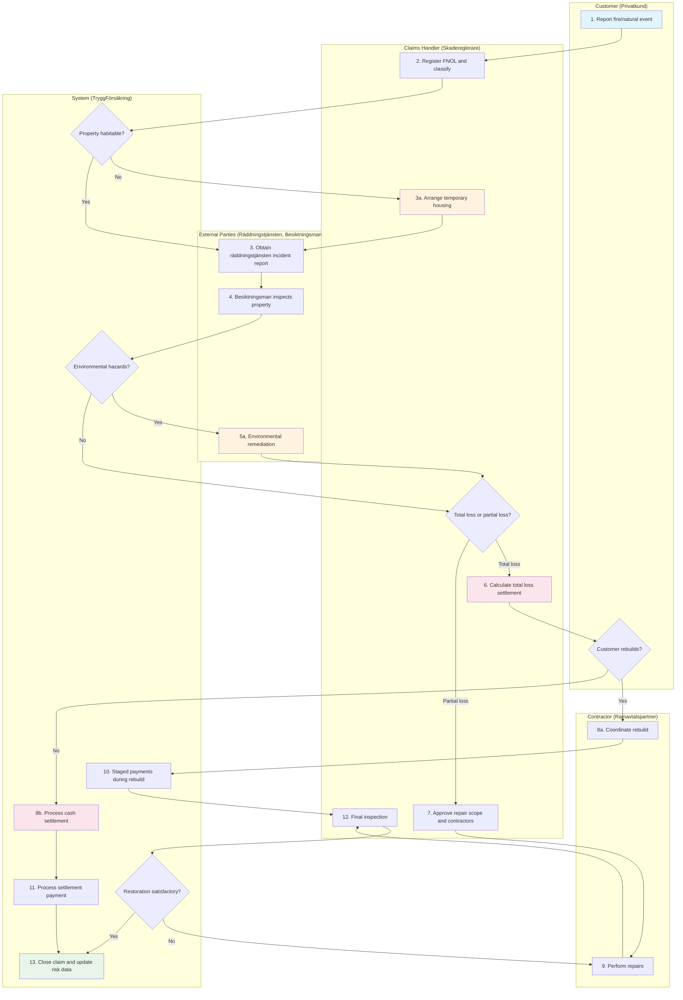
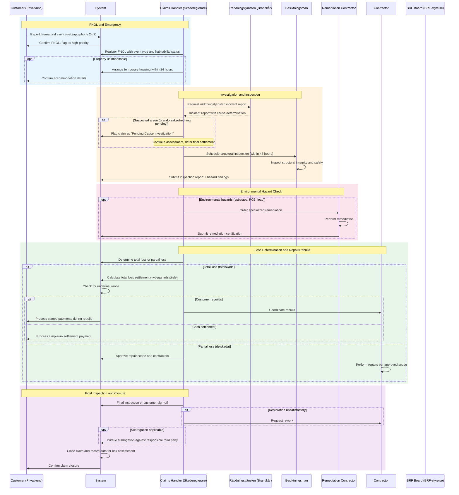
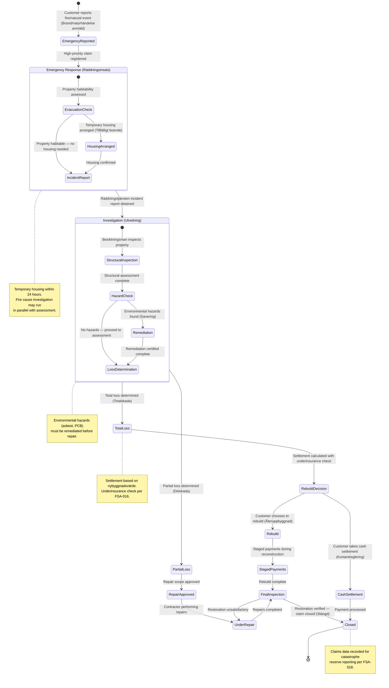

# UC-HCF-001: Fire/Natural Event Claim Lifecycle

## Overview

This use case describes the end-to-end lifecycle of a fire or natural event (brand/naturhändelse) claim — from emergency FNOL through structural assessment, total/partial loss determination, restoration or rebuild, settlement, and closure. Fire and natural event claims are low-frequency but high-severity, involving evacuation, total loss assessment, environmental hazard remediation, multi-party coordination, and extended temporary housing. The lifecycle differs significantly from water damage claims due to the scale of destruction, involvement of räddningstjänsten (fire department), and the total loss vs rebuild decision.

## Actors

- **Primary:** [Customer (Privatkund)](../../actors/internal/customer.md), [Claims Handler (Skadereglerare)](../../actors/internal/claims-handler.md)
- **Supporting:** [Fire Department (Räddningstjänsten)](../../actors/external/fire-department.md), [Property Inspector (Besiktningsman)](../../actors/external/property-inspector.md), [Restoration Company (Saneringsfirma)](../../actors/external/restoration-company.md), [BRF Board (BRF-styrelse)](../../actors/external/brf-board.md)

## Preconditions

1. The customer holds an active home insurance policy (hemförsäkring, villahemförsäkring, or bostadsrättsförsäkring) with TryggFörsäkring
2. A fire, storm, flood, lightning strike, or other natural event has occurred at the insured property
3. The customer has access to the web portal, mobile app, or claims phone line

## Postconditions

**Success:**

- Claim is settled and closed with full documentation
- Property has been repaired or rebuilt, or cash settlement has been paid
- Customer has received the settlement amount (minus deductible and any age deductions or underinsurance adjustments)
- Temporary housing has been provided for the duration of displacement
- BRF/individual responsibility has been determined (if applicable)
- Subrogation has been pursued against responsible third parties (if applicable)
- Claims data has been recorded for underwriting risk assessment and catastrophe reserve reporting

**Failure:**

- Claim is denied with documented reason (e.g., excluded peril, lapsed policy, arson by policyholder)
- Customer has been informed of the denial reason and FSA complaints procedure
- Emergency temporary housing may still be provided pending investigation

## Process Flow

## Interaction Sequence

## State Lifecycle

## Main Flow (Fire/Natural Event Claim Lifecycle)

| Step | Actor          | Action                                                                              | System Response                                                                   | Reference                                                             |
| ---- | -------------- | ----------------------------------------------------------------------------------- | --------------------------------------------------------------------------------- | --------------------------------------------------------------------- |
| 1    | Customer       | Reports fire or natural event via web, app, or phone (available 24/7)               | Creates FNOL record with claim number, flags as high-priority, sends confirmation | [US-HCF-001](../user-stories/fire-natural-fnol.md)                    |
| 2    | Claims Handler | Registers FNOL with event type, damage extent, and habitability status              | Validates coverage, classifies event type, assigns claims handler                 | [US-HCF-003](../user-stories/fire-natural-event-classification.md)    |
| 3    | Claims Handler | Requests räddningstjänsten incident report                                          | Records document request, tracks report receipt                                   | [US-HCF-002](../user-stories/fire-natural-incident-report.md)         |
| 4    | Besiktningsman | Inspects property for structural integrity and safety                               | Records inspection report, structural assessment, and hazard findings             | [US-HCF-005](../user-stories/fire-natural-structural-inspection.md)   |
| 5    | Claims Handler | Reviews inspection; checks for environmental hazards                                | Records hazard assessment; blocks repair if remediation needed                    | [US-HCF-006](../user-stories/fire-natural-environmental-hazards.md)   |
| 6    | Claims Handler | Determines total loss or partial loss based on inspection and cost analysis         | Activates the appropriate settlement path                                         | [US-HCF-004](../user-stories/fire-natural-total-loss-assessment.md)   |
| 7    | Claims Handler | For total loss: calculates settlement (rebuild cost or sum insured)                 | Generates settlement breakdown with underinsurance check                          | [US-HCF-007](../user-stories/fire-natural-valuation.md)               |
| 8    | Claims Handler | Coordinates with contractors for repair (partial) or rebuild (total)                | Records contractor assignment, scope, and budget                                  | [US-HCF-008](../user-stories/fire-natural-contractor-coordination.md) |
| 9    | Contractor     | Performs repairs or rebuild per approved scope                                      | Tracks progress, costs, and milestones                                            | [US-HCF-008](../user-stories/fire-natural-contractor-coordination.md) |
| 10   | Claims Handler | Processes settlement payments (staged for rebuilds, lump sum for cash settlements)  | Records payment details, updates claim status                                     | [US-HCF-007](../user-stories/fire-natural-valuation.md)               |
| 11   | Claims Handler | Verifies restoration is complete via final inspection or customer sign-off          | Records inspection results and customer acceptance                                | [US-HCF-008](../user-stories/fire-natural-contractor-coordination.md) |
| 12   | Claims Handler | Pursues subrogation against responsible third party if applicable                   | Tracks subrogation separately from customer settlement                            | [US-HCF-011](../user-stories/fire-natural-subrogation.md)             |
| 13   | System         | Closes claim and records data for risk assessment and catastrophe reserve reporting | Archives claim file, updates property claims history and geographic risk data     | [US-HCF-012](../user-stories/fire-natural-risk-update.md)             |

## Alternative Flow: Emergency Temporary Housing

| Step | Actor          | Action                                                                | System Response                                               |
| ---- | -------------- | --------------------------------------------------------------------- | ------------------------------------------------------------- |
| 1a.1 | Customer       | Reports property is uninhabitable during FNOL                         | Flags claim for immediate temporary housing                   |
| 1a.2 | Claims Handler | Approves temporary housing and arranges accommodation                 | Creates housing order, books accommodation, notifies customer |
| 1a.3 | System         | Monitors temporary housing duration and costs against policy limits   | Alerts claims handler at 80% of coverage limit                |
| 1a.4 | Claims Handler | Extends housing as needed during rebuild; ends when property restored | Records total housing cost, includes in settlement            |

Reference: [US-HCF-009](../user-stories/fire-natural-temporary-housing.md)

## Alternative Flow: Multi-Unit Event (Apartment Building)

| Step | Actor          | Action                                                                  | System Response                                   |
| ---- | -------------- | ----------------------------------------------------------------------- | ------------------------------------------------- |
| 2a.1 | Claims Handler | Identifies that multiple units are affected                             | Creates parent event record, links all claims     |
| 2a.2 | Claims Handler | Assigns lead handler for coordinated management                         | Links sub-claims to parent, shows event dashboard |
| 2a.3 | Claims Handler | Coordinates shared contractors for building-level repairs               | Tracks progress per unit and overall timeline     |
| 2a.4 | Claims Handler | Determines BRF building vs individual bostadsrättsförsäkring boundaries | Records responsibility split for each unit        |

Reference: [US-HCF-010](../user-stories/fire-natural-multi-unit.md)

## Alternative Flow: Catastrophe Response (Large-Scale Natural Event)

| Step | Actor          | Action                                            | System Response                                                         |
| ---- | -------------- | ------------------------------------------------- | ----------------------------------------------------------------------- |
| 2b.1 | Claims Handler | Declares a catastrophe event (katastrof)          | Creates catastrophe event record with geographic scope                  |
| 2b.2 | System         | Enables bulk claim registration for affected area | Simplified FNOL flow for affected policyholders                         |
| 2b.3 | Claims Handler | Assigns dedicated claims team to the catastrophe  | Routes all linked claims to the dedicated team                          |
| 2b.4 | System         | Generates aggregate reserve and exposure reports  | Reports total exposure by geographic zone for FSA catastrophe reporting |

Reference: [US-HCF-010](../user-stories/fire-natural-multi-unit.md)

## Alternative Flow: Environmental Hazard Remediation

| Step | Actor                  | Action                                                 | System Response                                         |
| ---- | ---------------------- | ------------------------------------------------------ | ------------------------------------------------------- |
| 5a.1 | Besiktningsman         | Identifies environmental hazards (asbestos, PCB, lead) | Records hazard type and location                        |
| 5a.2 | Claims Handler         | Orders specialized environmental remediation           | Creates remediation order, assigns certified contractor |
| 5a.3 | Remediation Contractor | Performs remediation and submits certification         | Records certification, unblocks repair phase            |
| 5a.4 | Claims Handler         | Includes remediation cost in claim total               | Updates claim cost breakdown                            |

Reference: [US-HCF-006](../user-stories/fire-natural-environmental-hazards.md)

## Alternative Flow: Fire Cause Under Investigation

| Step | Actor          | Action                                                              | System Response                                                  |
| ---- | -------------- | ------------------------------------------------------------------- | ---------------------------------------------------------------- |
| 3a.1 | Claims Handler | Receives incident report indicating pending brandorsaksutredning    | Flags claim as "Pending Cause Investigation"                     |
| 3a.2 | Claims Handler | Continues assessment and temporary housing while investigation runs | Records that settlement decision is deferred for cause findings  |
| 3a.3 | Claims Handler | Receives final cause determination                                  | Updates claim; if arson by policyholder, flags for denial review |

Reference: [US-HCF-002](../user-stories/fire-natural-incident-report.md)

## Alternative Flow: Underinsured Property

| Step | Actor          | Action                                                                | System Response                                             |
| ---- | -------------- | --------------------------------------------------------------------- | ----------------------------------------------------------- |
| 7a.1 | System         | Detects sum insured is below estimated rebuild cost                   | Calculates underinsurance ratio and proportional settlement |
| 7a.2 | Claims Handler | Explains underinsurance to the customer with proportional calculation | Records customer communication and underinsurance finding   |
| 7a.3 | Customer       | Acknowledges or disputes the underinsurance determination             | Records acknowledgment or creates dispute record            |

Reference: [US-HCF-007](../user-stories/fire-natural-valuation.md)

## Exception Flow: Suspected Arson

| Step | Actor          | Action                                    | System Response                                                             |
| ---- | -------------- | ----------------------------------------- | --------------------------------------------------------------------------- |
| 3b.1 | Claims Handler | Incident report indicates suspected arson | Flags claim for fraud investigation                                         |
| 3b.2 | Claims Handler | Suspends settlement pending investigation | Records suspension reason, continues temporary housing                      |
| 3b.3 | Claims Handler | Reviews investigation outcome             | If cleared: resumes settlement; if confirmed arson by insured: denies claim |

Reference: [US-HCF-002](../user-stories/fire-natural-incident-report.md), [US-HCF-011](../user-stories/fire-natural-subrogation.md)

## Validation Rules

| Rule       | Description                                                                     |
| ---------- | ------------------------------------------------------------------------------- |
| VR-HCF-001 | Incident date must not be in the future                                         |
| VR-HCF-002 | Incident date must fall within the policy's active coverage period              |
| VR-HCF-003 | Property address must match the insured property on the policy                  |
| VR-HCF-004 | Event type must be a covered peril under the policy terms                       |
| VR-HCF-005 | Environmental remediation must be verified complete before repair phase         |
| VR-HCF-006 | Total loss settlement must include underinsurance check                         |
| VR-HCF-007 | Repair/rebuild cost exceeding threshold requires senior claims handler approval |
| VR-HCF-008 | All required documentation must be complete before claim closure                |
| VR-HCF-009 | Fire cause investigation must conclude before final settlement (if pending)     |

## Data Model

### FireNaturalEventClaim

| Field                | Type      | Required       | Description                                                                       |
| -------------------- | --------- | -------------- | --------------------------------------------------------------------------------- |
| claimId              | String    | Auto-generated | Unique claim identifier (skadenummer)                                             |
| policyId             | Reference | Yes            | Link to the insured policy                                                        |
| eventDate            | Date      | Yes            | Date of the fire or natural event                                                 |
| reportDate           | Timestamp | Auto-set       | Date and time of FNOL submission                                                  |
| eventType            | Enum      | Yes            | Fire, storm, flood, lightning, explosion, other natural event                     |
| secondaryEventType   | Enum      | No             | Secondary peril if multiple types involved                                        |
| causeOfLoss          | Text      | No             | Determined cause (from incident report or investigation)                          |
| propertyType         | Enum      | Yes            | Villa, bostadsrätt, hyresrätt                                                     |
| propertyHabitable    | Boolean   | Yes            | Whether the property is safe for occupancy                                        |
| lossClassification   | Enum      | No             | Total loss (totalskada) or partial loss (delskada)                                |
| brfInvolved          | Boolean   | Yes            | Whether BRF coordination is required                                              |
| brfPolicyId          | Reference | Conditional    | BRF building insurance policy (if applicable)                                     |
| catastropheEventId   | Reference | No             | Link to parent catastrophe event (for multi-claim events)                         |
| environmentalHazards | Boolean   | No             | Whether environmental hazards were identified                                     |
| estimatedCost        | Currency  | No             | Initial cost estimate                                                             |
| rebuildCost          | Currency  | No             | Estimated nybyggnadsvärde for total loss                                          |
| sumInsured           | Currency  | Yes            | Policy's building sum insured (försäkringsbelopp)                                 |
| underinsured         | Boolean   | No             | Whether underinsurance was detected                                               |
| totalClaimCost       | Currency  | Calculated     | Final total cost (repair/rebuild + temporary housing + remediation)               |
| status               | Enum      | Auto-set       | Emergency Reported, Classified, Under Assessment, Repair/Rebuild, Settled, Closed |
| assignedHandler      | Reference | Auto-set       | Claims handler assigned to the claim                                              |

### IncidentReport

| Field                  | Type      | Required       | Description                                     |
| ---------------------- | --------- | -------------- | ----------------------------------------------- |
| reportId               | String    | Auto-generated | Unique report identifier                        |
| claimId                | Reference | Yes            | Link to the fire/natural event claim            |
| raddningstjanstenRef   | String    | Yes            | Räddningstjänsten's incident reference number   |
| incidentDate           | Date      | Yes            | Official date and time of incident              |
| causeCategory          | Enum      | Yes            | Fire, storm, flood, lightning, explosion, other |
| causeDetermination     | Text      | No             | Detailed cause finding                          |
| criminalSuspicion      | Boolean   | No             | Whether arson or criminal activity suspected    |
| policeReportRef        | String    | Conditional    | Police report reference (if criminal suspicion) |
| environmentalHazards   | Boolean   | No             | Whether hazardous materials were identified     |
| causeInvestigationOpen | Boolean   | No             | Whether a brandorsaksutredning is pending       |

### StructuralInspection

| Field                | Type      | Required       | Description                                            |
| -------------------- | --------- | -------------- | ------------------------------------------------------ |
| inspectionId         | String    | Auto-generated | Unique inspection identifier                           |
| claimId              | Reference | Yes            | Link to the fire/natural event claim                   |
| inspectionDate       | Date      | Yes            | Date of on-site inspection                             |
| inspectorName        | String    | Yes            | Besiktningsman name and certification number           |
| structuralIntegrity  | Enum      | Yes            | Safe, unsafe, conditionally safe                       |
| roofIntegrity        | Enum      | Yes            | Intact, partially damaged, destroyed                   |
| utilitySystems       | Object    | Yes            | Status of electrical, plumbing, gas, heating           |
| environmentalHazards | Boolean   | Yes            | Whether hazards found (asbestos, chemicals, etc.)      |
| lossRecommendation   | Enum      | Yes            | Inspector's recommendation: total loss or partial loss |
| estimatedDamageCost  | Currency  | No             | Preliminary cost estimate                              |

### TemporaryHousing

| Field             | Type      | Required       | Description                               |
| ----------------- | --------- | -------------- | ----------------------------------------- |
| housingId         | String    | Auto-generated | Unique housing record identifier          |
| claimId           | Reference | Yes            | Link to the fire/natural event claim      |
| startDate         | Date      | Yes            | Temporary housing start date              |
| endDate           | Date      | No             | End date (updated on completion)          |
| accommodationType | Enum      | Yes            | Hotel, furnished apartment, extended-stay |
| dailyCost         | Currency  | Yes            | Daily accommodation cost                  |
| totalCost         | Currency  | Calculated     | Total accumulated housing cost            |
| coverageLimit     | Currency  | Yes            | Policy maximum for temporary housing      |
| provider          | String    | No             | Accommodation provider name               |

## Business Rules

| Rule       | Description                                                                                                                            |
| ---------- | -------------------------------------------------------------------------------------------------------------------------------------- |
| BR-HCF-001 | Fire/natural event claims are classified as high-priority and routed for immediate handling                                            |
| BR-HCF-002 | Temporary housing must be arranged within 24 hours when property is uninhabitable                                                      |
| BR-HCF-003 | Structural inspection must be scheduled within 48 hours of räddningstjänsten clearance                                                 |
| BR-HCF-004 | Environmental remediation must be completed and certified before standard repair work begins                                           |
| BR-HCF-005 | Total loss settlement is based on nybyggnadsvärde (rebuild cost) for fullvärdesförsäkring policies                                     |
| BR-HCF-006 | Underinsurance triggers proportional settlement: claim amount x (sum insured / rebuild cost)                                           |
| BR-HCF-007 | Repair or rebuild costs exceeding SEK 500,000 require senior claims handler approval                                                   |
| BR-HCF-008 | The customer must not be left out of pocket for covered portions while subrogation is in progress                                      |
| BR-HCF-009 | Catastrophe events must be reported to FSA per natural disaster reserve requirements                                                   |
| BR-HCF-010 | Fire cause investigation must conclude before final settlement; temporary housing and emergency measures continue during investigation |

## External Integrations

| System                                          | Purpose                                                      | Data Exchanged                                                |
| ----------------------------------------------- | ------------------------------------------------------------ | ------------------------------------------------------------- |
| Räddningstjänsten                               | Incident reports for fire and natural event cause and extent | Incident reports, cause determinations, criminal referrals    |
| Approved contractor network (ramavtalspartners) | Repair and rebuild coordination                              | Scope of work, progress updates, invoices                     |
| Environmental remediation contractors           | Specialized hazard cleanup (asbestos, PCB, etc.)             | Remediation orders, certifications                            |
| BRF building insurer                            | Cross-claim coordination for split-responsibility claims     | Claim details, responsibility determination, settlement split |
| Temporary housing provider                      | Accommodation booking for uninhabitable properties           | Booking requests, availability, cost confirmation             |
| Lantmäteriet                                    | Property data and building valuation                         | Property register data, rebuilding cost estimates             |
| Police (Polismyndigheten)                       | Criminal investigation for arson cases                       | Police report references, investigation status                |

## Regulatory

- **FSA-010** — Fair and timely claims settlement: the entire claims lifecycle must proceed without undue delay; SLAs must be tracked from FNOL through settlement
- **FSA-016** — Building valuation: total loss settlements must reflect adequate building valuation; underinsurance rules apply per proportional settlement formula
- **FSA-018** — Natural disaster reserves: fire and natural event claims data must support catastrophe reserve calculations and FSA reporting by peril type and geography
- **FSA-004** — Consumer protection: the customer must receive clear communication at each stage, particularly regarding total loss vs partial loss determination and settlement basis
- **FSA-005** — Product governance: claims data must be available for product reviews
- **FSA-003** — Solvency II compliance: catastrophe risk exposure data supports SCR calculations
- **FSA-011** — Complaints handling: the customer must be informed of the complaints procedure if they dispute any aspect of the claim
- **FSA-014** — Record keeping: the complete claims file must be retained for 10 years
- **GDPR-003** — Claims processing: personal data shared with contractors, inspectors, and housing providers must be limited to what is necessary
- **GDPR-008** — Restoration company data sharing: data sharing with restoration companies and contractors must follow data minimization and be covered by data processing agreements

## Related User Stories

- [US-HCF-001](../user-stories/fire-natural-fnol.md) — Report Fire or Natural Event Emergency
- [US-HCF-002](../user-stories/fire-natural-incident-report.md) — Obtain Räddningstjänsten Incident Report
- [US-HCF-003](../user-stories/fire-natural-event-classification.md) — Classify Event Type and Coverage
- [US-HCF-004](../user-stories/fire-natural-total-loss-assessment.md) — Assess Total Loss vs Partial Loss
- [US-HCF-005](../user-stories/fire-natural-structural-inspection.md) — Inspect Property for Structural Integrity
- [US-HCF-006](../user-stories/fire-natural-environmental-hazards.md) — Check for Environmental Hazards
- [US-HCF-007](../user-stories/fire-natural-valuation.md) — Explain Rebuild Cost vs Market Value Settlement
- [US-HCF-008](../user-stories/fire-natural-contractor-coordination.md) — Coordinate Contractors for Rebuild or Repair
- [US-HCF-009](../user-stories/fire-natural-temporary-housing.md) — Provide Continued Temporary Housing During Rebuild
- [US-HCF-010](../user-stories/fire-natural-multi-unit.md) — Manage Multi-Unit Claims
- [US-HCF-011](../user-stories/fire-natural-subrogation.md) — Process Subrogation Against Responsible Third Party
- [US-HCF-012](../user-stories/fire-natural-risk-update.md) — Flag Property for Updated Risk Assessment
