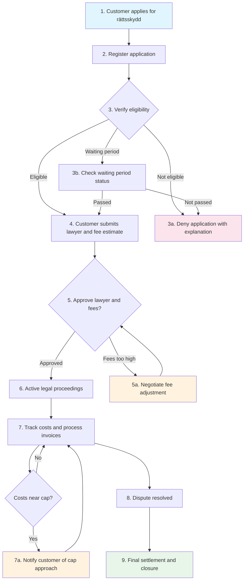
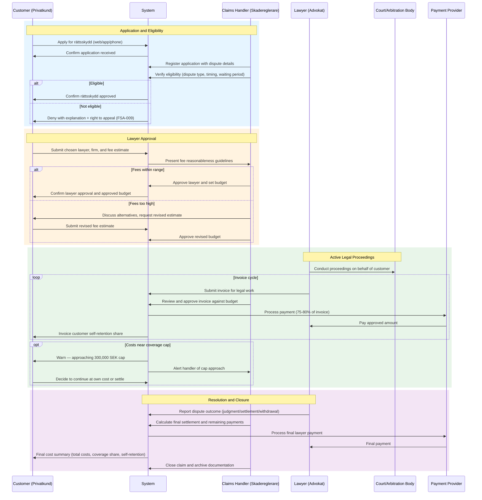
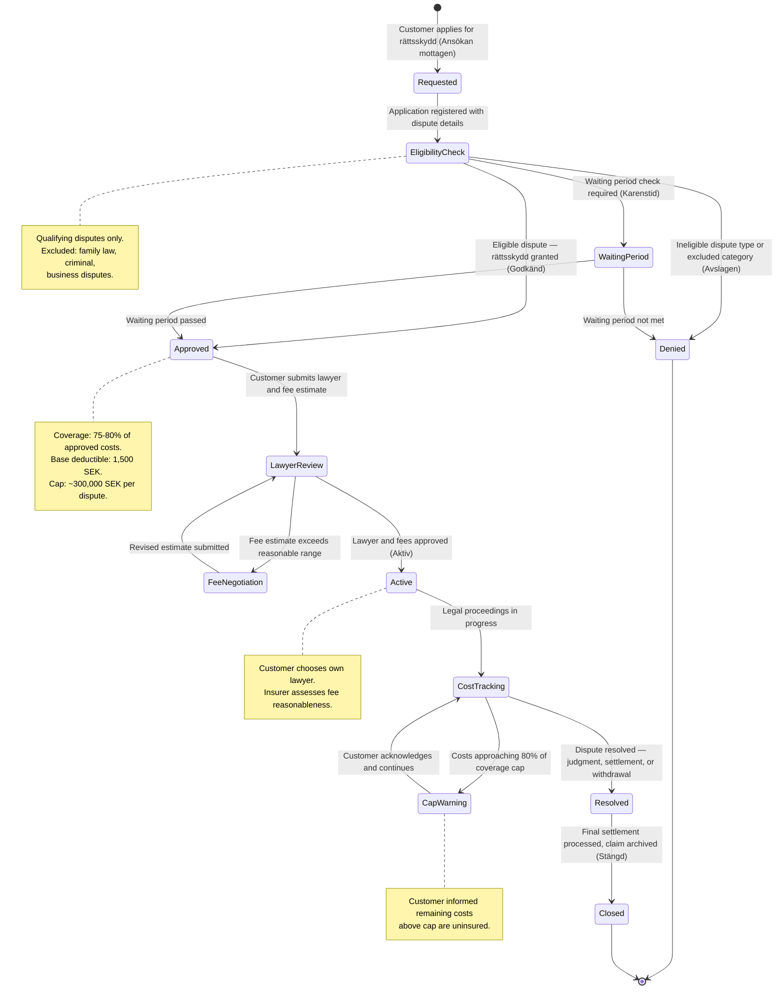

# UC-HCL-002: Legal Expenses (Rättsskydd) Application and Management

## Overview

This use case describes the end-to-end lifecycle of a legal expenses
(rättsskydd) claim under home insurance — from application through eligibility
verification, lawyer approval, cost management, and closure. Rättsskydd covers
legal costs in qualifying civil disputes, typically at 75–80% of costs up to
a cap of approximately 300,000 SEK. It is a mandatory component of Swedish
hemförsäkring.

## Actors

- **Primary:** [Customer (Privatkund)](../../actors/internal/customer.md),
  [Claims Handler (Skadereglerare)](../../actors/internal/claims-handler.md)
- **Supporting:** Lawyer (Advokat), Opposing Party, Court/Arbitration Body

## Preconditions

1. The customer holds an active home insurance policy with rättsskydd coverage
2. A qualifying legal dispute has arisen where the customer needs legal
   representation
3. The dispute cannot be resolved without legal proceedings or legal counsel

## Postconditions

**Success:**

- Rättsskydd eligibility verified and approved
- Lawyer approved with fee estimate within budget
- Legal costs tracked and paid per coverage terms (75–80% up to cap)
- Dispute resolved (judgment, settlement, or withdrawal)
- Full claims file archived for regulatory retention

**Failure:**

- Application denied due to ineligible dispute type, waiting period, or
  excluded category
- Customer informed of denial reason and right to appeal via complaints process

## Process Flow

## Interaction Sequence

## State Lifecycle

## Main Flow (Rättsskydd Application and Management)

| Step | Actor          | Action                                                                  | System Response                                                                | Reference                                                                                          |
| ---- | -------------- | ----------------------------------------------------------------------- | ------------------------------------------------------------------------------ | -------------------------------------------------------------------------------------------------- |
| 1    | Customer       | Applies for rättsskydd via web, app, or phone                           | Creates rättsskydd claim record, sends confirmation to customer                | [HCL-05](../user-stories/liability-and-legal.md#hcl-05-apply-for-rättsskydd-for-a-legal-dispute)   |
| 2    | Claims Handler | Registers application with dispute details and opposing party           | Validates coverage status, assigns claims handler                              | [HCL-05](../user-stories/liability-and-legal.md#hcl-05-apply-for-rättsskydd-for-a-legal-dispute)   |
| 3    | Claims Handler | Verifies eligibility: dispute type, timing, waiting period, exclusions  | Displays eligibility checklist, records determination                          | [HCL-06](../user-stories/liability-and-legal.md#hcl-06-verify-rättsskydd-eligibility)              |
| 4    | Customer       | Submits chosen lawyer name, firm, and fee estimate                      | Records lawyer details, presents fee reasonableness guidelines                 | [HCL-07](../user-stories/liability-and-legal.md#hcl-07-approve-lawyer-and-fee-estimate)            |
| 5    | Claims Handler | Reviews and approves lawyer choice and fee estimate                     | Records approval, sets approved budget, notifies customer                      | [HCL-07](../user-stories/liability-and-legal.md#hcl-07-approve-lawyer-and-fee-estimate)            |
| 6    | Lawyer         | Conducts legal proceedings on behalf of the customer                    | System tracks case status and milestones                                       | [HCL-07](../user-stories/liability-and-legal.md#hcl-07-approve-lawyer-and-fee-estimate)            |
| 7    | Claims Handler | Reviews and approves lawyer invoices against approved budget            | Processes payment (coverage % of invoice), tracks cumulative costs against cap | [HCL-08](../user-stories/liability-and-legal.md#hcl-08-understand-self-retention-and-coverage-cap) |
| 8    | Lawyer         | Reports dispute outcome (judgment, settlement, withdrawal)              | Records outcome in claim file                                                  | [HCL-05](../user-stories/liability-and-legal.md#hcl-05-apply-for-rättsskydd-for-a-legal-dispute)   |
| 9    | Claims Handler | Calculates final settlement, processes remaining payments, closes claim | Archives claim file, records total costs and customer self-retention           | [HCL-08](../user-stories/liability-and-legal.md#hcl-08-understand-self-retention-and-coverage-cap) |

## Alternative Flow: Application Denied

| Step | Actor          | Action                                                              | System Response                                           |
| ---- | -------------- | ------------------------------------------------------------------- | --------------------------------------------------------- |
| 3a.1 | Claims Handler | Determines dispute does not qualify (excluded type, timing, amount) | Records denial with specific reason                       |
| 3a.2 | System         | Sends written denial to customer with explanation                   | Includes right to appeal via complaints process (FSA-009) |
| 3a.3 | Customer       | May appeal the denial through the complaints process                | Complaint is logged and routed to complaints handler      |

## Alternative Flow: Fee Estimate Exceeds Reasonable Range

| Step | Actor          | Action                                                            | System Response                                              |
| ---- | -------------- | ----------------------------------------------------------------- | ------------------------------------------------------------ |
| 5a.1 | Claims Handler | Identifies fee estimate as above market range or disproportionate | Flags fee concern, documents reasoning                       |
| 5a.2 | Claims Handler | Contacts customer to discuss alternatives                         | Records communication, suggests fee adjustment or new lawyer |
| 5a.3 | Customer       | Submits revised fee estimate or confirms acceptance of cap        | Updates approved budget, notifies customer of approval       |

## Alternative Flow: Customer Changes Lawyer

| Step | Actor          | Action                                                   | System Response                                        |
| ---- | -------------- | -------------------------------------------------------- | ------------------------------------------------------ |
| 6a.1 | Customer       | Requests to change lawyer during proceedings             | Records change request                                 |
| 6a.2 | Claims Handler | Reviews new lawyer choice and fee estimate               | Approves new lawyer, adjusts budget for remaining work |
| 6a.3 | System         | Transfers case file to new lawyer, adjusts cost tracking | Updates lawyer details, recalculates remaining budget  |

## Exception Flow: Costs Exceed Coverage Cap

| Step | Actor          | Action                                                        | System Response                                            |
| ---- | -------------- | ------------------------------------------------------------- | ---------------------------------------------------------- |
| 7a.1 | System         | Detects cumulative costs reaching 80% of the coverage cap     | Sends warning notification to customer and claims handler  |
| 7a.2 | Claims Handler | Informs customer that remaining costs above cap are uninsured | Records cap notification, customer acknowledges in writing |
| 7a.3 | Customer       | Decides whether to continue proceedings at own cost or settle | Records customer decision, adjusts claim accordingly       |

## Exception Flow: Dispute Settled Before Proceedings

| Step | Actor    | Action                                                    | System Response                                            |
| ---- | -------- | --------------------------------------------------------- | ---------------------------------------------------------- |
| 6b.1 | Customer | Reports that the dispute has been settled out of court    | Records settlement details                                 |
| 6b.2 | System   | Processes final lawyer invoice for work completed to date | Calculates final costs, coverage share, and self-retention |
| 6b.3 | System   | Closes claim with settlement outcome                      | Archives claim file                                        |

## Validation Rules

| Rule       | Description                                                              |
| ---------- | ------------------------------------------------------------------------ |
| VR-HCL-101 | Dispute must fall within a qualifying category (see eligibility table)   |
| VR-HCL-102 | Dispute must not have arisen before the policy inception date            |
| VR-HCL-103 | Waiting period must have passed for applicable dispute categories        |
| VR-HCL-104 | Dispute value must exceed the qualifying threshold (25,000 SEK)          |
| VR-HCL-105 | Lawyer hourly rate must be within market range for reasonableness        |
| VR-HCL-106 | Total approved fees must not exceed the coverage cap (300,000 SEK)       |
| VR-HCL-107 | Excluded dispute types (family law, criminal, business) must be rejected |

## Business Rules

| Rule       | Description                                                                                                    |
| ---------- | -------------------------------------------------------------------------------------------------------------- |
| BR-HCL-101 | Rättsskydd covers 75–80% of approved legal costs; the customer pays the remaining self-retention               |
| BR-HCL-102 | A base deductible of 1,500 SEK applies in addition to the self-retention percentage                            |
| BR-HCL-103 | The coverage cap is typically 300,000 SEK per dispute; amounts above the cap are the customer's responsibility |
| BR-HCL-104 | The customer has the right to choose their own lawyer (advokat); the insurer assesses fee reasonableness       |
| BR-HCL-105 | Interim invoices are paid as they are approved; the customer's self-retention is collected proportionally      |
| BR-HCL-106 | The insurer may require the customer to attempt mediation before approving full litigation costs               |
| BR-HCL-107 | Disputes under 25,000 SEK do not qualify for rättsskydd                                                        |

## External Integrations

| System            | Purpose                                    | Data Exchanged                                  |
| ----------------- | ------------------------------------------ | ----------------------------------------------- |
| Payment provider  | Lawyer invoice payments                    | Invoice amount, coverage share, payment details |
| Law firm / Lawyer | Case management, invoicing, status updates | Fee estimates, invoices, case outcomes          |
| Court registry    | Verification of legal proceedings          | Case numbers, hearing dates, judgments          |

## Regulatory

- **FSA-005** — Fair settlement: rättsskydd is a mandatory component of
  hemförsäkring; the insurer must administer it per published policy terms
- **FSA-003** — Timely claims handling: eligibility determination and fee
  approval must not delay the customer's access to legal representation
- **FSA-009** — Complaints handling: the customer must be informed of the
  right to appeal if the rättsskydd application is denied
- **FSA-012** — Coverage disclosure: self-retention, coverage cap, and
  qualifying dispute types must be clearly communicated
- **FSA-014** — Record keeping: the complete rättsskydd file (application,
  eligibility assessment, lawyer approval, invoices, outcome) must be
  retained for 10 years
- **GDPR-007** — Personal data including dispute details and opposing party
  information must be processed in accordance with Article 6(1)(b) contract
  performance; data shared with lawyers must be covered by data processing
  agreements
- **IDD-011** — The customer must receive adequate advice on the scope,
  limitations, self-retention, and coverage cap of rättsskydd before incurring
  legal costs

## Related User Stories

- [HCL-05](../user-stories/liability-and-legal.md#hcl-05-apply-for-rättsskydd-for-a-legal-dispute) — Apply for Rättsskydd for a Legal Dispute
- [HCL-06](../user-stories/liability-and-legal.md#hcl-06-verify-rättsskydd-eligibility) — Verify Rättsskydd Eligibility
- [HCL-07](../user-stories/liability-and-legal.md#hcl-07-approve-lawyer-and-fee-estimate) — Approve Lawyer and Fee Estimate
- [HCL-08](../user-stories/liability-and-legal.md#hcl-08-understand-self-retention-and-coverage-cap) — Understand Self-Retention and Coverage Cap
