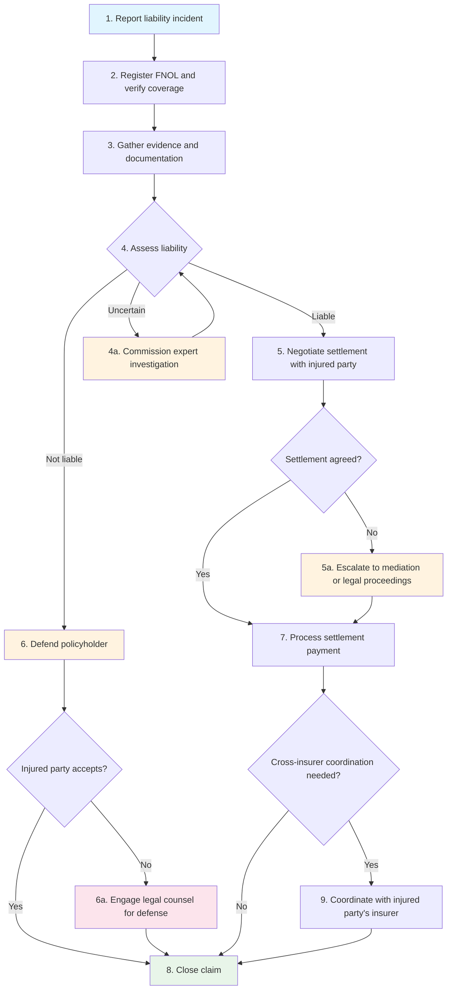
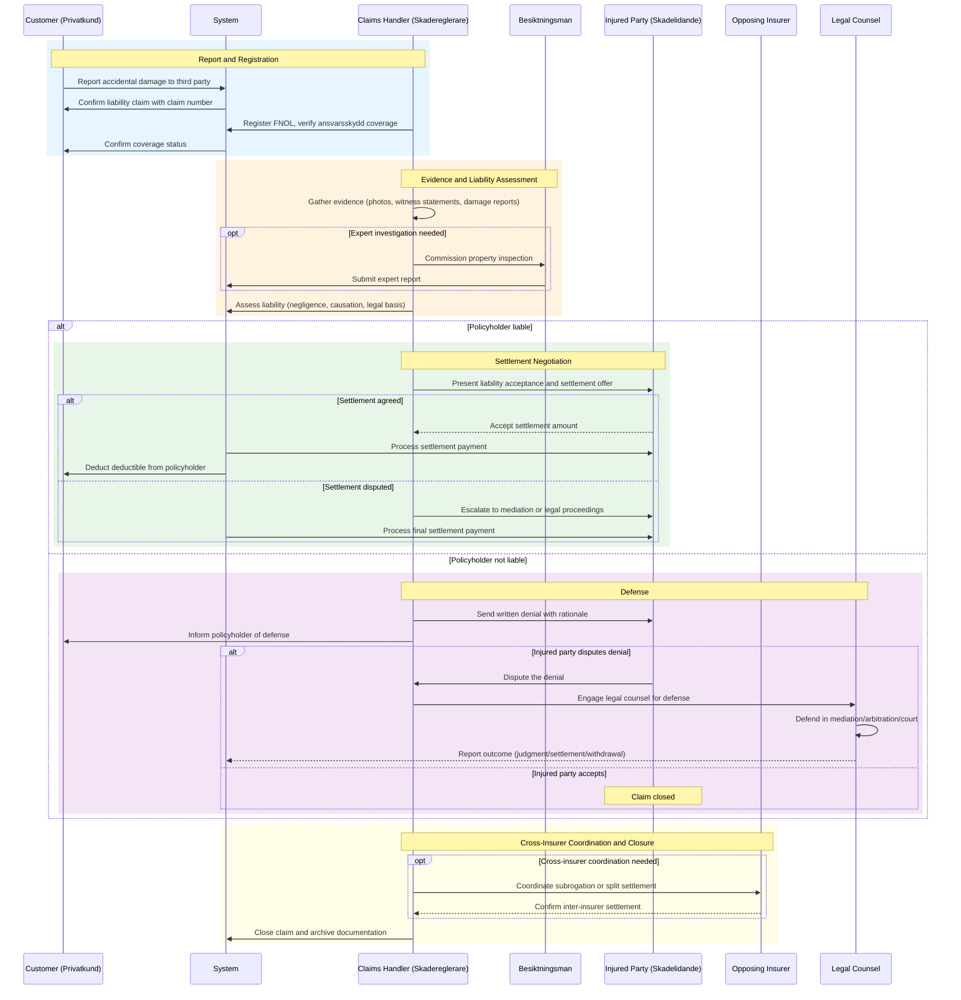
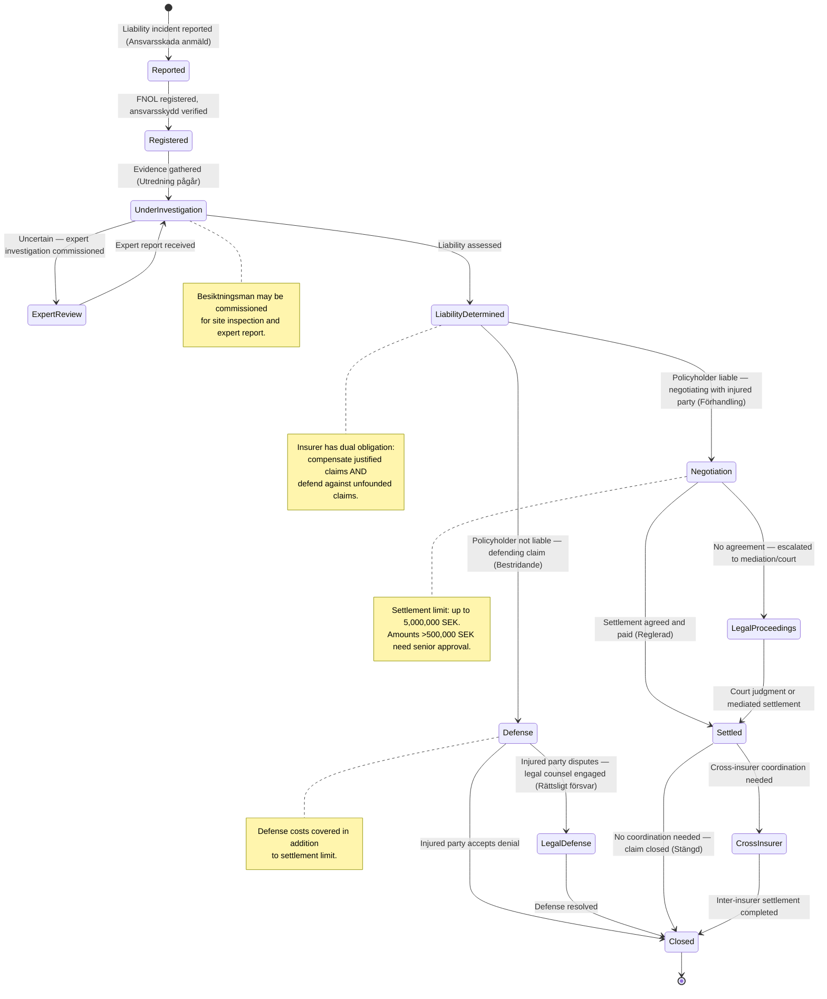

# UC-HCL-001: Liability Claim Assessment and Settlement

## Overview

This use case describes the end-to-end lifecycle of a liability claim
(ansvarsskydd) under home insurance — from initial report through liability
assessment, settlement negotiation or defense, cross-insurer coordination, and
closure. Ansvarsskydd covers damage the policyholder accidentally causes to
others, with typical coverage up to 5,000,000 SEK. The insurer has a dual
obligation: to compensate justified claims and to defend the policyholder
against unfounded claims.

## Actors

- **Primary:** [Customer (Privatkund)](../../actors/internal/customer.md),
  [Claims Handler (Skadereglerare)](../../actors/internal/claims-handler.md)
- **Supporting:** [Property Inspector
  (Besiktningsman)](../../actors/external/property-inspector.md), [BRF Board
  (BRF-styrelse)](../../actors/external/brf-board.md), Injured Party
  (Skadelidande), Opposing Insurer

## Preconditions

1. The policyholder holds an active home insurance policy (hemförsäkring,
   villahemförsäkring, or bostadsrättsförsäkring) with ansvarsskydd
2. An incident has occurred where the policyholder may have caused damage to a
   third party
3. The customer or the injured party has reported the incident

## Postconditions

**Success:**

- Liability has been assessed and documented
- If liable: settlement paid to injured party, policyholder's deductible
  collected
- If not liable: policyholder defended, injured party informed of denial
- Cross-insurer coordination completed (if applicable)
- Full claims file archived for regulatory retention

**Failure:**

- Claim denied due to policy exclusion (e.g., intentional act, business
  activity)
- Customer informed of denial reason and complaints procedure

## Process Flow

## Interaction Sequence

## State Lifecycle

## Main Flow (Liability Claim Assessment and Settlement)

| Step | Actor          | Action                                                                         | System Response                                                              | Reference                                                                                                          |
| ---- | -------------- | ------------------------------------------------------------------------------ | ---------------------------------------------------------------------------- | ------------------------------------------------------------------------------------------------------------------ |
| 1    | Customer       | Reports accidental damage caused to a third party via web, app, or phone       | Creates liability claim record, sends confirmation to customer               | [HCL-01](../user-stories/liability-and-legal.md#hcl-01-report-accidental-damage-caused-to-third-party)             |
| 2    | Claims Handler | Registers FNOL, verifies ansvarsskydd coverage and policy status               | Validates coverage, assigns claims handler, confirms coverage to customer    | [HCL-01](../user-stories/liability-and-legal.md#hcl-01-report-accidental-damage-caused-to-third-party)             |
| 3    | Claims Handler | Gathers evidence: incident details, photos, witness statements, damage reports | Records evidence, requests additional documentation if needed                | [HCL-02](../user-stories/liability-and-legal.md#hcl-02-assess-policyholder-legal-liability)                        |
| 4    | Claims Handler | Assesses liability based on evidence, negligence, and causation                | Records liability determination with legal basis                             | [HCL-02](../user-stories/liability-and-legal.md#hcl-02-assess-policyholder-legal-liability)                        |
| 5    | Claims Handler | Negotiates settlement amount with the injured party                            | Displays coverage limits, tracks negotiation, generates settlement agreement | [HCL-03](../user-stories/liability-and-legal.md#hcl-03-negotiate-settlement-with-injured-party)                    |
| 6    | Claims Handler | If not liable, sends written denial to injured party with rationale            | Records defense rationale, informs policyholder                              | [HCL-04](../user-stories/liability-and-legal.md#hcl-04-defend-policyholder-against-unfounded-claims)               |
| 7    | System         | Processes settlement payment to injured party, deducts deductible              | Records payment, updates claim status to "Settled"                           | [HCL-03](../user-stories/liability-and-legal.md#hcl-03-negotiate-settlement-with-injured-party)                    |
| 8    | Claims Handler | Closes claim and archives documentation                                        | Archives claim file, updates policyholder claims history                     | [HCL-09](../user-stories/liability-and-legal.md#hcl-09-identify-cross-insurance-coordination-for-liability-claims) |
| 9    | Claims Handler | Coordinates with injured party's insurer for subrogation or split settlement   | Records inter-insurer settlement, ensures no double payment                  | [HCL-09](../user-stories/liability-and-legal.md#hcl-09-identify-cross-insurance-coordination-for-liability-claims) |

## Alternative Flow: Expert Investigation Required

| Step | Actor          | Action                                                           | System Response                                       |
| ---- | -------------- | ---------------------------------------------------------------- | ----------------------------------------------------- |
| 4a.1 | Claims Handler | Determines expert investigation is needed (e.g., besiktningsman) | Creates referral, notifies expert                     |
| 4a.2 | Besiktningsman | Inspects site, produces expert report                            | Records report findings in claim file                 |
| 4a.3 | Claims Handler | Reviews expert report and completes liability assessment         | Updates liability determination based on expert input |

## Alternative Flow: BRF Liability Boundary

| Step | Actor          | Action                                                     | System Response                                                   |
| ---- | -------------- | ---------------------------------------------------------- | ----------------------------------------------------------------- |
| 4b.1 | Claims Handler | Identifies BRF property involvement                        | Presents BRF/individual liability boundary tool                   |
| 4b.2 | Claims Handler | Determines BRF vs individual responsibility per stadgar    | Records responsibility assignment with legal basis                |
| 4b.3 | Claims Handler | Routes claim to correct insurer (BRF or individual policy) | Updates claim routing, notifies relevant insurer and policyholder |

## Alternative Flow: High-Value Settlement

| Step | Actor                 | Action                                                | System Response                                          |
| ---- | --------------------- | ----------------------------------------------------- | -------------------------------------------------------- |
| 5a.1 | Claims Handler        | Submits settlement exceeding threshold (>500,000 SEK) | Flags for senior approval, blocks payment                |
| 5a.2 | Senior Claims Handler | Reviews and approves or adjusts the settlement amount | Records senior approval, releases payment for processing |

## Alternative Flow: Multiple Injured Parties

| Step | Actor          | Action                                                     | System Response                                              |
| ---- | -------------- | ---------------------------------------------------------- | ------------------------------------------------------------ |
| 5b.1 | Claims Handler | Identifies multiple injured parties from the same incident | Creates linked sub-claims for each injured party             |
| 5b.2 | Claims Handler | Negotiates settlement with each party individually         | Tracks aggregate against liability limit, alerts if near cap |
| 5b.3 | System         | Processes payments to each injured party                   | Records individual and aggregate settlements                 |

## Exception Flow: Injured Party Disputes Denial

| Step | Actor          | Action                                                   | System Response                                    |
| ---- | -------------- | -------------------------------------------------------- | -------------------------------------------------- |
| 6a.1 | Injured Party  | Disputes the liability denial                            | Records dispute, notifies claims handler           |
| 6a.2 | Claims Handler | Evaluates whether to engage legal counsel for defense    | Creates defense authorization record               |
| 6a.3 | Legal Counsel  | Defends policyholder in mediation, arbitration, or court | Tracks legal costs, updates claim with proceedings |
| 6a.4 | System         | Records outcome (judgment, settlement, or withdrawal)    | Processes any court-ordered payment, closes claim  |

## Exception Flow: Liability Limit Exceeded

| Step | Actor          | Action                                                      | System Response                                         |
| ---- | -------------- | ----------------------------------------------------------- | ------------------------------------------------------- |
| 5c.1 | Claims Handler | Identifies that aggregate claims exceed the liability limit | Alerts handler and policyholder of coverage exhaustion  |
| 5c.2 | Claims Handler | Informs injured parties that remaining costs are uninsured  | Records cap application, refers policyholder for advice |

## Validation Rules

| Rule       | Description                                                        |
| ---------- | ------------------------------------------------------------------ |
| VR-HCL-001 | Incident date must not be in the future                            |
| VR-HCL-002 | Incident date must fall within the policy's active coverage period |
| VR-HCL-003 | Ansvarsskydd must be included in the customer's coverage tier      |
| VR-HCL-004 | Settlement amount must not exceed the policy's liability limit     |
| VR-HCL-005 | High-value settlements require senior claims handler approval      |
| VR-HCL-006 | Intentional acts are excluded from liability coverage              |
| VR-HCL-007 | All liability determinations must include a documented legal basis |

## Business Rules

| Rule       | Description                                                                                                  |
| ---------- | ------------------------------------------------------------------------------------------------------------ |
| BR-HCL-001 | The insurer must both compensate justified claims and defend against unfounded claims (dual obligation)      |
| BR-HCL-002 | Settlement amounts exceeding 500,000 SEK require senior claims handler approval                              |
| BR-HCL-003 | The policyholder must not admit liability or make payments to the injured party without insurer approval     |
| BR-HCL-004 | Cross-insurer coordination must ensure the injured party receives full compensation without double payment   |
| BR-HCL-005 | BRF/individual liability boundary follows bostadsrättslagen unless BRF stadgar specify otherwise             |
| BR-HCL-006 | Defense costs (legal counsel, court fees) are covered under ansvarsskydd in addition to the settlement limit |

## External Integrations

| System                                  | Purpose                                     | Data Exchanged                                         |
| --------------------------------------- | ------------------------------------------- | ------------------------------------------------------ |
| GSR (Gemensamt Skadeanmälningsregister) | Claims register for fraud prevention        | Claim details, policyholder and injured party identity |
| Opposing insurer                        | Cross-insurer coordination and subrogation  | Claim details, liability determination, settlement     |
| Payment provider                        | Settlement payment to injured party         | Payment amount, recipient details                      |
| Legal counsel network                   | Defense representation for the policyholder | Case details, legal costs, proceedings                 |

## Regulatory

- **FSA-005** — Fair settlement: liability claims must be assessed objectively;
  the insurer must compensate justified claims and defend against unfounded ones
- **FSA-003** — Timely claims handling: the entire liability claim lifecycle
  must proceed without undue delay
- **FSA-009** — Complaints handling: both the policyholder and the injured party
  must be informed of the complaints procedure
- **FSA-014** — Record keeping: the complete claims file must be retained for
  10 years
- **GDPR-007** — Personal data of the policyholder and injured party must be
  processed in accordance with Article 6(1)(b) and 6(1)(f); data shared with
  opposing insurers must be limited to what is necessary
- **IDD-011** — The customer must receive adequate advice on the scope and
  limitations of ansvarsskydd

## Related User Stories

- [HCL-01](../user-stories/liability-and-legal.md#hcl-01-report-accidental-damage-caused-to-third-party) — Report Accidental Damage Caused to Third Party
- [HCL-02](../user-stories/liability-and-legal.md#hcl-02-assess-policyholder-legal-liability) — Assess Policyholder Legal Liability
- [HCL-03](../user-stories/liability-and-legal.md#hcl-03-negotiate-settlement-with-injured-party) — Negotiate Settlement with Injured Party
- [HCL-04](../user-stories/liability-and-legal.md#hcl-04-defend-policyholder-against-unfounded-claims) — Defend Policyholder Against Unfounded Claims
- [HCL-09](../user-stories/liability-and-legal.md#hcl-09-identify-cross-insurance-coordination-for-liability-claims) — Identify Cross-Insurance Coordination
- [HCL-10](../user-stories/liability-and-legal.md#hcl-10-determine-brf-liability-vs-individual-liability) — Determine BRF Liability vs Individual Liability
