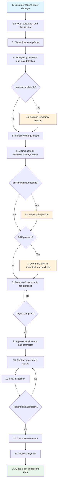
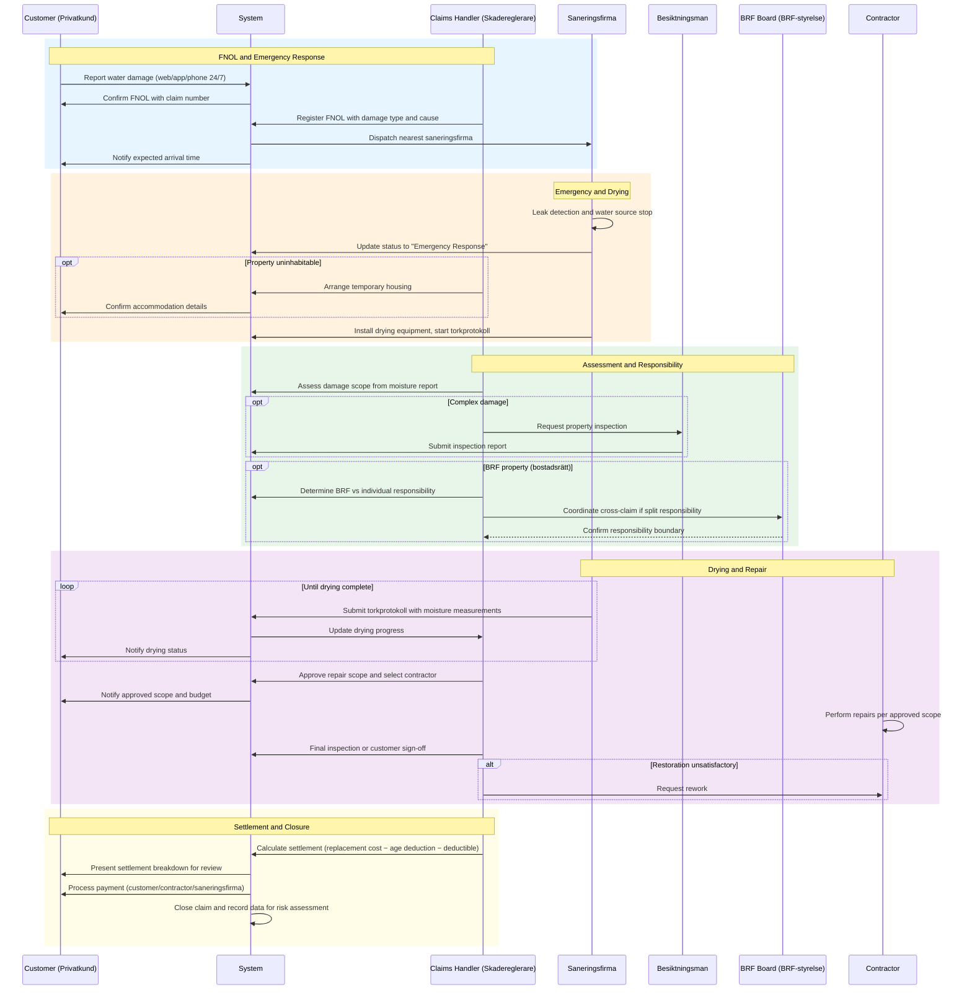

# UC-HCW-001: Water Damage Claim Lifecycle

## Overview

This use case describes the end-to-end lifecycle of a water damage (vattenskada) claim — from FNOL through emergency response, drying, repair, settlement, and closure. Water damage is the most common home insurance claim in Sweden (~100,000 per year) with a unique lifecycle involving restoration companies, drying protocols, BRF/individual responsibility determination, and complex multi-party settlement coordination.

## Actors

- **Primary:** [Customer (Privatkund)](../../actors/internal/customer.md), [Claims Handler (Skadereglerare)](../../actors/internal/claims-handler.md)
- **Supporting:** [Restoration Company (Saneringsfirma)](../../actors/external/restoration-company.md), [Property Inspector (Besiktningsman)](../../actors/external/property-inspector.md), [BRF Board (BRF-styrelse)](../../actors/external/brf-board.md)

## Preconditions

1. The customer holds an active home insurance policy (hemförsäkring, villahemförsäkring, or bostadsrättsförsäkring) with TryggFörsäkring
2. A water damage event has occurred at the insured property
3. The customer has access to the web portal, mobile app, or claims phone line

## Postconditions

**Success:**

- Claim is settled and closed with full documentation
- Property has been dried and restored to pre-damage condition
- Customer has received the settlement amount (minus deductible and age deductions)
- BRF/individual responsibility has been determined and cross-claim coordination completed (if applicable)
- Drying protocols, inspection reports, and settlement calculations are archived
- Claims data has been recorded for underwriting risk assessment

**Failure:**

- Claim is denied with documented reason (e.g., excluded cause, lapsed policy)
- Customer has been informed of the denial reason and complaints procedure
- Emergency response and drying may still proceed under reservation pending investigation

## Process Flow

## Interaction Sequence

## Main Flow (Water Damage Claim Lifecycle)

| Step | Actor          | Action                                                                       | System Response                                                       | Reference                                                        |
| ---- | -------------- | ---------------------------------------------------------------------------- | --------------------------------------------------------------------- | ---------------------------------------------------------------- |
| 1    | Customer       | Reports water damage via web, app, or phone (available 24/7)                 | Creates FNOL record with claim number, sends confirmation to customer | [US-HCW-001](../user-stories/water-damage-fnol.md)               |
| 2    | Claims Handler | Registers FNOL with damage type, location, and suspected cause               | Validates coverage, categorizes claim, assigns claims handler         | [US-HCW-003](../user-stories/water-damage-registration.md)       |
| 3    | System         | Dispatches nearest available saneringsfirma under framework agreement        | Records dispatch time, notifies customer of expected arrival          | [US-HCW-002](../user-stories/water-damage-dispatch.md)           |
| 4    | Saneringsfirma | Performs leak detection, stops water source, removes standing water          | Records arrival time, updates claim status to "Emergency Response"    | [US-HCW-002](../user-stories/water-damage-dispatch.md)           |
| 5    | Saneringsfirma | Installs drying equipment and begins torkprotokoll (drying protocol)         | Records equipment placement, starts drying timeline                   | [US-HCW-008](../user-stories/water-damage-drying-protocol.md)    |
| 6    | Claims Handler | Assesses damage scope using saneringsfirma's moisture measurement report     | Displays moisture readings, affected area, and cost estimate          | [US-HCW-004](../user-stories/water-damage-moisture-report.md)    |
| 7    | Claims Handler | Determines coverage responsibility: individual vs BRF (for bostadsrätt)      | Presents responsibility boundary tool, records determination          | [US-HCW-005](../user-stories/water-damage-brf-responsibility.md) |
| 8    | Saneringsfirma | Submits periodic torkprotokoll with moisture measurements                    | Updates drying progress, notifies handler and customer                | [US-HCW-008](../user-stories/water-damage-drying-protocol.md)    |
| 9    | Claims Handler | Approves repair scope and selects contractor once drying is complete         | Records approved scope and budget, notifies customer                  | [US-HCW-009](../user-stories/water-damage-repair-approval.md)    |
| 10   | Contractor     | Performs repairs per approved scope                                          | Tracks repair progress, updates claim timeline                        | [US-HCW-009](../user-stories/water-damage-repair-approval.md)    |
| 11   | Claims Handler | Verifies restoration is complete via final inspection or customer sign-off   | Records inspection results and customer acceptance                    | [US-HCW-014](../user-stories/water-damage-final-inspection.md)   |
| 12   | Claims Handler | Calculates settlement: replacement cost minus age deduction minus deductible | Generates settlement breakdown for customer review                    | [US-HCW-011](../user-stories/water-damage-settlement.md)         |
| 13   | System         | Processes payment to customer, contractor, and/or saneringsfirma             | Records payment details, updates claim status to "Settled"            | [US-HCW-011](../user-stories/water-damage-settlement.md)         |
| 14   | System         | Closes claim and records data for risk assessment                            | Archives claim file, updates property claims history                  | [US-HCW-015](../user-stories/water-damage-closure.md)            |

## Alternative Flow: Emergency After Hours

| Step | Actor             | Action                                                       | System Response                                                   |
| ---- | ----------------- | ------------------------------------------------------------ | ----------------------------------------------------------------- |
| 1a.1 | Customer          | Reports water damage outside business hours via phone or app | Routes to 24/7 emergency service                                  |
| 1a.2 | Emergency Service | Takes FNOL details and dispatches saneringsfirma directly    | Creates preliminary claim record, dispatches with urgent priority |
| 1a.3 | Claims Handler    | Reviews and completes FNOL registration next business day    | Validates and finalizes the claim record                          |

## Alternative Flow: Severe Damage — Temporary Housing

| Step | Actor                   | Action                                                | System Response                                               |
| ---- | ----------------------- | ----------------------------------------------------- | ------------------------------------------------------------- |
| 4a.1 | Customer/Saneringsfirma | Reports that the property is uninhabitable            | Claims handler is notified of housing need                    |
| 4a.2 | Claims Handler          | Approves temporary housing and arranges accommodation | Creates housing order, books accommodation, notifies customer |
| 4a.3 | System                  | Tracks temporary housing costs for settlement         | Accumulates daily costs against policy limits                 |
| 4a.4 | Claims Handler          | Ends temporary housing when property is restored      | Records total housing cost, includes in settlement            |

## Alternative Flow: Construction Defect (Dolda Fel)

| Step | Actor          | Action                                                                  | System Response                                        |
| ---- | -------------- | ----------------------------------------------------------------------- | ------------------------------------------------------ |
| 6a.1 | Besiktningsman | Identifies construction defect as damage cause                          | Records defect finding in inspection report            |
| 6a.2 | Claims Handler | Determines that subrogation may apply against seller or builder         | Flags claim for subrogation assessment                 |
| 6a.3 | Claims Handler | Processes customer claim normally while pursuing subrogation separately | Tracks subrogation separately from customer settlement |

## Alternative Flow: BRF/Individual Boundary Dispute

| Step | Actor                 | Action                                                      | System Response                                 |
| ---- | --------------------- | ----------------------------------------------------------- | ----------------------------------------------- |
| 7a.1 | Claims Handler        | Cannot determine responsibility due to ambiguous boundary   | Escalates to senior claims handler              |
| 7a.2 | Senior Claims Handler | Reviews BRF stadgar and engages besiktningsman if needed    | Records determination with documented rationale |
| 7a.3 | Claims Handler        | If dispute persists, informs customer of complaints process | Records dispute and FSA-compliant communication |

## Alternative Flow: Multi-Apartment Damage

| Step | Actor          | Action                                                      | System Response                                             |
| ---- | -------------- | ----------------------------------------------------------- | ----------------------------------------------------------- |
| 7b.1 | Claims Handler | Identifies that multiple apartments in the BRF are affected | Creates linked claims for each affected apartment           |
| 7b.2 | Claims Handler | Assigns a lead handler for the coordinated claim group      | Links all sub-claims to a parent coordination record        |
| 7b.3 | System         | Coordinates drying and repair across all affected units     | Tracks progress per unit while maintaining overall timeline |

## Exception Flow: Repair Cost Exceeds Threshold

| Step | Actor                 | Action                                               | System Response                                           |
| ---- | --------------------- | ---------------------------------------------------- | --------------------------------------------------------- |
| 9a.1 | Claims Handler        | Submits repair scope that exceeds approval threshold | Flags for senior approval, blocks contractor notification |
| 9a.2 | Senior Claims Handler | Reviews and approves or adjusts the repair scope     | Records senior approval, releases repair to proceed       |

## Exception Flow: Customer Disputes Settlement

| Step  | Actor          | Action                                                      | System Response                                          |
| ----- | -------------- | ----------------------------------------------------------- | -------------------------------------------------------- |
| 12a.1 | Customer       | Disputes the settlement amount (e.g., age deduction, scope) | Records dispute, pauses payment                          |
| 12a.2 | Claims Handler | Reviews dispute and recalculates or escalates               | Updates settlement if justified, or refers to complaints |
| 12a.3 | System         | If unresolved, directs customer to FSA complaints process   | Records complaint referral                               |

## Validation Rules

| Rule       | Description                                                        |
| ---------- | ------------------------------------------------------------------ |
| VR-HCW-001 | Incident date must not be in the future                            |
| VR-HCW-002 | Incident date must fall within the policy's active coverage period |
| VR-HCW-003 | Property address must match the insured property on the policy     |
| VR-HCW-004 | Damage cause must be a covered peril under the policy terms        |
| VR-HCW-005 | Drying must be verified complete before repair phase can begin     |
| VR-HCW-006 | Repair cost exceeding threshold requires senior approval           |
| VR-HCW-007 | All required documentation must be complete before claim closure   |

## Data Model

### WaterDamageClaim

| Field               | Type      | Required       | Description                                                                           |
| ------------------- | --------- | -------------- | ------------------------------------------------------------------------------------- |
| claimId             | String    | Auto-generated | Unique claim identifier (skadenummer)                                                 |
| policyId            | Reference | Yes            | Link to the insured policy                                                            |
| damageDate          | Date      | Yes            | Date water damage was discovered                                                      |
| reportDate          | Timestamp | Auto-set       | Date and time of FNOL submission                                                      |
| causeCategory       | Enum      | Yes            | Burst pipe, appliance leak, membrane failure, frozen pipes, roof leak, external water |
| affectedRooms       | String[]  | Yes            | List of affected rooms                                                                |
| propertyType        | Enum      | Yes            | Villa, bostadsrätt, hyresrätt                                                         |
| brfInvolved         | Boolean   | Yes            | Whether BRF coordination is required                                                  |
| brfPolicyId         | Reference | Conditional    | BRF building insurance policy (if applicable)                                         |
| responsibilitySplit | Object    | Conditional    | BRF vs individual percentage or line-item split                                       |
| estimatedCost       | Currency  | No             | Initial cost estimate                                                                 |
| totalClaimCost      | Currency  | Calculated     | Final total cost (drying + repair + housing)                                          |
| status              | Enum      | Auto-set       | Emergency Reported, Registered, Drying, Repair, Settled, Closed                       |
| assignedHandler     | Reference | Auto-set       | Claims handler assigned to the claim                                                  |

### RestorationOrder

| Field           | Type      | Required       | Description                              |
| --------------- | --------- | -------------- | ---------------------------------------- |
| orderId         | String    | Auto-generated | Unique restoration order identifier      |
| claimId         | Reference | Yes            | Link to the water damage claim           |
| saneringsfirma  | String    | Yes            | Name of the assigned restoration company |
| dispatchTime    | Timestamp | Yes            | When the company was dispatched          |
| arrivalTime     | Timestamp | No             | When the company arrived on site         |
| dryingStartDate | Date      | No             | When drying equipment was installed      |
| dryingEndDate   | Date      | No             | When drying was completed                |
| totalDryingCost | Currency  | Calculated     | Total cost for drying services           |

### DryingProtocol (Torkprotokoll)

| Field              | Type      | Required       | Description                                      |
| ------------------ | --------- | -------------- | ------------------------------------------------ |
| protocolId         | String    | Auto-generated | Unique protocol identifier                       |
| restorationOrderId | Reference | Yes            | Link to the restoration order                    |
| measurementDate    | Date      | Yes            | Date measurements were taken                     |
| moistureLevels     | Object[]  | Yes            | Room-by-room moisture readings                   |
| equipmentUsed      | Object[]  | Yes            | Drying equipment in use                          |
| dryingAssessment   | Enum      | Yes            | On track, delayed, complete, reassessment needed |
| technicianNotes    | Text      | No             | Observations and recommendations                 |

### TemporaryHousing

| Field             | Type      | Required       | Description                               |
| ----------------- | --------- | -------------- | ----------------------------------------- |
| housingId         | String    | Auto-generated | Unique housing record identifier          |
| claimId           | Reference | Yes            | Link to the water damage claim            |
| startDate         | Date      | Yes            | Temporary housing start date              |
| endDate           | Date      | No             | End date (updated on completion)          |
| accommodationType | Enum      | Yes            | Hotel, furnished apartment, extended-stay |
| dailyCost         | Currency  | Yes            | Daily accommodation cost                  |
| totalCost         | Currency  | Calculated     | Total accumulated housing cost            |

## Business Rules

| Rule       | Description                                                                                                    |
| ---------- | -------------------------------------------------------------------------------------------------------------- |
| BR-HCW-001 | Saneringsfirma must be dispatched within 2 hours for urgent cases (water still flowing)                        |
| BR-HCW-002 | Drying must be verified complete (moisture within acceptable limits) before repair phase begins                |
| BR-HCW-003 | Age deduction (åldersavdrag) is applied per the insurer's published tables based on material type and age      |
| BR-HCW-004 | BRF responsibility follows bostadsrättslagen unless the BRF's stadgar specify otherwise                        |
| BR-HCW-005 | Repair costs exceeding SEK 200,000 require senior claims handler approval                                      |
| BR-HCW-006 | Temporary housing is covered for the duration of restoration, subject to policy coverage limits                |
| BR-HCW-007 | The customer must not be left out of pocket for covered portions while cross-claim coordination is in progress |

## External Integrations

| System                              | Purpose                                                  | Data Exchanged                                                |
| ----------------------------------- | -------------------------------------------------------- | ------------------------------------------------------------- |
| Saneringsfirma API (Polygon/BELFOR) | Dispatch, status updates, torkprotokoll submission       | Dispatch orders, moisture reports, cost estimates             |
| BRF building insurer                | Cross-claim coordination for split-responsibility claims | Claim details, responsibility determination, settlement split |
| Temporary housing provider          | Accommodation booking for uninhabitable properties       | Booking requests, availability, cost confirmation             |

## Regulatory

- **FSA-010** — Fair and timely claims settlement: the entire claims lifecycle must proceed without undue delay; SLAs must be tracked
- **FSA-004** — Consumer protection: the customer must receive clear communication at each stage of the process
- **FSA-011** — Complaints handling: the customer must be informed of the complaints procedure if they dispute any aspect of the claim
- **FSA-014** — Record keeping: the complete claims file (FNOL, moisture reports, torkprotokoll, inspection reports, settlement calculations, payments) must be retained for 10 years
- **FSA-005** — Product governance: claims data must be available for product reviews
- **GDPR-003** — Claims processing: personal data shared with saneringsfirma, besiktningsman, and housing providers must be limited to what is necessary and covered by data processing agreements
- **GDPR-006** — Fraud detection: unusual claim patterns (frequency, cost, timing) may trigger fraud screening

## Related User Stories

- [US-HCW-001](../user-stories/water-damage-fnol.md) — Report Water Damage Emergency (24/7)
- [US-HCW-002](../user-stories/water-damage-dispatch.md) — Dispatch Restoration Company
- [US-HCW-003](../user-stories/water-damage-registration.md) — Register FNOL With Damage Classification
- [US-HCW-004](../user-stories/water-damage-moisture-report.md) — Receive Moisture Measurement Report
- [US-HCW-005](../user-stories/water-damage-brf-responsibility.md) — Determine BRF vs Individual Responsibility
- [US-HCW-006](../user-stories/water-damage-inspection.md) — Document Damage With Inspection
- [US-HCW-007](../user-stories/water-damage-drying-progress.md) — Track Drying Progress
- [US-HCW-008](../user-stories/water-damage-drying-protocol.md) — Submit Drying Protocol (Torkprotokoll)
- [US-HCW-009](../user-stories/water-damage-repair-approval.md) — Approve Repair Scope and Contractor
- [US-HCW-010](../user-stories/water-damage-temporary-housing.md) — Arrange Temporary Housing
- [US-HCW-011](../user-stories/water-damage-settlement.md) — Calculate Settlement With Age Deduction
- [US-HCW-012](../user-stories/water-damage-deductible.md) — View Deductible for Claim
- [US-HCW-013](../user-stories/water-damage-cross-claim.md) — Coordinate Cross-Claim Payment
- [US-HCW-014](../user-stories/water-damage-final-inspection.md) — Verify Restoration via Final Inspection
- [US-HCW-015](../user-stories/water-damage-closure.md) — Close Claim and Record for Risk Assessment
