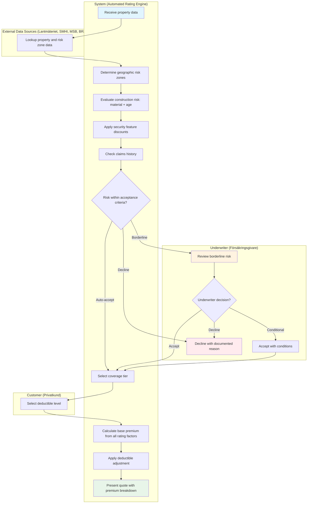

# Use Case: Home Insurance Risk Assessment and Pricing

End-to-end use case for home & property insurance underwriting at
TryggFörsäkring. Covers the complete risk assessment and pricing flow from
property data collection through geographic risk zone determination,
construction evaluation, security feature discounts, claims history analysis,
coverage tier selection, deductible choice, and premium calculation. Includes
automatic acceptance, referral to underwriter review, and risk declination
pathways. Integrates with SMHI, MSB, BRÅ, and Lantmäteriet for authoritative
risk data.

## Use Case Summary

| Field                | Value                                                                              |
| -------------------- | ---------------------------------------------------------------------------------- |
| **Use Case ID**      | UC-HUW-001                                                                         |
| **Name**             | Home Insurance Risk Assessment and Pricing                                         |
| **Primary Actor**    | System (automated rating engine)                                                   |
| **Secondary Actors** | Underwriter (Försäkringsgivare), Customer (Privatkund), Customer Service Agent     |
| **Goal**             | Assess property risk and calculate an accurate, fair premium for home insurance    |
| **Preconditions**    | Customer has provided a valid Swedish property address and selected a product type |
| **Postconditions**   | Premium quote issued, or risk referred to underwriter, or risk declined            |
| **Trigger**          | Customer submits property details as part of the quote-and-bind flow (UC-HQB-001)  |

## Stakeholders and Interests

| Stakeholder            | Interest                                                               |
| ---------------------- | ---------------------------------------------------------------------- |
| Customer               | Fair, transparent pricing; quick quote; understanding of premium basis |
| Underwriter            | Accurate risk classification; consistent pricing; manageable referrals |
| Customer Service Agent | Clear premium explanation for phone-based advisory                     |
| Compliance Officer     | Fair pricing principles; non-discrimination; regulatory traceability   |
| TryggFörsäkring        | Profitable portfolio; accurate risk selection; regulatory compliance   |
| SMHI                   | Appropriate use of climate and flood risk data                         |
| MSB                    | Appropriate use of risk zone mapping data                              |
| BRÅ                    | Appropriate use of crime statistics                                    |
| Lantmäteriet           | Accurate use of property registry data                                 |

## Process Flow

## Main Success Scenario

### 1. Property Data Collection

1. System receives property data from the quote-and-bind flow: address, product
   type (hemförsäkring, villahemförsäkring, bostadsrättsförsäkring,
   fritidshusförsäkring), living area (m²), and household details
2. System queries Lantmäteriet for property registry data: building type,
   construction year, construction material, property size
3. System geocodes the property address for geographic risk assessment

### 2. Geographic Risk Zone Determination

1. System queries SMHI and MSB for the property's flood risk zone classification
2. System queries BRÅ for the area's crime rate classification
3. System checks MSB geological data for subsidence risk
4. System assigns a composite geographic risk score based on the three zone
   classifications (flood, crime, subsidence)
5. Each zone factor and its loading percentage are recorded in the rating factor
   breakdown

### 3. Construction Risk Evaluation

1. System evaluates fire risk based on construction material:
   - Trä (wood): highest fire risk loading
   - Sten (stone/brick): moderate fire risk loading
   - Betong (concrete): lowest fire risk loading
2. System evaluates age-related risk based on building age bands:
   - 0–10 years: lowest loading
   - 11–30 years: low loading
   - 31–50 years: moderate loading
   - 51–100 years: high loading
   - Over 100 years: highest loading, requires besiktningsprotokoll
3. If a recent major renovation is documented, the effective age for renovated
   components is adjusted downward
4. Construction factors are recorded in the rating factor breakdown

### 4. Security Feature Discount Application

1. System checks the customer's declared security features: alarm type, water
   shutoff system, sprinkler system
2. System applies applicable discounts:
   - Alarm (local): 5% discount on burglary + fire
   - Alarm (monitored): 10% discount on burglary + fire
   - Alarm (connected to emergency): 15% discount on burglary + fire
   - Water shutoff (automatic): 5–10% discount on water damage
   - Sprinkler: 10–20% discount on fire damage
3. Combined discounts are capped at the maximum total security discount
   (configurable, default 30%)
4. Security discounts are recorded in the rating factor breakdown

### 5. Claims History Assessment

1. System retrieves the customer's claims history for the past 5 years from
   internal claims data
2. System applies the claims loading factor:
   - 0 claims: no loading (base premium)
   - 1 claim: +5–10% loading
   - 2 claims: +15–25% loading
   - 3+ claims: route to senior underwriter for manual review
3. For new customers with no internal history, the system accepts a claims-free
   declaration
4. Claims loading is recorded in the rating factor breakdown

### 6. Risk Acceptance Evaluation

1. System evaluates the combined risk profile against the acceptance criteria
   matrix
2. If the property meets all auto-accept criteria, processing continues to
   coverage tier selection (step 7)
3. If borderline criteria are met, the case is referred to underwriter review
   (extension 6a)
4. If declination criteria are met, the risk is declined (extension 6b)

### 7. Coverage Tier and Deductible Selection

1. System presents the three coverage tiers (bas/standard/premium) with:
   - Included and excluded perils for each tier
   - Sub-limit amounts per item category
   - Default deductible for each tier
   - Annual premium for each tier based on the calculated risk factors
2. Customer selects a coverage tier
3. System presents the available deductible (självrisk) options with premium
   impact:
   - Låg (1 500 SEK): +15% premium
   - Standard (3 000 SEK): base premium
   - Hög (6 000 SEK): -10% premium
   - Mycket hög (10 000 SEK): -18% premium
4. Customer selects a deductible level

### 8. Premium Calculation and Quote Presentation

1. System calculates the final premium using all rating factors:
   - Base rate for the product type and living area
   - Geographic zone loadings (flood, crime, subsidence)
   - Construction type factor
   - Building age factor
   - Security feature discounts
   - Claims history loading
   - Coverage tier adjustment
   - Deductible adjustment
2. System generates a premium breakdown showing each factor's contribution
3. System presents the quote to the customer with the total annual premium,
   monthly payment option, and the detailed breakdown
4. For BRF products, the system adjusts the premium to account for the BRF's
   collective building insurance (no building component in individual premium)

## Extensions (Alternative Flows)

### 1a. Property Data Unavailable from Lantmäteriet

1. Lantmäteriet lookup fails or returns incomplete data
2. System prompts the customer for manual property data entry (construction
   year, material, building size)
3. System flags the case for underwriter review due to unverified property data
4. Flow continues from step 2

### 2a. Property in Very High Flood Risk Zone

1. System determines the property is in the highest MSB flood risk zone
2. Based on the configured risk acceptance rules, the system either:
   - Declines the quote with a flood risk explanation, or
   - Applies an exclusion for flood damage and continues with remaining
     coverages
3. If declined, flow moves to extension 6b
4. If exclusion applied, the quote clearly states the flood exclusion and flow
   continues from step 3

### 3a. Building Over 100 Years Old

1. System detects building age exceeds 100 years
2. System requires a besiktningsprotokoll (inspection report) before the quote
   can be finalized
3. If the customer uploads an approved inspection report, the underwriter
   reviews it and may accept, accept with conditions, or decline
4. If no report is available, the quote is suspended pending inspection

### 5a. Three or More Claims in Past 5 Years

1. System detects 3 or more claims in the customer's history
2. Case is routed to a senior underwriter for manual review
3. Senior underwriter assesses whether the claims pattern indicates ongoing
   risk or isolated incidents
4. Underwriter decides: accept with increased loading, accept with conditions
   (e.g., required security improvements), or decline
5. Flow continues based on underwriter decision

### 6a. Borderline Risk — Underwriter Referral

1. The combined risk score exceeds the auto-accept threshold but does not meet
   declination criteria
2. Case enters the underwriter review queue with a full risk factor summary
3. Underwriter reviews and decides:
   - **Accept at standard terms** — flow continues from step 7
   - **Accept with conditions** — conditions are added to the quote (e.g.,
     increased deductible, coverage exclusions, required property improvements)
     and flow continues from step 7
   - **Decline** — flow moves to extension 6b
4. If the review exceeds the SLA (2 business days), the case is escalated to a
   senior underwriter

### 6b. Risk Declined

1. System or underwriter determines the risk is outside the company's appetite
2. Declination is recorded with a documented reason
3. Customer is notified with a clear explanation of the declination reason
4. The declination record is retained for regulatory audit purposes
5. Flow ends

### 8a. BRF Product — Adjust for Shared Building Insurance

1. System detects the product type is bostadsrättsförsäkring
2. System excludes the building insurance component (covered by the BRF's
   collective building policy)
3. Premium is calculated based on contents coverage, liability,
   bostadsrättstillägg (interior fittings), and selected add-ons
4. System notes the BRF adjustment in the premium breakdown
5. Flow continues from step 8.2

## Business Rules

| Rule ID   | Rule                                                                                         |
| --------- | -------------------------------------------------------------------------------------------- |
| BR-HUW-01 | Geographic risk zones are determined by external authoritative sources (SMHI, MSB, BRÅ)      |
| BR-HUW-02 | Construction material affects fire risk loading: trä > sten > betong                         |
| BR-HUW-03 | Building age bands affect water damage and electrical fire risk loading                      |
| BR-HUW-04 | Buildings over 100 years require besiktningsprotokoll for underwriting                       |
| BR-HUW-05 | Security feature discounts are cumulative but capped at the configured maximum (default 30%) |
| BR-HUW-06 | Claims history loading is based on the past 5 years                                          |
| BR-HUW-07 | Three or more claims in 5 years require senior underwriter review                            |
| BR-HUW-08 | Risk acceptance criteria are evaluated before coverage tier selection                        |
| BR-HUW-09 | Underwriter referral SLA is 2 business days; breach triggers escalation                      |
| BR-HUW-10 | BRF products exclude the building insurance component from individual premium                |
| BR-HUW-11 | Deductible adjustment is applied after all other rating factors                              |
| BR-HUW-12 | Sub-limits apply per item category per tier; premium tier removes standard sub-limits        |
| BR-HUW-13 | Declination decisions must be documented with reason and retained for audit                  |
| BR-HUW-14 | External risk data fallback to cached data (max 30 days) when live sources are unavailable   |
| BR-HUW-15 | Premium calculation must use the tariff version effective on the requested policy start date |

## Non-functional Requirements

| Requirement                 | Target                                                                 |
| --------------------------- | ---------------------------------------------------------------------- |
| Premium calculation speed   | Under 3 seconds for standard risk profiles                             |
| Lantmäteriet lookup         | Response within 2 seconds; fallback to manual entry on timeout         |
| SMHI/MSB/BRÅ data refresh   | Updated on published schedule (quarterly/annually per source)          |
| External data cache         | Maximum cache age 30 days; configurable per source                     |
| Underwriter review SLA      | 2 business days from referral to decision                              |
| Audit trail                 | All rating factors, decisions, and data sources logged with timestamps |
| Availability                | Quote system available 24/7 for automatic risk profiles                |
| Data retention              | Underwriting decisions retained for 10 years per FSA-014               |
| Concurrent quote processing | System handles 100+ concurrent quote calculations without degradation  |

## Regulatory Compliance Summary

| Regulation   | Requirements Addressed                                                              |
| ------------ | ----------------------------------------------------------------------------------- |
| **FSA-004**  | Transparent pricing; clear communication of premium factors and declination reasons |
| **FSA-005**  | Fair, consistent pricing; non-discrimination; product governance                    |
| **FSA-012**  | Pre-contractual disclosure of coverage scope, exclusions, and sub-limits            |
| **FSA-015**  | Product suitability; mandatory coverage components in all tiers                     |
| **FSA-016**  | Adequate building valuation; construction-based risk assessment                     |
| **GDPR-007** | Property data processed under contract performance and legitimate interest;         |
|              | geospatial data aggregated at zone level; customer right to understand              |
|              | automated decisions                                                                 |
| **IDD-011**  | Demands-and-needs assessment determines appropriate tier and deductible             |
| **IDD-012**  | Risk-based pricing transparency; coverage gap disclosure between tiers              |

## Related User Stories

- [HUW-01: Assess Risk Based on Geographic Location](../user-stories/underwriting-rules.md#huw-01-assess-risk-based-on-geographic-location)
- [HUW-02: Evaluate Construction Type and Building Age](../user-stories/underwriting-rules.md#huw-02-evaluate-construction-type-and-building-age)
- [HUW-03: Apply Discounts for Security Features](../user-stories/underwriting-rules.md#huw-03-apply-discounts-for-security-features)
- [HUW-04: Factor Claims History into Premium Calculation](../user-stories/underwriting-rules.md#huw-04-factor-claims-history-into-premium-calculation)
- [HUW-05: Define Coverage Tiers](../user-stories/underwriting-rules.md#huw-05-define-coverage-tiers)
- [HUW-06: Set Self-Retention (Självrisk) Levels](../user-stories/underwriting-rules.md#huw-06-set-self-retention-självrisk-levels)
- [HUW-07: Define Sub-Limits for High-Value Item Categories](../user-stories/underwriting-rules.md#huw-07-define-sub-limits-for-high-value-item-categories)
- [HUW-08: Define Risk Acceptance Criteria](../user-stories/underwriting-rules.md#huw-08-define-risk-acceptance-criteria)
- [HUW-09: Escalate Borderline Cases for Manual Review](../user-stories/underwriting-rules.md#huw-09-escalate-borderline-cases-for-manual-review)
- [HUW-10: Calculate Premium Automatically for Standard Risks](../user-stories/underwriting-rules.md#huw-10-calculate-premium-automatically-for-standard-risks)
- [HUW-11: Integrate with External Data Sources for Geographic Risk](../user-stories/underwriting-rules.md#huw-11-integrate-with-external-data-sources-for-geographic-risk)
