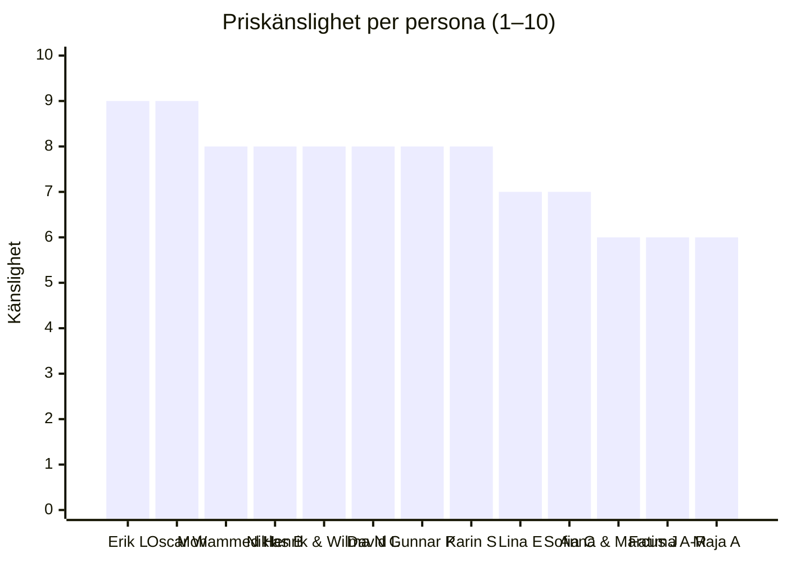

# Detaljerade prisprofiler per persona

Djupanalys av priskänslighet för var och en av TryggFörsäkrings 13 kundpersonas
inom motorförsäkring. Varje profil innehåller viktade känslighetspoäng,
smärtgränser, konkurrensbild, retentionsstrategi och intäktspåverkan vid churn.

Personerna presenteras i fallande ordning efter priskänslighet.

---

## Erik Lindström, 19 — Förstagångsköpare

[Personaprofil](../personas/erik-lindstrom.md)

### a) Priskänslighet: 9/10

| Faktor                    | Vikt | Poäng   | Motivering                                             |
| ------------------------- | ---- | ------- | ------------------------------------------------------ |
| Inkomstnivå               | 25 % | 10      | Deltidsanställd student, mycket begränsad budget       |
| Digital jämförelseförmåga | 20 % | 9       | Digital native, använder jämförelsesajter som standard |
| Byteskostnader            | 20 % | 9       | Ingen historik, inget bonussteg att förlora            |
| Lojalitet                 | 15 % | 2       | Ingen relation till något bolag                        |
| Flexibilitet i täckning   | 20 % | 9       | Nöjer sig med lagstadgad trafikförsäkring              |
| **Viktat resultat**       |      | **9,0** |                                                        |

### b) Smärtgräns

| Överpris % | Beteende                                               | Churn-sannolikhet |
| ---------- | ------------------------------------------------------ | ----------------- |
| 0–5 %      | Accepterar men jämför vid nästa förnyelse              | 10 %              |
| 5–10 %     | Söker aktivt billigare alternativ                      | 50 %              |
| 10–15 %    | Byter försäkringsbolag direkt                          | 80 %              |
| > 15 %     | Omedelbar uppsägning, väljer billigaste via jämförelse | 95 %              |

### c) Tillgängliga alternativ

| Konkurrent        | Styrka för denna persona          | Svaghet                    | Byteskostnad |
| ----------------- | --------------------------------- | -------------------------- | ------------ |
| Hedvig            | Appbaserad, snabb onboarding      | Begränsade tillägg         | Mycket låg   |
| IF                | Ung-förare-rabatter, studentpaket | Högt baspris               | Låg          |
| Länsförsäkringar  | Lokal närvaro, stabilt varumärke  | Trögt digitalt flöde       | Låg          |
| Folksam           | Fackförbundsrabatt via Handels    | Äldre digital upplevelse   | Låg          |
| Dina Försäkringar | Ofta billigast vid jämförelse     | Svagt varumärke bland unga | Mycket låg   |

### d) Vad skulle behålla dem trots överpris

| Värdeerbjudande                                                       | Uppskattad pristolerans |
| --------------------------------------------------------------------- | ----------------------- |
| Bonusstegsprogram med snabb progression (t.ex. +2 steg/år utan skada) | +8 %                    |
| Telematikbaserad rabatt kopplad till körbeteende                      | +6 %                    |
| Studentrabatt eller ung-förare-paket                                  | +5 %                    |
| Enkel, heldigital upplevelse med Swish-betalning                      | +3 %                    |

### e) Intäktspåverkan vid churn

| Mått                                  | Värde                                           |
| ------------------------------------- | ----------------------------------------------- |
| Uppskattad årspremie                  | 8 000 kr                                        |
| Kundlivslängd                         | 15 år (om fångad tidigt)                        |
| LTV (5 % diskonterat)                 | ~85 000 kr                                      |
| Korsförsäljningspotential             | Hög — hemförsäkring, innehav, familjeförsäkring |
| Referensvärde                         | Högt — social media-generation                  |
| **Totalt strategiskt värde vid risk** | **~120 000 kr**                                 |

### f) Strategisk rekommendation

**Underprissätt** — Erik har noll byteskostnad och extrem priskänslighet.
Investera i att fånga kunder tidigt genom aggressiv introduktionspris. LTV över
15 år med korsförsäljning motiverar en initial förlust under 2–3 år.

---

## Oscar Wallin, 26 — Gig-ekonomi

[Personaprofil](../personas/oscar-wallin.md)

### a) Priskänslighet: 9/10

| Faktor                    | Vikt | Poäng   | Motivering                                   |
| ------------------------- | ---- | ------- | -------------------------------------------- |
| Inkomstnivå               | 25 % | 9       | Variabel gig-inkomst, inga fasta intäkter    |
| Digital jämförelseförmåga | 20 % | 9       | Digitalt kompetent, jämför löpande           |
| Byteskostnader            | 20 % | 8       | Låg bonusklass, inga bundna tillägg          |
| Lojalitet                 | 15 % | 3       | Vill ha billigast, ingen emotionell koppling |
| Flexibilitet i täckning   | 20 % | 9       | Vill minimera premie, hoppar över tillägg    |
| **Viktat resultat**       |      | **9,0** |                                              |

### b) Smärtgräns

| Överpris % | Beteende                                                   | Churn-sannolikhet |
| ---------- | ---------------------------------------------------------- | ----------------- |
| 0–5 %      | Accepterar men bevakar marknaden                           | 15 %              |
| 5–10 %     | Söker aktivt alternativ                                    | 55 %              |
| 10–15 %    | Byter bolag, undviker att redovisa kommersiell användning  | 80 %              |
| > 15 %     | Omedelbar uppsägning, risk för odeklarerad yrkesanvändning | 95 %              |

### c) Tillgängliga alternativ

| Konkurrent       | Styrka för denna persona          | Svaghet                        | Byteskostnad |
| ---------------- | --------------------------------- | ------------------------------ | ------------ |
| Hedvig           | Snabb, billig grundförsäkring     | Otydlig yrkestrafik-policy     | Mycket låg   |
| IF               | Yrkestrafik-tillägg tillgängligt  | Premiumtillägg vid deklaration | Låg          |
| Länsförsäkringar | Flexibel premie, lokal rådgivning | Kräver besök, långsam process  | Låg          |
| Moderna          | Konkurrenskraftigt pris, digital  | Litet bolag, osäker stabilitet | Låg          |
| Folksam          | Bred täckning, tydliga villkor    | Saknar gig-anpassad produkt    | Låg          |

### d) Vad skulle behålla dem trots överpris

| Värdeerbjudande                                                   | Uppskattad pristolerans |
| ----------------------------------------------------------------- | ----------------------- |
| Gig-anpassad försäkring med flexibel premie (betala per km/timme) | +10 %                   |
| Enkel process för att deklarera yrkestrafik utan straffpremie     | +7 %                    |
| Inkomstskydd vid olycka kopplad till gig-arbete                   | +5 %                    |
| Telematikbaserad premie som belönar säker körning                 | +4 %                    |

### e) Intäktspåverkan vid churn

| Mått                                  | Värde                                          |
| ------------------------------------- | ---------------------------------------------- |
| Uppskattad årspremie                  | 10 000 kr (med yrkestrafik)                    |
| Kundlivslängd                         | 8 år                                           |
| LTV (5 % diskonterat)                 | ~65 000 kr                                     |
| Korsförsäljningspotential             | Medel — olycksfallsförsäkring, inkomstskydd    |
| Referensvärde                         | Högt — gig-nätverk sprider erfarenheter snabbt |
| **Totalt strategiskt värde vid risk** | **~85 000 kr**                                 |

### f) Strategisk rekommendation

**Underprissätt** — Skapa en gig-anpassad produkt med flexibel premie. Oscar
representerar ett växande segment. Traditionella bolag som inte anpassar sig
förlorar hela gig-segmentet till insurtechs. En korrekt prissatt
yrkestrafik-produkt minskar dessutom risken för odeklarerad kommersiell
användning.

---

## Mohammed Hassan, 42 — Bytare

[Personaprofil](../personas/mohammed-hassan.md)

### a) Priskänslighet: 8/10

| Faktor                    | Vikt | Poäng   | Motivering                                     |
| ------------------------- | ---- | ------- | ---------------------------------------------- |
| Inkomstnivå               | 25 % | 6       | Restaurangägare, stabil men konjunkturkänslig  |
| Digital jämförelseförmåga | 20 % | 8       | Erfaren jämförare, använder mäklare aktivt     |
| Byteskostnader            | 20 % | 7       | Har hög bonusklass att överföra, viss friktion |
| Lojalitet                 | 15 % | 3       | Bevisligen villig att byta efter 8 år          |
| Flexibilitet i täckning   | 20 % | 8       | Prioriterar pris framför extra tillägg         |
| **Viktat resultat**       |      | **8,0** |                                                |

### b) Smärtgräns

| Överpris % | Beteende                                         | Churn-sannolikhet |
| ---------- | ------------------------------------------------ | ----------------- |
| 0–5 %      | Accepterar motvilligt, bevakar marknaden         | 15 %              |
| 5–10 %     | Kontaktar konkurrenter för offerter              | 40 %              |
| 10–15 %    | Aktivt bytesförlopp — redan demonstrerad tröskel | 75 %              |
| > 15 %     | Omedelbart byte — exakt nuvarande situation      | 95 %              |

### c) Tillgängliga alternativ

| Konkurrent        | Styrka för denna persona                       | Svaghet                         | Byteskostnad |
| ----------------- | ---------------------------------------------- | ------------------------------- | ------------ |
| Länsförsäkringar  | Personlig rådgivning, tydlig bonusöverföring   | Inte alltid billigast           | Medel        |
| Folksam           | Stabil, brett nätverk, enkel bonushantering    | Mindre flexibel digitalt        | Medel        |
| IF                | Konkurrenskraftig prissättning, digital offert | Opersonlig, stor kundstock      | Medel        |
| Dina Försäkringar | Agressiva kampanjpriser                        | Osäker prishistorik efter år 1  | Låg          |
| Gjensidige        | Norsk tradition, prisvärda helpaket            | Mindre känt varumärke i Sverige | Medel        |

### d) Vad skulle behålla dem trots överpris

| Värdeerbjudande                                            | Uppskattad pristolerans |
| ---------------------------------------------------------- | ----------------------- |
| Lojalitetsrabatt som växer över tid (synlig i portalen)    | +8 %                    |
| Proaktiv förnyelsedialog 60 dagar före med prisgaranti     | +6 %                    |
| Kombinationsrabatt bil + företagsförsäkring (restauranger) | +7 %                    |
| Snabb, smidig bonusöverföring vid inkommande kunder        | +4 %                    |

### e) Intäktspåverkan vid churn

| Mått                                  | Värde                                        |
| ------------------------------------- | -------------------------------------------- |
| Uppskattad årspremie                  | 14 000 kr                                    |
| Kundlivslängd                         | 10 år (om retenterad)                        |
| LTV (5 % diskonterat)                 | ~108 000 kr                                  |
| Korsförsäljningspotential             | Hög — företagsförsäkring, egendomsförsäkring |
| Referensvärde                         | Högt — restaurangägare med stort nätverk     |
| **Totalt strategiskt värde vid risk** | **~160 000 kr**                              |

### f) Strategisk rekommendation

**Matcha marknaden** — Mohammed har redan visat att 15 % överpris triggar byte.
Nyckeln är proaktiv förnyelsedialog med konkurrenskraftig prissättning och synliga
lojalitetsförmåner. Kombinationsrabatt med företagsförsäkring skapar
korsförsäljning och höjer byteskostnaden.

---

## Niklas Bergman, 35 — Egenföretagare

[Personaprofil](../personas/niklas-bergman.md)

### a) Priskänslighet: 8/10

| Faktor                    | Vikt | Poäng   | Motivering                                                |
| ------------------------- | ---- | ------- | --------------------------------------------------------- |
| Inkomstnivå               | 25 % | 7       | Egenföretagare, stabil men inget överskott                |
| Digital jämförelseförmåga | 20 % | 7       | Digitalt kompetent, jämför vid behov                      |
| Byteskostnader            | 20 % | 6       | Medelhög bonusklass, viss eftertanke vid byte             |
| Lojalitet                 | 15 % | 4       | Pragmatisk, stannar om priset stämmer                     |
| Flexibilitet i täckning   | 20 % | 9       | Bil är arbetsredskap — kräver skydd men söker lägsta pris |
| **Viktat resultat**       |      | **8,0** |                                                           |

### b) Smärtgräns

| Överpris % | Beteende                                  | Churn-sannolikhet |
| ---------- | ----------------------------------------- | ----------------- |
| 0–5 %      | Accepterar, bilen är nödvändig för arbete | 10 %              |
| 5–10 %     | Jämför alternativ, begär rabatt           | 35 %              |
| 10–15 %    | Aktivt byte om bonusöverföring är enkel   | 60 %              |
| > 15 %     | Byter bolag, prioriterar lägsta kostnad   | 85 %              |

### c) Tillgängliga alternativ

| Konkurrent       | Styrka för denna persona         | Svaghet                    | Byteskostnad |
| ---------------- | -------------------------------- | -------------------------- | ------------ |
| IF               | Företagspaket med bil + verktyg  | Premiumprissatt            | Medel        |
| Länsförsäkringar | Lokal kontakt, personlig service | Inte alltid billigast      | Medel        |
| Trygg-Hansa      | Bra företagserbjudande           | Svag digital upplevelse    | Medel        |
| Folksam          | Tydlig bonusöverföring, stabilt  | Begränsade företagstillägg | Medel        |
| Moderna          | Snabb offert, prisvärd           | Litet bolag, osäkerhet     | Låg          |

### d) Vad skulle behålla dem trots överpris

| Värdeerbjudande                                        | Uppskattad pristolerans |
| ------------------------------------------------------ | ----------------------- |
| Snabb skadehantering med hyrbil samma dag              | +8 %                    |
| Kombinationsrabatt bil + företagsförsäkring            | +6 %                    |
| Bonusskyddsförsäkring inkluderad                       | +5 %                    |
| Digital skadeanmälan med statusuppdateringar i realtid | +3 %                    |

### e) Intäktspåverkan vid churn

| Mått                                  | Värde                                       |
| ------------------------------------- | ------------------------------------------- |
| Uppskattad årspremie                  | 12 000 kr                                   |
| Kundlivslängd                         | 12 år                                       |
| LTV (5 % diskonterat)                 | ~106 000 kr                                 |
| Korsförsäljningspotential             | Hög — företagsförsäkring, ansvarsförsäkring |
| Referensvärde                         | Medel — hantverkarnätverk                   |
| **Totalt strategiskt värde vid risk** | **~140 000 kr**                             |

### f) Strategisk rekommendation

**Matcha marknaden** — Niklas prioriterar snabb skadehantering och
driftskontinuitet. Pris är viktigt men sekundärt till att bilen snabbt är
tillbaka i drift. Erbjud snabb hyrbilstjänst och kombinera med företagspaket för
att höja byteskostnaden.

---

## Henrik & Wilma Nilsson, 48/17 — Ung förare i familjen

[Personaprofil](../personas/henrik-wilma-nilsson.md)

### a) Priskänslighet: 8/10

| Faktor                    | Vikt | Poäng   | Motivering                                           |
| ------------------------- | ---- | ------- | ---------------------------------------------------- |
| Inkomstnivå               | 25 % | 6       | Ensam inkomst, produktionschef, stabil men pressad   |
| Digital jämförelseförmåga | 20 % | 7       | Kan jämföra men har begränsad tid                    |
| Byteskostnader            | 20 % | 6       | Hög bonusklass att förlora, men premiechocken driver |
| Lojalitet                 | 15 % | 5       | Viss lojalitet men priset dominerar                  |
| Flexibilitet i täckning   | 20 % | 9       | Söker sätt att minimera tillägg för ung förare       |
| **Viktat resultat**       |      | **8,0** |                                                      |

### b) Smärtgräns

| Överpris % | Beteende                                                  | Churn-sannolikhet |
| ---------- | --------------------------------------------------------- | ----------------- |
| 0–5 %      | Accepterar, fokuserar på ung-förare-tillägg               | 10 %              |
| 5–10 %     | Jämför alternativ aktivt, överväger separat försäkring    | 35 %              |
| 10–15 %    | Byter om ung-förare-tillägget är billigare hos konkurrent | 60 %              |
| > 15 %     | Byter hela familjens försäkring                           | 85 %              |

### c) Tillgängliga alternativ

| Konkurrent       | Styrka för denna persona                | Svaghet                    | Byteskostnad |
| ---------------- | --------------------------------------- | -------------------------- | ------------ |
| IF               | Telematik-rabatt för ung förare         | Högt baspris               | Medel        |
| Folksam          | Familjepaket, tydlig ungdomsrabatt      | Äldre digitalt gränssnitt  | Medel        |
| Hedvig           | Billigt grundpris, attraktivt för Wilma | Nytt bolag, osäkerhet      | Låg          |
| Länsförsäkringar | Lokal trygghet, familjeerbjudanden      | Svag telematik-integration | Medel        |
| Trygg-Hansa      | Ung-förare-paket med delad premie       | Komplext villkor           | Medel        |

### d) Vad skulle behålla dem trots överpris

| Värdeerbjudande                                               | Uppskattad pristolerans |
| ------------------------------------------------------------- | ----------------------- |
| Telematikbaserad rabatt för Wilma (upp till 30 % efter 3 mån) | +10 %                   |
| Separat ung-förare-premie utan att påverka Henriks bonus      | +7 %                    |
| Familjepaketsrabatt (bil + hemförsäkring + barn)              | +5 %                    |
| Digital körlogg som ger Wilma egen bonushistorik              | +4 %                    |

### e) Intäktspåverkan vid churn

| Mått                                  | Värde                                           |
| ------------------------------------- | ----------------------------------------------- |
| Uppskattad årspremie                  | 16 000 kr (inkl. ung-förare-tillägg)            |
| Kundlivslängd                         | 12 år (Henrik) + 15 år (Wilma som ny kund)      |
| LTV (5 % diskonterat)                 | ~180 000 kr (kombinerat)                        |
| Korsförsäljningspotential             | Mycket hög — Wilma som egen kund, hemförsäkring |
| Referensvärde                         | Högt — föräldranätverk, Wilmas sociala krets    |
| **Totalt strategiskt värde vid risk** | **~250 000 kr**                                 |

### f) Strategisk rekommendation

**Matcha marknaden** — Familjens totala LTV med Wilma som framtida fristående
kund motiverar investeringen. Telematikbaserad ung-förare-rabatt är nyckeln:
den sänker premien, engagerar Wilma och bygger data för framtida prissättning.
Risk att förlora två generationers kundrelation gör detta till ett
högriskscenario.

---

## David Lindgren, 30 — Leasingkund

[Personaprofil](../personas/david-lindgren.md)

### a) Priskänslighet: 8/10

| Faktor                    | Vikt | Poäng   | Motivering                                                |
| ------------------------- | ---- | ------- | --------------------------------------------------------- |
| Inkomstnivå               | 25 % | 5       | UX-designer, bra lön men hög levnadskostnad               |
| Digital jämförelseförmåga | 20 % | 9       | Mycket digitalt kompetent, jämför systematiskt            |
| Byteskostnader            | 20 % | 8       | Leasingavtal begränsar men byte inom ramarna är enkelt    |
| Lojalitet                 | 15 % | 3       | Ingen emotionell koppling, ren prisoptimering             |
| Flexibilitet i täckning   | 20 % | 8       | Obligatorisk helförsäkring via leasing, söker lägsta pris |
| **Viktat resultat**       |      | **8,0** |                                                           |

### b) Smärtgräns

| Överpris % | Beteende                                              | Churn-sannolikhet |
| ---------- | ----------------------------------------------------- | ----------------- |
| 0–5 %      | Accepterar om inom leasingkrav                        | 10 %              |
| 5–10 %     | Jämför alternativ inom leasingbolagets partnerlista   | 45 %              |
| 10–15 %    | Byter till billigaste godkända försäkring             | 75 %              |
| > 15 %     | Omedelbart byte, kontaktar leasingbolag om alternativ | 90 %              |

### c) Tillgängliga alternativ

| Konkurrent       | Styrka för denna persona                   | Svaghet                           | Byteskostnad |
| ---------------- | ------------------------------------------ | --------------------------------- | ------------ |
| IF               | Stort leasingpartner-nätverk               | Högt standardpris                 | Låg          |
| Länsförsäkringar | Konkurrenskraftigt leasingpaket            | Begränsad digital upplevelse      | Låg          |
| Trygg-Hansa      | Integrerat gap-försäkring                  | Otydlig EV-prissättning           | Låg          |
| Folksam          | Stabil, godkänd hos de flesta leasingbolag | Svag EV-kompetens                 | Låg          |
| Hedvig           | Billigt, modernt, snabb onboarding         | Kanske ej godkänd av leasingbolag | Låg          |

### d) Vad skulle behålla dem trots överpris

| Värdeerbjudande                                             | Uppskattad pristolerans |
| ----------------------------------------------------------- | ----------------------- |
| Inkluderad gap-försäkring utan extra kostnad                | +7 %                    |
| EV-specifik täckning (batteri, laddinfrastruktur)           | +5 %                    |
| Sömlös integration med leasingbolagets portal               | +4 %                    |
| Automatisk förlängning utan prishöjning under leasingperiod | +6 %                    |

### e) Intäktspåverkan vid churn

| Mått                                  | Värde                                                 |
| ------------------------------------- | ----------------------------------------------------- |
| Uppskattad årspremie                  | 15 000 kr (helförsäkring EV)                          |
| Kundlivslängd                         | 6 år (2 leasingperioder)                              |
| LTV (5 % diskonterat)                 | ~78 000 kr                                            |
| Korsförsäljningspotential             | Medel — hemförsäkring, nästa leasingbil               |
| Referensvärde                         | Högt — teknikintresserad, delar erfarenheter digitalt |
| **Totalt strategiskt värde vid risk** | **~100 000 kr**                                       |

### f) Strategisk rekommendation

**Matcha marknaden** — Leasingkunder har låga byteskostnader men är styrda av
leasingbolagets kravlista. Nyckeln är partnerskap med leasingbolag och
inkluderad gap-försäkring. EV-kompetens är en differentieringsfaktor som kan
bygga lojalitet inför nästa leasingperiod.

---

## Gunnar Pettersson, 72 — Lojal pensionär

[Personaprofil](../personas/gunnar-pettersson.md)

### a) Priskänslighet: 8/10

| Faktor                    | Vikt | Poäng   | Motivering                                      |
| ------------------------- | ---- | ------- | ----------------------------------------------- |
| Inkomstnivå               | 25 % | 8       | Fast pension, begränsat utrymme för höjningar   |
| Digital jämförelseförmåga | 20 % | 4       | Begränsad digital vana, föredrar telefon        |
| Byteskostnader            | 20 % | 7       | 22 års historik, hög bonusklass, men frustrerad |
| Lojalitet                 | 15 % | 7       | Stark men eroderar vid oförklarade höjningar    |
| Flexibilitet i täckning   | 20 % | 6       | Vill ha rätt täckning för veteranbil, inte mer  |
| **Viktat resultat**       |      | **8,0** |                                                 |

### b) Smärtgräns

| Överpris % | Beteende                             | Churn-sannolikhet |
| ---------- | ------------------------------------ | ----------------- |
| 0–5 %      | Accepterar, litar på bolaget         | 5 %               |
| 5–10 %     | Ringer kundtjänst, kräver förklaring | 20 %              |
| 10–15 %    | Ber familjemedlem jämföra alternativ | 45 %              |
| > 15 %     | Byter med hjälp av familj/rådgivare  | 70 %              |

### c) Tillgängliga alternativ

| Konkurrent                    | Styrka för denna persona             | Svaghet                       | Byteskostnad |
| ----------------------------- | ------------------------------------ | ----------------------------- | ------------ |
| Länsförsäkringar              | Personlig kontakt, lokal närvaro     | Kanske ej veteranbilsexpert   | Medel        |
| Folksam                       | Tydlig pensionärsrabatt, stort bolag | Standardiserad, opersonlig    | Medel        |
| IF                            | Veteranbilsförsäkring tillgänglig    | Digital-fokus passar ej       | Hög          |
| Motorhistoriska riksförbundet | Specialistförsäkring veteranbilar    | Begränsad till entusiastbilar | Låg          |
| Gjensidige                    | Kompetent bilförsäkring, personlig   | Mindre känt bland äldre       | Hög          |

### d) Vad skulle behålla dem trots överpris

| Värdeerbjudande                                      | Uppskattad pristolerans |
| ---------------------------------------------------- | ----------------------- |
| Proaktiv förnyelsedialog med tydlig prisförklaring   | +8 %                    |
| Dedikerad pensionärsrådgivare (telefon, inte app)    | +6 %                    |
| Lojalitetsrabatt synlig på årsbeskedet (22 års kund) | +7 %                    |
| Veteranbilsspecialist som förstår Saab 900 värdering | +5 %                    |
| Årligt tackbrev med sammanfattning av förmåner       | +3 %                    |

### e) Intäktspåverkan vid churn

| Mått                                  | Värde                                                   |
| ------------------------------------- | ------------------------------------------------------- |
| Uppskattad årspremie                  | 6 000 kr                                                |
| Kundlivslängd                         | 10 år (kvarvarande)                                     |
| LTV (5 % diskonterat)                 | ~46 000 kr                                              |
| Korsförsäljningspotential             | Låg — redan pensionär, begränsade nya produkter         |
| Referensvärde                         | Medel — familj och vänkrets lyssnar på rekommendationer |
| **Totalt strategiskt värde vid risk** | **~60 000 kr**                                          |

### f) Strategisk rekommendation

**Premiumservice till marknadspris** — Gunnars direkta LTV är måttligt men
reputationsvärdet är högt. En 72-årig kund som lämnar efter 22 år skapar en
negativ berättelse. Investera i proaktiv kommunikation och personlig service
snarare än prisrabatter. Transparens kring premieförändringar är den enskilt
viktigaste åtgärden.

---

## Karin Ström, 45 — Frånskild, ägarövergång

[Personaprofil](../personas/karin-strom.md)

### a) Priskänslighet: 8/10

| Faktor                    | Vikt | Poäng   | Motivering                                          |
| ------------------------- | ---- | ------- | --------------------------------------------------- |
| Inkomstnivå               | 25 % | 8       | Ensamstående inkomst, logistikkoordinator           |
| Digital jämförelseförmåga | 20 % | 7       | Kompetent, jämför vid behov                         |
| Byteskostnader            | 20 % | 8       | Ingen egen bonushistorik — inget att förlora        |
| Lojalitet                 | 15 % | 3       | Ny situation, ingen etablerad lojalitet             |
| Flexibilitet i täckning   | 20 % | 7       | Behöver helförsäkring men söker lägsta möjliga pris |
| **Viktat resultat**       |      | **8,0** |                                                     |

### b) Smärtgräns

| Överpris % | Beteende                                      | Churn-sannolikhet |
| ---------- | --------------------------------------------- | ----------------- |
| 0–5 %      | Accepterar, fokuserar på att bygga bonusklass | 10 %              |
| 5–10 %     | Jämför alternativ aktivt                      | 40 %              |
| 10–15 %    | Byter till billigaste alternativ              | 70 %              |
| > 15 %     | Omedelbart byte, ingen lojalitetskoppling     | 90 %              |

### c) Tillgängliga alternativ

| Konkurrent        | Styrka för denna persona                         | Svaghet                 | Byteskostnad |
| ----------------- | ------------------------------------------------ | ----------------------- | ------------ |
| Hedvig            | Billig, snabb onboarding, ingen bonusklass krävs | Nytt bolag              | Mycket låg   |
| IF                | Erkännande av medförsäkrads körhistorik          | Kan kräva dokumentation | Låg          |
| Länsförsäkringar  | Personlig kontakt, förståelse för situation      | Inte alltid billigast   | Låg          |
| Folksam           | Stor kundstock, stabil, tydliga villkor          | Standardiserad process  | Låg          |
| Dina Försäkringar | Agressivt pris för nya kunder                    | Oklart långsiktigt pris | Mycket låg   |

### d) Vad skulle behålla dem trots överpris

| Värdeerbjudande                                                  | Uppskattad pristolerans |
| ---------------------------------------------------------------- | ----------------------- |
| Erkännande av medsökandes körhistorik (12 år skadefri)           | +10 %                   |
| Snabb bonusklassuppbyggnad (dubbelsteg första 2 åren)            | +7 %                    |
| Förmånligt paket vid livshändelse (separation/skilsmässa)        | +5 %                    |
| Digital portal med tydlig bonusprogression och besparingsprognos | +3 %                    |

### e) Intäktspåverkan vid churn

| Mått                                  | Värde                                        |
| ------------------------------------- | -------------------------------------------- |
| Uppskattad årspremie                  | 13 000 kr (bonusklass 0)                     |
| Kundlivslängd                         | 15 år                                        |
| LTV (5 % diskonterat)                 | ~115 000 kr                                  |
| Korsförsäljningspotential             | Hög — hemförsäkring, barnförsäkring          |
| Referensvärde                         | Medel — delar erfarenheter i föräldranätverk |
| **Totalt strategiskt värde vid risk** | **~150 000 kr**                              |

### f) Strategisk rekommendation

**Underprissätt initialt** — Karin saknar bonusklass trots 12 års skadefri
körning. Att erkänna medförsäkrads historik är den starkaste
retentionsåtgärden och en unik differentiator. Initialt lägre premie kompenseras
av högt LTV och korsförsäljningspotential.

---

## Lina Eriksson, 28 — Elbilsägare

[Personaprofil](../personas/lina-eriksson.md)

### a) Priskänslighet: 7/10

| Faktor                    | Vikt | Poäng   | Motivering                                                                |
| ------------------------- | ---- | ------- | ------------------------------------------------------------------------- |
| Inkomstnivå               | 25 % | 5       | Fysioterapeut, offentlig sektor, stabil men måttlig                       |
| Digital jämförelseförmåga | 20 % | 8       | Digitalt kompetent, jämför aktivt online                                  |
| Byteskostnader            | 20 % | 7       | Relativt ny kund, begränsad bonusklass                                    |
| Lojalitet                 | 15 % | 4       | Vill förstå premien men byter om omotiverat dyr                           |
| Flexibilitet i täckning   | 20 % | 6       | Kräver EV-specifik täckning (batteri), accepterar merkostnad om motiverad |
| **Viktat resultat**       |      | **7,0** |                                                                           |

### b) Smärtgräns

| Överpris % | Beteende                                           | Churn-sannolikhet |
| ---------- | -------------------------------------------------- | ----------------- |
| 0–5 %      | Accepterar om EV-täckning är tydlig                | 10 %              |
| 5–10 %     | Jämför EV-specialistbolag                          | 30 %              |
| 10–15 %    | Byter om konkurrenten erbjuder bättre EV-paket     | 55 %              |
| > 15 %     | Byter, accepterar sämre EV-täckning för lägre pris | 75 %              |

### c) Tillgängliga alternativ

| Konkurrent                 | Styrka för denna persona            | Svaghet                       | Byteskostnad |
| -------------------------- | ----------------------------------- | ----------------------------- | ------------ |
| IF                         | Tydlig EV-produkt, batteriskydd     | Premium-prissatt              | Medel        |
| Hedvig                     | Modernt, billigt, snabb process     | Osäker EV-kompetens           | Låg          |
| Länsförsäkringar           | Lokal, personlig, stabil            | Svag EV-specialisering        | Medel        |
| Tesla Insurance (framtida) | Integrerad med bilen, telematik     | Ej tillgänglig i Sverige ännu | N/A          |
| Folksam                    | Hållbarhetsprofil, passar EV-kunder | Begränsad EV-differentiering  | Medel        |

### d) Vad skulle behålla dem trots överpris

| Värdeerbjudande                                       | Uppskattad pristolerans |
| ----------------------------------------------------- | ----------------------- |
| Fullständig batterigaranti och degraderingsförsäkring | +8 %                    |
| Täckning av laddinfrastruktur (hemmaladdare, kablar)  | +5 %                    |
| Tydlig premieuppdelning (vad kostar EV-delen?)        | +4 %                    |
| Hållbarhetsrabatt (grön bonus för elbilsägare)        | +6 %                    |
| Snabb skadehantering med EV-certifierad verkstad      | +4 %                    |

### e) Intäktspåverkan vid churn

| Mått                                  | Värde                                                    |
| ------------------------------------- | -------------------------------------------------------- |
| Uppskattad årspremie                  | 14 000 kr                                                |
| Kundlivslängd                         | 12 år                                                    |
| LTV (5 % diskonterat)                 | ~124 000 kr                                              |
| Korsförsäljningspotential             | Hög — hemförsäkring, solcellsförsäkring, nästa EV        |
| Referensvärde                         | Högt — EV-community delar aktivt försäkringserfarenheter |
| **Totalt strategiskt värde vid risk** | **~170 000 kr**                                          |

### f) Strategisk rekommendation

**Matcha med EV-differentiering** — Lina accepterar högre premie om den motiveras
med EV-specifik täckning. Nyckeln är transparens i premieuppdelningen och
marknadsledande batteriskydd. EV-segmentet växer snabbt — att bygga trovärdighet
nu skapar långsiktig konkurrensposition.

---

## Sofia Chen, 32 — Inflyttad, bonusöverföring

[Personaprofil](../personas/sofia-chen.md)

### a) Priskänslighet: 7/10

| Faktor                    | Vikt | Poäng   | Motivering                                         |
| ------------------------- | ---- | ------- | -------------------------------------------------- |
| Inkomstnivå               | 25 % | 4       | Mjukvaruingenjör, god lön                          |
| Digital jämförelseförmåga | 20 % | 9       | Mycket hög digital kompetens                       |
| Byteskostnader            | 20 % | 8       | Startade vid klass 0, ingen historik att förlora   |
| Lojalitet                 | 15 % | 3       | Ny i Sverige, ingen etablerad relation             |
| Flexibilitet i täckning   | 20 % | 7       | Vill ha bra täckning men frustrerad av premienivån |
| **Viktat resultat**       |      | **7,0** |                                                    |

### b) Smärtgräns

| Överpris % | Beteende                                                    | Churn-sannolikhet |
| ---------- | ----------------------------------------------------------- | ----------------- |
| 0–5 %      | Accepterar motvilligt                                       | 10 %              |
| 5–10 %     | Jämför aktivt, kontaktar bolag som erbjuder bonusöverföring | 40 %              |
| 10–15 %    | Byter till bolag som erkänner utländsk körerfarenhet        | 65 %              |
| > 15 %     | Omedelbart byte, ingen lojalitet att hålla kvar             | 85 %              |

### c) Tillgängliga alternativ

| Konkurrent       | Styrka för denna persona                          | Svaghet                                         | Byteskostnad |
| ---------------- | ------------------------------------------------- | ----------------------------------------------- | ------------ |
| IF               | Internationell erfarenhet, bonusöverföringspolicy | Komplex process                                 | Medel        |
| Hedvig           | Modernt, flerspråkigt gränssnitt                  | Oklart om utländsk bonus accepteras             | Låg          |
| Länsförsäkringar | Lokal kontakt, kan göra individuell bedömning     | Standardprocess saknar internationell hantering | Medel        |
| Folksam          | Stabilt, brett, flerspråkig kundtjänst            | Rigida bonusregler                              | Medel        |
| Gjensidige       | Nordisk, kan ha erfarenhet av gränsöverskridande  | Litet i Sverige                                 | Medel        |

### d) Vad skulle behålla dem trots överpris

| Värdeerbjudande                                                 | Uppskattad pristolerans |
| --------------------------------------------------------------- | ----------------------- |
| Erkännande av utländsk körhistorik (SF-klass från Tyskland)     | +12 %                   |
| Flerspråkig kundtjänst och portal (engelska)                    | +5 %                    |
| Snabb bonusklassuppbyggnad med dokumenterad utländsk erfarenhet | +8 %                    |
| Välkomstpaket för nyinflyttade med tydlig vägledning            | +3 %                    |

### e) Intäktspåverkan vid churn

| Mått                                  | Värde                                                 |
| ------------------------------------- | ----------------------------------------------------- |
| Uppskattad årspremie                  | 15 000 kr (bonusklass 0)                              |
| Kundlivslängd                         | 15 år                                                 |
| LTV (5 % diskonterat)                 | ~135 000 kr                                           |
| Korsförsäljningspotential             | Mycket hög — hemförsäkring, sparande, familjebildning |
| Referensvärde                         | Mycket högt — internationellt nätverk, tech-community |
| **Totalt strategiskt värde vid risk** | **~200 000 kr**                                       |

### f) Strategisk rekommendation

**Underprissätt initialt** — Sofia har mycket hög LTV och referensvärde. Att
erkänna utländsk körhistorik är en kraftfull differentiator som få svenska bolag
erbjuder. Initialt rabatterad premie kompenseras av lång kundlivslängd och
exceptionellt korsförsäljningspotential.

---

## Anna & Marcus Johansson, 38/40 — Dubbelinkomstfamilj

[Personaprofil](../personas/anna-marcus-johansson.md)

### a) Priskänslighet: 6/10

| Faktor                    | Vikt | Poäng   | Motivering                                         |
| ------------------------- | ---- | ------- | -------------------------------------------------- |
| Inkomstnivå               | 25 % | 4       | Projektledare + lärare, stabil dubbelinkomst       |
| Digital jämförelseförmåga | 20 % | 7       | Kan jämföra men prioriterar bekvämlighet           |
| Byteskostnader            | 20 % | 7       | Höga bonusklasser (6 och 5), två bilar att flytta  |
| Lojalitet                 | 15 % | 6       | Nöjda med nuvarande, byter ej utan stark anledning |
| Flexibilitet i täckning   | 20 % | 5       | Vill ha bra täckning, inte nödvändigtvis billigast |
| **Viktat resultat**       |      | **6,0** |                                                    |

### b) Smärtgräns

| Överpris % | Beteende                                | Churn-sannolikhet |
| ---------- | --------------------------------------- | ----------------- |
| 0–5 %      | Accepterar utan åtgärd                  | 5 %               |
| 5–10 %     | Noterar men agerar troligen inte        | 15 %              |
| 10–15 %    | Jämför vid förnyelse, begär bättre pris | 35 %              |
| > 15 %     | Byter hela familjens försäkringspaket   | 60 %              |

### c) Tillgängliga alternativ

| Konkurrent       | Styrka för denna persona                  | Svaghet                  | Byteskostnad |
| ---------------- | ----------------------------------------- | ------------------------ | ------------ |
| Länsförsäkringar | Familjepaket, lokal kontakt               | Kräver aktiv kontakt     | Hög          |
| IF               | Digital familjeöversikt, bra app          | Opersonlig vid problem   | Hög          |
| Folksam          | Fackförbundsrabatt (lärare), familjepaket | Äldre digital upplevelse | Hög          |
| Trygg-Hansa      | Barnförsäkring + bil-kombination          | Komplex prisstruktur     | Hög          |
| Hedvig           | Modernt, enkelt                           | Saknar familjepaketdjup  | Medel        |

### d) Vad skulle behålla dem trots överpris

| Värdeerbjudande                                       | Uppskattad pristolerans |
| ----------------------------------------------------- | ----------------------- |
| Samlad familjeportal med alla försäkringar            | +7 %                    |
| Familjepaketsrabatt (2 bilar + hem + barn)            | +8 %                    |
| Automatisk förnyelse med prisgaranti                  | +5 %                    |
| Proaktiv rådgivning vid livshändelser (barn, bilbyte) | +4 %                    |

### e) Intäktspåverkan vid churn

| Mått                                  | Värde                                 |
| ------------------------------------- | ------------------------------------- |
| Uppskattad årspremie                  | 22 000 kr (2 bilar)                   |
| Kundlivslängd                         | 15 år                                 |
| LTV (5 % diskonterat)                 | ~228 000 kr                           |
| Korsförsäljningspotential             | Mycket hög — hem, barn, liv, sparande |
| Referensvärde                         | Högt — föräldranätverk, skolkontakter |
| **Totalt strategiskt värde vid risk** | **~320 000 kr**                       |

### f) Strategisk rekommendation

**Premiumservice till marknadspris** — Anna och Marcus är den idealiska
familjakunden: hög LTV, bred korsförsäljning och hög byteskostnad. Fokusera på
bekvämlighet och samlad översikt snarare än lägsta pris. Familjepaket med tydlig
totalrabatt är den starkaste retentionsmekanismen.

---

## Fatima Al-Rashid, 45 — Flottakund

[Personaprofil](../personas/fatima-al-rashid.md)

### a) Priskänslighet: 6/10

| Faktor                    | Vikt | Poäng   | Motivering                                 |
| ------------------------- | ---- | ------- | ------------------------------------------ |
| Inkomstnivå               | 25 % | 5       | Företagare, stabil men kostnadsmedveten    |
| Digital jämförelseförmåga | 20 % | 6       | Kompetent men tidsbegränsad                |
| Byteskostnader            | 20 % | 8       | 8 fordon, hög administrativ byteskostnad   |
| Lojalitet                 | 15 % | 6       | Pragmatisk lojalitet, stannar om effektivt |
| Flexibilitet i täckning   | 20 % | 5       | Kräver stabil täckning för hela flottan    |
| **Viktat resultat**       |      | **6,0** |                                            |

### b) Smärtgräns

| Överpris % | Beteende                                                          | Churn-sannolikhet |
| ---------- | ----------------------------------------------------------------- | ----------------- |
| 0–5 %      | Accepterar, administrativ kostnad att byta överstiger besparingen | 5 %               |
| 5–10 %     | Begär förhandling, hotar med byte                                 | 20 %              |
| 10–15 %    | Inhämtar offerter från 2–3 konkurrenter                           | 40 %              |
| > 15 %     | Byter hela flottan, accepterar administrativ kostnad              | 65 %              |

### c) Tillgängliga alternativ

| Konkurrent       | Styrka för denna persona                 | Svaghet                      | Byteskostnad |
| ---------------- | ---------------------------------------- | ---------------------------- | ------------ |
| IF               | Stark flotterbjudande, dedikerad kontakt | Premium-prissatt             | Hög          |
| Trygg-Hansa      | Bra flotthantering, digital portal       | Begränsad småföretagsfokus   | Hög          |
| Länsförsäkringar | Lokal kontakt, flexibel förhandling      | Svag flottadministration     | Medel        |
| Moderna          | Konkurrenskraftigt pris, enkel process   | Litet bolag för flottkunder  | Medel        |
| Gjensidige       | Erfarenhet av nordiska flottor           | Mindre känt bland småföretag | Hög          |

### d) Vad skulle behålla dem trots överpris

| Värdeerbjudande                                          | Uppskattad pristolerans |
| -------------------------------------------------------- | ----------------------- |
| Dedikerad företagsrådgivare med flottexpertis            | +8 %                    |
| Digital flottportal med samlad översikt och rapportering | +7 %                    |
| Volymrabatt som växer med antal fordon                   | +6 %                    |
| Förenklad skadehantering (ett ärende oavsett fordon)     | +5 %                    |
| Kombinationsrabatt fordon + företagsförsäkring           | +4 %                    |

### e) Intäktspåverkan vid churn

| Mått                                  | Värde                                                        |
| ------------------------------------- | ------------------------------------------------------------ |
| Uppskattad årspremie                  | 64 000 kr (8 fordon)                                         |
| Kundlivslängd                         | 10 år                                                        |
| LTV (5 % diskonterat)                 | ~494 000 kr                                                  |
| Korsförsäljningspotential             | Mycket hög — företagsförsäkring, ansvarsförsäkring, tillväxt |
| Referensvärde                         | Högt — företagarnätverk, branschkontakter                    |
| **Totalt strategiskt värde vid risk** | **~650 000 kr**                                              |

### f) Strategisk rekommendation

**Premiumservice till marknadspris** — Fatima är den mest värdefulla enskilda
kunden sett till årspremie och LTV. Höga byteskostnader ger viss prisflexibilitet
men bör inte utnyttjas. Dedikerad företagsrådgivare och digital flottportal
är avgörande retentionsverktyg. Risken vid churn (650 000 kr) motiverar
proaktiv prisförhandling.

---

## Maja Andersson, 52 — Dödsboförvaltare

<!-- Personaprofil under utveckling -->

### a) Priskänslighet: 6/10

| Faktor                    | Vikt | Poäng   | Motivering                                            |
| ------------------------- | ---- | ------- | ----------------------------------------------------- |
| Inkomstnivå               | 25 % | 5       | Stabil inkomst, hanterar dödsboets ekonomi separat    |
| Digital jämförelseförmåga | 20 % | 6       | Kompetent men fokuserad på att avsluta, inte optimera |
| Byteskostnader            | 20 % | 5       | Tillfällig kund, kort relation                        |
| Lojalitet                 | 15 % | 4       | Ingen personlig koppling till den avlidnes bolag      |
| Flexibilitet i täckning   | 20 % | 7       | Vill minimera kostnad under avvecklingsperioden       |
| **Viktat resultat**       |      | **6,0** |                                                       |

### b) Smärtgräns

| Överpris % | Beteende                                      | Churn-sannolikhet |
| ---------- | --------------------------------------------- | ----------------- |
| 0–5 %      | Accepterar, vill avsluta snabbt               | 5 %               |
| 5–10 %     | Ifrågasätter men agerar troligen inte         | 15 %              |
| 10–15 %    | Överväger att säga upp omedelbart             | 40 %              |
| > 15 %     | Avbryter försäkringen, säljer fordon snabbare | 65 %              |

### c) Tillgängliga alternativ

| Konkurrent       | Styrka för denna persona                   | Svaghet                           | Byteskostnad |
| ---------------- | ------------------------------------------ | --------------------------------- | ------------ |
| IF               | Tydlig dödsboprocess, digital              | Opersonlig                        | Låg          |
| Länsförsäkringar | Personlig kontakt, hjälp med pappersarbete | Långsam process                   | Medel        |
| Folksam          | Stor, stabil, etablerade dödsborutiner     | Byråkratisk                       | Medel        |
| Trygg-Hansa      | Tydliga villkor vid ägaröverföring         | Begränsad digital dödsbohantering | Medel        |
| Gjensidige       | Flexibel, pragmatisk hantering             | Mindre känt                       | Låg          |

### d) Vad skulle behålla dem trots överpris

| Värdeerbjudande                                             | Uppskattad pristolerans |
| ----------------------------------------------------------- | ----------------------- |
| Smidig dödsboprocess med en kontaktperson                   | +8 %                    |
| Automatisk premiejustering vid avställning                  | +5 %                    |
| Tydlig digital guide för dödsboförvaltare                   | +4 %                    |
| Möjlighet att överföra den avlidnes bonusklass till arvinge | +6 %                    |

### e) Intäktspåverkan vid churn

| Mått                                  | Värde                                       |
| ------------------------------------- | ------------------------------------------- |
| Uppskattad årspremie                  | 7 000 kr (under avvecklingsperiod)          |
| Kundlivslängd                         | 0,5–1 år (tillfällig)                       |
| LTV (direkt)                          | ~5 000 kr                                   |
| Korsförsäljningspotential             | Indirekt — arvingar kan bli nya kunder      |
| Referensvärde                         | Högt — negativ upplevelse sprids i familjen |
| **Totalt strategiskt värde vid risk** | **~50 000 kr (indirekt via arvingar)**      |

### f) Strategisk rekommendation

**Matcha marknaden** — Majas direkta värde är lågt men det indirekta värdet
är signifikant. En dålig upplevelse vid dödsbohantering sprids till hela
familjen och riskerar att förlora arvingarna som framtida kunder. Investera i en
smidig, empatisk dödsboprocess. Erbjud bonusklassöverföring till arvingar som
brygga till nya kundrelationer.
