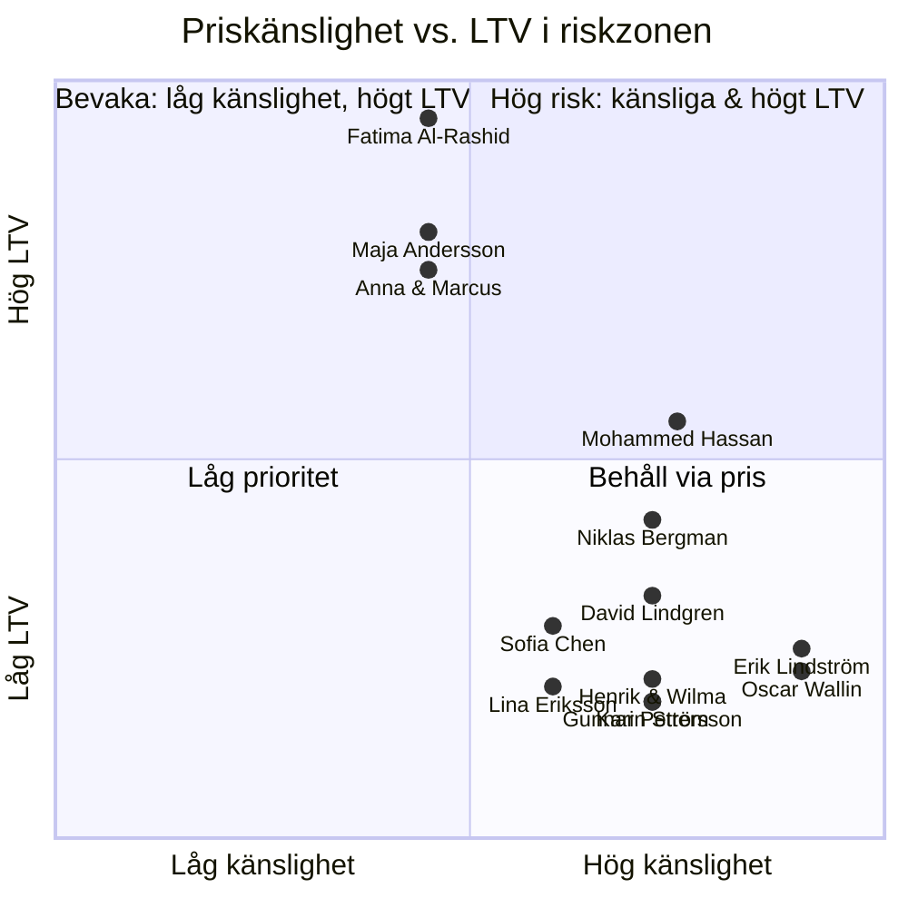
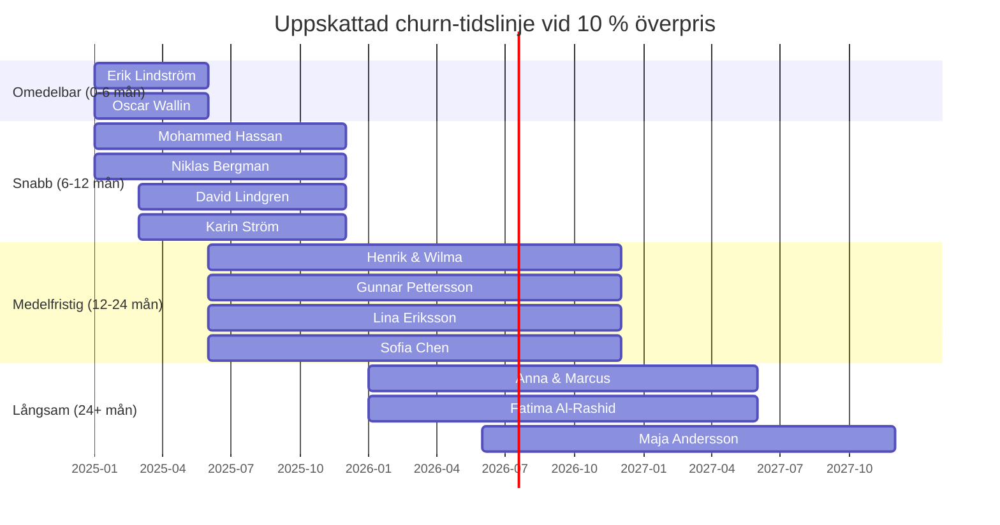

# Priskonsoliderad känslighetsmatris

> Konsoliderad analys av priskänslighet över samtliga 13 kundpersonas i Fas 1
> (Motorförsäkring). Dokumentet vägleder prissättningsstrategi, produktutveckling
> och kundretentionsarbete.

## Sammanfattning

Analysen visar att **10 av 13 personas (77 %) reagerar negativt** på premier som
överstiger marknadspris. Endast tre personas har tillräckligt höga byteskostnader
för att kortsiktigt tolerera överpris — men även dessa lämnar på medellång sikt
om prisgapet är tydligt.

Huvudslutsatser:

- Priskänsliga segment (9–10/10) kräver aktiv underprissättning för att
  attrahera och behålla.
- Medelhögt känsliga segment (7–8/10) kan tolerera marginella överpris
  **om** de kompenseras med tydliga mervärden (t.ex. snabb skadehantering,
  bonusöverföring, elbilsspecialisering).
- Lågkänsliga segment (6/10) accepterar +3–5 % överpris om
  servicedifferentieringen är påtaglig, men lämnar vid tydliga prisgap
  inom 24 månader.

## Konsoliderad prismatris

| Persona                                                      | Ålder | Känslighet (1–10) | Smärttröskel              | Max tolerabelt överpris       | Rekommenderad strategi            | LTV i riskzonen     |
| ------------------------------------------------------------ | ----- | :---------------: | ------------------------- | ----------------------------- | --------------------------------- | ------------------- |
| [Erik Lindström](../personas/erik-lindstrom)                 | 19    |       9/10        | 5 % jämför, 10 % lämnar   | 0–3 %                         | Underprissätt −3–5 % år 1         | 80k SEK             |
| [Oscar Wallin](../personas/oscar-wallin)                     | 26    |       9/10        | 5 % jämför, 8 % lämnar    | 0 % (behöver gig-produkt)     | Matcha + gig-produkt              | 76k SEK             |
| [Mohammed Hassan](../personas/mohammed-hassan)               | 42    |       8/10        | 3–5 % jämför, 10 % lämnar | 0 % personligt, bunta flottan | Underprissätt / flottbunt         | 219k SEK            |
| [Niklas Bergman](../personas/niklas-bergman)                 | 35    |       8/10        | 6 % jämför, 10 % lämnar   | +3 % med skade-SLA            | Matcha + snabb skadehantering     | 150k SEK            |
| [Henrik & Wilma Nilsson](../personas/henrik-wilma-nilsson)   | 48/17 |       8/10        | 5–8 % jämför, 12 % lämnar | +5 % med telematik            | Matcha + ungdomsprogram           | 70k SEK             |
| [David Lindgren](../personas/david-lindgren)                 | 30    |       8/10        | 3–7 % jämför, 12 % lämnar | +3 % med leasingtjänst        | Matcha + leasing-UX               | 113k SEK            |
| [Gunnar Pettersson](../personas/gunnar-pettersson)           | 72    |       8/10        | 5 % jämför, 10 % lämnar   | +5 % med lojalitetsprogram    | Matcha + dedikerad kontakt        | 60k SEK             |
| [Karin Ström](../personas/karin-strom)                       | 45    |       8/10        | 5 % jämför, 8 % lämnar    | 0 % (behöver bonusreparation) | Matcha + spillover-bonus          | 60k SEK             |
| [Lina Eriksson](../personas/lina-eriksson)                   | 28    |       7/10        | 5–8 % jämför, 12 % lämnar | +5 % med elbilsspecialisering | Matcha + elbilstäckning tydlighet | 67k SEK             |
| [Sofia Chen](../personas/sofia-chen)                         | 32    |       7/10        | 3–7 % jämför, 12 % lämnar | +5–7 % med mervärden          | Premium med bonusöverföring       | 99k SEK             |
| [Anna & Marcus Johansson](../personas/anna-marcus-johansson) | 38/40 |       6/10        | 5–6 % jämför, 10 % lämnar | +3–5 % efter år 3             | Matcha, sedan premium             | 400k SEK            |
| [Fatima Al-Rashid](../personas/fatima-al-rashid)             | 45    |       6/10        | 6–8 % jämför, 12 % lämnar | +3–4 % som servicetillägg     | Matcha + flott-IoT                | 1 400k SEK          |
| [Maja Andersson](../personas/maja-andersson)                 | 52    |       6/10        | 12–15 % jämför            | 0 % (indirekt värde)          | Matcha + empatisk service         | 550k SEK (indirekt) |

## Segmenterad prissättningsstrategi

### Aldrig överprissätt (känslighet 9–10/10)

**Personas:** Erik Lindström, Oscar Wallin

Dessa segment har extremt låga byteskostnader och hög prismedvetenhet. De söker
aktivt den billigaste lösningen och lämnar omedelbart vid prishöjning.

| Faktor                | Erik Lindström                               | Oscar Wallin                                 |
| --------------------- | -------------------------------------------- | -------------------------------------------- |
| Prisbeteende          | Jämför minst 3 bolag vid varje förnyelse     | Jämför kontinuerligt                         |
| Bytesbarriär          | Ingen — inget bonussystem att förlora        | Ingen traditionell produkt passar            |
| Strategi              | Underprissätt 3–5 % år 1 för kundanskaffning | Erbjud branschens enda gig-anpassade produkt |
| Risknivå vid överpris | Omedelbar avhoppning                         | Ingen konvertering alls                      |

### Matcha marknad + differentiera (känslighet 7–8/10)

**Personas:** Mohammed Hassan, Niklas Bergman, Henrik & Wilma Nilsson, David
Lindgren, Gunnar Pettersson, Karin Ström, Lina Eriksson, Sofia Chen

Dessa segment jämför aktivt, men kan tolerera marginella överpris om tydliga
mervärden kompenserar. Nyckeln är att erbjuda rätt mervärde per segment.

| Persona           | Tolererar överpris om …                   | Rekommenderat mervärde                          |
| ----------------- | ----------------------------------------- | ----------------------------------------------- |
| Mohammed Hassan   | Flottbunt rabatt + enkel bonus-överföring | Sömlös bytesprocess + flottrabatt               |
| Niklas Bergman    | Skadehantering-SLA under 3 dagar          | Snabb skadehantering + tydlig kommunikation     |
| Henrik & Wilma    | Telematikbaserad rabatt för ungdomar      | Ungdomsprogram + familjerabatt                  |
| David Lindgren    | Leasingintegration och digital UX         | Sömlös leasing-UX + automatisk försäkringsadmin |
| Gunnar Pettersson | Dedikerad personlig kontakt               | Lojalitetsprogram + senior-kundservice          |
| Karin Ström       | Bonusreparation vid ägaröverlåtelse       | Spillover-bonus + enkel överlåtelseprocess      |
| Lina Eriksson     | EV-specifika täckningsvillkor             | Tydlig elbilstäckning + laddskydd               |
| Sofia Chen        | Erkännande av utländsk skadehistorik      | Bonusöverföring + flerspråkig service           |

### Servicedifferentiering (känslighet 6/10)

**Personas:** Anna & Marcus Johansson, Fatima Al-Rashid, Maja Andersson

Dessa segment har högre byteskostnader (komplex portfölj, affärsrelation eller
emotionell situation) och är mindre prismedvetna. De reagerar på servicekvalitet
snarare än pris.

| Persona          | Bytesbarriär                                 | Acceptabelt överpris      | Förutsättning                      |
| ---------------- | -------------------------------------------- | ------------------------- | ---------------------------------- |
| Anna & Marcus    | Multipla fordon, familjerabatt, historik     | +3–5 % efter år 3         | Enkel portföljhantering            |
| Fatima Al-Rashid | Komplex flottadministration, IoT-integration | +3–4 % som servicetillägg | Flott-IoT + proaktiv riskhantering |
| Maja Andersson   | Emotionell situation, indirekt kundvärde     | 0 % direkt (indirekt LTV) | Empatisk dödsboservice             |

## Mervärden som motiverar premiumnivå

### Erik Lindström (19, ny ung förare)

- **Mervärde:** Inga — priset avgör helt
- **Pristolerans med mervärde:** 0–3 % max med digital självbetjäning
- **Kostnad vs. retention:** Låg anskaffningskostnad, hög churn utan priskonkurrens

### Oscar Wallin (26, gig-ekonomiförare)

- **Mervärde:** Gig-anpassad försäkringsprodukt (per-resa eller per-timme)
- **Pristolerans med mervärde:** 0 % — produkten existerar inte hos konkurrenter
- **Kostnad vs. retention:** Produktutvecklingskostnad vs. nytt marknadssegment

### Mohammed Hassan (42, försäkringsbytare)

- **Mervärde:** Sömlös bonusöverföring + flottbunt
- **Pristolerans med mervärde:** 0 % personligt, buntrabatt motiverar flottaffär
- **Kostnad vs. retention:** Hög LTV (219k SEK) — liten investering i bytesprocess ger stor avkastning

### Niklas Bergman (35, skadeanmälare)

- **Mervärde:** Garanterad skadehandläggningstid (SLA)
- **Pristolerans med mervärde:** +3 % med skade-SLA
- **Kostnad vs. retention:** Processeffektivisering sparar kostnader och ökar retention

### Henrik & Wilma Nilsson (48/17, tonårsförare)

- **Mervärde:** Telematikbaserad ungdomsrabatt
- **Pristolerans med mervärde:** +5 % med telematik + familjerabatt
- **Kostnad vs. retention:** Telematik-investering kompenseras av bättre riskdata

### David Lindgren (30, leasingkund)

- **Mervärde:** Sömlös leasingintegration + digital UX
- **Pristolerans med mervärde:** +3 % med leasingtjänst
- **Kostnad vs. retention:** API-integration med leasingbolag — engångskostnad, löpande intäkt

### Gunnar Pettersson (72, senior försäkringstagare)

- **Mervärde:** Dedikerad personlig kontaktperson + lojalitetsprogram
- **Pristolerans med mervärde:** +5 % med lojalitetsprogram
- **Kostnad vs. retention:** Låg personalkostnad per kund, hög lojalitet

### Karin Ström (45, skilsmässoöverlåtelse)

- **Mervärde:** Bonusreparation vid ägaröverlåtelse (spillover-bonus)
- **Pristolerans med mervärde:** 0 % — produkt-innovation snarare än överpris
- **Kostnad vs. retention:** Låg systemkostnad, hög kundnöjdhet i kritisk livssituation

### Lina Eriksson (28, elbilsägare)

- **Mervärde:** EV-specifik täckning (laddningsinfrastruktur, batteriskydd)
- **Pristolerans med mervärde:** +5 % med tydlig elbilsspecialisering
- **Kostnad vs. retention:** Produktutvecklingskostnad vs. växande EV-segment

### Sofia Chen (32, nyinflyttad)

- **Mervärde:** Utländsk skadehistorik-erkännande + flerspråkig service
- **Pristolerans med mervärde:** +5–7 % med bonusöverföring + mervärden
- **Kostnad vs. retention:** Systeminvestering i internationella bonusavtal

### Anna & Marcus Johansson (38/40, familj med flera bilar)

- **Mervärde:** Samlad portföljhantering + familjerabatt
- **Pristolerans med mervärde:** +3–5 % efter 3 års relation
- **Kostnad vs. retention:** Portföljsystem — hög LTV (400k SEK) motiverar investering

### Fatima Al-Rashid (45, småföretagsflotta)

- **Mervärde:** Flott-IoT + proaktiv riskhantering + förenklad admin
- **Pristolerans med mervärde:** +3–4 % som servicetillägg
- **Kostnad vs. retention:** IoT-plattformskostnad vs. högsta LTV (1 400k SEK)

### Maja Andersson (52, dödsboförvaltare)

- **Mervärde:** Empatisk dödsboservice + smidig avveckling
- **Pristolerans med mervärde:** 0 % direkt — indirekt LTV via familjerelation
- **Kostnad vs. retention:** Serviceutbildning, låg kostnad, hög varumärkeseffekt

## Portföljriskbedömning

### Total LTV i riskzonen

Vid en generell 10 % överprissättning jämfört med marknad uppskattas följande
LTV vara i riskzonen:

| Riskkategori                       | Personas                          | Uppskattad LTV i riskzonen |
| ---------------------------------- | --------------------------------- | -------------------------- |
| Omedelbar avhoppning (0–6 mån)     | Erik, Oscar                       | 156k SEK                   |
| Snabb utfasning (6–12 mån)         | Mohammed, Niklas, David, Karin    | 542k SEK                   |
| Medelfristig utfasning (12–24 mån) | Henrik/Wilma, Gunnar, Lina, Sofia | 296k SEK                   |
| Långsam utfasning (24+ mån)        | Anna/Marcus, Fatima, Maja         | 2 350k SEK                 |
| **Totalt**                         | **Samtliga 13 personas**          | **3 344k SEK**             |

Multiplicerat med antalet kunder i varje segment innebär 10 % överprissättning
en risk på **tiotals miljoner SEK** i förlorat livstidsvärde.

### Högst risk per LTV

1. **Fatima Al-Rashid** — 1 400k SEK (flottkund, svår att återvinna)
2. **Maja Andersson** — 550k SEK indirekt (påverkar hela dödsboets
   familjerelation)
3. **Anna & Marcus Johansson** — 400k SEK (multipla fordon, lång relation)

### Churn-tidslinje

Uppskattningsvis lämnar **60–70 % av segmenten** inom 24 månader vid 10 %
överpris. De återstående 30 % (låg känslighet) börjar ifrågasätta priset efter
24 månader, särskilt vid förnyelse.

## Konkurrenslandskap

En kort översikt av konkurrenternas positionering som påverkar priskänsligheten:

| Konkurrent       | Positionering                         | Prisstrategi                         | Största hotet mot                               |
| ---------------- | ------------------------------------- | ------------------------------------ | ----------------------------------------------- |
| If P&C           | Marknadsledare, stark digital närvaro | Aggressiv prissättning, volymfokus   | Erik, Oscar, Mohammed — prisjägare              |
| Länsförsäkringar | Regional styrka, kooperativ modell    | Priskonkurrenskraftig, lokal service | Gunnar, Anna & Marcus — lojalitetsbenägna       |
| Folksam          | Kooperativ, medlemsrabatter           | Budgetvänlig, enkel produkt          | Erik, Sofia — pris- och tillgänglighetskänsliga |
| Trygg-Hansa      | Mellansegment, serviceorienterad      | Mellanpris, servicefokus             | Niklas, Lina — servicekänsliga                  |

### Konsekvens för TryggFörsäkring

TryggFörsäkring befinner sig i en marknad med **hög transparens** och **låga
byteskostnader** (särskilt digitalt). Prisinformation är lättillgänglig via
jämförelsesajter (Insplanet, Compricer), vilket innebär att överprissättning
upptäcks snabbt av de flesta kundsegment.

## Regulatorisk notering

Prissättningsstrategin måste beakta följande regulatoriska krav:

- **IDD-001** — Demands-and-needs-bedömning: Prissättningen måste reflektera
  kundens faktiska behov och riskprofil. Segmenterad prissättning baserad på
  personas stödjer detta krav genom att säkerställa att produkter matchas mot
  kundbehov.
- **FSA-004** — Pristransparens: Försäkringsgivare ska tydligt redovisa
  premieberäkningen. Eventuella mervärden som motiverar högre pris måste vara
  synliga och förståeliga för kunden.
- **GDPR-003** — Kundsegmentering baserad på persondata (ålder, fordon,
  skadehistorik) kräver laglig grund och transparent information till den
  registrerade.

Se [regulatorisk dokumentation](../regulatory/idd-compliance.md) och
[FSA-krav](../regulatory/fsa-requirements.md) för fullständiga kravmappningar.
