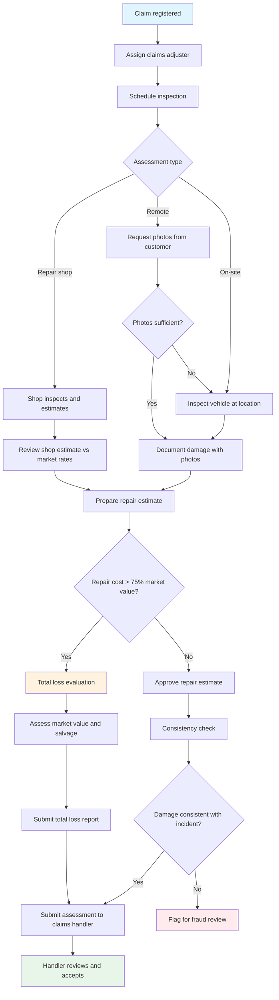
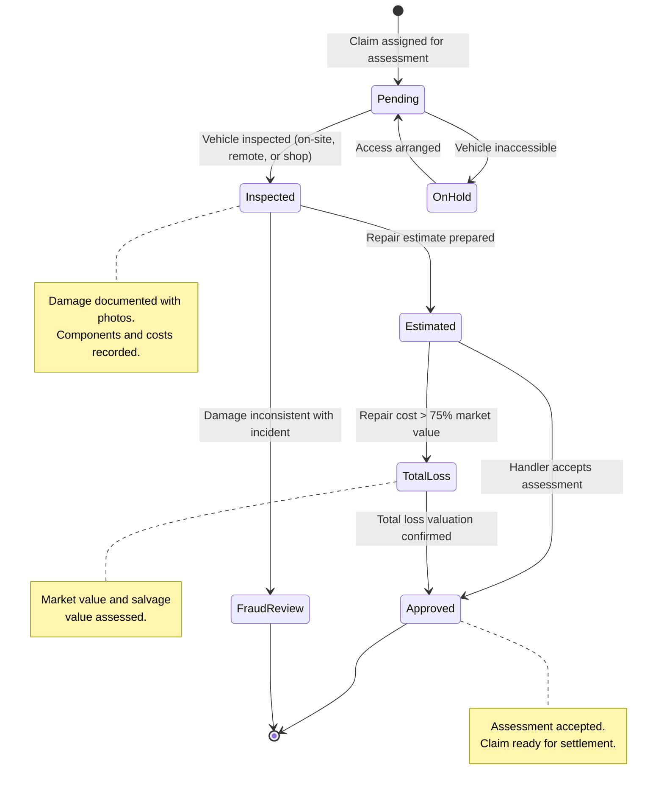

# UC-CLM-006: Damage Assessment

## Overview

This use case describes the damage assessment process for motor insurance claims. It covers appraiser assignment, inspection booking, repair estimate approval, remote assessment for minor damage, and total loss evaluation criteria.

## Use Case Summary

| Field                | Value                                                                                          |
| -------------------- | ---------------------------------------------------------------------------------------------- |
| **Use Case ID**      | UC-CLM-006                                                                                     |
| **Name**             | Damage Assessment                                                                              |
| **Primary Actor**    | Claims Adjuster (Värderare)                                                                    |
| **Secondary Actors** | Claims Handler, Repair Shop, Customer                                                          |
| **Goal**             | Assess vehicle damage and produce an approved repair estimate or total loss valuation          |
| **Preconditions**    | Claim is registered, coverage verified, and liability determination is in progress or complete |
| **Postconditions**   | Assessment report is attached to the claim with repair estimate or total loss valuation        |
| **Trigger**          | Claims handler assigns the damage assessment after coverage verification                       |

## Actors

- **Primary:** [Claims Adjuster (Värderare)](../../actors/internal/claims-adjuster.md)
- **Supporting:** [Claims Handler (Skadereglerare)](../../actors/internal/claims-handler.md), [Repair Shop (Verkstad)](../../actors/external/repair-shop.md), [Customer (Privatkund)](../../actors/internal/customer.md)

## Preconditions

1. The claim has been registered and linked to a valid policy
2. Coverage has been verified for the claim type
3. The claim has not been denied or flagged for fraud investigation (or fraud investigation is complete)

## Postconditions

**Success:**

- A damage assessment report is attached to the claim
- Repair estimate (or total loss valuation) is approved
- The claim is ready for settlement calculation

**Failure:**

- The vehicle cannot be inspected (e.g., vehicle is inaccessible, customer unresponsive)
- The assessment is placed on hold and the claims handler is notified

## Process Flow

## State Lifecycle

## Main Success Scenario: On-Site Inspection

| Step | Actor           | Action                                                                   | System Response                                                          |
| ---- | --------------- | ------------------------------------------------------------------------ | ------------------------------------------------------------------------ |
| 1    | Claims Handler  | Assigns the damage assessment to a claims adjuster                       | System notifies the adjuster with claim details and customer contact     |
| 2    | Claims Adjuster | Contacts the customer to schedule an inspection                          | System records the scheduled inspection date                             |
| 3    | Claims Adjuster | Inspects the vehicle at the customer's location or repair shop           | System provides a mobile assessment form                                 |
| 4    | Claims Adjuster | Documents damage with photos (minimum 4: overview + close-ups)           | System stores photos linked to the assessment                            |
| 5    | Claims Adjuster | Records affected components and damage descriptions                      | System captures the damage inventory                                     |
| 6    | Claims Adjuster | Prepares or reviews the repair estimate (parts, labor, paint)            | System calculates the total repair cost                                  |
| 7    | Claims Adjuster | Performs consistency check: is damage consistent with reported incident? | System records the consistency finding                                   |
| 8    | Claims Adjuster | Evaluates repair vs. total loss                                          | System checks total loss threshold (repair cost vs. 75% of market value) |
| 9    | Claims Adjuster | Submits the completed assessment report                                  | System attaches the report to the claim and notifies the claims handler  |
| 10   | Claims Handler  | Reviews and accepts (or requests re-assessment)                          | System updates assessment status and advances the claim                  |

## Alternative Flow: Repair Shop Estimate

| Step | Actor           | Action                                                             | System Response                                            |
| ---- | --------------- | ------------------------------------------------------------------ | ---------------------------------------------------------- |
| 1    | Claims Handler  | Directs the customer to an authorized repair shop for assessment   | System records the assigned repair shop                    |
| 2    | Repair Shop     | Inspects the vehicle and prepares a detailed estimate              | Estimate is submitted to the system                        |
| 3    | Claims Adjuster | Reviews the repair shop estimate against market rates              | System displays comparison with standard rates             |
| 4a   | Claims Adjuster | Approves the estimate (within acceptable range)                    | System records the approved estimate                       |
| 4b   | Claims Adjuster | Adjusts the estimate (labor rates above market, unnecessary parts) | System records the adjusted estimate with justification    |
| 5    | Claims Adjuster | Submits the assessment                                             | System attaches the report and notifies the claims handler |

## Alternative Flow: Remote Assessment (Minor Damage)

| Step | Actor           | Action                                                                                     | System Response                                           |
| ---- | --------------- | ------------------------------------------------------------------------------------------ | --------------------------------------------------------- |
| 1    | Claims Handler  | Identifies the claim as eligible for remote assessment (estimated damage below SEK 15,000) | System sends a photo/video upload request to the customer |
| 2    | Customer        | Uploads required photos (minimum 6: front, rear, both sides, damage close-up, odometer)    | System validates photo count and quality                  |
| 3    | Claims Adjuster | Reviews photos and assesses damage remotely                                                | System provides the remote assessment form                |
| 4a   | Claims Adjuster | Completes assessment based on photos (damage is clear)                                     | System records the assessment and notifies the handler    |
| 4b   | Claims Adjuster | Cannot determine damage extent from photos                                                 | System escalates to on-site inspection (main flow step 2) |

## Alternative Flow: Total Loss Declaration

| Step | Actor           | Action                                                        | System Response                                               |
| ---- | --------------- | ------------------------------------------------------------- | ------------------------------------------------------------- |
| 1    | Claims Adjuster | Determines repair cost exceeds 75% of vehicle market value    | System flags the claim for total loss processing              |
| 2    | System          | Calculates vehicle market value using industry valuation data | System displays market value with methodology and data source |
| 3    | Claims Adjuster | Reviews and confirms (or adjusts) the market valuation        | System records the confirmed market value                     |
| 4    | Claims Adjuster | Assesses salvage value (value of the damaged vehicle)         | System records salvage value                                  |
| 5    | Claims Adjuster | Records the total loss determination with rationale           | System generates the total loss assessment report             |
| 6    | Claims Handler  | Reviews total loss determination                              | System advances the claim to settlement (total loss flow)     |

## Exception Flow: Vehicle Inaccessible

| Step | Actor           | Action                                                              | System Response                  |
| ---- | --------------- | ------------------------------------------------------------------- | -------------------------------- |
| 1    | Claims Adjuster | Cannot access the vehicle for inspection                            | System records the access issue  |
| 2    | Claims Adjuster | Contacts the customer to arrange alternative access                 | System logs the communication    |
| 3    | Claims Adjuster | If still inaccessible after 3 attempts, escalates to claims handler | System places assessment on hold |
| 4    | Claims Handler  | Contacts the customer; may suspend the claim pending access         | System updates claim status      |

## Exception Flow: Inconsistency Detected

| Step | Actor           | Action                                            | System Response                               |
| ---- | --------------- | ------------------------------------------------- | --------------------------------------------- |
| 1    | Claims Adjuster | Damage is inconsistent with the reported incident | System records the inconsistency finding      |
| 2    | Claims Adjuster | Documents the specific inconsistencies            | System flags the claim for fraud review       |
| 3    | Claims Handler  | Reviews the inconsistency flag                    | System routes to fraud screening (UC-CLM-004) |

## Validation Rules

| Rule       | Description                                                                                      |
| ---------- | ------------------------------------------------------------------------------------------------ |
| VR-DAM-001 | Assessment must include at least 4 damage photos                                                 |
| VR-DAM-002 | Remote assessment requires minimum 6 photos (front, rear, both sides, damage close-up, odometer) |
| VR-DAM-003 | Repair estimate must include separate line items for parts, labor, and paint                     |
| VR-DAM-004 | Total loss threshold: repair cost > 75% of vehicle market value (configurable)                   |
| VR-DAM-005 | Market value must be sourced from an approved industry valuation tool                            |
| VR-DAM-006 | Consistency check result (pass/fail) is mandatory                                                |
| VR-DAM-007 | If consistency check fails, a fraud screening referral is required                               |
| VR-DAM-008 | Assessment must be completed within 10 business days of assignment                               |

## Data Model

### Damage Assessment Record

| Field                    | Type      | Required       | Description                                                     |
| ------------------------ | --------- | -------------- | --------------------------------------------------------------- |
| Assessment ID            | String    | Auto-generated | Unique identifier for the assessment                            |
| Claim number             | String    | Yes            | Link to the parent claim                                        |
| Assigned adjuster        | Reference | Yes            | The claims adjuster performing the assessment                   |
| Inspection type          | Enum      | Yes            | On-site, Repair shop, Remote                                    |
| Inspection date          | Date      | Yes            | When the inspection was performed                               |
| Damage description       | Text      | Yes            | Detailed description of damage observed                         |
| Affected components      | String[]  | Yes            | List of damaged vehicle parts                                   |
| Photos                   | File[]    | Yes            | Damage photos (minimum 4 for on-site, 6 for remote)             |
| Repair estimate -- parts | Decimal   | Yes            | Cost of replacement parts (SEK)                                 |
| Repair estimate -- labor | Decimal   | Yes            | Cost of labor hours (SEK)                                       |
| Repair estimate -- paint | Decimal   | Yes            | Cost of paint and finishing (SEK)                               |
| Repair estimate -- total | Decimal   | Calculated     | Sum of parts + labor + paint                                    |
| Repair shop name         | String    | Conditional    | If estimate originates from a repair shop                       |
| Repair shop estimate     | File      | Conditional    | Original repair shop estimate document                          |
| Adjuster rate comparison | Text      | Conditional    | Notes on rate comparison vs. market                             |
| Determination            | Enum      | Yes            | Repair, Total loss                                              |
| Vehicle market value     | Decimal   | Conditional    | Required for total loss consideration                           |
| Valuation source         | String    | Conditional    | Industry tool used for market value                             |
| Salvage value            | Decimal   | Conditional    | Required if total loss is declared                              |
| Consistency check        | Enum      | Yes            | Pass, Fail                                                      |
| Consistency notes        | Text      | Conditional    | Required if consistency check fails                             |
| Assessment status        | Enum      | Auto-set       | Assigned, Scheduled, In progress, Submitted, Accepted, Rejected |
| Submitted date           | Timestamp | Conditional    | When the adjuster submitted the report                          |
| Accepted date            | Timestamp | Conditional    | When the claims handler accepted the report                     |

## Business Rules

| Rule       | Description                                                                                                                   |
| ---------- | ----------------------------------------------------------------------------------------------------------------------------- |
| BR-DAM-001 | Glass-only claims may skip adjuster inspection and go directly to an authorized glass shop                                    |
| BR-DAM-002 | Remote assessment is only available for claims with estimated damage below the configurable threshold (default: SEK 15,000)   |
| BR-DAM-003 | Repair shop labor rates are compared against regional market rates; rates above 120% of market require adjuster justification |
| BR-DAM-004 | The customer may request an independent valuation for total loss disputes at TryggFörsäkring's expense                        |
| BR-DAM-005 | The adjuster must not have a financial relationship with the repair shop providing the estimate                               |
| BR-DAM-006 | Assessment reports must be submitted within 10 business days of assignment                                                    |

## Non-functional Requirements

| Requirement                  | Target                                         |
| ---------------------------- | ---------------------------------------------- |
| Assessment assignment        | Within 1 business day of coverage verification |
| Inspection scheduling        | Within 3 business days of assignment           |
| Assessment completion        | Within 10 business days of assignment          |
| Remote assessment turnaround | Within 2 business days of photo receipt        |
| Total loss valuation         | Market value data refreshed monthly            |

## Regulatory Compliance Summary

| Regulation   | Requirements Addressed                                                                                       |
| ------------ | ------------------------------------------------------------------------------------------------------------ |
| **FSA-010**  | Fair and timely claims settlement: damage assessment must be objective and timely to support fair settlement |
| **FSA-014**  | Record keeping: assessment reports, photos, estimates, and valuations must be retained for 10 years          |
| **GDPR-003** | Claims processing: photos must capture damage only; incidental personal data should be avoided               |
| **GDPR-001** | Customer data shared with repair shops must follow data minimization                                         |

## Related User Stories

- [US-CLM-005](../user-stories/claims-damage-assessment.md) -- Assess Vehicle Damage
- [US-CLM-014](../user-stories/claims-repair-authorization.md) -- Authorize Repairs at Network Shops
- [US-CLM-008](../user-stories/claims-settlement.md) -- Calculate and Process Settlement
