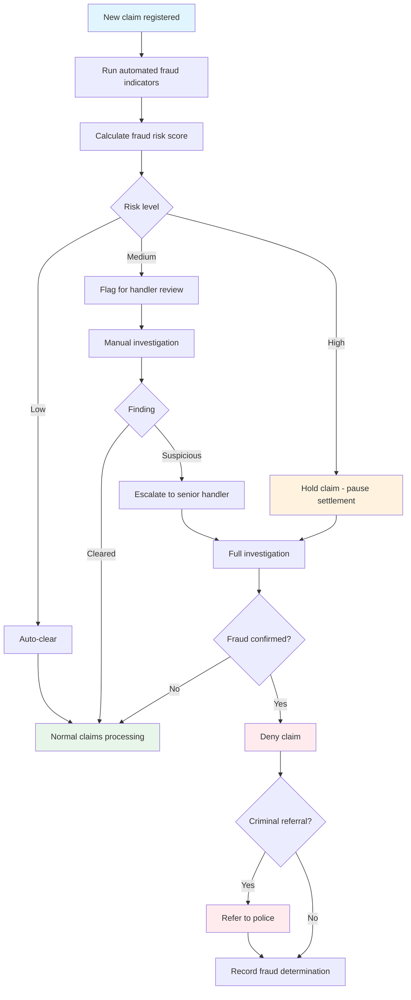

# UC-CLM-004: Fraud Screening and Investigation

## Overview

This use case describes the fraud screening and investigation process for motor insurance claims. It covers automated fraud indicator detection at claim registration, manual investigation workflows, and the outcomes of fraud investigations including criminal referral.

## Actors

- **Primary:** [Claims Handler (Skadereglerare)](../../actors/internal/claims-handler.md)
- **Supporting:** [Claims Adjuster (Värderare)](../../actors/internal/claims-adjuster.md), [Police (Polis)](../../actors/external/police.md)

## Preconditions

1. A claim has been registered in the system
2. Automated fraud screening rules are configured
3. Integration with the industry fraud database (GSR) is active (if available)

## Postconditions

**Cleared:**

- Claim is cleared of fraud suspicion and proceeds through normal claims processing
- The fraud screening result is recorded in the claim file

**Fraud confirmed:**

- Claim is denied with documented fraud determination
- Criminal referral to police is initiated (if warranted)
- Fraud indicators are recorded for future pattern detection
- Customer is notified of the denial (without disclosing investigation details)

## Process Flow

## Main Flow: Automated Screening

| Step | Actor  | Action                     | System Response                                                          |
| ---- | ------ | -------------------------- | ------------------------------------------------------------------------ |
| 1    | System | Claim is registered        | System automatically runs fraud screening rules against the claim        |
| 2    | System | Evaluates fraud indicators | System calculates a fraud risk score: low, medium, or high               |
| 3a   | System | Score is low               | Claim proceeds to normal processing; screening result is logged          |
| 3b   | System | Score is medium            | Claim is flagged for handler review; specific indicators are highlighted |
| 3c   | System | Score is high              | Claim is flagged for investigation; settlement processing is paused      |

## Alternative Flow: Manual Investigation

| Step | Actor          | Action                                                                           | System Response                                                  |
| ---- | -------------- | -------------------------------------------------------------------------------- | ---------------------------------------------------------------- |
| 1    | Claims Handler | Reviews flagged fraud indicators on a medium/high-risk claim                     | System displays the specific indicators that triggered the flag  |
| 2    | Claims Handler | Decides to investigate further                                                   | System records the investigation start and pauses settlement     |
| 3    | Claims Handler | Gathers additional evidence (interviews, document verification, site inspection) | System stores investigation notes and evidence in the claim file |
| 4    | Claims Handler | Checks the industry fraud database (GSR) for matching patterns                   | System queries GSR and displays any matches                      |
| 5    | Claims Handler | Reviews damage assessment for consistency with reported incident                 | Claims adjuster may be asked to re-inspect                       |
| 6    | Claims Handler | Records investigation findings                                                   | System stores the complete investigation record                  |
| 7a   | Claims Handler | Clears the claim (no fraud found)                                                | System removes the fraud flag and resumes normal processing      |
| 7b   | Claims Handler | Confirms fraud                                                                   | System denies the claim and records the fraud determination      |

## Alternative Flow: Criminal Referral

| Step | Actor          | Action                                               | System Response                                              |
| ---- | -------------- | ---------------------------------------------------- | ------------------------------------------------------------ |
| 1    | Claims Handler | Fraud investigation confirms insurance fraud         | System records the confirmed fraud determination             |
| 2    | Claims Handler | Decides to refer the case to police                  | System generates a criminal referral summary                 |
| 3    | Claims Handler | Submits the referral to the Swedish Police Authority | System records the referral date and police reference number |
| 4    | Claims Handler | Monitors the police investigation outcome            | System tracks the referral status                            |

## Fraud Indicators and Scoring

| Indicator                              | Weight | Description                                                                    |
| -------------------------------------- | ------ | ------------------------------------------------------------------------------ |
| Recent policy inception                | Medium | Policy was purchased within 30 days of the claim                               |
| Coverage upgrade before claim          | High   | Coverage tier was increased within 60 days of the claim                        |
| Multiple recent claims                 | Medium | 2+ claims filed by the same policyholder within 12 months                      |
| Inconsistent details                   | High   | FNOL details conflict with police report or physical evidence                  |
| Disproportionate claim amount          | Medium | Claim amount significantly exceeds expected cost for the incident type         |
| GSR match                              | High   | Policyholder, vehicle, or linked parties appear in the industry fraud database |
| Total loss on recently insured vehicle | High   | Vehicle declared total loss shortly after being insured                        |
| Late reporting                         | Low    | More than 30 days between incident date and FNOL                               |
| Unusual incident location              | Low    | Incident occurred in an unusual or hard-to-verify location                     |

### Scoring Logic

- **Low risk:** No high-weight indicators; at most one medium-weight indicator
- **Medium risk:** One or more medium-weight indicators; no high-weight indicators
- **High risk:** One or more high-weight indicators; or three or more medium-weight indicators

## Validation Rules

| Rule       | Description                                                                                             |
| ---------- | ------------------------------------------------------------------------------------------------------- |
| VR-FRD-001 | Fraud screening must complete before the claim advances past "Registered" status                        |
| VR-FRD-002 | High-risk claims cannot proceed to settlement without handler review                                    |
| VR-FRD-003 | Investigation closure requires a documented finding (cleared or confirmed)                              |
| VR-FRD-004 | Criminal referral requires a completed investigation record and senior approval                         |
| VR-FRD-005 | GSR queries must include at minimum: policyholder personnummer, vehicle registration, and incident date |

## Data Model

### Fraud Screening Record

| Field                    | Type      | Required       | Description                                     |
| ------------------------ | --------- | -------------- | ----------------------------------------------- |
| Screening ID             | String    | Auto-generated | Unique identifier for the screening             |
| Claim number             | String    | Yes            | Link to the screened claim                      |
| Screening date           | Timestamp | Auto-set       | When the automated screening ran                |
| Indicators triggered     | Object[]  | Auto-set       | List of fraud indicators that matched           |
| Risk score               | Enum      | Auto-set       | Low, Medium, High                               |
| GSR match                | Boolean   | Auto-set       | Whether a match was found in the fraud database |
| GSR match details        | Text      | Conditional    | Details of GSR matches (if any)                 |
| Handler review required  | Boolean   | Auto-set       | True if risk score is Medium or High            |
| Investigation status     | Enum      | Conditional    | Not started, In progress, Cleared, Confirmed    |
| Investigation start date | Timestamp | Conditional    | When manual investigation began                 |
| Investigation notes      | Text[]    | Conditional    | Handler's investigation notes and evidence      |
| Investigation finding    | Enum      | Conditional    | Cleared, Fraud confirmed                        |
| Investigation close date | Timestamp | Conditional    | When investigation was concluded                |
| Criminal referral        | Boolean   | Conditional    | Whether the case was referred to police         |
| Police reference         | String    | Conditional    | Police case reference number                    |
| Approved by              | Reference | Conditional    | Senior handler who approved criminal referral   |

## Business Rules

| Rule       | Description                                                                                                                              |
| ---------- | ---------------------------------------------------------------------------------------------------------------------------------------- |
| BR-FRD-001 | Fraud screening runs automatically on every new claim                                                                                    |
| BR-FRD-002 | High-risk claims must be reviewed by a claims handler before settlement                                                                  |
| BR-FRD-003 | Investigation details must never be disclosed to the claimant during an active investigation                                             |
| BR-FRD-004 | Fraud investigation must not unreasonably delay settlement of legitimate claims (target: investigation complete within 15 business days) |
| BR-FRD-005 | Criminal referral requires senior claims handler or manager approval                                                                     |
| BR-FRD-006 | Cleared fraud flags must retain the investigation log for audit purposes                                                                 |
| BR-FRD-007 | GSR data must be refreshed at least daily to ensure up-to-date fraud pattern matching                                                    |
| BR-FRD-008 | Fraud screening rules and indicator weights are reviewed and updated quarterly                                                           |

## Regulatory

- **FSA-010** — Fair and timely claims settlement: fraud investigation must not unreasonably delay settlement of legitimate claims; the insurer must balance fraud prevention with fair treatment
- **FSA-014** — Record keeping: fraud investigation records must be retained for 10 years from investigation closure
- **GDPR-006** — Fraud detection and prevention: automated screening must use pseudonymized data where possible; access to full claim details is restricted to flagged cases; the claimant has the right to object to automated profiling
- **GDPR-003** — Claims processing: fraud investigation data is sensitive and must be protected with strict access controls; purpose limitation applies
- **GDPR-001** — Data sharing with GSR and police must have a lawful basis; data minimization applies to all external data sharing

## Related User Stories

- [US-CLM-006](../user-stories/claims-fraud-screening.md) — Screen Claims for Fraud
- [US-CLM-007](../user-stories/claims-decision.md) — Approve or Deny a Claim
- [US-CLM-002](../user-stories/claims-registration.md) — Register and Manage Claims
